# Derivades: Teoria

**Tema 5: Derivades**

------------------------------------------------------------------------

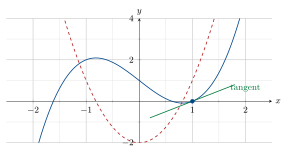

**Dossier Complet de Teoria i Pràctica**

1r de Batxillerat $\cdot$ Matemàtiques

> 2 Continguts del tema:
>
> - La derivada com a mesura de creixement
>
> - Taxa de variació mitjana (TVM)
>
> - Taxa de variació instantània i derivada en un punt
>
> - Derivada d’una funció. Regles de derivació
>
> - Creixement, decreixement i extrems
>
> - Concavitat, convexitat i punts d’inflexió
>
> - Aplicacions: optimització

Curs 2024–2025

## La derivada com a mesura del creixement

### Pendent d’una recta

> **📘 Definició**
>
> Pendent d’una recta El **pendent** d’una recta és la mesura del seu creixement. S’expressa com el quocient entre el canvi vertical i el canvi horitzontal entre dos punts qualssevol de la recta: $$m = \frac{\Delta y}{\Delta x} = \frac{y_2 - y_1}{x_2 - x_1}$$
>
> - $m > 0$: la recta és **creixent** (puja d’esquerra a dreta).
>
> - $m < 0$: la recta és **decreixent** (baixa d’esquerra a dreta).
>
> - $m = 0$: la recta és **horitzontal** (funció constant, no creix ni decreix).
>
> - Com més gran és $|m|$, **més ràpid** és el creixement o decreixement.

La figura següent mostra cinc rectes amb pendents diferents. Fixa’t com el signe i el valor absolut de $m$ determinen la inclinació:

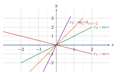

> **💡 Recorda**
>
> La **derivada d’una funció en un punt** és precisament el pendent de la recta tangent a la corba en aquell punt. Per tant, la derivada ens mesura el *ritme de creixement* de la funció en cada instant.

### Equació de la recta tangent i la recta normal

> **📘 Definició**
>
> Recta tangent en el punt $(a,\, f(a))$ La recta tangent a la gràfica de $f$ en el punt d’abscissa $a$ és la recta que *s’arrima* a la corba en aquell punt. La seva equació és: $$\boxed{y - f(a) = f'(a)\,(x - a)}$$ on $f'(a)$ és el pendent (la derivada de $f$ en $a$) i $(a, f(a))$ és el punt de tangència.

> **📘 Definició**
>
> Recta normal en el punt $(a,\, f(a))$ La recta normal és perpendicular a la tangent en el mateix punt. Com que dues rectes perpendiculars satisfan $m_1 \cdot m_2 = -1$, el pendent de la normal és $-1/f'(a)$: $$\boxed{y - f(a) = \frac{-1}{f'(a)}\,(x - a)}$$ *Nota:* Si $f'(a) = 0$ (tangent horitzontal), la normal és la recta vertical $x = a$.

> **✏️ Exemple**
>
> Recta tangent i normal a $f(x) = x^2$ en $x = 1$ Tenim $f(1) = 1$ i $f'(x) = 2x$, de manera que $f'(1) = 2$.
>
> **Recta tangent:** $y - 1 = 2(x-1) \;\Rightarrow\; \boxed{y = 2x - 1}$
>
> **Recta normal:** $y - 1 = -\frac{1}{2}(x-1) \;\Rightarrow\; \boxed{y = -\frac{1}{2}x + \frac{3}{2}}$
>
> 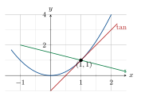

## Taxa de Variació Mitjana (TVM)

> **📘 Definició**
>
> Definició de la TVM La **Taxa de Variació Mitjana** de la funció $f$ en l’interval $[a,b]$ és el quocient: $$\text{TVM}[a,b] = \frac{f(b) - f(a)}{b - a} = \frac{\Delta y}{\Delta x}$$ Geomètricament, és el **pendent de la recta secant** que passa pels punts $(a, f(a))$ i $(b, f(b))$. Mesura el **ritme de creixement mitjà** (o decreixement, si és negativa) de la funció en l’interval $[a,b]$.

La il·lustració següent mostra la interpretació geomètrica de la TVM. La recta secant (en vermell) passa pels extrems de l’interval i la seva inclinació és la TVM:

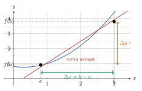

> **✏️ Exemple**
>
> Càlcul de la TVM de $f(x) = \sqrt{x-3}$ en $[3,7]$
>
> **Pas 1.** Calculem $f(7)$ i $f(3)$: $$f(7) = \sqrt{7-3} = \sqrt{4} = 2 \qquad f(3) = \sqrt{3-3} = \sqrt{0} = 0$$
>
> **Pas 2.** Apliquem la fórmula de la TVM: $$\text{TVM}[3,7] = \frac{f(7)-f(3)}{7-3} = \frac{2-0}{4} = \frac{2}{4} = \frac{1}{2} = 0{,}5$$
>
> **Interpretació:** En l’interval $[3,7]$, la funció $f(x) = \sqrt{x-3}$ creix de mitjana $0{,}5$ unitats en $y$ per cada unitat en $x$.

## Taxa de Variació Instantània (TVI) i derivada en un punt

### De la TVM a la TVI: el pas al límit

La TVM mesura el creixement *en un interval*. Però, i si volem saber el creixement en un *punt concret*? La idea clau és **fer que l’interval s’encongeixi** fins a zero.

Si comencem a $x = a$ i ens movem un increment $h$ (de manera que $b = a+h$), la TVM es converteix en: $$\text{TVM}[a,\, a+h] = \frac{f(a+h) - f(a)}{h}$$ Quan $h \to 0$, la recta secant s’aproxima a la recta **tangent**, i el seu pendent és la derivada:

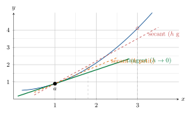

> **📘 Definició**
>
> Derivada en un punt — Definició per límit La **derivada de $f$ en el punt $x = a$** (o taxa de variació instantània en $a$) és: $$\boxed{f'(a) = \lim_{h \to 0} \frac{f(a+h) - f(a)}{h}}$$ Si aquest límit existeix i és finit, diem que $f$ és **derivable** en $a$.
>
> Equivalentment: $\displaystyle f'(a) = \lim_{x \to a} \dfrac{f(x) - f(a)}{x - a}$
>
> **Interpretació:** $f'(a)$ és el **pendent de la recta tangent** a la gràfica de $f$ en el punt $(a, f(a))$.

> **✏️ Exemple**
>
> Càlcul de $f'(1)$ per a $f(x) = x^2$ per definició $$\begin{aligned}
f'(1) &= \lim_{h \to 0} \frac{f(1+h) - f(1)}{h}
= \lim_{h \to 0} \frac{(1+h)^2 - 1^2}{h} \\[6pt]
&= \lim_{h \to 0} \frac{1 + 2h + h^2 - 1}{h}
= \lim_{h \to 0} \frac{2h + h^2}{h}
= \lim_{h \to 0} \frac{h(2 + h)}{h}
= \lim_{h \to 0} (2 + h) = \mathbf{2}
\end{aligned}$$ **Interpretació:** La recta tangent a $y = x^2$ en $x = 1$ té pendent $2$, és a dir, en aquell punt la funció creix 2 unitats per cada unitat de $x$.

### Quan una funció **no** és derivable?

> **📘 Definició**
>
> Punts de no derivabilitat Una funció $f$ **no és derivable** en $x = a$ en tres situacions:
>
> 1.  **Discontinuïtat:** si $f$ no és contínua en $a$, les derivades laterals no coincideixen: $f'_-(a) \neq f'_+(a)$
>
> 2.  **Punt angular:** la corba fa un “angle” en $a$. Exemple: $f(x) = |x|$ en $x=0$. Les derivades laterals existeixen però no coincideixen: $f'_-(0) = -1 \neq f'_+(0) = 1$
>
> 3.  **Recta tangent vertical:** la derivada és $\pm\infty$. Exemple: $f(x) = \sqrt[3]{x}$ en $x=0$: $f'(0) = +\infty$

La figura il·lustra els tres casos:

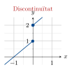 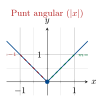 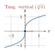

> **⚠️ Atenció**
>
> **Regla fonamental:** $$\text{Derivable} \;\Longrightarrow\; \text{Contínua} \qquad \text{però} \qquad \text{Contínua} \;\not\Longrightarrow\; \text{Derivable}$$ El valor absolut $f(x) = |x|$ és contínua en tot $\mathbb{R}$ però no és derivable en $x = 0$.

## Derivada d’una funció: càlcul

### Funció derivada per definició

> **📘 Definició**
>
> Funció derivada La **funció derivada** $f'(x)$ associa a cada punt $x$ del domini la derivada de $f$ en aquell punt: $$f'(x) = \lim_{h \to 0} \frac{f(x+h) - f(x)}{h}$$ Mentre que $f'(a)$ és un *nombre*, $f'(x)$ és una *funció*.

> **✏️ Exemple**
>
> Funció derivada de $f(x) = x^2$ per definició $$\begin{aligned}
f'(x) &= \lim_{h \to 0} \frac{(x+h)^2 - x^2}{h}
= \lim_{h \to 0} \frac{x^2 + 2xh + h^2 - x^2}{h} \\[6pt]
&= \lim_{h \to 0} \frac{h(2x + h)}{h}
= \lim_{h \to 0} (2x + h) = \mathbf{2x}
\end{aligned}$$ **Interpretació:** En el punt $x = 3$, el pendent de la tangent a $y = x^2$ és $f'(3) = 6$. En $x = 0$, el pendent és $0$ (tangent horitzontal).
>
> La figura mostra $f(x) = x^2$ (blau) i la seva derivada $f'(x) = 2x$ (vermell):
>
> 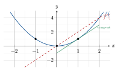
>
> Observa que quan $f$ creix (part dreta), $f' > 0$; quan decreix (part esquerra), $f' < 0$; i en el mínim ($x=0$), $f' = 0$ (tangent horitzontal).

### Regles de derivació

> **📘 Teoria**
>
> Taula de derivades de funcions elementals
>
> | **Tipus**   | **Forma simple**                                     | **Forma composta (regla cadena)**                     |
> |:------------|:-----------------------------------------------------|:------------------------------------------------------|
> | Potencial   | $y = x^n \Rightarrow y' = nx^{n-1}$                  | $y = u^n \Rightarrow y' = n u^{n-1} \cdot u'$         |
> | Constant    | $y = k \Rightarrow y' = 0$                           |                                                       |
> | Lineal      | $y = x \Rightarrow y' = 1$                           |                                                       |
> | Arrel       | $y = \sqrt{x} \Rightarrow y' = \dfrac{1}{2\sqrt{x}}$ | $y = \sqrt{u} \Rightarrow y' = \dfrac{u'}{2\sqrt{u}}$ |
> | Recíproca   | $y = \dfrac{1}{x} \Rightarrow y' = \dfrac{-1}{x^2}$  | $y = \dfrac{1}{u} \Rightarrow y' = \dfrac{-u'}{u^2}$  |
> | Logarítmica | $y = \ln x \Rightarrow y' = \dfrac{1}{x}$            | $y = \ln u \Rightarrow y' = \dfrac{u'}{u}$            |
> | Exponencial | $y = e^x \Rightarrow y' = e^x$                       | $y = e^u \Rightarrow y' = e^u \cdot u'$               |
> | Sinus       | $y = \sin x \Rightarrow y' = \cos x$                 | $y = \sin u \Rightarrow y' = u' \cos u$               |
> | Cosinus     | $y = \cos x \Rightarrow y' = -\sin x$                | $y = \cos u \Rightarrow y' = -u' \sin u$              |
> | Tangent     | $y = \tan x \Rightarrow y' = \dfrac{1}{\cos^2 x}$    | $y = \tan u \Rightarrow y' = \dfrac{u'}{\cos^2 u}$    |

> **📘 Teoria**
>
> Operacions algebraiques amb derivades Siguin $u = u(x)$ i $v = v(x)$ funcions derivables, i $k \in \mathbb{R}$: $$(u + v - w)' = u' + v' - w' \qquad (k \cdot u)' = k \cdot u'$$ $$(u \cdot v)' = u' v + u v' \qquad \left(\frac{u}{v}\right)' = \frac{u' v - u v'}{v^2}$$ **Regla de la cadena** (composició de funcions): $$y = g(f(x)) \;\Longrightarrow\; y' = g'(f(x)) \cdot f'(x)$$ O equivalent amb substitució $u = f(x)$: si $y = g(u)$ i $u = f(x)$, llavors $y' = g'(u) \cdot u'$.

> **✏️ Exemple**
>
> Derivada de $f(x) = (3x^2-1)^4$ Aquí $u = 3x^2 - 1$ (funció interior) i $g(u) = u^4$ (funció exterior).
>
> $u' = 6x$ i $g'(u) = 4u^3$
>
> Per la regla de la cadena: $f'(x) = 4(3x^2-1)^3 \cdot 6x = \mathbf{24x(3x^2-1)^3}$

## Aplicacions de la derivada

### Creixement i decreixement

> **📘 Definició**
>
> Criteri del signe de $f'$ Donada una funció derivable $f$:
>
> - Si $f'(x) > 0$ en un interval $(a,b)$, llavors $f$ és **creixent** en $(a,b)$.
>
> - Si $f'(x) < 0$ en un interval $(a,b)$, llavors $f$ és **decreixent** en $(a,b)$.
>
> - Si $f'(x) = 0$ en un punt, la tangent és horitzontal (possible extrem).

> **✏️ Exemple**
>
> Creixement/decreixement de $f(x) = x^3 - 3x + 1$ **Pas 1.** Calculem la derivada: $f'(x) = 3x^2 - 3 = 3(x^2 - 1) = 3(x-1)(x+1)$
>
> **Pas 2.** Resolem $f'(x) = 0$: $x = -1$ i $x = 1$.
>
> **Pas 3.** Estudiem el signe de $f'$ en cada interval:
>
> 
>
> $f$ és creixent en $(-\infty,-1) \cup (1,+\infty)$ i decreixent en $(-1,1)$.
>
> 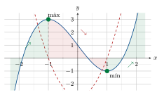

### Màxims i mínims locals

> **📘 Definició**
>
> Extrems locals Un punt $(x_0, f(x_0))$ és un **extrem local** de $f$ si és el valor més gran o més petit en un entorn de $x_0$.
>
> Per trobar els extrems:
>
> 1.  Calcula $f'(x)$ i resol $f'(x_0) = 0$ (candidats a extrem).
>
> 2.  Per a cada candidat $x_0$, aplica **un** dels dos criteris:
>
> **Criteri de la segona derivada:**
>
> - Si $f'(x_0) = 0$ i $f''(x_0) < 0$ $\;\Rightarrow\;$ $(x_0, f(x_0))$ és un **màxim local**.
>
> - Si $f'(x_0) = 0$ i $f''(x_0) > 0$ $\;\Rightarrow\;$ $(x_0, f(x_0))$ és un **mínim local**.
>
> - Si $f'(x_0) = 0$ i $f''(x_0) = 0$ $\;\Rightarrow\;$ no es pot concloure (cal més estudi).

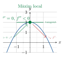 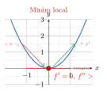

### Concavitat, convexitat i punts d’inflexió

> **📘 Definició**
>
> Concavitat, convexitat i punts d’inflexió
>
> - $f$ és **còncava** en $(a,b)$ si $f''(x) < 0$ per a tot $x \in (a,b)$. (La tangent queda *per sobre* de la corba.)
>
> - $f$ és **convexa** en $(a,b)$ si $f''(x) > 0$ per a tot $x \in (a,b)$. (La tangent queda *per sota* de la corba.)
>
> - $(x_0, f(x_0))$ és un **punt d’inflexió** si $f''(x_0) = 0$ *i* $f''$ canvia de signe en $x_0$.

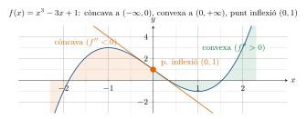
