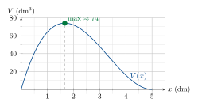

# Derivades: Exercicis

## Introducció a les derivades

#### Equació de la recta tangent i la recta normal

> **📝 Exercici**
>
> Exercici 1 – Rectes tangent i normal (lectura gràfica) Les cinc rectes del gràfic de la pàgina anterior ($r_1$ a $r_5$) representen rectes tangents a funcions en punts concrets. Per a cada recta:
>
> 1.  Determina el pendent $m$ llegint el gràfic (canvi de $y$ per cada unitat d’$x$).
>
> 2.  Escriu l’equació de la recta sabent que passa per l’origen.
>
> 3.  Si la recta és tangent a $f$ en $x = 1$, escriu l’equació de la recta normal corresponent.

### Taxa de Variació Mitjana (TVM)

> **📝 Exercici**
>
> Exercici 2 – Càlcul de la TVM Calcula la TVM de les funcions següents en els intervals indicats. Interpreta el resultat (la funció creix o decreix? a quin ritme?):
>
> 1.  $f(x) = x^3 - 4x + 6$ en $[0, 2]$
>
> 2.  $f(x) = \sqrt{x-3}$ en $[3, 7]$
>
> 3.  $f(x) = (x-1)^2$ en $[-3, 0]$
>
> 4.  $f(x) = \dfrac{x-1}{x+2}$ en $[-1, 2]$
>
> 5.  $f(x) = 2x^2 - 3x + 1$ en $[1, 4]$
>
> 6.  $f(x) = \ln(x)$ en $[1, e]$ *(deixa el resultat exacte)*

#### De la TVM a la TVI: el pas al límit

> **📝 Exercici**
>
> Exercici 3 – Derivada en un punt per definició Calcula la derivada en el punt indicat aplicant la definició límit. A cada apartat, interpreta geomètricament el resultat:
>
> 1.  $f(x) = x^2$, calcula $f'(3)$
>
> 2.  $f(x) = x^3$, calcula $f'(2)$
>
> 3.  $f(x) = \sqrt{x}$, calcula $f'(4)$
>
> 4.  $f(x) = \dfrac{1}{x}$, calcula $f'(2)$
>
> 5.  $f(x) = 3x^2 - 2x + 1$, calcula $f'(0)$

#### Quan una funció **no** és derivable?

> **📝 Exercici**
>
> Exercici 4 – Derivabilitat Estudia si les funcions següents són derivables en el punt indicat. Justifica la resposta calculant les derivades laterals:
>
> 1.  $f(x) = |x - 2|$ en $x = 2$
>
> 2.  $f(x) = \begin{cases} x^2 & \text{si } x \leq 1 \\ 2x - 1 & \text{si } x > 1 \end{cases}$ en $x = 1$
>
> 3.  $f(x) = \begin{cases} x + 1 & \text{si } x < 0 \\ x^2 + 1 & \text{si } x \geq 0 \end{cases}$ en $x = 0$
>
> 4.  $f(x) = x^{2/3}$ en $x = 0$

#### Funció derivada per definició

> **📝 Exercici**
>
> Exercici 5 – Funció derivada per definició Calcula la funció derivada aplicant la definició límit. Comprova el resultat amb les regles de derivació de la secció <a href="#sec:regles" data-reference-type="ref" data-reference="sec:regles">4.2</a>:
>
> 1.  $f(x) = x^3$
>
> 2.  $f(x) = 3x^2 - 5x$
>
> 3.  $f(x) = \dfrac{1}{x}$
>
> 4.  $f(x) = \sqrt{x}$

#### Regles de derivació

> **📝 Exercici**
>
> Exercici 6 – Derivades bàsiques Calcula la derivada de les funcions:
>
> 2
>
> 1.  $f(x) = 5x^3 - 2x^2 + 7x - 3$
>
> 2.  $f(x) = x^4 - 3x^3 + x$
>
> 3.  $f(x) = \dfrac{3}{x^2} - 5\sqrt{x}$
>
> 4.  $f(x) = (2x-1)^5$
>
> 5.  $f(x) = \sqrt{3x^2 - 1}$
>
> 6.  $f(x) = e^{2x+1}$
>
> 7.  $f(x) = \ln(x^2 + 1)$
>
> 8.  $f(x) = \sin(3x)$
>
> 9.  $f(x) = x^2 \cdot e^x$
>
> 10. $f(x) = \dfrac{x+1}{x-1}$

> **📝 Exercici**
>
> Exercici 7 – Derivades compostes (nivell mitjà)
>
> 2
>
> 1.  $f(x) = \ln(\sin x)$
>
> 2.  $f(x) = e^{x^2 - 3x}$
>
> 3.  $f(x) = \sqrt{\dfrac{x+1}{x-1}}$
>
> 4.  $f(x) = x^2 \cdot \ln(x)$
>
> 5.  $f(x) = \cos^3(x)$
>
> 6.  $f(x) = \dfrac{e^x}{x^2+1}$
>
> 7.  $f(x) = \ln\!\left(\dfrac{x}{x+2}\right)$
>
> 8.  $f(x) = \sin(x^2) \cdot \cos(x)$

> **📝 Exercici**
>
> Exercici 8 – Rectes tangent i normal Per a cada funció i punt, calcula $f'(a)$, l’equació de la recta tangent i la de la recta normal:
>
> 1.  $f(x) = x^2 - 3x + 2$ en $x = 1$
>
> 2.  $f(x) = x^3 - x$ en $x = 2$
>
> 3.  $f(x) = \sqrt{x}$ en $x = 4$
>
> 4.  $f(x) = e^x$ en $x = 0$
>
> 5.  $f(x) = \ln(x)$ en $x = 1$

#### Màxims i mínims locals

> **📝 Exercici**
>
> Exercici 9 – Creixement, decreixement i extrems Per a cada funció:
>
> - Calcula $f'(x)$ i $f''(x)$.
>
> - Determina els intervals de creixement i decreixement.
>
> - Troba els màxims i mínims locals (amb les seves coordenades).
>
> 1.  $f(x) = x^3 - 3x^2 + 4$
>
> 2.  $f(x) = x^4 - 8x^2$
>
> 3.  $f(x) = \dfrac{x}{x^2+1}$
>
> 4.  $f(x) = x \cdot e^{-x}$
>
> 5.  $f(x) = x^3 - 6x^2 + 9x - 2$

#### Concavitat, convexitat i punts d’inflexió

> **📝 Exercici**
>
> Exercici 10 – Concavitat i punts d’inflexió Per a cada funció, determina els intervals de concavitat/convexitat i les coordenades dels punts d’inflexió:
>
> 1.  $f(x) = x^4 - 6x^2 + 1$
>
> 2.  $f(x) = x^3 - 3x^2 + 4$
>
> 3.  $f(x) = e^{-x^2}$
>
> 4.  $f(x) = \ln(x^2 + 1)$

### Problemes d’optimització

> **📘 Definició**
>
> Mètode per resoldre problemes d’extrems
>
> 1.  **Identifica** la magnitud que vols maximitzar o minimitzar i exprés-la com una funció $f(x)$.
>
> 2.  **Determina el domini** de $f$ (restriccions del problema).
>
> 3.  **Calcula $f'(x)$** i resol $f'(x) = 0$.
>
> 4.  **Verifica** que cada solució és màxim o mínim (amb $f''$ o estudiant el signe de $f'$).
>
> 5.  **Interpreta** el resultat en el context del problema.

> **✏️ Exemple**
>
> La caixa de volum màxim D’una peça de cartolina de $10 \times 10$ dm es vol construir una caixa retallant quadrats iguals als vèrtexs. Quina mida ha de tenir el retall per maximitzar el volum?
>
> **Modelització:** Si el retall té costat $x$ (en dm), la caixa té:
>
> - Altura: $x$
>
> - Base: $(10-2x) \times (10-2x)$
>
> - Volum: $V(x) = x(10-2x)^2 = 4x^3 - 40x^2 + 100x$, amb $0 < x < 5$.
>
> **Derivada:** $V'(x) = 12x^2 - 80x + 100 = 4(3x^2 - 20x + 25) = 4(3x-5)(x-5)$
>
> $V'(x) = 0 \;\Rightarrow\; x = \dfrac{5}{3} \approx 1{,}67$ dm (dins del domini) o $x = 5$ (fora del domini obert).
>
> **Verificació:** $V''(x) = 24x - 80$; en $x = 5/3$: $V''(5/3) = 40 - 80 = -40 < 0$ $\Rightarrow$ **màxim**.
>
> **Resultat:** El retall ha de tenir $x = \frac{5}{3} \approx 1{,}67$ dm. Volum màxim: $V\!\left(\frac{5}{3}\right) = \frac{2000}{27} \approx 74$ dm$^3$.
>
> 

> **📝 Exercici**
>
> Exercici 11 – Problemes d’optimització
>
> 1.  **La bola:** una bola es llança verticalment. La seva altura (en m) és $h(t) = 20t - 5t^2$ ($t$ en s).
>
>     - Quina és la velocitat instantània en $t = 1$ i $t = 3$?
>
>     - En quin moment s’atura (velocitat = 0)?
>
>     - Quina és l’altura màxima que assoleix?
>
> 2.  **El rectangle d’àrea màxima:** un pastor vol tancar un terreny rectangular d’àrea màxima usant 200 m de tanca. Quines dimensions ha de tenir el terreny?
>
> 3.  **La llauna:** es vol construir una llauna cilíndrica de 500 cm$^3$ de volum. Quines dimensions (radi $r$ i altura $h$) minimitzen la quantitat de material (superfície total)?
>
> 4.  **El tall del quadrat:** donada una planxa de $12 \times 12$ cm, es retallen quadrats als vèrtexs per fer una caixa oberta. Quin retall maximitza el volum?

### Respostes seleccionades

> ****Respostes (Ex. 2 – TVM)****
>
> a\) $0$ b) $\tfrac{1}{2}$ c) $-5$ d) $\tfrac{3}{4}$ e) $7$ f) $\tfrac{e-1}{e-1}=1$

> ****Respostes (Ex. 3 – Derivada per definició)****
>
> a\) $f'(3) = 6$ b) $f'(2) = 12$ c) $f'(4) = \tfrac{1}{4}$ d) $f'(2) = -\tfrac{1}{4}$ e) $f'(0) = -2$

> ****Respostes (Ex. 6 – Derivades)****
>
> a\) $15x^2-4x+7$ b) $4x^3-9x^2+1$ c) $-\tfrac{6}{x^3}-\tfrac{5}{2\sqrt{x}}$ d) $10(2x-1)^4$ e) $\tfrac{3x}{\sqrt{3x^2-1}}$ f) $2e^{2x+1}$ g) $\tfrac{2x}{x^2+1}$ h) $3\cos(3x)$ i) $e^x(x^2+2x)$ j) $\tfrac{-2}{(x-1)^2}$

> ****Respostes (Ex. 8 – Tangents)****
>
> a\) $f'(1)=-1$; tang: $y=-x+1$; norm: $y=x-1$ b) $f'(2)=11$; tang: $y=11x-16$; norm: $y=-\tfrac{1}{11}x+\tfrac{4}{11}+6$ c) $f'(4)=\tfrac{1}{4}$; tang: $y=\tfrac{1}{4}x+1$; norm: $y=-4x+18$ d) $f'(0)=1$; tang: $y=x+1$; norm: $y=-x+1$ e) $f'(1)=1$; tang: $y=x-1$; norm: $y=-x+1$

> ****Respostes (Ex. 11 – Optimització)****
>
> a\) $h'(t)=20-10t$; vel$(1)=10$ m/s, vel$(3)=-10$ m/s; s’atura a $t=2$ s; alt. màx $= 20$ m. b) Quadrat de $50\times 50$ m. c) $r = \sqrt[3]{\tfrac{250}{\pi}} \approx 4{,}30$ cm, $h = 2r \approx 8{,}60$ cm. d) Retall $x = 2$ cm; volum màxim $= 128$ cm$^3$.

------------------------------------------------------------------------

  

*La matemàtica és la ciència que es construeix seguint un fil lògic sense trencaments.*

------------------------------------------------------------------------

## Exercicis de paràmetres

> **📝 Exercici**
>
> Exercici 1 **Enunciat:** Troba els valors $a, b, c, d$ perquè la funció $$f(x) = ax^3 + bx^2 + cx + d$$ tingui un **màxim** en el punt $(0, 4)$ i un **mínim** en el punt $(2, 0)$.

#### Pas 1 – Derivada de la funció

$$f'(x) = 3ax^2 + 2bx + c$$

#### Pas 2 – Condicions del màxim en $(0,\,4)$

**Condició 1:** La funció passa pel punt $(0, 4)$: $$f(0) = a\cdot 0^3 + b\cdot 0^2 + c\cdot 0 + d = 4
\implies \boxed{d = 4}$$

**Condició 2:** En un màxim la derivada és zero, $f'(0) = 0$: $$f'(0) = 3a\cdot 0^2 + 2b\cdot 0 + c = 0
\implies \boxed{c = 0}$$

#### Pas 3 – Condicions del mínim en $(2,\,0)$

**Condició 3:** La funció passa pel punt $(2, 0)$: $$f(2) = 8a + 4b + 2c + d = 0$$ Substituint $c=0$ i $d=4$: $$8a + 4b + 4 = 0
\implies 8a + 4b = -4
\implies \boxed{2a + b = -1} \quad \text{(equació I)}$$

**Condició 4:** En un mínim la derivada és zero, $f'(2) = 0$: $$f'(2) = 3a\cdot 4 + 2b\cdot 2 + c = 0
\implies 12a + 4b + 0 = 0
\implies \boxed{3a + b = 0} \quad \text{(equació II)}$$

#### Pas 4 – Resolució del sistema d’equacions

$$\begin{cases}
2a + b = -1 & \text{(I)} \\
3a + b = 0  & \text{(II)}
\end{cases}$$

Restant (I) de (II): $$(3a + b) - (2a + b) = 0 - (-1)
\implies a = 1$$

Substituint $a=1$ a (II): $$3(1) + b = 0 \implies b = -3$$

> **📘 Resultat**
>
> $$a = 1, \quad b = -3, \quad c = 0, \quad d = 4$$ $$\boxed{f(x) = x^3 - 3x^2 + 4}$$
>
> Comprovació:
>
> - $f(0) = 0 - 0 + 4 = 4$
>
> - $f(2) = 8 - 12 + 4 = 0$
>
> - $f'(x) = 3x^2 - 6x$; $f'(0) = 0$ ;$f'(2) = 12 - 12 = 0$

> **📝 Exercici**
>
> Exercici 2 **Enunciat:** Troba els valors $a, b, c, d$ perquè la funció $$f(x) = ax^3 + bx^2 + cx + d$$ passi per $(-1,\,1)$ i per $(0,\,-2)$, i tingui un **punt d’inflexió** amb **tangent horitzontal** en $(0,\,-2)$.

#### Pas 1 – Derivades de la funció

$$f'(x) = 3ax^2 + 2bx + c$$ $$f''(x) = 6ax + 2b$$

#### Pas 2 – Condició: passa per $(0,\,-2)$

$$f(0) = d = -2
\implies \boxed{d = -2}$$

#### Pas 3 – Condició: tangent horitzontal en $x = 0$

La recta tangent és horitzontal quan $f'(0) = 0$: $$f'(0) = c = 0
\implies \boxed{c = 0}$$

#### Pas 4 – Condició: punt d’inflexió en $x = 0$

En un punt d’inflexió, $f''(0) = 0$: $$f''(0) = 6a\cdot 0 + 2b = 0
\implies 2b = 0
\implies \boxed{b = 0}$$

#### Pas 5 – Condició: passa per $(-1,\,1)$

$$f(-1) = a(-1)^3 + b(-1)^2 + c(-1) + d = 1$$ Substituint $b = 0$, $c = 0$, $d = -2$: $$-a + 0 + 0 - 2 = 1$$ $$-a = 3
\implies \boxed{a = -3}$$

> **📘 Resultat**
>
> $$a = -3, \quad b = 0, \quad c = 0, \quad d = -2$$ $$\boxed{f(x) = -3x^3 - 2}$$
>
> Comprovació:
>
> - $f(0) = 0 - 2 = -2$
>
> - $f(-1) = -3(-1)^3 - 2 = 3 - 2 = 1$
>
> - $f'(x) = -9x^2$;$f'(0) = 0$ (tangent horitzontal)
>
> - $f''(x) = -18x$;$f''(0) = 0$ (punt d’inflexió)
