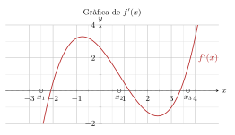
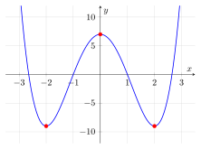
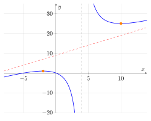

# Derivades: Difícils i exàmens

## Introducció a les derivades

### Problemes de síntesi

> **📝 Exercici**
>
> Exercici 12 – Estudi complet d’una funció Per a cada funció, fes l’estudi complet: domini, talls amb els eixos, creixement/decreixement, màxims i mínims, concavitat/convexitat, punts d’inflexió, i esbossa la gràfica:
>
> 1.  $f(x) = x^3 - 3x^2 + 4$
>
> 2.  $f(x) = x^4 - 8x^2 + 7$

> **📝 Exercici**
>
> Exercici 13 – Raonament sobre gràfiques A la figura es mostra la gràfica de la *derivada* $f'(x)$ d’una funció $f(x)$.
>
> 
>
> Respon raonant a partir de la gràfica de $f'(x)$:
>
> 1.  En quins punts $f$ pot tenir un màxim local? I un mínim local? Per què?
>
> 2.  En quins intervals $f$ és creixent? I decreixent?
>
> 3.  Quin és el signe de $f'$ en l’interval $(-\infty, x_1)$?
>
> 4.  Si a més sabem que $f'$ és creixent al voltant de $x_2$, és un màxim o un mínim de $f$?

> **📝 Exercici**
>
> Exercici 14 – Determinació de paràmetres
>
> 1.  Determina els valors de $a$ i $b$ perquè la funció $$f(x) = \begin{cases} ax + b & \text{si } x \leq 2 \\ x^2 - 1 & \text{si } x > 2 \end{cases}$$ sigui derivable en $x = 2$.
>
> 2.  La funció $f(x) = ax^3 + bx^2 + cx + d$ té un màxim en $(-1, 4)$ i un mínim en $(1, -2)$. Troba $a$, $b$, $c$ i $d$.

## Examen de derivades

### Exercici 1

> Donat el gràfic de $f(x)$, calcula $f'(-4)$, $f'(0)$, $f'(3)$ i $f'(6)$ i troba l’equació de la recta tangent en els punts A, B i C.

> De la inspecció del gràfic es llegeixen les pendents:
>
> - $f'(-4) = -\dfrac{1}{2}$ (pendent de la recta en $x=-4$)
>
> - $f'(0) = 0$ (mínim local, tangent horitzontal)
>
> - $f'(3) = \dfrac{4}{3}$ (pendent positiva creixent)
>
> - $f'(6)$ és gran i positiu (corba molt inclinada)
>
> **Recta tangent en el punt A** (aproximadament $(-4, 1)$ i pendent $-\frac{1}{2}$): $$y - 1 = -\frac{1}{2}(x + 4) \implies y = -\frac{1}{2}x - 1$$
>
> **Recta tangent en el punt B** (aproximadament $(0, -3)$ i pendent $0$): $$y = -3$$
>
> **Recta tangent en el punt C** (aproximadament $(3, -1)$ i pendent $\frac{4}{3}$): $$y + 1 = \frac{4}{3}(x - 3) \implies y = \frac{4}{3}x - 5$$

### Exercici 2

> Calcula la funció derivada de les funcions següents:
>
> 1.  $y = x^3 \cdot \ln x$
>
> 2.  $y = (e^x + 1)^3$
>
> 3.  $y = \sin^2 x$
>
> 4.  $y = 9^{x^2+x+1}$

> **a)** Regla del producte: $(u \cdot v)' = u'v + uv'$, amb $u = x^3$, $v = \ln x$: $$y' = 3x^2 \cdot \ln x + x^3 \cdot \frac{1}{x} = 3x^2 \ln x + x^2 = x^2(3\ln x + 1)$$
>
> **b)** Regla de la cadena: $[f(g(x))]' = f'(g(x)) \cdot g'(x)$, amb $f(u)=u^3$, $g(x)=e^x+1$: $$y' = 3(e^x + 1)^2 \cdot e^x$$
>
> **c)** $y = (\sin x)^2$. Regla de la cadena amb $f(u)=u^2$, $g(x)=\sin x$: $$y' = 2\sin x \cdot \cos x = \sin(2x)$$
>
> **d)** $y = 9^{x^2+x+1}$. Derivada de $a^{u(x)}$: $y' = a^{u(x)} \cdot \ln(a) \cdot u'(x)$: $$u(x) = x^2 + x + 1 \implies u'(x) = 2x + 1$$ $$y' = 9^{x^2+x+1} \cdot \ln(9) \cdot (2x+1)$$

### Exercici 3

> Sigui $f(x) = x^3 + ax^2 + bx + 5$. Troba $a$ i $b$ perquè la corba $y = f(x)$ tingui en $x = 1$ un punt d’inflexió amb recta tangent horitzontal.

> Calculem les derivades: $$f'(x) = 3x^2 + 2ax + b$$ $$f''(x) = 6x + 2a$$
>
> **Condició 1 – Punt d’inflexió a $x=1$:** $f''(1) = 0$ $$6(1) + 2a = 0 \implies 2a = -6 \implies \boxed{a = -3}$$
>
> **Condició 2 – Tangent horitzontal a $x=1$:** $f'(1) = 0$ $$3(1)^2 + 2(-3)(1) + b = 0 \implies 3 - 6 + b = 0 \implies \boxed{b = 3}$$
>
> **Comprovació:** $f(x) = x^3 - 3x^2 + 3x + 5 = (x-1)^3 + 6$. Efectivament $x=1$ és punt d’inflexió.

### Exercici 4

> Considera la funció $y = x^4 - 8x^2 + 7$.
>
> 1.  Calcula els seus intervals de creixement i decreixement, així com els màxims i mínims relatius.
>
> 2.  Fes després un esbós de la gràfica d’aquesta funció.

> **a)** Derivem: $$y' = 4x^3 - 16x = 4x(x^2 - 4) = 4x(x-2)(x+2)$$
>
> Punts crítics: $x = -2,\ 0,\ 2$.
>
> | $x$  | $(-\infty,-2)$ | $-2$ |  $(-2,0)$  | $0$ |  $(0,2)$   | $2$ | $(2,+\infty)$ |
> |:----:|:--------------:|:----:|:----------:|:---:|:----------:|:---:|:-------------:|
> | $y'$ |      $-$       | $0$  |    $+$     | $0$ |    $-$     | $0$ |      $+$      |
> | $y$  |   $\searrow$   | mín  | $\nearrow$ | màx | $\searrow$ | mín |  $\nearrow$   |
>
> - **Mínim relatiu** en $x = -2$: $y(-2) = 16 - 32 + 7 = -9$. Punt $(-2, -9)$.
>
> - **Màxim relatiu** en $x = 0$: $y(0) = 7$. Punt $(0, 7)$.
>
> - **Mínim relatiu** en $x = 2$: $y(2) = 16 - 32 + 7 = -9$. Punt $(2, -9)$.
>
> **Intervals de creixement:** $(-2, 0)$ i $(2, +\infty)$.  
> **Intervals de decreixement:** $(-\infty, -2)$ i $(0, 2)$.
>
> **b)** Esbós (funció parella, simètrica respecte l’eix $y$):
>
> 

### Exercici 5

> Considera la funció real de variable real $f(x) = \dfrac{x^2 + 5x}{x - 4}$.
>
> 1.  Estudia el signe de la funció.
>
> 2.  Determina el creixement i decreixement de la funció i indica quins són els seus màxims i mínims.
>
> 3.  Troba les seves asímptotes.
>
> 4.  Fes un esbós de la gràfica de la funció a partir de les dades obtingudes en els apartats anteriors.

> **Domini:** $x \neq 4$, és a dir, $\mathbb{R} \setminus \{4\}$.
>
> **a) Signe de la funció:** $$f(x) = \frac{x(x+5)}{x-4}$$ Zeros: $x = 0$ i $x = -5$.
>
> | Interval | $(-\infty,-5)$ | $-5$ | $(-5,0)$ | $0$ | $(0,4)$ |    $4$     | $(4,+\infty)$ |
> |:--------:|:--------------:|:----:|:--------:|:---:|:-------:|:----------:|:-------------:|
> |  $f(x)$  |      $-$       | $0$  |   $+$    | $0$ |   $-$   | $\nexists$ |      $+$      |
>
> **b) Creixement i decreixement:** $$f'(x) = \frac{(2x+5)(x-4) - (x^2+5x)(1)}{(x-4)^2}
= \frac{2x^2 - 8x + 5x - 20 - x^2 - 5x}{(x-4)^2}
= \frac{x^2 - 8x - 20}{(x-4)^2}$$ $$x^2 - 8x - 20 = 0 \implies x = \frac{8 \pm \sqrt{64 + 80}}{2} = \frac{8 \pm 12}{2}$$ $$x_1 = 10, \quad x_2 = -2$$
>
> - $f'(x) > 0$ per $x \in (-\infty,-2) \cup (10,+\infty)$ **(creixent)**
>
> - $f'(x) < 0$ per $x \in (-2,4) \cup (4,10)$ **(decreixent)**
>
> - **Màxim relatiu** en $x = -2$: $f(-2) = \dfrac{4-10}{-6} = 1$. Punt $(-2, 1)$.
>
> - **Mínim relatiu** en $x = 10$: $f(10) = \dfrac{100+50}{6} = 25$. Punt $(10, 25)$.
>
> **c) Asímptotes:**
>
> *Vertical:* $x = 4$ (el denominador s’anul·la).
>
> *Obliqua:* Dividim $x^2 + 5x$ entre $x - 4$: $$x^2 + 5x = (x-4)(x+9) + 36 \implies f(x) = x + 9 + \frac{36}{x-4}$$ Asímptota obliqua: $y = x + 9$.
>
> **d)** Esbós:
>
> 

### Exercici 6

> Donat el gràfic de la funció $f(x)$:
>
> 1.  Determina per a quins valors de $x$ no existeix la derivada de la funció $f$.
>
> 2.  Representa la gràfica de la funció derivada de $f(x)$.

> **a)** Del gràfic s’observa que $f$ presenta **punts angulars** (no derivable) a: $$x = 0 \quad \text{i} \quad x = 1$$ (La funció és contínua però les semipendents laterals no coincideixen en aquests punts.)
>
> A l’interval $[-1, 1]$ la funció és derivable excepte en $x=0$ i $x=1$.
>
> **b)** Descripció qualitativa de $f'(x)$:
>
> - Per $x < 0$: $f'$ és una constant positiva (tram lineal creixent).
>
> - En $x = 0$: salt (no existeix).
>
> - Per $0 < x < 1$: $f'$ és una constant negativa (tram lineal decreixent).
>
> - En $x = 1$: salt (no existeix).
>
> - Per $x > 1$: $f'$ és creixent (tram parabòlic).

### Exercici 7

> Volem fer un envàs de gelat amb forma de prisma regular de base quadrada i amb una capacitat de $80\ \text{cm}^3$. El material per a la tapa i la superfície lateral costa $1\ \text{€/cm}^2$, però per a la base haurem d’utilitzar un material que és un 50% més car.
>
> 1.  Si $x$ és la mesura, en cm, del costat de la base, comprova que la funció que determina el preu de l’envàs és $f(x) = 2{,}5x^2 + \dfrac{320}{x}$.
>
> 2.  Calcula les mides que ha de tenir l’envàs perquè el preu sigui el mínim possible.

> Sigui $x$ = costat de la base i $h$ = alçada.
>
> **Restricció de volum:** $x^2 \cdot h = 80 \implies h = \dfrac{80}{x^2}$.
>
> **a)** Àrees i costos:
>
> - Base: àrea $= x^2$, preu $= 1{,}5\ \text{€/cm}^2$ (50% més car). Cost $= 1{,}5x^2$.
>
> - Tapa: àrea $= x^2$, preu $= 1\ \text{€/cm}^2$. Cost $= x^2$.
>
> - Lateral (4 cares): àrea $= 4xh = 4x \cdot \dfrac{80}{x^2} = \dfrac{320}{x}$, preu $= 1\ \text{€/cm}^2$. Cost $= \dfrac{320}{x}$.
>
> $$f(x) = 1{,}5x^2 + x^2 + \frac{320}{x} = 2{,}5x^2 + \frac{320}{x} \quad \checkmark$$
>
> **b)** Minimitzem $f(x)$ per $x > 0$: $$f'(x) = 5x - \frac{320}{x^2}$$ Igualem a zero: $$5x = \frac{320}{x^2} \implies 5x^3 = 320 \implies x^3 = 64 \implies \boxed{x = 4\ \text{cm}}$$
>
> Comprovem que és mínim: $f''(x) = 5 + \dfrac{640}{x^3} > 0$ per tot $x > 0$. ✓
>
> $$h = \frac{80}{4^2} = \frac{80}{16} = 5\ \text{cm}$$
>
> **Cost mínim:** $f(4) = 2{,}5 \cdot 16 + \dfrac{320}{4} = 40 + 80 = 120\ \text{€}$.
>
> **Mides òptimes:** base $4 \times 4\ \text{cm}$, alçada $5\ \text{cm}$.

### Exercici 8

> Una empresa vol instal·lar un cable d’energia elèctrica des del punt A de la costa fins al punt B situat en una illa. L’illa es troba 9 km més avall del punt A i a 6 km de la costa. El cost d’instal·lació és de 4.000 €/km per terra i 5.000 €/km per sota l’aigua.
>
> 1.  Demostra que el cost total en milers d’euros és $f(x) = 5\sqrt{x^2 + 36} + 4(9-x)$.
>
> 2.  Calcula el valor de $x$ perquè la connexió sigui tan econòmica com sigui possible. Quin serà aquest cost mínim?

> Sigui $P$ el punt de la costa on surt el cable submarí, a distància $x$ de $C$ (base perpendicular des de l’illa).
>
> **a)**
>
> - Longitud submarina: $\sqrt{x^2 + 6^2} = \sqrt{x^2 + 36}$ km.
>
> - Longitud per terra: $9 - x$ km (de $P$ fins $A$).
>
> $$f(x) = 5\sqrt{x^2 + 36} + 4(9-x), \quad 0 \le x \le 9 \quad \checkmark$$
>
> **b)** Derivem i igualem a zero: $$f'(x) = \frac{5x}{\sqrt{x^2 + 36}} - 4$$ $$\frac{5x}{\sqrt{x^2+36}} = 4 \implies 25x^2 = 16(x^2 + 36) \implies 9x^2 = 576 \implies x^2 = 64 \implies \boxed{x = 8\ \text{km}}$$
>
> Comprovem $f''(8) > 0$ (mínim).
>
> $$f(8) = 5\sqrt{64+36} + 4(9-8) = 5\sqrt{100} + 4 = 50 + 4 = \boxed{54\ \text{milers d'euros}}$$

### Exercici 9

> Una planxa de cartró quadrada té 12 cm de costat. En cada un dels vèrtexs hi retallem un quadrat de $x$ cm de costat. Plegant les solapes que queden es forma una capsa.
>
> 1.  Expressa el volum en funció de $x$.
>
> 2.  Determina la mida de $x$ perquè el volum de la capsa sigui màxima.

> **a)** Dimensions de la capsa:
>
> - Base: $(12 - 2x) \times (12 - 2x)$
>
> - Alçada: $x$
>
> $$V(x) = x(12-2x)^2 = x(144 - 48x + 4x^2) = 4x^3 - 48x^2 + 144x$$ amb $0 < x < 6$.
>
> **b)** Derivem: $$V'(x) = 12x^2 - 96x + 144 = 12(x^2 - 8x + 12) = 12(x-2)(x-6)$$
>
> Punts crítics dins $(0,6)$: $x = 2$.
>
> $$V''(x) = 24x - 96 \implies V''(2) = 48 - 96 = -48 < 0 \implies \text{màxim}$$
>
> $$\boxed{x = 2\ \text{cm}}$$
>
> $$V(2) = 2(12-4)^2 = 2 \cdot 64 = 128\ \text{cm}^3$$

### Exercici 10

> Se sap que la concentració d’un antibiòtic en sang (ng/ml) ve modelitzada per la funció $$f(t) = 18t \cdot e^{-0{,}5t}$$ $t$ hores després de prendre la primera dosi. Determina la màxima concentració d’aquest fàrmac en sang i al cap de quant de temps s’assoleix.

> Derivem usant la regla del producte: $$f'(t) = 18e^{-0{,}5t} + 18t \cdot (-0{,}5) e^{-0{,}5t} = 18e^{-0{,}5t}(1 - 0{,}5t)$$
>
> Com que $e^{-0{,}5t} > 0$ per tot $t$, igualem el factor lineal a zero: $$1 - 0{,}5t = 0 \implies \boxed{t = 2\ \text{hores}}$$
>
> Comprovem que és màxim: $f'(t) > 0$ per $t < 2$ i $f'(t) < 0$ per $t > 2$. ✓
>
> **Concentració màxima:** $$f(2) = 18 \cdot 2 \cdot e^{-1} = 36 \cdot e^{-1} = \frac{36}{e} \approx 13{,}25\ \text{ng/ml}$$

### Exercici 11 (Opcional)

> Considera la funció $f(x) = \sqrt{x-1}$.
>
> 1.  Troba les equacions de la recta tangent i la recta normal a la gràfica de $f(x)$ en el punt d’abscissa igual a 10.
>
> 2.  Per a quin valor de $x$ la recta tangent a la funció $f(x)$ és paral·lela a la recta $y = \dfrac{1}{2}x + 3$?

> **Derivada:** $$f'(x) = \frac{1}{2\sqrt{x-1}}$$
>
> **a)** En $x = 10$: $$f(10) = \sqrt{9} = 3, \qquad f'(10) = \frac{1}{2\sqrt{9}} = \frac{1}{6}$$
>
> *Recta tangent* (pendent $\frac{1}{6}$, passa per $(10, 3)$): $$y - 3 = \frac{1}{6}(x - 10) \implies y = \frac{1}{6}x + \frac{4}{3}$$
>
> *Recta normal* (pendent $-6$, perpendicular a la tangent): $$y - 3 = -6(x - 10) \implies y = -6x + 63$$
>
> **b)** La recta $y = \frac{1}{2}x + 3$ té pendent $\frac{1}{2}$. Volem: $$f'(x) = \frac{1}{2} \implies \frac{1}{2\sqrt{x-1}} = \frac{1}{2} \implies \sqrt{x-1} = 1 \implies x - 1 = 1 \implies \boxed{x = 2}$$

### Exercici 12 (Opcional)

> Calcula el valor de $a$ i $b$ per tal que la funció $$f(x) = \begin{cases} ax^2 + 3x & \text{si } x \leq 2 \\ x^2 - bx - 4 & \text{si } x > 2 \end{cases}$$ sigui derivable en tot el seu domini.

> Per a que $f$ sigui derivable a $x = 2$ cal que sigui contínua i que les derivades laterals coincideixin.
>
> **Condició de continuïtat** ($\lim_{x\to 2^-} f(x) = \lim_{x\to 2^+} f(x)$): $$a(4) + 3(2) = (4) - b(2) - 4$$ $$4a + 6 = -2b \implies 4a + 2b = -6 \implies 2a + b = -3 \quad (1)$$
>
> **Condició de derivabilitat** (derivades laterals iguals):
>
> $f'_-(x) = 2ax + 3 \implies f'_-(2) = 4a + 3$
>
> $f'_+(x) = 2x - b \implies f'_+(2) = 4 - b$
>
> $$4a + 3 = 4 - b \implies 4a + b = 1 \quad (2)$$
>
> Resolem el sistema $(1)$ i $(2)$: $$(2) - (1): \quad 2a = 4 \implies \boxed{a = 2}$$ $$b = 1 - 4a = 1 - 8 = \boxed{b = -7}$$

### Exercici 13 (Opcional)

> Considera tots els rectangles situats en el primer quadrant que tenen dos dels seus costats sobre els eixos de coordenades i un vèrtex en la recta que passa pels punts $A(0,4)$ i $B(6,0)$. Determina els vèrtexs del rectangle d’àrea màxima.

> **Equació de la recta** $AB$ (passa per $(0,4)$ i $(6,0)$): $$\frac{x}{6} + \frac{y}{4} = 1 \implies y = 4 - \frac{2x}{3}$$
>
> El vèrtex del rectangle sobre la recta és $(x, y)$ amb $0 < x < 6$.
>
> **Àrea del rectangle:** $$A(x) = x \cdot y = x\left(4 - \frac{2x}{3}\right) = 4x - \frac{2x^2}{3}$$
>
> **Maximitzem:** $$A'(x) = 4 - \frac{4x}{3} = 0 \implies x = 3$$ $$A''(x) = -\frac{4}{3} < 0 \implies \text{màxim} \checkmark$$
>
> $$y = 4 - \frac{2 \cdot 3}{3} = 4 - 2 = 2$$
>
> **Vèrtexs del rectangle d’àrea màxima:** $$(0,0),\quad (3,0),\quad (3,2),\quad (0,2)$$ $$A_{\max} = 3 \times 2 = 6\ \text{u}^2$$

### Exercici 14 (Opcional)

> En el gràfic adjunt es mostren les gràfiques de $f$ i $g$. A partir d’elles es defineixen les funcions $$p(x) = f(x) \cdot g(x) \qquad \text{i} \qquad q(x) = \frac{f(x)}{g(x)}.$$ Calcula:
>
> 1.  $p'(1)$
>
> 2.  $q'(5)$

> Del gràfic llegim (valors i pendents aproximats):
>
> | $x$ | $f(x)$ | $f'(x)$ | $g(x)$ | $g'(x)$ |
> |:---:|:------:|:-------:|:------:|:-------:|
> | $1$ |  $2$   |   $2$   |  $-2$  |   $1$   |
> | $5$ |  $2$   |   $1$   |  $2$   |   $0$   |
>
> **a)** Regla del producte: $$p'(x) = f'(x) \cdot g(x) + f(x) \cdot g'(x)$$ $$p'(1) = f'(1) \cdot g(1) + f(1) \cdot g'(1) = 2 \cdot (-2) + 2 \cdot 1 = -4 + 2 = \boxed{-2}$$
>
> **b)** Regla del quocient: $$q'(x) = \frac{f'(x) \cdot g(x) - f(x) \cdot g'(x)}{[g(x)]^2}$$ $$q'(5) = \frac{f'(5) \cdot g(5) - f(5) \cdot g'(5)}{[g(5)]^2} = \frac{1 \cdot 2 - 2 \cdot 0}{4} = \frac{2}{4} = \boxed{\frac{1}{2}}$$

*Document generat amb LaTeX per a Overleaf – Matemàtiques 1r BAT 2025-2026*
