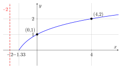
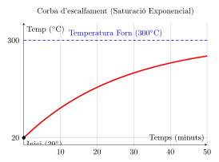
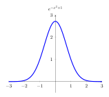
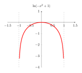
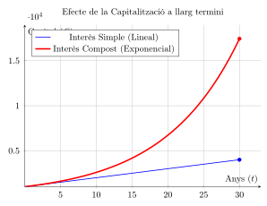
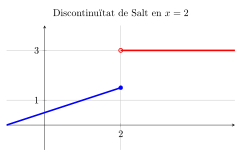
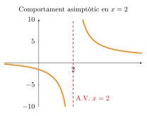

# Funcions exponencials, logarítmiques i límits: Exercicis

## Exercicis resolts de funcions i límits

### Exercici 1: Funció Logarítmica

**Enunciat:** Troba l’equació de la funció $y=\log_{b}(C(x+2))$ sabent que té una asímptota vertical en $x=-2$ i que passa pels punts $(0, 1)$ i $(4, 2)$.

#### Resolució pas a pas

1.  **Identificació de l’asímptota:** L’asímptota vertical en $x = -2$ ens confirma el desplaçament horitzontal de la funció. L’argument del logaritme s’ha d’anul·lar en aquest punt, per tant, el factor $(x+2)$ és correcte.

2.  **Substitució del punt $(0, 1)$:** Substituïm $x=0$ i $y=1$ en l’equació general per trobar una relació entre $b$ i $C$: $$1 = \log_{b}(C(0+2)) \implies 1 = \log_{b}(2C)$$ Aplicant la definició de logaritme ($b^y = \text{argument}$): $$b^1 = 2C \implies b = 2C$$

3.  **Substitució del punt $(4, 2)$:** Substituïm $x=4$ i $y=2$ en l’equació: $$2 = \log_{b}(C(4+2)) \implies 2 = \log_{b}(6C)$$ Aplicant la definició de logaritme: $$b^2 = 6C$$

4.  **Resolució del sistema d’equacions:** Dividim l’equació (2) entre l’equació (1) per eliminar la incògnita $C$: $$\frac{b^2}{b} = \frac{6C}{2C} \implies b = 3$$

5.  **Càlcul de la constant $C$:** Ara substituïm el valor de $b=3$ en l’equació (1): $$3 = 2C \implies C = \frac{3}{2} = 1,5$$

#### Resultat Final

L’equació de la funció que passa pels punts indicats és: $$y = \log_{3}(1,5(x+2))$$

### Exercici 2: Funció Exponencial (Model de la Pizza)

**Enunciat:** Una pizza surt de la nevera a $20^{\circ}C$ i es posa en un forn a $300^{\circ}C$. Al cap d’un minut, la temperatura és de $30^{\circ}C$. Troba la funció $T(t)=a \cdot b^{t}+k$ i calcula en quin minut arribarà als $90^{\circ}C$.

#### Resolució pas a pas

1.  **Trobar l’asímptota horitzontal ($k$):** En els models d’escalfament, la temperatura de l’objecte tendeix a la temperatura ambient (el forn). \[cite_start\]Per tant, el "sostre" o asímptota horitzontal és $k = 300$\[cite: 44, 45\]. $$T(t) = a \cdot b^{t} + 300$$

2.  **Trobar la distància inicial ($a$):** \[cite_start\]Usem la dada inicial: en el moment de sortir de la nevera ($t=0$), la temperatura és de $20^{\circ}C$\[cite: 32, 46\]. $$20 = a \cdot b^{0} + 300$$ Com que $b^0 = 1$: $$20 = a + 300 \implies a = 20 - 300 = -280$$ \[cite_start\]El valor negatiu indica que la funció creix des de sota cap a l’asímptota\[cite: 48, 49\].

3.  **Trobar el ritme de creixement ($b$):** \[cite_start\]Usem la dada del minut 1 ($t=1, T=30$)\[cite: 33, 50\]: $$30 = -280 \cdot b^{1} + 300$$ Aïllem $b$: $$30 - 300 = -280b \implies -270 = -280b$$ $$b = \frac{-270}{-280} \approx 0,964$$

4.  **Equació final del model:** \[cite_start\]$$T(t) = -280 \cdot 0,964^{t} + 300$$ \[cite: 54\]

5.  **Càlcul per a $T = 90^{\circ}C$:** Plantegem l’equació per trobar el temps $t$: $$90 = -280 \cdot 0,964^{t} + 300$$ $$90 - 300 = -280 \cdot 0,964^{t} \implies -210 = -280 \cdot 0,964^{t}$$ $$0,75 = 0,964^{t}$$ Apliquem logaritmes per aïllar $t$: $$\ln(0,75) = t \cdot \ln(0,964) \implies t = \frac{\ln(0,75)}{\ln(0,964)} \approx 7,86 \text{ minuts}$$

#### Resultat Final

La funció és **$T(t) = -280 \cdot 0,964^{t} + 300$** i la pizza arribarà als $90^{\circ}C$ aproximadament al minut **7,86**.

### Exercici 3: Transformacions de Funcions

**Enunciat:** Donada la funció base $f(x) = -x^2 + 1$, descriu el domini i el comportament de $g(x) = e^{f(x)}$ i $h(x) = \ln(f(x))$.

#### Resolució pas a pas

- **Anàlisi de la funció base:** La paràbola $f(x) = -x^2 + 1$ té el vèrtex a $(0, 1)$ i les arrels a $x = -1$ i $x = 1$. És positiva només en l’interval $(-1, 1)$.

- **a) Transformació Exponencial $g(x) = e^{-x^2+1}$:**

  - **Domini:** Tots els nombres reals ($\mathbb{R}$), ja que la funció exponencial no té restriccions.

  - **Comportament asimptòtic:** Quan $x \to \pm\infty$, $f(x) \to -\infty$. Com que $e^{-\infty} \to 0$, la funció té una **asímptota horitzontal en $y = 0$**.

  - **Imatge:** L’interval $(0, e]$, amb el valor màxim a $g(0) = e^1 \approx 2,718$.

- **b) Transformació Logarítmica $h(x) = \ln(-x^2+1)$:**

  - **Domini restringit:** El logaritme només existeix on $f(x) > 0$. Per tant, el domini és l’interval **$(-1, 1)$**.

  - **Asímptotes verticals:** En els punts on la paràbola val zero ($x = \pm 1$), el logaritme cau cap a $-\infty$. Hi ha **asímptotes verticals en $x = -1$ i $x = 1$**.

  - **Màxim:** El punt més alt és $h(0) = \ln(1) = 0$.

### Exercici 4: Matemàtica Financera (Interès Simple vs Compost)

**Enunciat:** Compara una inversió de 1.000€ al 10% anual durant 30 anys en interès simple i compost.

#### Resolució pas a pas

1.  **a) Interès Simple (Model Lineal):** Utilitzem la fórmula $C_f = C_i(1 + i \cdot t)$: $$C_f = 1000(1 + 0,10 \cdot 30) = 1000(1 + 3) = 4.000\text{€}$$

2.  **b) Interès Compost (Model Exponencial):** Utilitzem la fórmula $C_f = C_i(1 + i)^t$: $$C_f = 1000(1 + 0,10)^{30} = 1000(1,1)^{30} \approx 17.449,40\text{€}$$

3.  **Conclusió visual:** L’interès simple genera una **línia recta**, mentre que el compost genera una **corba exponencial** que es dispara a llarg termini.

### Exercici 5: Model d’Interès Continu

**Enunciat:** Invertim 1.500€ a un 2,75% d’interès continu. Quant de temps tardarem a duplicar el capital (3.000€)?

#### Resolució pas a pas

1.  **Equació:** Utilitzem la base $e$ per capitalització contínua: $C_f = C_i \cdot e^{i \cdot t}$. $$3000 = 1500 \cdot e^{0,0275 \cdot t} \implies 2 = e^{0,0275 \cdot t}$$

2.  **Logaritmes:** Apliquem el logaritme neperià ($\ln$) a ambdós costats: $$\ln(2) = 0,0275 \cdot t \cdot \ln(e)$$ Com que $\ln(e) = 1$: $$t = \frac{\ln(2)}{0,0275} \approx 25,2 \text{ anys}$$

### Exercici 6: Límits i Jerarquia d’Infinits

#### Resolució pas a pas

- **a) $\lim_{x\to\infty} \frac{100x^{10} + 500}{e^{0,1x}}$:** Segons la jerarquia d’infinits, una funció exponencial sempre creix més ràpid que qualsevol potència ($e^x \gg x^n$). Com que el denominador domina: $$\lim_{x\to\infty} \frac{100x^{10} + 500}{e^{0,1x}} = 0$$

- **b) $\lim_{x\to 2} \frac{x+3}{x-2}$:**

  - **Esquerra ($2^-$):** $\frac{\approx 5}{-0,01} \to -\infty$.

  - **Dreta ($2^+$):** $\frac{\approx 5}{+0,01} \to +\infty$.

  El límit no existeix perquè els laterals no coincideixen; hi ha una **discontinuïtat asimptòtica**.

### Exercici 7: Asímptotes Horitzontals

**Enunciat:** Troba l’asímptota horitzontal de $f(x) = \frac{2x^2 - 1}{x^2 + 1}$.

#### Resolució pas a pas

Calculem el límit a l’infinit: $$\lim_{x\to\infty} \frac{2x^2 - 1}{x^2 + 1} = \frac{\infty}{\infty}$$ Com que els graus del numerador i denominador són iguals (grau 2), dividim els coeficients: $$\frac{2}{1} = 2$$ **Resultat:** Hi ha una asímptota horitzontal en **$y = 2$**.

## Exponencials, logarítmiques, transformacions i límits

### Funció Logarítmica: Trobar l’equació

**Exercici:** Troba l’equació de la funció $y = \log_b(C(x+2))$ que passa pels punts $(0, 1)$ i $(4, 2)$.

#### Resolució detallada pas a pas:

1.  **Càlcul de l’asímptota:** L’asímptota vertical ens indica el desplaçament horitzontal. Com que està a $x = -2$, la fórmula conté $(x + 2)$.

2.  **Substitució del punt $(0, 1)$:** $$1 = \log_b(C(0 + 2)) \implies 1 = \log_b(2C)$$ Per definició de logaritme ($b^y = \text{argument}$): $$b^1 = 2C$$

3.  **Substitució del punt $(4, 2)$:** $$2 = \log_b(C(4 + 2)) \implies 2 = \log_b(6C)$$ Per definició de logaritme: $$b^2 = 6C$$

4.  **Resolució del sistema per divisió:** Dividim l’equació (2) entre l’equació (1) per eliminar la incògnita $C$: $$\frac{b^2}{b} = \frac{6C}{2C} \implies b = 3$$

5.  **Càlcul de la constant $C$:** Recuperem l’equació (1) i substituïm $b$: $$3 = 2C \implies C = \frac{3}{2} = 1,5$$

**Resultat final:** $y = \log_3(1,5(x + 2))$

### Funció Exponencial: El Model de la Pizza

**Enunciat:** Una pizza surt de la nevera a $20^\circ$C i es posa en un forn a $300^\circ$C. Al cap d’un minut, la temperatura és de $30^\circ$C. Troba la funció $y = a \cdot b^x + k$.

#### Resolució pas a pas per a principiants

1.  **Trobar el "Sostre" ($k$):** En aquestes funcions, $k$ és l’asímptota horitzontal. Com que la pizza no pot estar més calenta que el forn, el nostre límit és 300. *Fórmula actual:* $y = a \cdot b^x + 300$.

2.  **Trobar la "Distància" ($a$):** Usem el punt on el temps és zero ($x=0, y=20$). Recorda que qualsevol número elevat a 0 val 1 ($b^0 = 1$): $$20 = a \cdot (1) + 300 \implies a = 20 - 300 = -280$$ El valor negatiu indica que la pizza "puja" cap al sostre.

3.  **Trobar el "Ritme" ($b$):** Usem la dada del minut 1 ($x=1, y=30$): $$30 = -280 \cdot b^1 + 300$$ Passem el 300 restant: $-270 = -280 \cdot b$. Passem el -280 dividint: $b = \frac{-270}{-280} = 0,964$.

4.  **L’equació final:** $$y = -280 \cdot 0,964^x + 300$$

### Transformacions de Funcions: $e^{f(x)}$ i $\ln(f(x))$

**Concepte:** Partim d’una funció base $f(x) = -x^2 + 1$. Analitzarem com canvia la seva forma i el seu domini en aplicar-li una transformació exponencial i una logarítmica.

#### 1. La Funció Base (Paràbola)

Abans de transformar, identifiquem els punts clau de $f(x) = -x^2 + 1$:

- **Vèrtex:** $(0, 1)$.

- **Arrels (talls eix X):** $x = -1$ i $x = 1$.

- **Signe:** És positiva només entre $-1$ i $1$.

#### 2. Transformació Exponencial: $g(x) = e^{f(x)}$

- **Domini:** Tots els números reals ($\mathbb{R}$), perquè l’exponencial no té restriccions.

- **Sempre Positiva:** El gràfic mai toca l’eix X ($y > 0$).

- **Comportament:** Quan la paràbola se’n va cap a $-\infty$, $e^{-\infty}$ s’apropa a $0$. Això crea una asímptota horitzontal a $y=0$.

#### 3. Transformació Logarítmica: $h(x) = \ln(f(x))$

- **Domini restringit:** Només existeix on $f(x) > 0$. Per tant, el domini és $(-1, 1)$.

- **Asímptotes Verticals:** En els punts on la paràbola valia zero ($x = \pm 1$), el logaritme cau en picat cap a $-\infty$.

- **Màxim:** El punt més alt és $\ln(1) = 0$, situat a $x=0$.

#### Resum comparatiu de l’anàlisi

| **Característica** | **Base $f(x)$** | **Exponencial $e^f$** | **Logaritme $\ln(f)$** |
|:-------------------|:---------------:|:---------------------:|:----------------------:|
| Domini             |  $\mathbb{R}$   |     $\mathbb{R}$      |       $(-1, 1)$        |
| Imatge             | $(-\infty, 1]$  |       $(0, e]$        |     $(-\infty, 0]$     |
| Asímptotes         |    No en té     |       H: $y=0$        |     V: $x=-1, x=1$     |

### Matemàtica Financera: Models de Creixement i Capitalització

En l’estudi de les finances, és fonamental distingir entre el creixement lineal i l’exponencial. A continuació, comparem com evoluciona una inversió segons el model aplicat.

#### 1. Comparativa Visual: Interès Simple vs. Compost

Per observar la potència de l’interès compost, imaginem una inversió inicial de $1.000$€ amb un interès del $10$% anual durant un període de $30$ anys.

#### 2. Model d’Interès Continu (Ús del nombre $e$)

Quan els interessos es generen de forma instantània (capitalització contínua), fem servir la base $e$. La fórmula és: $C_f = C_i \cdot e^{i \cdot t}$.

**Exemple pràctic:** Invertim $1.500$€ a un $2,75$% d’interès continu durant $4$ anys.

- **Dades:** $C_i = 1500$, $i = 0,0275$, $t = 4$.

- **Càlcul:** $C_f = 1500 \cdot e^{0,0275 \cdot 4} = 1500 \cdot e^{0,11}$.

- **Resultat:** $C_f \approx 1500 \cdot 1,1162 = 1.674,42$€.

#### 3. Resolució del temps mitjançant Logaritmes

Una pregunta freqüent és: *Quant de temps tardarem a duplicar el capital inicial?* Si volem que $C_f = 3000$€, plantejem l’equació: $$3000 = 1500 \cdot e^{0,0275 \cdot t} \implies 2 = e^{0,0275 \cdot t}$$

Per "baixar" la incògnita de l’exponent, apliquem el logaritme neperià ($\ln$) a ambdós costats: $$\ln(2) = \ln(e^{0,0275 \cdot t})$$ $$\ln(2) = 0,0275 \cdot t \cdot \ln(e) \quad (\text{com que } \ln(e)=1)$$ $$t = \frac{\ln(2)}{0,0275} \approx 25,2 \text{ anys.}$$

### Límits i Continuïtat: Comportament de les Funcions

El límit d’una funció ens indica la seva tendència quan la $x$ s’apropa a un valor concret o a l’infinit. No ens importa què passa exactament en el punt, sinó cap a on es dirigeix la funció.

#### 1. L’Ordre d’Infinits (La Jerarquia)

Quan calculem límits a l’infinit ($\lim_{x \to \infty}$), sovint ens trobem amb "lluites" entre funcions. No tots els infinits són igual de ràpids.

**Escala de creixement (de menor a major):** $$\ln(x) \ll \sqrt[n]{x} \ll x^n \ll a^x$$

- **Logarítmica:** La més lenta.

- **Potencial:** Depèn de l’exponent (un $x^2$ guanya a un $x$).

- **Exponencial:** La més ràpida. Qualsevol exponencial (ex: $2^x$) guanyarà sempre a una potència (ex: $x^{100}$).

**Exemple pràctic:** $$\lim_{x \to \infty} \frac{x^5}{e^x} = 0$$ *Explicació: Com que l’exponencial del denominador és un "infinit molt més potent", el denominador creix molt més ràpid i la fracció s’apropa a zero.*

#### 2. Lectura Gràfica i Límits Laterals

Perquè existeixi el límit en un punt $a$, els límits per la dreta ($a^+$) i per l’esquerra ($a^-$) han de coincidir.

**Anàlisi del gràfic en $x=2$:**

- $\lim_{x \to 2^-} f(x) = 1,5$ (venint per l’esquerra).

- $\lim_{x \to 2^+} f(x) = 3$ (venint per la dreta).

- **Conclusió:** Com que $1,5 \neq 3$, **no existeix el límit** en $x=2$. Hi ha una discontinuïtat de salt finit.

#### 3. Indeterminacions i Asímptotes

- **Asímptota Vertical (A.V.):** Es dóna quan el límit en un punt és infinit ($\lim_{x \to a} f(x) = \infty$). Típic en valors que anul·len el denominador.

- **Asímptota Horitzontal (A.H.):** Es dóna quan el límit a l’infinit és un nombre ($\lim_{x \to \infty} f(x) = L$).

**Exercici resolt:** Troba les asímptotes de $f(x) = \frac{2x^2 - 1}{x^2 + 1}$.

1.  **Verticals:** El denominador $x^2 + 1$ mai és zero (no té arrels reals). No hi ha A.V.

2.  **Horitzontals:** Calculem el límit a l’infinit: $$\lim_{x \to \infty} \frac{2x^2 - 1}{x^2 + 1} = \frac{\infty}{\infty}$$ Com que els graus són iguals, dividim els coeficients: $\frac{2}{1} = 2$.

3.  **Resultat:** Hi ha una A.H. en $y=2$.

#### 4. Exercicis d’Autoavaluació de Límits

**Exercici A: La lluita de gegants (Jerarquia)** Calcula el següent límit i justifica el resultat basant-te en l’ordre d’infinit: $$\lim_{x \to \infty} \frac{100x^{10} + 500}{e^{0,1x}}$$

*Resolució pas a pas:*

1.  Identifiquem els tipus de funcions: El numerador és una **funció potencial** ($x^{10}$) i el denominador és una **funció exponencial** ($e^x$).

2.  Tot i que el numerador té un exponent gran (10) i un coeficient de 100, la teoria ens diu que: **Exponencial $\gg$ Potencial**.

3.  L’exponencial creix infinitament més ràpid que qualsevol potència quan $x$ tendeix a infinit.

4.  Per tant, el denominador es fa "molt més gran" que el numerador: $$\lim_{x \to \infty} \frac{100x^{10} + 500}{e^{0,1x}} = 0$$

**Exercici B: Límits i asímptotes verticals** Donada la funció $f(x) = \frac{x+3}{x-2}$, calcula els límits en el punt on s’anul·la el denominador i interpreta’n el resultat gràficament.

*Resolució pas a pas:*

1.  El denominador s’anul·la en $x=2$. Anem a veure què passa al voltant d’aquest punt (límits laterals):

2.  **Per l’esquerra ($2^-$):** Si agafem un número com $1,99$: $$\lim_{x \to 2^-} \frac{x+3}{x-2} = \frac{4,99}{-0,01} \to -\infty$$

3.  **Per la dreta ($2^+$):** Si agafem un número com $2,01$: $$\lim_{x \to 2^+} \frac{x+3}{x-2} = \frac{5,01}{+0,01} \to +\infty$$

4.  **Conclusió gràfica:** Com que el límit és infinit, tenim una **Asímptota Vertical** en $x=2$. La funció "cau" cap avall per l’esquerra i "dispara" cap amunt per la dreta.

### -

### Full d’Exercicis de Repàs

#### Bloc 1: Funcions Logarítmiques

**Exercici 1.** Troba l’equació de la funció $y = \log_b(C(x+2))$ sabent que té una asímptota vertical en $x = -2$ i que passa exactament pels punts $(0, 1)$ i $(4, 2)$.

#### Bloc 2: Funcions Exponencials (Models de creixement)

**Exercici 2.** Una pizza es treu de la nevera a $20^\circ$C i es posa en un forn que està a una temperatura constant de $300^\circ$C. Sabem que al cap d’un minut la pizza ja ha pujat fins als $30^\circ$C.

1.  Troba la funció $T(t) = a \cdot b^t + k$ que modelitza aquest escalfament.

2.  Utilitza logaritmes per calcular en quin minut la pizza arribarà als $90^\circ$C.

#### Bloc 3: Transformacions de Funcions

**Exercici 3.** Donada la funció base $f(x) = -x^2 + 1$:

1.  Descriu el domini i el comportament asimptòtic de la transformació exponencial $g(x) = e^{f(x)}$.

2.  Determina el domini restringit i les asímptotes verticals de la transformació logarítmica $h(x) = \ln(f(x))$.

#### Bloc 4: Matemàtica Financera

**Exercici 4.** Comparem dues opcions d’inversió per a un capital inicial de $1.000$€ durant $30$ anys amb un interès del $10$% anual:

1.  Calcula el capital final si l’interès és simple.

2.  Calcula el capital final si l’interès és compost. Explica la diferència visual que hi hauria entre ambdós gràfics.

**Exercici 5.** Invertim $1.500$€ a un $2,75$% d’interès continu. Quant de temps haurà de passar perquè el capital es dupliqui ($3.000$€)?

#### Bloc 5: Límits i Continuïtat

**Exercici 6.** Calcula els següents límits aplicant la jerarquia d’infinits o l’estudi de límits laterals:

1.  $\displaystyle \lim_{x \to \infty} \frac{100x^{10} + 500}{e^{0,1x}}$

2.  $\displaystyle \lim_{x \to 2} \frac{x+3}{x-2}$ (Calcula els límits laterals en $x=2$ i digues si existeix el límit).

**Exercici 7.** Identifica l’asímptota horitzontal de la funció $f(x) = \frac{2x^2 - 1}{x^2 + 1}$ mitjançant el càlcul del límit a l’infinit.
