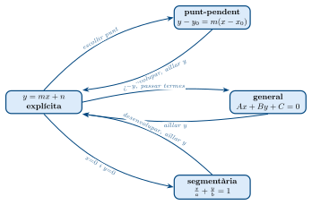
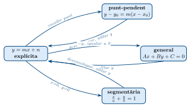

# Rectes al pla: Teoria

**Equacions de la recta al pla**  
Apunts de repàs complets  
Matemàtiques 4t ESO / 1r Batxillerat

------------------------------------------------------------------------

height 1.5pt

## Conceptes previs: pendent i ordenada a l’origen

> **📘 Definició**
>
> Donats dos punts $A=(x_1,y_1)$ i $B=(x_2,y_2)$: $$\boxed{m = \frac{y_2-y_1}{x_2-x_1}}
\qquad
\text{Ordenada a l'origen: valor de } y \text{ quan } x=0.$$ $m>0$ creixent; $m<0$ decreixent; $m=0$ horitzontal; $m$ no existeix: vertical ($x=k$).

## Les quatre formes de l’equació de la recta

> **📘 Propietat**
>
> | **Forma**    | **Equació**                       | **Quan s’usa**                 |
> |:-------------|:----------------------------------|:-------------------------------|
> | Explícita    | $y = mx + n$                      | Sempre; forma principal        |
> | Punt-pendent | $y - y_0 = m(x - x_0)$            | Donats punt i pendent          |
> | General      | $Ax + By + C = 0$                 | Càlculs, distàncies            |
> | Segmentària  | $\dfrac{x}{a} + \dfrac{y}{b} = 1$ | Donats els talls amb els eixos |

### Forma explícita: $y=mx+n$

> **📘 Definició**
>
> $m$ = pendent, $n$ = ordenada a l’origen. Exemple: $y=3x-5 \Rightarrow m=3,\,n=-5$.

### Forma punt-pendent: $y-y_0=m(x-x_0)$

> **📘 Definició**
>
> Si la recta passa per $(x_0,y_0)$ amb pendent $m$: $y - y_0 = m(x-x_0)$. Desenvolupant s’obté la forma explícita.

### Forma general: $Ax+By+C=0$

> **📘 Definició**
>
> $Ax+By+C=0$. Si $B\neq0$: $m=-\tfrac{A}{B}$, $n=-\tfrac{C}{B}$.

### Forma segmentària: $\tfrac{x}{a}+\tfrac{y}{b}=1$

> **📘 Definició**
>
> La recta talla $OX$ a $(a,0)$ i $OY$ a $(0,b)$, amb $a,b\neq0$.

## Com convertir entre les diferents formes

Treballarem sempre amb la recta que passa per $A=(2,1)$ i $B=(6,5)$, per comparar.

> **💡 Conversió**
>
> $m = \dfrac{5-1}{6-2} = 1$

> **💡 Conversió**
>
> $y-1=1(x-2) \;\Rightarrow\; y-1=x-2 \;\Rightarrow\; \boxed{y=x-1}$

> **💡 Conversió**
>
> $y=x-1 \;\xRightarrow{-y}\; 0=x-y-1 \;\Rightarrow\; \boxed{x-y-1=0}$($A=1,B=-1,C=-1$)

> **💡 Conversió**
>
> $x-y-1=0 \;\Rightarrow\; y=x-1 \qquad$ Cas general: $y=-\tfrac{A}{B}x-\tfrac{C}{B}$

> **💡 Conversió**
>
> Tall $OY$ ($x=0$): $y=-1\Rightarrow b=-1$.Tall $OX$ ($y=0$): $x=1\Rightarrow a=1$. $$\boxed{\frac{x}{1}+\frac{y}{-1}=1} \;\Leftrightarrow\; x-y=1$$

> **💡 Conversió**
>
> Escollim $(0,-1)$: $\;y+1=1(x-0)$.Qualsevol punt vàlid dona la mateixa recta.

## Posicions relatives de dues rectes

> **📘 Propietat**
>
> $$r\parallel s \Leftrightarrow m_1=m_2,\;n_1\neq n_2
\qquad
r\perp s \Leftrightarrow m_1\cdot m_2=-1$$ Coincidents: $m_1=m_2$ i $n_1=n_2$. Secants: $m_1\neq m_2$ (es tallen en un punt).

## Distàncies

### Distància d’un punt a una recta

> **💡 Nota**
>
> Donats el punt $P=(x_0,y_0)$ i la recta $r: Ax+By+C=0$: $$\boxed{d(P,r) = \frac{|Ax_0 + By_0 + C|}{\sqrt{A^2+B^2}}}$$

> **✏️ Exemple**
>
> $$d = \frac{|8\cdot2 + 15\cdot3 + 2|}{\sqrt{8^2+15^2}}
= \frac{|16+45+2|}{\sqrt{64+225}}
= \frac{|63|}{\sqrt{289}}
= \frac{63}{17}$$

> **✏️ Exemple**
>
> De la llibreta: recta $8x+15y+K=0$ que dista $5$ del punt $(2,3)$: $$\frac{|8(2)+15(3)+K|}{\sqrt{8^2+15^2}}
= \frac{|61+K|}{17} = 5
\;\Rightarrow\;
|61+K| = 85$$ $$61+K=85 \;\Rightarrow\; K=24
\qquad\text{o b\'e}\qquad
61+K=-85 \;\Rightarrow\; K=-146$$

### Distància entre dues rectes paralleles

> **💡 Nota**
>
> Donades $r: Ax+By+C_1=0$ i $s: Ax+By+C_2=0$ (mateix $A$ i $B$): $$\boxed{d(r,s) = \frac{|C_1 - C_2|}{\sqrt{A^2+B^2}}}$$ *Mètode alternatiu:* escollir qualsevol punt de $r$ i calcular $d(P,s)$.

> **✏️ Exemple**
>
> Primer cal que tinguin els mateixos coeficients. Multipliquem $r\times2$: $$r': 4x-2y+6=0 \qquad s: 4x-2y+1=0$$ $$d = \frac{|6-1|}{\sqrt{4^2+(-2)^2}} = \frac{5}{\sqrt{20}} = \frac{5}{2\sqrt{5}} = \frac{\sqrt{5}}{2}$$
>
> *Mètode 2 (punt de $r$):* fem $x=0$ a $r$: $-y+3=0\Rightarrow P=(0,3)$. $$d(P,s)=\frac{|4(0)-2(3)+1|}{\sqrt{20}}=\frac{|-5|}{\sqrt{20}}=\frac{5}{\sqrt{20}}=\frac{\sqrt{5}}{2}\;\checkmark$$

## Llocs geomètrics

> **📘 Definició**
>
> Un **lloc geomètric** és el conjunt de tots els punts del pla que compleixen una determinada condició geomètrica.

### Mediatriu d’un segment

> **💡 Nota**
>
> La **mediatriu** del segment $AB$ és la recta perpendicular a $AB$ que passa pel seu punt mitjà $M$. $$M = \left(\frac{x_A+x_B}{2},\;\frac{y_A+y_B}{2}\right)
\qquad
m_\text{med} = -\frac{1}{m_{AB}}$$ Propietat clau: *tots els punts de la mediatriu equidisten de $A$ i de $B$*, és a dir, $d(P,A)=d(P,B)$.

> **✏️ Exemple**
>
> **1. Punt mitjà:** $$M=\left(\frac{0+2}{2},\frac{2+(-3)}{2}\right)=(1,-\tfrac{1}{2})$$ **2. Vector director $\overrightarrow{AB}$:** $(2-0,-3-2)=(-2,5) \Rightarrow \vec{u}_{AB}=(-2,5)$  
> El vector normal de la mediatriu és $\vec{n}=(-2,5)$ (perpendicular a la mediatriu, però parallel a $AB$).  
> **3. Pendent:** $$m_{AB}=\frac{-3-2}{2-0}=-\frac{5}{2}
\;\Rightarrow\;
m_\text{med}=-\frac{1}{m_{AB}}=\frac{2}{5}$$ **4. Equació** (punt-pendent per $M=(1,-\tfrac{1}{2})$): $$y+\tfrac{1}{2}=\tfrac{2}{5}(x-1)
\;\Rightarrow\;
5y+\tfrac{5}{2}=2x-2
\;\Rightarrow\;
2x-5y-\tfrac{9}{2}=0
\;\Rightarrow\;
\boxed{x-2y-3=0}$$ (Multiplicant per 2 i simplificant.)

### Bisectriu d’un angle format per dues rectes

> **💡 Nota**
>
> La **bisectriu** de l’angle format per dues rectes $r$ i $s$ és el lloc geomètric dels punts equidistants de totes dues rectes: $$d(P,r) = d(P,s)
\;\Rightarrow\;
\frac{|Ax_0+By_0+C_1|}{\sqrt{A^2+B^2}} = \frac{|Dx_0+Ey_0+F|}{\sqrt{D^2+E^2}}$$ Llevant el valor absolut apareixen **dues equacions**, que donen les *dues bisectrius* (perpendiculars entre elles).

> **✏️ Exemple**
>
> $$\frac{|3x-4y+5|}{\sqrt{9+16}} = \frac{|6x+8y+1|}{\sqrt{36+64}}
\;\Rightarrow\;
\frac{|3x-4y+5|}{5} = \frac{|6x+8y+1|}{10}$$ Llevem el valor absolut (dos casos):
>
> **Cas $+$:** $$\frac{3x-4y+5}{5}=+\frac{6x+8y+1}{10}
\;\Rightarrow\;
2(3x-4y+5)=6x+8y+1
\;\Rightarrow\;
6x-8y+10=6x+8y+1$$ $$-16y=-9 \;\Rightarrow\; \boxed{y=\frac{9}{16}}$$
>
> **Cas $-$:** $$2(3x-4y+5)=-(6x+8y+1)
\;\Rightarrow\;
6x-8y+10=-6x-8y-1
\;\Rightarrow\;
12x=-11
\;\Rightarrow\;
\boxed{x=-\frac{11}{12}}$$

### Punt simètric d’un punt respecte d’una recta

> **💡 Nota**
>
> Per trobar el punt $A'$ simètric de $A=(x_A, y_A)$ respecte de la recta $r$:
>
> 1.  Troba la recta $p$ **perpendicular** a $r$ que passa per $A$.
>
> 2.  Troba el punt $M$ = intersecció de $p$ i $r$ (és el punt mitjà $AA'$).
>
> 3.  Aplica la fórmula del punt mitjà per trobar $A'$: $$M = \frac{A+A'}{2} \;\Rightarrow\; A' = 2M - A$$

> **✏️ Exemple**
>
> **Pas 1 — Forma general de $r$:** $$\frac{x}{6}+\frac{y}{4}=1 \;\Rightarrow\; 2x+3y=12 \;\Rightarrow\; 2x+3y-12=0$$ Vector director de $r$: $\vec{u}=(3,-2)$ (perpendicular al normal $(2,3)$). Pendent de $r$: $m_r=-\tfrac{2}{3}$.
>
> **Pas 2 — Perpendicular per $P=(1,1)$:** $m_\perp=\tfrac{3}{2}$(inversa del negatiu): $$y-1=\tfrac{3}{2}(x-1) \;\Rightarrow\; 3x-2y-1=0$$
>
> **Pas 3 — Intersecció $p\cap r$ (punt mitjà $M$):** $$\begin{cases}2x+3y-12=0\\3x-2y-1=0\end{cases}$$ De la 1a: $2x+3y=12$.De la 2a $\times 3$: $9x-6y=3$, i 1a $\times 2$: $4x+6y=24$. Sumant: $13x=27\Rightarrow x=\tfrac{27}{13}$. Substituint: $y=\tfrac{2\cdot\tfrac{27}{13}-1\cdot\tfrac{1}{1}}{...}$
>
> Resolem el sistema directament ($\times2$ i $\times3$): $$4x+6y=24\quad\text{i}\quad 9x-6y=3 \;\Rightarrow\; 13x=27 \;\Rightarrow\; x=\frac{27}{13}$$ $$y=\frac{12-2\cdot\tfrac{27}{13}}{3}=\frac{\tfrac{156-54}{13}}{3}=\frac{102}{39}=\frac{34}{13}$$ $M=\left(\tfrac{27}{13},\tfrac{34}{13}\right)$
>
> **Pas 4 — Simètric $P'$:** $$P'=2M-P=\left(2\cdot\frac{27}{13}-1,\;2\cdot\frac{34}{13}-1\right)
=\left(\frac{54-13}{13},\;\frac{68-13}{13}\right)
=\boxed{\left(\frac{41}{13},\;\frac{55}{13}\right)}$$

## Formulari de referència ràpida

| **Concepte**            | **Fórmula**                                                           | **Notes**               |
|:------------------------|:----------------------------------------------------------------------|:------------------------|
| Pendent                 | $m=\dfrac{y_2-y_1}{x_2-x_1}$                                          | $m_\perp=-\tfrac{1}{m}$ |
| Explícita               | $y=mx+n$                                                              | forma principal         |
| Punt-pendent            | $y-y_0=m(x-x_0)$                                                      | si es coneix un punt    |
| General $\to$ Explícita | $m=-\tfrac{A}{B}$, $n=-\tfrac{C}{B}$                                  | $B\neq0$                |
| Segmentària             | $\dfrac{x}{a}+\dfrac{y}{b}=1$                                         | talls $(a,0)$ i $(0,b)$ |
| Paralleles              | $m_1=m_2$, $n_1\neq n_2$                                              | mateix pendent          |
| Perpendiculars          | $m_1\cdot m_2=-1$                                                     | producte $=-1$          |
| Dist. punt–recta        | $d(P,r)=\dfrac{|Ax_0+By_0+C|}{\sqrt{A^2+B^2}}$                        | recta $Ax+By+C=0$       |
| Dist. entre paralleles  | $d(r,s)=\dfrac{|C_1-C_2|}{\sqrt{A^2+B^2}}$                            | mateix $A$, $B$         |
| Punt mitjà              | $M=\!\left(\dfrac{x_1+x_2}{2},\dfrac{y_1+y_2}{2}\right)$              |                         |
| Mediatriu               | $\perp$ a $AB$ per $M$, $m_\text{med}=-\tfrac{1}{m_{AB}}$             | lloc: $d(P,A)=d(P,B)$   |
| Bisectriu               | $\dfrac{|Ax+By+C|}{\sqrt{A^2+B^2}}=\dfrac{|Dx+Ey+F|}{\sqrt{D^2+E^2}}$ | 2 solucions             |
| Punt simètric           | $P'=2M-P$                                                             | $M=p\cap r$             |

**Diagrama de conversions entre formes**  

