# Trigonometria: Teoria

## Funcions trigonomètriques

### 1. Paràmetres de les funcions trigonomètriques

Quan treballem amb funcions trigonomètriques, podem modificar la funció base $y = \sin(x)$ o $y = \cos(x)$ afegint-hi diferents paràmetres. L’equació general d’una funció sinusoïdal es pot escriure de la manera següent:

> ****Equació general****
>
> $$f(x) = A \cdot \sin\big(B(x - h)\big) + k$$ *Aquesta mateixa estructura s’aplica a la funció cosinus: $g(x) = A \cdot \cos\big(B(x - h)\big) + k$*

Cadascun d’aquests paràmetres ($A$, $B$, $h$ i $k$) transforma la gràfica de manera independent i té un significat analític clar:

- **El paràmetre $\boldsymbol{A}$ (Amplitud):**  
  L’amplitud és $|A|$. Ens indica la distància entre l’eix central de la funció i el seu valor màxim (o mínim). Fixa’t com canvia l’alçada de l’ona si variem aquest valor.

  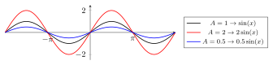

- **El paràmetre $\boldsymbol{B}$ (Freqüència i Velocitat Angular):**  
  Determina si la funció es comprimeix o s’estira horitzontalment. Afecta directament al **període** ($T$), que és el temps que triga la funció a completar un cicle sencer.

  En problemes d’aplicació pràctica, aquest paràmetre $B$ es coneix com a **velocitat angular** ($\omega$) i es relaciona amb el període mitjançant la fórmula: $$B = \frac{2\pi}{T}$$

  Com varia $B$ segons els segons que triga un cicle sencer?

  - Si el cicle triga $60$ segons ($T=60$): $B = \frac{2\pi}{60} = \frac{\pi}{30}$

  - Si el cicle triga $30$ segons ($T=30$): $B = \frac{2\pi}{30} = \frac{\pi}{15}$

  - Si el cicle triga $10$ segons ($T=10$): $B = \frac{2\pi}{10} = \frac{\pi}{5}$

  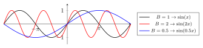

- **El paràmetre $\boldsymbol{h}$ (Desfase o desplaçament horitzontal):**  
  S’encarrega de moure tota la gràfica cap a la **dreta** (si $h > 0$) o cap a l’**esquerra** (si $h < 0$). *Nota: Dins el parèntesi l’expressió és $(x - h)$.*

  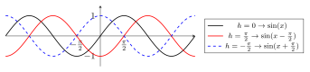

- **El paràmetre $\boldsymbol{k}$ (Desplaçament vertical):**  
  Mou tota la gràfica cap **amunt** (si $k > 0$) o cap **avall** (si $k < 0$). La recta horitzontal $y = k$ es converteix en el nou eix central de la funció.

  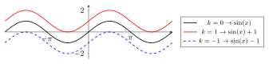

------------------------------------------------------------------------

### 2. Relació entre sinus i cosinus com a desfase ($h$)

Les funcions sinus i cosinus representen exactament la mateixa ona (tenen la mateixa amplitud i freqüència). L’única diferència estructural entre elles és un **desfase horitzontal** (el paràmetre $h$).

Si agafem la funció base $f(x) = \sin(x)$ i hi apliquem un desplaçament cap a l’esquerra de $h = -\frac{\pi}{2}$ radians ($90^\circ$), obtenim exactament la funció cosinus. Això ens genera les següents identitats de translació:

> ****El cosinus com a sinus desfasat****
>
> $$\cos(x) = \sin\left(x - \left(-\frac{\pi}{2}\right)\right) = \sin\left(x + \frac{\pi}{2}\right)$$ *De la mateixa manera, si desplacem el cosinus cap a la dreta ($h = \frac{\pi}{2}$), obtenim el sinus:* $$\sin(x) = \cos\left(x - \frac{\pi}{2}\right)$$

Com podem veure a la gràfica següent, en desplaçar l’ona negra del sinus cap a l’esquerra una distància de $\frac{\pi}{2}$, aquesta coincideix plenament amb la corba vermella discontínua del cosinus.

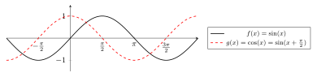

------------------------------------------------------------------------

## Raons trigonomètriques i resolució de triangles

**Trigonometria**  
i Geometria Analítica  
1r Batxillerat  

------------------------------------------------------------------------

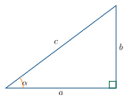

### Raons Trigonomètriques

#### Raons en un triangle rectangle

> **📘 Teoria**
>
> Donat un triangle rectangle amb angle agut $\alpha$, hipotenusa $r$, catet oposat $y$ i catet contigu $x$:
>
> 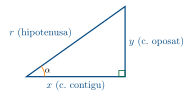
>
> | **Raó**      | **Fórmula**                                                    | **Invers**                           |
> |:-------------|:---------------------------------------------------------------|:-------------------------------------|
> | $\sin\alpha$ | $\dfrac{y}{r} = \dfrac{\text{c.\ oposat}}{\text{hipotenusa}}$  | $\csc\alpha = \dfrac{1}{\sin\alpha}$ |
> | $\cos\alpha$ | $\dfrac{x}{r} = \dfrac{\text{c.\ contigu}}{\text{hipotenusa}}$ | $\sec\alpha = \dfrac{1}{\cos\alpha}$ |
> | $\tan\alpha$ | $\dfrac{y}{x} = \dfrac{\text{c.\ oposat}}{\text{c.\ contigu}}$ | $\cot\alpha = \dfrac{1}{\tan\alpha}$ |

> **✏️ Exemple**
>
> Triangle rectangle amb catets $x=4$ i $y=3$. $$r = \sqrt{3^2+4^2} = \sqrt{25} = 5$$ $$\sin\alpha = \tfrac{3}{5}, \quad
\cos\alpha = \tfrac{4}{5}, \quad
\tan\alpha = \tfrac{3}{4}, \quad
\csc\alpha = \tfrac{5}{3}, \quad
\sec\alpha = \tfrac{5}{4}, \quad
\cot\alpha = \tfrac{4}{3}$$

#### Angle qualsevol. Cercle goniomètric

> **📘 Teoria**
>
> Per a un angle $\alpha$ en posició estàndard, si el punt $P=(x,y)$ és sobre la circumferència de radi $r$: $$\sin\alpha = \frac{y}{r}, \qquad
\cos\alpha = \frac{x}{r}, \qquad
\tan\alpha = \frac{y}{x}$$ **Signe per quadrant:**
>
> 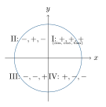
>
> |   **Sinus**   |  **Cosinus**  |  **Tangent**   |
> |:-------------:|:-------------:|:--------------:|
> | $+$ al I i II | $+$ al I i IV | $+$ al I i III |

> **📘 Teoria**
>
> 2 $$\begin{aligned}
\sin^2\alpha + \cos^2\alpha &= 1 \label{eq:pit}\\
1 + \tan^2\alpha &= \sec^2\alpha \label{eq:sec}\\
1 + \cot^2\alpha &= \csc^2\alpha \label{eq:csc}
\end{aligned}$$
>
> *Derivades de <a href="#eq:pit" data-reference-type="eqref" data-reference="eq:pit">[eq:pit]</a>:*  
> Dividint per $\cos^2\!\alpha$: $\tan^2\!\alpha+1=\sec^2\!\alpha$  
> Dividint per $\sin^2\!\alpha$: $1+\cot^2\!\alpha=\csc^2\!\alpha$

> **📘 Teoria**
>
> 2 $\sin(180^{\circ}-\alpha) = \sin\alpha$  
> $\cos(180^{\circ}-\alpha) = -\cos\alpha$  
> $\sin(-\alpha) = -\sin\alpha$  
> $\cos(-\alpha) = \cos\alpha$

> **✏️ Exemple**
>
> $\cos\alpha = \dfrac{\sqrt{3}}{2}$, angle al **4t quadrant**. Calcula les 6 raons.
>
> *Solució:* $r=2$, catet contigu $= \sqrt{3}$. Al 4t quadrant, $y < 0$: $$y = -\sqrt{4-3} = -1$$ $$\sin\alpha = \frac{-1}{2}, \quad
\tan\alpha = \frac{-1}{\sqrt{3}}, \quad
\csc\alpha = -2, \quad
\sec\alpha = \frac{2}{\sqrt{3}}, \quad
\cot\alpha = -\sqrt{3}$$

> **✏️ Exemple**
>
> $r=4$, $x=1$. Al 4t quadrant: $y = -\sqrt{16-1} = -\sqrt{15}$. $$\sin\alpha = \frac{-\sqrt{15}}{4}, \quad
\tan\alpha = -\sqrt{15}, \quad
\csc\alpha = \frac{-4}{\sqrt{15}}, \quad
\sec\alpha = 4, \quad
\cot\alpha = \frac{-1}{\sqrt{15}}$$

### Resolució de Triangles

Donat un triangle qualsevol $ABC$, anomenem $a$, $b$, $c$ els costats oposats als angles $\hat{A}$, $\hat{B}$, $\hat{C}$ respectivament. La suma dels angles sempre és $\hat{A}+\hat{B}+\hat{C}=180^{\circ}$.

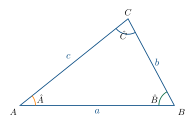

#### Teorema del sinus

> **📘 Teoria**
>
> L’idèa és baixar una **altura** des d’un vèrtex fins al costat oposat i expressar-la de dues maneres amb el sinus.
>
> 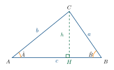
>
> Des del triangle $ACH$: $$\sin\hat{A} = \frac{h}{b} \quad\Rightarrow\quad h = b\sin\hat{A}$$ Des del triangle $BCH$: $$\sin\hat{B} = \frac{h}{a} \quad\Rightarrow\quad h = a\sin\hat{B}$$ Com que les dues expressions igualden la mateixa altura $h$: $$b\sin\hat{A} = a\sin\hat{B}
\quad\Rightarrow\quad
\frac{a}{\sin\hat{A}} = \frac{b}{\sin\hat{B}}$$ Si repetim l’argument baixant l’altura des de $A$ fins a $BC$, obtenim també la igualtat amb $\dfrac{c}{\sin\hat{C}}$.

> **📘 Teoria**
>
> En qualsevol triangle $ABC$: $$\boxed{\dfrac{a}{\sin\hat{A}} = \dfrac{b}{\sin\hat{B}} = \dfrac{c}{\sin\hat{C}}}$$ *Cada costat dividit pel sinus de l’angle oposat dóna sempre el mateix valor (que és el diàmetre de la circumferència circumscrita).*

#### Teorema del cosinus

> **📘 Teoria**
>
> També baixem l’altura $h$ des de $C$ fins al costat $c = AB$, i apliquem **Pitàgores** als dos triangles rectangles que es formen. Anomeno $p = AH$ la projecció de $b$ sobre $c$.
>
> 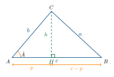
>
> **Pas 1.** Del triangle rectangle $ACH$: $$\cos\hat{A} = \frac{p}{b}
\;\Rightarrow\; p = b\cos\hat{A},
\qquad
h^2 = b^2 - p^2 \quad\text{(Pit\`{a}gores)}$$
>
> **Pas 2.** Del triangle rectangle $BCH$, aplico Pitàgores per trobar $a^2$: $$a^2 = (c-p)^2 + h^2
= c^2 - 2cp + p^2 + h^2$$
>
> **Pas 3.** Substitueixo $h^2 = b^2 - p^2$: $$a^2 = c^2 - 2cp + \underbrace{p^2 + b^2 - p^2}_{=\,b^2}
= b^2 + c^2 - 2cp$$
>
> **Pas 4.** Substitueixo $p = b\cos\hat{A}$: $$\boxed{a^2 = b^2 + c^2 - 2bc\cos\hat{A}}$$
>
> Per simetria (baixant l’altura des de $A$ o des de $B$) s’obtenen les altres dues formes. **Cas particular:** si $\hat{A}=90^{\circ}$ llavors $\cos 90^{\circ}=0$ i recuperem Pitàgores: $a^2 = b^2+c^2$.

> **📘 Teoria**
>
> $$\boxed{a^2 = b^2 + c^2 - 2bc\cos\hat{A}}$$ Despejant $\cos\hat{A}$ (útil quan coneixem els 3 costats i volem l’angle): $$\boxed{\cos\hat{A} = \frac{b^2 + c^2 - a^2}{2bc}}$$ Anàlogament per als altres angles.

#### Triangles rectangles — 1 costat i 1 angle

> **📘 Teoria**
>
> Amb $\hat{C}=90^{\circ}$:
>
> - $\hat{A}+\hat{B} = 90^{\circ}$
>
> - $a^2 + b^2 = c^2$ (Pitàgores)
>
> - $\sin\hat{A} = \dfrac{a}{c}$, $\cos\hat{A} = \dfrac{b}{c}$, $\tan\hat{A} = \dfrac{a}{b}$

> **✏️ Exemple**
>
> 2 **Angle $\hat{A}$:** $$\hat{A} = 90^{\circ}-20^{\circ} = 70^{\circ}$$
>
> **Catet $b$:** $$\cos 20^{\circ} = \frac{b}{25}
\;\Rightarrow\; b = 25\cos 20^{\circ} \approx 23{,}49$$
>
> **Catet $a$:** $$\sin 20^{\circ} = \frac{a}{25}
\;\Rightarrow\; a = 25\sin 20^{\circ} \approx 8{,}55$$

#### Triangles oblics: 4 casos

> **📘 Teoria**
>
> | **Dades conegudes**           | **Teorema** | **Ordre de resolució**                            |
> |:------------------------------|:------------|:--------------------------------------------------|
> | 1 costat + 2 angles           | Sinus       | angle $\to$ costats                               |
> | 2 costats + angle entre ells  | Cosinus     | costat $\to$ sinus $\to$ angles                   |
> | 3 costats                     | Cosinus     | $\cos\hat{A}$ el més gran $\to$ sinus $\to$ angle |
> | 2 costats + angle oposat a un | Sinus       | cas ambigu possible                               |
>
> *Regla pràctica: el costat oposat més llarg té l’angle major.*

##### Cas 1: Coneguts 1 costat i 2 angles

> **✏️ Exemple**
>
> **Angle $\hat{A}$:** $$\hat{A} = 180^{\circ}-45^{\circ}-105^{\circ} = 30^{\circ}$$
>
> **Teorema del sinus:** $$\frac{6}{\sin 30^{\circ}} = \frac{b}{\sin 45^{\circ}} = \frac{c}{\sin 105^{\circ}}$$ $$b = \frac{6\sin 45^{\circ}}{\sin 30^{\circ}} \approx 8{,}49 \qquad
c = \frac{6\sin 105^{\circ}}{\sin 30^{\circ}} \approx 11{,}59$$

##### Cas 2: Coneguts 3 costats

> **✏️ Exemple**
>
> **Angle $\hat{A}$ (oposat al costat més llarg):** $$\cos\hat{A} = \frac{b^2+c^2-a^2}{2bc}
= \frac{289+225-484}{510} = \frac{30}{510}
\quad\Rightarrow\quad
\hat{A} = \arccos\!\left(\tfrac{30}{510}\right) \approx 86{,}63^{\circ}$$
>
> **Angle $\hat{B}$:** $$\cos\hat{B} = \frac{a^2+c^2-b^2}{2ac}
= \frac{484+225-289}{660} = \frac{420}{660}
\quad\Rightarrow\quad \hat{B} \approx 50{,}48^{\circ}$$
>
> **Angle $\hat{C}$:** $$\hat{C} = 180^{\circ}-86{,}63^{\circ}-50{,}48^{\circ} \approx 42{,}89^{\circ}$$

##### Cas 3: Coneguts 2 costats i l’angle que formen

> **✏️ Exemple**
>
> **Costat $c$:** $$c^2 = a^2+b^2-2ab\cos\hat{C}
= 100+64-2\cdot 10\cdot 8\cdot\cos 30^{\circ}
\approx 5{,}04
\quad\Rightarrow\quad
c \approx 2{,}24$$
>
> **Angle $\hat{A}$:** $$\cos\hat{A} = \frac{b^2+c^2-a^2}{2bc}
\approx \frac{64+5{,}04-100}{35{,}84}
\approx -0{,}864
\quad\Rightarrow\quad
\hat{A} \approx 149{,}86^{\circ}$$
>
> **Angle $\hat{B}$:** $$\hat{B} = 180^{\circ}-30^{\circ}-149{,}86^{\circ} \approx 0{,}14^{\circ}$$
>
> *Nota: triangle molt pla, coherent amb $\hat{C}=30^{\circ}$ i costats molt desiguals.*

##### Cas 4: Coneguts 2 costats i l’angle oposat (cas ambigu)

> **📘 Teoria**
>
> Si coneixem $a$, $b$ i $\hat{A}$ (angle oposat a $a$):
>
> - Calculem $\sin\hat{B} = \dfrac{b\sin\hat{A}}{a}$
>
> - Si $\sin\hat{B} \leq 1$, hi ha **una solució** amb $\hat{B}$ agut.
>
> - Si a més $\hat{B}' = 180^{\circ}-\hat{B}$ compleix $\hat{A}+\hat{B}' < 180^{\circ}$, hi ha una **segona solució** (triangle obtusangle).

> **✏️ Exemple**
>
> $$\frac{5}{\sin 30^{\circ}} = \frac{3}{\sin\hat{B}}
\quad\Rightarrow\quad
\sin\hat{B} = \frac{3\sin 30^{\circ}}{5} = 0{,}3
\quad\Rightarrow\quad
\hat{B} \approx 17{,}46^{\circ}$$
>
> $$\hat{C} = 180^{\circ}-30^{\circ}-17{,}46^{\circ} = 132{,}54^{\circ}$$
>
> **Costat $c$:** $$c^2 = b^2+a^2-2ba\cos\hat{C}
= 9+25-30\cos 132{,}54^{\circ}
\approx 54{,}25
\quad\Rightarrow\quad
c \approx 7{,}37$$

#### Problemes mètrics amb alçades i angles

> **📘 Teoria**
>
> 1.  Assigna $x$ a la distància horitzontal desconeguda.
>
> 2.  Escriu $\tan\alpha = h/x$ des de cada punt.
>
> 3.  Aïlla $h$ en totes dues equacions i iguala.
>
> **Fórmula directa (2 angles des del mateix costat):** $$h = \frac{d \cdot \tan\alpha_1 \cdot \tan\alpha_2}{\tan\alpha_1 - \tan\alpha_2},
\qquad \alpha_1 > \alpha_2$$ on $d$ és la distància entre els dos punts d’observació.

> **✏️ Exemple**
>
> Sigui $x$ la distància del punt més proper a la base: $$\tan 60^{\circ} = \frac{h}{x}, \qquad
\tan 36^{\circ} = \frac{h}{20+x}$$ Igualem: $x\tan 60^{\circ} = (20+x)\tan 36^{\circ}$, d’on $$x = \frac{20\tan 36^{\circ}}{\tan 60^{\circ}-\tan 36^{\circ}}
\qquad\text{i}\qquad
h = x\tan 60^{\circ}.$$

> **✏️ Exemple**
>
> 
>
> $$\tan 65^{\circ} = \frac{h}{x}, \qquad
\tan 30^{\circ} = \frac{h}{100-x}
\quad\Rightarrow\quad
h = \frac{100\,\tan 65^{\circ}\cdot\tan 30^{\circ}}{\tan 65^{\circ}+\tan 30^{\circ}}$$

### Resum de fórmules

> **📘 Teoria**
>
> 2 $\sin\alpha = \dfrac{\text{oposat}}{\text{hipotenusa}}$  
> $\cos\alpha = \dfrac{\text{contigu}}{\text{hipotenusa}}$  
> $\tan\alpha = \dfrac{\text{oposat}}{\text{contigu}} = \dfrac{\sin\alpha}{\cos\alpha}$  
>
> $\csc\alpha = \dfrac{1}{\sin\alpha}$  
> $\sec\alpha = \dfrac{1}{\cos\alpha}$  
> $\cot\alpha = \dfrac{1}{\tan\alpha}$
>
> $$\sin^2\!\alpha+\cos^2\!\alpha = 1, \qquad
1+\tan^2\!\alpha = \sec^2\!\alpha, \qquad
1+\cot^2\!\alpha = \csc^2\!\alpha$$

> **📘 Teoria**
>
> 2 **Sinus:** $$\frac{a}{\sin\hat{A}} = \frac{b}{\sin\hat{B}} = \frac{c}{\sin\hat{C}}$$
>
> **Cosinus:** $$a^2 = b^2+c^2-2bc\cos\hat{A}$$ $$\cos\hat{A} = \frac{b^2+c^2-a^2}{2bc}$$
