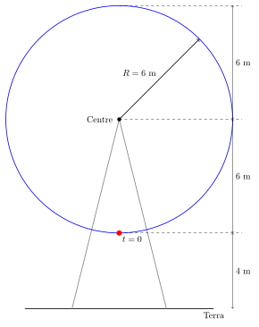
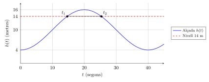
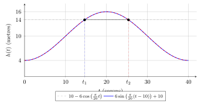
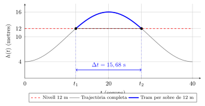

# Trigonometria: Exercicis

## Funcions trigonomètriques

### 3. Exercicis

1.  **La noria del parc d’atraccions**  
    Una atracció de fira consisteix en una gran noria giratòria de $6\text{ m}$ de radi. El punt més baix de la noria (on els passatgers pugen a la cabina) es troba a $4\text{ m}$ de terra. Sabem que la noria gira a velocitat constant i triga exactament $40\text{ segons}$ a fer una volta completa.

    Suposant que engegues el cronòmetre ($t = 0$) just en el moment en què la teva cabina arrenca des del punt més baix:

    1.  Dibuixa un esquema de la situació i troba l’equació de l’altura $h(t)$ respecte a terra en funció del temps $t$ en segons.

    2.  A quins instants de la primera volta la cabina es trobarà exactament a $14\text{ m}$ d’altura?

    3.  Quant de temps estarà per sobre dels $12\text{ m}$ metres d’altura?

    **Resolució:**

    **Apartat a) Esquema i equació**  
    A partir de les dades del problema, podem deduir els paràmetres de la funció trigonomètrica:

    - **Desplaçament vertical ($k$):** És l’altura del centre de la noria. Com que el radi és de $6\text{ m}$ i la distància a terra és de $4\text{ m}$, el centre està a $k = 4 + 6 = 10\text{ m}$.

    - **Amplitud ($A$):** És el radi de la noria, de manera que $A = 6$.

    - **Freqüència angular ($B$):** Sabent que el període és $T = 40\text{ s}$, tenim $B = \frac{2\pi}{40} = \frac{\pi}{20}\text{ rad/s}$.

    

    Com que a $t=0$ comencem al punt més baix, la forma més directa de modelar-ho és utilitzant la funció cosinus invertida (multiplicada per un negatiu), ja que el cosinus normal comença al màxim. Per tant, no cal aplicar cap desfase ($h=0$): $$h(t) = 10 - 6\cos\left(\frac{\pi}{20}t\right)$$

    > ****Nota: Es pot fer servir el sinus?****
    >
    > Sí. Com hem vist a la teoria, el cosinus no és més que un sinus desfasat. Si l’atracció assoleix l’eix central ($10\text{ m}$) pujant al cap d’un quart de volta ($10\text{ s}$), podem usar el sinus amb un desfase $h = 10$: $$h(t) = 6\sin\left(\frac{\pi}{20}(t - 10)\right) + 10$$ Aquesta equació és \*\*matemàticament idèntica\*\* a l’anterior. Ho podem comprovar aplicant les propietats dels angles: $$6\sin\left(\frac{\pi}{20}t - \frac{\pi}{2}\right) = 6\left(-\cos\left(\frac{\pi}{20}t\right)\right) = -6\cos\left(\frac{\pi}{20}t\right)$$

    **Apartat b) Càlcul de temps per a $14\text{ m}$ d’altura**  
    Plantegem l’equació $h(t) = 14$: $$14 = 10 - 6\cos\left(\frac{\pi}{20}t\right)$$ Aïllem el cosinus: $$4 = -6\cos\left(\frac{\pi}{20}t\right) \quad \Rightarrow \quad \cos\left(\frac{\pi}{20}t\right) = -\frac{4}{6} = -\frac{2}{3}$$

    Calculem l’angle (en radians, utilitzant la calculadora científica a mode RAD): $$\frac{\pi}{20}t = \arccos\left(-\frac{2}{3}\right) \approx 2,3005\text{ rad}$$ $$t_1 = \frac{2,3005 \cdot 20}{\pi} \approx \textbf{14,65\text{ s}}$$

    Com que la noria triga $40\text{ s}$ a fer la volta i l’ona és simètrica, el segon instant en què passarà pels $14\text{ m}$ (quan estigui baixant) serà: $$t_2 = 40 - 14,65 = \textbf{25,35\text{ s}}$$

    

    > ****Atenció: Com trobem el segon temps generalment?****
    >
    > Quan resolem una equació trigonomètrica, la calculadora només ens dona **una solució** (un sol angle $\alpha$). Però en una volta completa, la funció passa **dues vegades** per la mateixa alçada. Per trobar el segon angle, la regla dependrà de la funció que hàgim utilitzat:
    >
    > - **Si hem fet servir el Cosinus:** El segon angle s’obté per simetria horitzontal. Fem $2\pi - \alpha$.
    >
    > - **Si hem fet servir el Sinus:** El segon angle s’obté agafant el suplementari (simetria vertical). Fem $\pi - \alpha$.

    **Resolució alternativa (utilitzant la funció sinus):**  
    Com hem vist a la nota teòrica, podem modelar el problema amb un sinus si hi apliquem un desfase. Sabem que la cabina assoleix l’alçada central ($10\text{ m}$) pujant quan ha passat un quart del període. Com que $T = 40\text{ s}$, això passa a l’instant $t = 10\text{ s}$. Per tant, el desfase és $h = 10$: $$h(t) = 6\sin\left(\frac{\pi}{20}(t - 10)\right) + 10$$

    Plantegem l’equació per als $14\text{ m}$: $$14 = 6\sin\left(\frac{\pi}{20}(t - 10)\right) + 10$$ Aïllem el sinus: $$4 = 6\sin\left(\frac{\pi}{20}(t - 10)\right) \quad \Rightarrow \quad \sin\left(\frac{\pi}{20}(t - 10)\right) = \frac{4}{6} = \frac{2}{3}$$

    Ara calculem l’angle amb l’arcsinus ($\arcsin$): $$\text{Angle } \alpha_1 = \arcsin\left(\frac{2}{3}\right) \approx 0,7297\text{ rad}$$

    **1r Temps ($t_1$):** Igualem l’interior del sinus al primer angle: $$\frac{\pi}{20}(t_1 - 10) = 0,7297$$ $$t_1 - 10 = \frac{0,7297 \cdot 20}{\pi} \approx 4,65 \quad \Rightarrow \quad t_1 = 10 + 4,65 = \textbf{14,65\text{ s}}$$

    **2n Temps ($t_2$):** Com que estem treballant amb el sinus, per trobar la segona solució hem de buscar l’angle suplementari al segon quadrant: $$\text{Angle } \alpha_2 = \pi - 0,7297 \approx 2,4118\text{ rad}$$ Ara igualem l’interior del sinus a aquest segon angle: $$\frac{\pi}{20}(t_2 - 10) = 2,4118$$ $$t_2 - 10 = \frac{2,4118 \cdot 20}{\pi} \approx 15,35 \quad \Rightarrow \quad t_2 = 10 + 15,35 = \textbf{25,35\text{ s}}$$

    **Visualització superposada: Demostració que és el mateix model**

    Com podem veure al gràfic següent, malgrat usar equacions diferents, les dues corbes són **idèntiques**. Ambdues models assoleixen els $14\text{ m}$ d’altura (intersecció amb la línia horitzontal) en els mateixos punts temporals ($t_1$ i $t_2$), demostrant visualment la consistència del càlcul.

    

    *Conclusió: Com veus, utilitzem l’equació que utilitzem, arribem exactament als mateixos temps físics!*

    **Apartat c) Temps per sobre dels $12\text{ m}$ d’altura**  
    Per saber quant de temps s’està per sobre dels $12\text{ m}$, primer hem de trobar els instants exactes en què la cabina creua aquesta alçada. Plantegem l’equació $h(t) = 12$ utilitzant el nostre model inicial: $$10 - 6\cos\left(\frac{\pi}{20}t\right) = 12$$

    Aïllem el cosinus: $$-6\cos\left(\frac{\pi}{20}t\right) = 2 \quad \Rightarrow \quad \cos\left(\frac{\pi}{20}t\right) = -\frac{2}{6} = -\frac{1}{3}$$

    Trobem el primer temps ($t_1$) amb la calculadora (en radians): $$\frac{\pi}{20}t = \arccos\left(-\frac{1}{3}\right) \approx 1,9106\text{ rad}$$ $$t_1 = \frac{1,9106 \cdot 20}{\pi} \approx \textbf{12,16\text{ s}}$$

    Aquest és l’instant en què la cabina assoleix els $12\text{ m}$ de pujada. Com que estem fent servir el model del cosinus sense desfase ($h=0$), podem trobar l’instant de baixada per simetria directa restant el temps al període total ($40\text{ s}$): $$t_2 = 40 - 12,16 = \textbf{27,84\text{ s}}$$

    La cabina estarà per sobre dels $12\text{ m}$ des de l’instant $t_1$ fins a l’instant $t_2$. Per saber la durada total, només cal restar-los: $$\Delta t = t_2 - t_1 = 27,84 - 12,16 = \textbf{15,68\text{ segons}}$$

    

## Raons trigonomètriques i resolució de triangles

#### Angle qualsevol. Cercle goniomètric

> **📝 Exercici**
>
> 1.  Donada la raó $\sin\alpha = \dfrac{5}{13}$ amb $\alpha$ al 1r quadrant, calcula les altres 5 raons trigonomètriques.
>
> 2.  Sabent que $\tan\alpha = -2$ i $\cos\alpha > 0$, determina en quin quadrant és $\alpha$ i calcula $\sin\alpha$ i $\cos\alpha$.
>
> 3.  Comprova, sense calculadora, que $\sin^2(150^{\circ})+\cos^2(150^{\circ}) = 1$.
>
> 4.  Si $\cot\alpha = \dfrac{3}{4}$ i $\sin\alpha < 0$, calcula $\sec\alpha$.
>
> 5.  El punt $P=(-4,-3)$ pertany al cercle goniomètric de radi $r$. Calcula les 6 raons de l’angle $\alpha$ que determina $P$.

#### Triangles rectangles — 1 costat i 1 angle

> **📝 Exercici**
>
> 1.  Triangle rectangle: $\hat{C}=90^{\circ}$, hipotenusa $c=12$, $\hat{A}=40^{\circ}$. Calcula els dos catets i l’angle $\hat{B}$.
>
> 2.  Triangle rectangle: $\hat{C}=90^{\circ}$, $b=100$, $\hat{B}=55^{\circ}$. Calcula $c$ i $a$. *(Pista: $\sin 55^{\circ} = b/c$).*
>
> 3.  Un arbre fa ombra de $50\,\text{m}$. L’angle d’elevació del sol és $37^{\circ}$. Quina és l’alçada de l’arbre? *(Nota: afegeix $1{,}75\,\text{m}$ d’alçada de l’observador.)*

#### Triangles oblics: 4 casos

> **📝 Exercici**
>
> 1.  Resol el triangle amb $a=8$, $\hat{B}=60^{\circ}$, $\hat{C}=75^{\circ}$.
>
> 2.  Donats $a=7$, $b=5$, $c=6$, calcula els tres angles.
>
> 3.  Donats $b=9$, $c=12$, $\hat{A}=50^{\circ}$, calcula $a$, $\hat{B}$ i $\hat{C}$.
>
> 4.  (*Cas ambigu*) Donats $a=6$, $b=8$, $\hat{A}=35^{\circ}$, determina quantes solucions hi ha i resol-les totes.
>
> 5.  Dos observadors separats $200\,\text{m}$ mesuren els angles d’elevació de la cimera d’una muntanya. Des del primer, l’angle és $60^{\circ}$; des del segon (entre el primer i la muntanya), és $50^{\circ}$. Calcula l’alçada de la muntanya.

#### Problemes mètrics amb alçades i angles

> **📝 Exercici**
>
> 1.  Des d’un punt $A$, l’angle d’elevació d’una torre és $60^{\circ}$. Des d’un punt $B$, a $20\,\text{m}$ més lluny, l’angle és $40^{\circ}$. Calcula l’alçada de la torre.
>
> 2.  Una antena es veu des dels dos extrems d’un camp de $100\,\text{m}$ amb angles $65^{\circ}$ i $30^{\circ}$. Calcula l’alçada de l’antena.
>
> 3.  (Ex. 32, pàg. 204) Des dels extrems d’una base de $100\,\text{m}$, s’observa la cimera d’un turó amb angles $65^{\circ}$ i $30^{\circ}$. Calcula $h$ de forma exacta i evalua-la numèricament.
