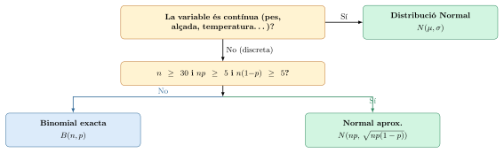
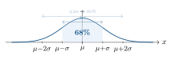

# Distribució binomial i normal. Intervals de confiança: Teoria

## La distribució binomial

Fins ara hem calculat probabilitats d’esdeveniments concrets. Ara fem un pas més: estudiem situacions on **repetim el mateix experiment moltes vegades** i volem saber quantes vegades passa un determinat resultat.

> **Quan podem usar la distribució binomial? Les 4 condicions**
>
> Un experiment segueix una **distribució binomial** $X \sim B(n,p)$ si es compleixen **les quatre condicions** següents:
>
> @p0.6cm p3.5cm p8cm@ **1.** & **Nombre fix** & Es repeteix l’experiment exactament $n$ vegades.  
> **2.** & **Dos resultats** & Cada repetició té exactament dos resultats possibles: *èxit* o *fracàs*.  
> **3.** & **Probabilitat constant** & La probabilitat d’èxit $p$ és la mateixa en cada repetició.  
> **4.** & **Independència** & El resultat d’una repetició **no afecta** les altres.  
>
> **Exemples que SÍ compleixen les 4 condicions:** llançar una moneda $n$ vegades, respondre $n$ preguntes a l’atzar, inspeccionar $n$ productes d’una cadena de muntatge.
>
> **Exemples que NO les compleixen:** treure boles d’una urna *sense reposició* (la prob. canvia a cada extracció → condició 3 falla), o treure cartes d’una baralla sense tornar-les.

> **📘 Propietat**
>
> La fórmula binomial i els seus paràmetres Si $X \sim B(n,p)$, la probabilitat d’obtenir exactament $k$ èxits és: $$\boxed{P(X = k) = \binom{n}{k} \cdot p^k \cdot (1-p)^{n-k}}
\qquad k = 0, 1, 2, \ldots, n$$
>
> On cada factor té un significat concret:
>
> p2.2cm p5.5cm p4cm **Factor** & **Significat** & **Exemple ($k{=}3$, $n{=}5$, $p{=}0{,}5$)**  
> $\dbinom{n}{k}$ & Nº de maneres de col·locar $k$ èxits entre $n$ intents & $\dbinom{5}{3} = 10$ ordenacions  
> $p^k$ & Probabilitat dels $k$ èxits & $0{,}5^3 = 0{,}125$  
> $(1-p)^{n-k}$ & Probabilitat dels $n{-}k$ fracassos & $0{,}5^2 = 0{,}25$  
>
> **Esperança i desviació típica:** $$\mu = E(X) = n \cdot p \qquad\qquad \sigma = \sqrt{n \cdot p \cdot (1-p)}$$

### Construint la intuïció: la moneda tres vegades

> **✏️ Exemple**
>
> Moneda equilibrada, 3 llançaments — d’on surt la fórmula? Llencem una moneda 3 vegades. Sigui $X$ = “nombre de cares”. Tenim $X \sim B(3, 0{,}5)$.
>
> **Enumerem tots els resultats possibles** (C=cara, ++=creu):
>
> 
>
> Tots els 8 resultats són equiprobables (prob. $\frac{1}{8}$ cadascun). Comptem:
>
> | $k$ |    Resultats    | Compte |   $P(X=k)$    |    $\binom{3}{k}\cdot(0{,}5)^3$     |
> |:---:|:---------------:|:------:|:-------------:|:-----------------------------------:|
> |  0  |      {+++}      |   1    | $\frac{1}{8}$ | $1 \cdot \frac{1}{8} = \frac{1}{8}$ |
> |  1  | {C++, +C+, ++C} |   3    | $\frac{3}{8}$ | $3 \cdot \frac{1}{8} = \frac{3}{8}$ |
> |  2  | {CC+, C+C, +CC} |   3    | $\frac{3}{8}$ | $3 \cdot \frac{1}{8} = \frac{3}{8}$ |
> |  3  |      {CCC}      |   1    | $\frac{1}{8}$ | $1 \cdot \frac{1}{8} = \frac{1}{8}$ |
> |     |    **Total**    | **8**  |     **1**     |                **1**                |
>
> El combinatori $\binom{3}{k}$ compta exactament les ordenacions de cada cas. **Aquí s’entén per què la fórmula té el combinatori**: no és màgia, és comptar quantes maneres hi ha de col·locar $k$ cares entre $n$ posicions.

### Esperança i desviació típica: interpretació pràctica

> **📘 Teoria**
>
> Si $X \sim B(n,p)$: $$\mu = n \cdot p \qquad \sigma = \sqrt{n \cdot p \cdot (1-p)}$$ $\mu$ és el **nombre esperat d’èxits**: si repetim l’experiment moltes vegades, de mitjana n’obtindrem $\mu$.
>
> $\sigma$ mesura la **dispersió**: quan menor és $\sigma$, més concentrats estan els resultats al voltant de $\mu$.

> **✏️ Exemple**
>
> Interpretar $\mu$ i $\sigma$ en context real
>
> p4.5cm c c c p4cm **Situació** & $n$ & $p$ & $\mu$ & $\sigma$ i interpretació  
> Clients satisfets & 10 & 0,8 & 8 & $\sigma=1{,}26$ → entre 7 i 9 gairebé sempre  
> Partits de tennis & 5 & 0,6 & 3 & $\sigma=1{,}10$ → guanya entre 2 i 4 normalment  
> Bombetes correctes & 15 & 0,95 & 14,25 & $\sigma=0{,}84$ → quasi sempre 14 o 15  
> Llançaments moneda & 4 & 0,5 & 2 & $\sigma=1{,}00$ → variabilitat moderada  

## Quan usar la binomial i quan la normal?

Una de les confusions més habituals és no saber quin model aplicar. La clau és entendre que la normal no és un substitut de la binomial sinó una **aproximació útil quan la binomial es torna difícil de calcular**.

> **Les dues distribucions: diferències fonamentals**
>
> p3.5cm p5cm p5cm & **Distribució binomial** $B(n,p)$ & **Distribució normal** $N(\mu,\sigma)$  
> **Tipus de variable** & Discreta (0, 1, 2, …, $n$) & Contínua (qualsevol valor real)  
> **Origen** & Comptar *èxits* en $n$ intents independents & Fenòmens naturals continus  
> **Paràmetres** & $n$ (intents) i $p$ (prob. d’èxit) & $\mu$ (mitjana) i $\sigma$ (desv. típica)  
> **Fórmula** & $P(X=k) = \binom{n}{k}p^k(1-p)^{n-k}$ & Taula de $\Phi(z)$ via tipificació  
> **Quan s’usa** & $n$ petit o $p$ molt extrem & Fenòmens continus o aprox. binomial  

> **📘 Teoria**
>
> **Quan la binomial s’aproxima per la normal**
>
> Quan $n$ és molt gran, calcular $\sum \binom{n}{k}p^k(1-p)^{n-k}$ es torna inviable. En aquest cas, si es compleixen les condicions: $$\boxed{n \geq 30 \qquad np \geq 5 \qquad n(1-p) \geq 5}$$ podem aproximar $X \sim B(n,p)$ per una normal amb els mateixos paràmetres d’esperança i variància: $$X \sim B(n,p) \;\xrightarrow{\text{aprox.}}\; X \sim N\!\left(\mu,\,\sigma\right)
\quad\text{on}\quad
\mu = n\cdot p \qquad \sigma = \sqrt{n \cdot p \cdot (1-p)}$$
>
> **Per què funciona?** És conseqüència del *Teorema Central del Límit*: la suma de moltes variables aleatòries independents tendeix a una distribució normal, independentment de la distribució original.

> **✏️ Exemple**
>
> Quan usar binomial exacta vs aproximació normal
>
> **Cas A — Binomial exacta** ($n$ petit):  
> Un jugador de bàsquet encerta el 70% dels tirs lliures. Llança 8 vegades. $n=8$, $np=5{,}6$, però $n<30$ → **binomial exacta** $B(8,\,0{,}7)$. $$P(X = 6) = \binom{8}{6}\cdot 0{,}7^6\cdot 0{,}3^2 = 28 \cdot 0{,}1176 \cdot 0{,}09 = 0{,}2965$$
>
> **Cas B — Aproximació normal** ($n$ gran):  
> Una fàbrica produeix 500 bombetes, el 95% correctes. $n=500$, $np=475 \geq 5$, $n(1-p)=25 \geq 5$, $n \geq 30$ → **aproximació normal**. $$X \sim B(500,\,0{,}95) \;\approx\; N(\mu,\,\sigma)
\quad\text{on}\quad
\mu = 500 \cdot 0{,}95 = 475,\quad \sigma = \sqrt{500 \cdot 0{,}95 \cdot 0{,}05} = \sqrt{23{,}75} \approx 4{,}87$$ Calcular $P(X \geq 480)$ amb la binomial requeriria sumar 21 termes. Amb la normal: $$P(X \geq 480) \approx P\!\left(Z \geq \frac{480 - 475}{4{,}87}\right) = P(Z \geq 1{,}03) = 1 - \Phi(1{,}03) \approx 0{,}152$$

> **Guia ràpida: quin model triar a la selectivitat**
>
> p5.5cm p3.5cm p3.5cm **Enunciat diu…** & **Model** & **Paràmetres**  
> “repetim $n$ vegades amb prob. $p$…” & $B(n,p)$ & $n$, $p$  
> “…i $n$ gran ($\geq 30$), $np \geq 5$” & $N(np,\;\sqrt{np(1-p)})$ & aprox. normal  
> “segueix una distribució normal…” & $N(\mu,\sigma)$ & $\mu$, $\sigma$  
> “interval de confiança per a la mitjana” & $N(0,1)$ + taula & $\bar{x}$, $\sigma$ o $S$, $n$  
> “interval de confiança per a la proporció” & $N(0,1)$ + taula & $\hat{p}$, $n$  

------------------------------------------------------------------------

## La distribució normal i els intervals de confiança

La distribució normal és la distribució contínua més important de l’estadística. Apareix en fenòmens naturals (alçades, pesos, notes d’exàmens) i és la base dels intervals de confiança que surten a la selectivitat.

> **📘 Propietat**
>
> La distribució normal $N(\mu, \sigma)$ Una variable aleatòria contínua $X$ segueix una **distribució normal** de paràmetres $\mu$ (mitjana) i $\sigma$ (desviació típica), que escrivim $X \sim N(\mu, \sigma)$, si la seva corba té forma de campana simètrica centrada a $\mu$.
>
> 
>
> **Propietats fonamentals:**
>
> - Simètrica respecte a $\mu$: $P(X \leq \mu) = P(X \geq \mu) = 0{,}5$
>
> - El 68% dels valors estan entre $\mu - \sigma$ i $\mu + \sigma$
>
> - El 95% dels valors estan entre $\mu - 2\sigma$ i $\mu + 2\sigma$
>
> - La suma de totes les probabilitats és 1: l’àrea total sota la corba = 1

> **📘 Teoria**
>
> **La normal estàndard i la tipificació**
>
> La **normal estàndard** $Z \sim N(0, 1)$ té mitjana 0 i desviació típica 1. Les taules que us donen a la selectivitat corresponen *sempre* a aquesta distribució.
>
> Per usar la taula amb qualsevol $X \sim N(\mu, \sigma)$, cal **tipificar**: $$\boxed{Z = \frac{X - \mu}{\sigma}}$$ Això transforma qualsevol valor $x$ en un valor $z$ que indica **quantes desviacions típiques** és $x$ per damunt o per davall de la mitjana.
>
> **Com llegir la taula:** la taula us dóna $\Phi(z) = P(Z \leq z)$, és a dir, l’àrea a l’esquerra del valor $z$.
>
> p4.5cm p5cm p3.5cm **Probabilitat** & **Com calcular-la** & **Observació**  
> $P(Z \leq z)$ & Directament de la taula & $z > 0$  
> $P(Z \geq z)$ & $= 1 - P(Z \leq z)$ & Complementari  
> $P(Z \leq -z)$ & $= 1 - P(Z \leq z)$ & Simetria  
> $P(Z \geq -z)$ & $= P(Z \leq z)$ & Simetria  
> $P(-z \leq Z \leq z)$ & $= 2\cdot P(Z \leq z) - 1$ & Interval centrat  
> $P(z_1 \leq Z \leq z_2)$ & $= P(Z \leq z_2) - P(Z \leq z_1)$ & Interval general  
>
> **Valors de $z$ que cal memoritzar** (us els donen sempre a selectivitat): $$P(-1{,}96 \leq Z \leq 1{,}96) = 0{,}95
\qquad\qquad
P(-2{,}58 \leq Z \leq 2{,}58) = 0{,}99$$

> **✏️ Exemple**
>
> Tipificació — Notes d’un examen Les notes d’un examen segueixen una distribució $X \sim N(5{,}5;\; 1{,}5)$. Calcula:
>
> **a)** $P(X \leq 7)$ **b)** $P(X \geq 4)$ **c)** $P(4 \leq X \leq 7)$
>
> **a)** Tipifiquem $x = 7$: $$Z = \frac{7 - 5{,}5}{1{,}5} = \frac{1{,}5}{1{,}5} = 1
\qquad\Rightarrow\qquad
P(X \leq 7) = P(Z \leq 1) = \Phi(1) = \boxed{0{,}8413}$$
>
> **b)** Tipifiquem $x = 4$: $$Z = \frac{4 - 5{,}5}{1{,}5} = \frac{-1{,}5}{1{,}5} = -1
\qquad\Rightarrow\qquad
P(X \geq 4) = P(Z \geq -1) = P(Z \leq 1) = \boxed{0{,}8413}$$ (per simetria de la normal estàndard)
>
> **c)** $$P(4 \leq X \leq 7) = P(-1 \leq Z \leq 1) = 2 \cdot \Phi(1) - 1 = 2 \cdot 0{,}8413 - 1 = \boxed{0{,}6826}$$ Coincideix amb la regla del 68%: el 68% dels valors estan dins $\pm\sigma$.

### Intervals de confiança per a la mitjana

> **El problema de fons: mai coneixem $\mu$**
>
> Imagina que vols saber el pes mitjà *real* $\mu$ de tots els estudiants d’una escola de 1.000 alumnes. Pesar-los tots és inviable, de manera que agafes una mostra de $n=36$ alumnes i calcules la seva mitjana $\bar{x} = 62{,}4$ kg.
>
> **La pregunta clau:** $\bar{x} = 62{,}4$ és exactament $\mu$? **No.** La mostra és una de les moltes possibles, i cada mostra diferent donaria un $\bar{x}$ diferent. Necessitem una manera de dir: “$\mu$ probablement es troba *entre aquests dos valors*”.

> **📘 Teoria**
>
> **Pas 1 — Com es distribueix $\bar{x}$?**
>
> Si la població segueix una $N(\mu, \sigma)$ i prenem mostres de mida $n$, es pot demostrar que la mitjana mostral $\bar{x}$ també segueix una distribució normal: $$\bar{x} \sim N\!\left(\mu,\; \frac{\sigma}{\sqrt{n}}\right)$$ El terme $\dfrac{\sigma}{\sqrt{n}}$ s’anomena **error estàndard**: mesura quant varia $\bar{x}$ d’una mostra a una altra. Com més gran és $n$, més petit és l’error estàndard i més concentrades estan les $\bar{x}$ al voltant de $\mu$.
>
> 

> **📘 Teoria**
>
> **Pas 2 — Derivació de la fórmula de l’IC**
>
> Com que $\bar{x} \sim N\!\left(\mu, \frac{\sigma}{\sqrt{n}}\right)$, tipifiquem: $$Z = \frac{\bar{x} - \mu}{\sigma/\sqrt{n}} \sim N(0,1)$$ Sabem que $P(-1{,}96 \leq Z \leq 1{,}96) = 0{,}95$. Substituïm $Z$: $$P\!\left(-1{,}96 \leq \frac{\bar{x} - \mu}{\sigma/\sqrt{n}} \leq 1{,}96\right) = 0{,}95$$ Multipliquem per $\dfrac{\sigma}{\sqrt{n}}$ (positiu, no canvia el sentit): $$P\!\left(-1{,}96\cdot\frac{\sigma}{\sqrt{n}} \leq \bar{x} - \mu \leq 1{,}96\cdot\frac{\sigma}{\sqrt{n}}\right) = 0{,}95$$ Reescrivim en termes de $\mu$ (canviem signes i sentit de les desigualtats): $$P\!\left(\bar{x} - 1{,}96\cdot\frac{\sigma}{\sqrt{n}} \leq \mu \leq \bar{x} + 1{,}96\cdot\frac{\sigma}{\sqrt{n}}\right) = 0{,}95$$
>
> **Això és exactament l’IC al 95%:** el rang de valors de $\mu$ compatibles amb la nostra $\bar{x}$, construït de manera que el 95% de les vegades que repetim l’experiment, $\mu$ quedarà dins l’interval.
>
> 

> **⚠ La interpretació correcta de l’IC (error freqüent a la PAU)**
>
> **Incorrecte:** “La probabilitat que $\mu$ estigui dins l’interval és del 95%”.
>
> **Per què és incorrecte?** $\mu$ és un valor fix (no és aleatori). No té probabilitat. O hi és dins, o no hi és. Un cop calculat l’interval, no es pot parlar de probabilitat.
>
> **Correcte:** “Si repetíssim el mostreig moltes vegades i construíssim un IC cada vegada, el 95% d’aquests intervals contindrien $\mu$”.
>
> **La metàfora del dard:** $\mu$ és el centre fix d’una diana. Cada mostra llença un dard ($\bar{x}$) i construïm un cercle al voltant d’on ha caigut. Un IC al 95% significa que 95 de cada 100 dards cauen prou a prop del centre perquè el seu cercle el contingui.

> **📘 Propietat**
>
> Les fórmules de l’IC per a la mitjana
>
> **Cas 1 — $\sigma$ coneguda** (el problema et dóna la desviació típica de la població): $$\boxed{\bar{x} \pm z_\gamma \cdot \frac{\sigma}{\sqrt{n}}}$$
>
> **Cas 2 — $\sigma$ desconeguda, $n \geq 30$** (el problema et dóna la desviació típica *mostral* $S$): $$\boxed{\bar{x} \pm z_\gamma \cdot \frac{S}{\sqrt{n}}}$$
>
> | **Confiança** | **$z_\gamma$** |         **Condició de la taula**         |
> |:-------------:|:--------------:|:----------------------------------------:|
> |      95%      |    $1{,}96$    | $P(-1{,}96 \leq Z \leq 1{,}96) = 0{,}95$ |
> |      99%      |    $2{,}58$    | $P(-2{,}58 \leq Z \leq 2{,}58) = 0{,}99$ |
>
> **Factors que afecten l’amplada de l’IC:**
>
> - $\uparrow n$ (mostra més gran) $\Rightarrow$ interval més **estret** (estimació més precisa)
>
> - $\uparrow z_\gamma$ (més confiança) $\Rightarrow$ interval més **ample**
>
> - $\uparrow \sigma$ (més variabilitat) $\Rightarrow$ interval més **ample**

> **✏️ Exemple**
>
> PAU — Iogurts i etiqueta errònia Hem comprat 10 iogurts i n’hem pesat el contingut (grams): $148,\ 149,\ 147,\ 146,\ 149,\ 146,\ 149,\ 148,\ 149,\ 149$. Sabem que el pes segueix $N(\mu, 3)$. Construeix un IC al 95% i determina si l’etiqueta (150 g) és errònia.
>
> **Pas 1 — Identificar les dades:** $n = 10$, $\sigma = 3$ (coneguda, és dada del problema), $z_{0{,}95} = 1{,}96$.
>
> **Pas 2 — Calcular $\bar{x}$:** $$\bar{x} = \frac{148+149+147+146+149+146+149+148+149+149}{10} = \frac{1480}{10} = 148$$
>
> **Pas 3 — Calcular l’error estàndard:** $$\frac{\sigma}{\sqrt{n}} = \frac{3}{\sqrt{10}} = \frac{3}{3{,}162} = 0{,}9487$$
>
> **Pas 4 — Construir l’IC:** $$148 \pm 1{,}96 \cdot 0{,}9487 = 148 \pm 1{,}859
\quad\Rightarrow\quad \text{IC 95\%} = \boxed{[146{,}14\ ,\ 149{,}86]}$$
>
> **Pas 5 — Conclusió:** 150 g **no** pertany a $[146{,}14;\; 149{,}86]$. Amb un 95% de confiança, l’etiqueta és errònia: el contingut real és inferior als 150 g declarats.

> **✏️ Exemple**
>
> PAU — Cafeteria: IC al 95% i al 99% Una mostra de 250 estudiants dóna $\bar{x} = 5$ € i desviació típica *mostral* $S = 1{,}5$ €.
>
> Com que $\sigma$ és *desconeguda* però $n = 250 \geq 30$, usem $S$.
>
> **Error estàndard:** $\dfrac{S}{\sqrt{n}} = \dfrac{1{,}5}{\sqrt{250}} = \dfrac{1{,}5}{15{,}81} = 0{,}0949$
>
> **IC al 95%:** $\quad 5 \pm 1{,}96 \cdot 0{,}0949 = 5 \pm 0{,}186 \quad\Rightarrow\quad \boxed{[4{,}814\ ,\ 5{,}186]}$
>
> **IC al 99%:** $\quad 5 \pm 2{,}58 \cdot 0{,}0949 = 5 \pm 0{,}245 \quad\Rightarrow\quad \boxed{[4{,}755\ ,\ 5{,}245]}$
>
> **Per què l’IC al 99% és més ample?** El valor $z$ passa de 1,96 a 2,58: multipliquem el mateix error estàndard per un nombre més gran, de manera que l’interval s’eixampla. Com més confiança volem, més gran ha de ser el “cercle”.

### Intervals de confiança per a una proporció

> **📘 Teoria**
>
> L’IC per a una proporció segueix exactament la mateixa lògica que per a la mitjana. La diferència és que ara l’“error estàndard” no és $\sigma/\sqrt{n}$ sinó $\sqrt{\hat{p}(1-\hat{p})/n}$.
>
> **Estimació puntual:** $\hat{p} = \dfrac{k}{n}$ (proporció a la mostra)
>
> **IC al nivell $\gamma$:** $$\boxed{\hat{p} \pm z_\gamma \cdot \sqrt{\frac{\hat{p}(1-\hat{p})}{n}}}$$
>
> **Per què $\sqrt{\hat{p}(1-\hat{p})/n}$?** Perquè si $X$ = nombre d’èxits en $n$ intents independents amb probabilitat $\hat{p}$, llavors $X \sim B(n, \hat{p})$, i la seva desviació típica és $\sqrt{n\hat{p}(1-\hat{p})}$. La desviació típica de la proporció $\hat{p} = X/n$ és $\sqrt{\hat{p}(1-\hat{p})/n}$: la mateixa lògica que $\sigma/\sqrt{n}$ per a les mitjanes.

> **✏️ Exemple**
>
> PAU — Persones que parlen anglès En una mostra de 500 persones, 189 parlen anglès.
>
> **Pas 1 — Estimació puntual:** $$\hat{p} = \frac{189}{500} = 0{,}378 \quad\Rightarrow\quad \textbf{37{,}8\%}$$
>
> **Pas 2 — Error estàndard:** $$\sqrt{\frac{\hat{p}(1-\hat{p})}{n}} = \sqrt{\frac{0{,}378 \cdot 0{,}622}{500}} = \sqrt{0{,}000470} = 0{,}02169$$
>
> **Pas 3 — IC al 95%:** $$0{,}378 \pm 1{,}96 \cdot 0{,}02169 = 0{,}378 \pm 0{,}0425
\quad\Rightarrow\quad \boxed{[33{,}55\%\ ,\ 42{,}05\%]}$$
>
> **Interpretació:** amb un 95% de confiança, el percentatge real de persones que parlen anglès a la població es troba entre el 33,55% i el 42,05%.

## Demostració pràctica: 100 monedes i 60 cares

Vegem de manera concreta i verificable com la distribució binomial s’aproxima a la normal. El problema que plantegem és senzill però les dues vies de resolució il·lustren perfectament la diferència entre tots dos models.

> **El problema**
>
> Llencem una moneda equilibrada **100 vegades**. Quina és la probabilitat d’obtenir **60 o més cares**? $$X = \text{``nombre de cares''} \qquad X \sim B(100,\; 0{,}5)$$

### Mètode 1: Binomial exacta (amb la funció acumulada)

Calcular $P(X \geq 60)$ directament significa sumar 41 termes: $$P(X \geq 60) = \sum_{k=60}^{100} \binom{100}{k} \cdot 0{,}5^k \cdot 0{,}5^{100-k}
= P(60) + P(61) + \cdots + P(100)$$ Això és inviable a mà, però usant el **complementari** i la **funció de distribució acumulada** ho podem fer: $$\boxed{P(X \geq 60) = 1 - P(X \leq 59)}$$

La funció $P(X \leq 59)$ és el que la calculadora anomena `binomcdf` o `FBin` i dóna directament la suma acumulada fins a 59.

lp9cm **Calculadora Casio** & `STAT` $\to$ `DIST` $\to$ `BINM` $\to$ `Bcd`:  
& `X=59`, `N=100`, `p=0.5` $\to$ resultat: $0{,}9716$  
**Calculadora TI** & `2nd` + `VARS` $\to$ `binomcdf(100, 0.5, 59)`  

$$P(X \leq 59) = 0{,}9716 \qquad\Rightarrow\qquad
P(X \geq 60) = 1 - 0{,}9716 = \boxed{0{,}0284}$$

*Interpretació: si llencem 100 monedes, hi ha aproximadament un 2,84% de probabilitat d’obtenir 60 o més cares.*

### Mètode 2: Aproximació normal

**Pas 1 — Verifiquem les condicions:** $$n = 100 \geq 30 \checkmark \qquad
np = 100 \cdot 0{,}5 = 50 \geq 5 \checkmark \qquad
n(1-p) = 50 \geq 5 \checkmark$$ Les tres condicions es compleixen. Podem aproximar.

**Pas 2 — Calculem $\mu$ i $\sigma$:** $$\mu = n \cdot p = 100 \cdot 0{,}5 = 50
\qquad\qquad
\sigma = \sqrt{n \cdot p \cdot (1-p)} = \sqrt{100 \cdot 0{,}5 \cdot 0{,}5} = \sqrt{25} = 5$$ Per tant: $X \sim B(100,\,0{,}5) \;\approx\; N(50,\, 5)$.

**Pas 3 — Tipifiquem i apliquem la taula:** $$P(X \geq 60) \approx P\!\left(Z \geq \frac{60 - 50}{5}\right) = P(Z \geq 2)
= 1 - \Phi(2) = 1 - 0{,}9772 = \boxed{0{,}0228}$$ *(Dada necessària que dóna l’enunciat: $\Phi(2) = P(Z \leq 2) = 0{,}9772$)*

| **Mètode**                   | **Resultat** | **Error absolut** | **Error relatiu** |
|:-----------------------------|:------------:|:-----------------:|:-----------------:|
| Binomial exacta (referència) |  $0{,}0284$  |         —         |         —         |
| Normal $N(50,5)$ sense cc    |  $0{,}0228$  |    $0{,}0056$     |  $\approx 20\%$   |
| Normal $N(50,5)$ amb cc$^*$  |  $0{,}0287$  |    $0{,}0003$     |   $\approx 1\%$   |

$^*$ La **correcció de continuïtat** consisteix a usar $59{,}5$ en lloc de $60$, ja que la binomial és discreta i la normal és contínua: $P(X \geq 60)_{\text{binomial}} \approx P\!\left(Z \geq \frac{59{,}5-50}{5}\right) = P(Z \geq 1{,}9) = 1 - 0{,}9713 = 0{,}0287$. A la selectivitat no s’exigeix, però explica per què l’aproximació millora molt.

> **Per què l’aproximació és acceptable malgrat el 20% d’error?**
>
> En valors petits de probabilitat (com $0{,}028$), un error absolut de $0{,}006$ sembla gran en termes relatius, però en la pràctica les dues conclusions són les mateixes: **obtenir 60 o més cares en 100 llançaments és un fet poc probable** (menys del 3%).
>
> A més, la utilitat real de l’aproximació es veu quan $n$ és molt gran (500, 1000 llançaments): la binomial exacta seria literalment impossible de calcular, mentre que la normal dóna una resposta ràpida i suficientment precisa.

### Visualització: la binomial s’assembla cada cop més a la normal

La taula següent mostra com, a mesura que $n$ augmenta, l’error entre la binomial exacta i l’aproximació normal disminueix:

| $n$ | $k_0$ | $\mu$ | $\sigma$ | $P(X \geq k_0)$ binomial | $P(X \geq k_0)$ normal |
|:---:|:-----:|:-----:|:--------:|:------------------------:|:----------------------:|
| 10  |   6   |   5   |   1,58   |        $0{,}3770$        | $0{,}2635$ (err. 30%)  |
| 30  |  18   |  15   |   2,74   |        $0{,}1808$        | $0{,}1367$ (err. 24%)  |
| 50  |  30   |  25   |   3,54   |        $0{,}1013$        | $0{,}0786$ (err. 22%)  |
| 100 |  60   |  50   |   5,00   |        $0{,}0284$        | $0{,}0228$ (err. 20%)  |

Observeu que l’error no desapareix instantàniament, però la diferència **en valors absoluts** es fa cada cop més petita i, sobretot, **les dues distribucions donen la mateixa conclusió qualitativa**. Quan les condicions $np \geq 5$ i $n(1-p) \geq 5$ es compleixen holgadament, l’aproximació és més que suficient per a la pràctica estadística.

> **📝 Exercici**
>
> 22 — Demostració amb calculadora Llencem una moneda equilibrada 80 vegades. Calcula la probabilitat d’obtenir exactament 50 o més cares pels dos mètodes i compara els resultats.
>
> 1.  Mètode binomial: usa la funció acumulada complementària.
>
> 2.  Mètode normal: verifica les condicions, troba $\mu$ i $\sigma$, tipifica i usa la taula.
>
> 3.  Calcula l’error relatiu entre els dos mètodes.
>
> Dada: $P(Z \leq 2{,}24) = 0{,}9875$.

Solució

$X \sim B(80,\; 0{,}5)$.

**a) Binomial exacta:** $$P(X \geq 50) = 1 - P(X \leq 49)$$ Amb la calculadora: `binomcdf(80, 0.5, 49)` $= 0{,}9836$ $$P(X \geq 50) = 1 - 0{,}9836 = \boxed{0{,}0164}$$

**b) Aproximació normal:**

Condicions: $n=80\geq30$ ✓, $np=40\geq5$ ✓, $n(1-p)=40\geq5$ ✓ $$\mu = 80 \cdot 0{,}5 = 40 \qquad \sigma = \sqrt{80 \cdot 0{,}5 \cdot 0{,}5} = \sqrt{20} \approx 4{,}47$$ $$P(X \geq 50) \approx P\!\left(Z \geq \frac{50-40}{4{,}47}\right) = P(Z \geq 2{,}24) = 1 - 0{,}9875 = \boxed{0{,}0125}$$

**c) Error relatiu:** $$\text{Error} = \frac{|0{,}0164 - 0{,}0125|}{0{,}0164} \approx 24\%$$ Malgrat el percentatge, els dos mètodes coincideixen en la conclusió: obtenir 50 o més cares en 80 llançaments és poc probable (menys del 2%).

------------------------------------------------------------------------

### La connexió definitiva: IC sobre les 100 monedes

Fins ara hem respost la pregunta: *“Si la moneda és equilibrada ($p=0{,}5$), quina probabilitat hi ha d’obtenir 60 o més cares?”* Però hi ha una pregunta diferent i igualment vàlida:

> **La pregunta inversa**
>
> **Hem obtingut 60 cares en 100 llançaments.**  
> En comptes de preguntar “és probable aquest resultat si $p=0{,}5$?”,  
> ara preguntem: **“quin rang de valors de $p$ és compatible amb les nostres 60 cares?”**

Aquesta és exactament la pregunta que respon un **interval de confiança per a la proporció**.

> **✏️ Exemple**
>
> IC sobre les 100 monedes: és la moneda equilibrada?
>
> Hem llançat una moneda 100 vegades i hem obtingut $k = 60$ cares.
>
> **Pas 1 — Estimació puntual de $p$:** $$\hat{p} = \frac{k}{n} = \frac{60}{100} = 0{,}60 \quad\Rightarrow\quad \text{estimem que la moneda dóna cara el 60\% de les vegades}$$
>
> **Pas 2 — Error estàndard:** $$\sqrt{\frac{\hat{p}(1-\hat{p})}{n}} = \sqrt{\frac{0{,}60 \cdot 0{,}40}{100}} = \sqrt{\frac{0{,}24}{100}} = \sqrt{0{,}0024} = 0{,}049$$
>
> **Pas 3 — IC al 95%** ($z = 1{,}96$): $$0{,}60 \pm 1{,}96 \cdot 0{,}049 = 0{,}60 \pm 0{,}096
\quad\Rightarrow\quad \text{IC 95\%} = \boxed{[50{,}4\%\ ,\ 69{,}6\%]}$$
>
> **Pas 4 — IC al 99%** ($z = 2{,}58$): $$0{,}60 \pm 2{,}58 \cdot 0{,}049 = 0{,}60 \pm 0{,}126
\quad\Rightarrow\quad \text{IC 99\%} = \boxed{[47{,}4\%\ ,\ 72{,}6\%]}$$

> **La connexió entre la probabilitat i l’interval**
>
> p3cm p4cm p3cm p3cm **Mètode** & **Pregunta** & **Resultat** & **Conclusió sobre $p=0{,}5$**  
> Binomial / Normal & $P(X \geq 60)$ si $p=0{,}5$ & $\approx 2{,}84\%$ & Poc probable, però possible  
> IC al 95% & Quins valors de $p$ expliquen 60 cares? & $[50{,}4\%,\; 69{,}6\%]$ & $p=0{,}5$ queda **fora** de l’IC  
> IC al 99% & Quins valors de $p$ expliquen 60 cares? & $[47{,}4\%,\; 72{,}6\%]$ & $p=0{,}5$ queda **dins** de l’IC  
>
> **Com llegir la taula:**
>
> - L’**IC al 95%** exclou just $p=0{,}5$: amb un 95% de confiança, diríem que la moneda *no* és equilibrada.
>
> - L’**IC al 99%** inclou $p=0{,}5$: amb un 99% de confiança, no tenim prou evidència per descartar que sigui equilibrada.
>
> - Aquesta és exactament la mateixa tensió que reflecteix la probabilitat $P(X\geq60)=2{,}84\%$: el resultat és *inusual* però no *impossible* amb $p=0{,}5$.
>
> **La relació profunda:** un valor $p_0$ queda *fora* de l’IC al 95% exactament quan la probabilitat de veure un resultat tan extrem com el nostre (o més) és inferior al 5%. Aquests dos raonaments, la probabilitat i l’IC, diuen el *mateix* des d’angles oposats.

El diagrama ho mostra clarament: $p=50\%$ (línia vermella) cau **fora** de l’IC al 95% (rectangle verd) però **dins** de l’IC al 99% (rectangle blau). Amb un 95% de confiança rebutgem que la moneda sigui equilibrada, però amb un 99% no.

> **✏️ Exemple**
>
> Contrast: 55 cares vs 60 cares en 100 llançaments
>
> **Cas A: 55 cares** $\Rightarrow \hat{p} = 0{,}55$
>
> $$\text{IC 95\%} = 0{,}55 \pm 1{,}96\cdot\sqrt{\frac{0{,}55\cdot0{,}45}{100}}
= 0{,}55 \pm 1{,}96 \cdot 0{,}0497
= 0{,}55 \pm 0{,}097
= \boxed{[45{,}3\%\ ,\ 64{,}7\%]}$$ $p=0{,}5$ **sí** pertany a $[45{,}3\%;\; 64{,}7\%]$ → amb 55 cares, la moneda *podria* ser equilibrada.
>
> **Cas B: 60 cares** $\Rightarrow \hat{p} = 0{,}60$
>
> $$\text{IC 95\%} = \boxed{[50{,}4\%\ ,\ 69{,}6\%]}$$ $p=0{,}5$ **no** pertany a l’IC → amb 60 cares, la moneda *sembla* trucada (al 95%).
>
> **Conclusió pedagògica:** l’IC indica a partir de quants resultats extrems podem dir, amb una certa confiança, que el model assumit ($p=0{,}5$) no explica bé el que hem observat. Exactament el mateix que feia la probabilitat $P(X\geq k)$, però des de l’angle oposat.

> **📝 Exercici**
>
> 23 — PAU: IC sobre les monedes i decisió Hem llançat una moneda 200 vegades i hem obtingut 115 cares.
>
> 1.  Calcula l’estimació puntual de la probabilitat de cara $\hat{p}$.
>
> 2.  Construeix un IC al 95% per a $p$.
>
> 3.  Amb els resultats obtinguts, pots afirmar, amb una confiança del 95%, que la moneda **no** és equilibrada? Raona la resposta.
>
> 4.  Construeix un IC al 99% i comprova si la conclusió canvia.
>
> Dades: $P(-1{,}96 \leq Z \leq 1{,}96) = 0{,}95$ i $P(-2{,}58 \leq Z \leq 2{,}58) = 0{,}99$.

Solució

**a) Estimació puntual:** $$\hat{p} = \frac{115}{200} = 0{,}575 \quad\Rightarrow\quad 57{,}5\%$$

**b) Error estàndard i IC al 95%:** $$\sqrt{\frac{0{,}575 \cdot 0{,}425}{200}} = \sqrt{\frac{0{,}24438}{200}} = \sqrt{0{,}001222} = 0{,}03495$$ $$\text{IC 95\%} = 0{,}575 \pm 1{,}96 \cdot 0{,}03495 = 0{,}575 \pm 0{,}0685 = \boxed{[50{,}65\%\ ,\ 64{,}35\%]}$$

**c) Decisió al 95%:** $p=0{,}5$ **no** pertany a $[50{,}65\%;\; 64{,}35\%]$. Per tant, amb un 95% de confiança, podem afirmar que la moneda no és equilibrada: la probabilitat de cara sembla superior al 50%.

**d) IC al 99%:** $$\text{IC 99\%} = 0{,}575 \pm 2{,}58 \cdot 0{,}03495 = 0{,}575 \pm 0{,}0902 = \boxed{[48{,}48\%\ ,\ 66{,}52\%]}$$ $p=0{,}5$ **sí** pertany a $[48{,}48\%;\; 66{,}52\%]$. Amb un 99% de confiança, *no* tenim prou evidència per descartar que la moneda sigui equilibrada. La conclusió **canvia** segons el nivell de confiança escollit.

------------------------------------------------------------------------

*Fi del document · Probabilitat i Estadística · 2n Batxillerat*
