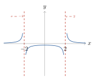
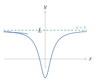
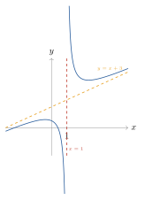
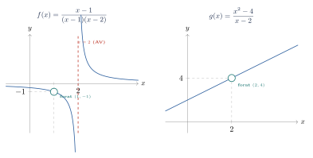

# Límits i continuïtat: Teoria

## Dossier de límits

> **DOSSIER DE REPÀS I CONSOLIDACIÓ**  
> UNITAT 1: LÍMITS DE FUNCIONS I CONTINUÏTAT  
> Matemàtiques II — 2n de Batxillerat

### Què hem de saber

Aquest dossier recull, estructura i amplia el treball realitzat a l’aula sobre el càlcul de límits, l’estudi d’assímptotes i la continuïtat de funcions. L’objectiu és consolidar els procediments algebraics i preparar-te per als exàmens de 2n de Batxillerat i les proves d’accés a la universitat (PAU).

**Objectius d’aprenentatge del tema:**

- Comprendre el concepte intuïtiu i formal de límit en un punt i a l’infinit.

- Dominar el càlcul d’algebrització de límits i la resolució de totes les indeterminacions ($0/0$, $\infty/\infty$, $\infty-\infty$, $0 \cdot \infty$, $1^\infty$).

- Determinar l’existència d’assímptotes verticals, horitzontals i oblíques en funcions racionals i irracionals.

- Analitzar la continuïtat d’una funció en un punt i en un interval, classificant-ne els tipus de discontinuïtat.

- Trobar paràmetres desconeguts per garantir la continuïtat o l’existència d’assímptotes.

—

### Conceptes Teòrics i Propietats

> **📘 Definició**
>
> Límit d’una funció en un punt Diem que el límit de la funció $f(x)$ quan $x$ tendeix al punt $a$ és el nombre real $L$, i ho escrivim: $$\lim_{x \to a} f(x) = L$$ si a mesura que $x$ s’aproxima a $a$ (però sense ser necessàriament igual a $a$), les imatges $f(x)$ s’aproximen tant com vulguem a $L$.

> **📘 Propietat**
>
> Límits laterals i existència del límit global Perquè existeixi el límit d’una funció en un punt $x = a$, és condició necessària i suficient que existeixin els dos límits laterals (per l’esquerra i per la dreta) i que siguin iguals: $$\lim_{x \to a} f(x) = L \iff \lim_{x \to a^-} f(x) = \lim_{x \to a^+} f(x) = L$$ Si els límits laterals no coincideixen, o si algun d’ells no existeix o és infinit, diem que **no existeix el límit finit global**.

#### Àlgebra de límits

Si $\lim_{x \to a} f(x) = L$ i $\lim_{x \to a} g(x) = M$ (amb $L, M \in \mathbb{R}$), es compleixen les propietats següents:

1.  **Suma / Resta:** $\lim_{x \to a} [f(x) \pm g(x)] = L \pm M$

2.  **Producte:** $\lim_{x \to a} [f(x) \cdot g(x)] = L \cdot M$

3.  **Quocient:** $\lim_{x \to a} \frac{f(x)}{g(x)} = \frac{L}{M} \quad (\text{si } M \neq 0)$

4.  **Producte per una constant:** $\lim_{x \to a} [k \cdot f(x)] = k \cdot L \quad (\forall k \in \mathbb{R})$

5.  **Potència:** $\lim_{x \to a} [f(x)]^{g(x)} = L^M \quad (\text{si } L > 0)$

#### Operacions amb l’infinit ($\infty$)

En el càlcul de límits operem sovint amb la recta real ampliada. És fonamental recordar:

2

- $(+\infty) + (+\infty) = +\infty$

- $(-\infty) - (+\infty) = -\infty$

- $k \cdot (\pm\infty) = \pm\infty \quad (\text{si } k > 0)$

- $k \cdot (\pm\infty) = \mp\infty \quad (\text{si } k < 0)$

- $\frac{k}{\pm\infty} = 0 \quad (\forall k \in \mathbb{R})$

- $\frac{k}{0} = \infty \quad (\text{si } k \neq 0, \text{cal mirar laterals})$

- $k^{+\infty} = +\infty \quad (\text{si } k > 1)$

- $k^{+\infty} = 0 \quad (\text{si } 0 < k < 1)$

- $k^{-\infty} = 0 \quad (\text{si } k > 1)$

—

### Mètodes de Càlcul i Indeterminacions

En avaluar un límit, el primer pas és sempre la **substitució directa**. Quan aquesta condueix a una expressió no definida, ens trobem davant d’una **indeterminació**.

Les 7 indeterminacions clàssiques són: $$\left[\frac{0}{0}\right], \quad \left[\frac{\infty}{\infty}\right], \quad [\infty - \infty], \quad [0 \cdot \infty], \quad [1^\infty], \quad [0^0], \quad [\infty^0]$$

> **📘 Propietat**
>
> Resolució de les Indeterminacions principals
>
> 1.  **Indeterminació $\left[\frac{0}{0}\right]$:**
>
>     - *Funcions racionals:* Factoritzem numerador i denominador (mitjançant Ruffini o treure factor comú) i simplifiquem el factor $(x-a)$.
>
>     - *Funcions amb arrels radicals:* Multipliquem i dividim per l’expressió conjugada.
>
> 2.  **Indeterminació $\left[\frac{\infty}{\infty}\right]$:** En funcions racionals quan $x \to \pm\infty$, comparem els graus del numerador $P(x)$ i denominador $Q(x)$:
>
>     - Si $\text{grau}(P) < \text{grau}(Q) \implies \lim = 0$.
>
>     - Si $\text{grau}(P) = \text{grau}(Q) \implies \lim = \frac{\text{coeficient principal de } P}{\text{coeficient principal de } Q}$.
>
>     - Si $\text{grau}(P) > \text{grau}(Q) \implies \lim = \pm\infty$ (el signe depèn dels coeficients i del signe de $x$).
>
> 3.  **Indeterminació $[\infty - \infty]$:**
>
>     - Si és una resta de fraccions algebraiques: reduïm a comú denominador i operem.
>
>     - Si intervenen radicals: multiplicem i dividim pel conjugat.
>
> 4.  **Indeterminació $[1^\infty]$:** S’aplica la fórmula de la relació amb el nombre $e$: $$\lim_{x \to a} [f(x)]^{g(x)} = e^L \quad \text{on} \quad L = \lim_{x \to a} \left( g(x) \cdot [f(x) - 1] \right)$$

—

### Assímptotes d’una Funció

> **📘 Definició**
>
> Assímptota Vertical (A.V.) La recta vertical $x = a$ és una assímptota vertical de $f(x)$ si es compleix algun dels límits laterals següents: $$\lim_{x \to a^-} f(x) = \pm\infty \quad \text{o} \quad \lim_{x \to a^+} f(x) = \pm\infty$$ **On buscar-les?** En els punts que anul·len el denominador o en els extrems de domini no inclosos.

> **📘 Definició**
>
> Assímptota Horitzontal (A.H.) La recta horitzontal $y = k$ és una assímptota horitzontal quan $x \to +\infty$ (o $x \to -\infty$) si: $$\lim_{x \to +\infty} f(x) = k \quad \text{o} \quad \lim_{x \to -\infty} f(x) = L \quad (k, L \in \mathbb{R})$$

> **📘 Definició**
>
> Assímptota Oblíqua (A.O.) La recta $y = mx + n$ (amb $m \neq 0$) és una assímptota oblíqua quan $x \to \pm\infty$ si existeixen i són finits els límits: $$m = \lim_{x \to \pm\infty} \frac{f(x)}{x}, \qquad n = \lim_{x \to \pm\infty} [f(x) - m x]$$

> **⚠️ Alerta**
>
> Incompatibilitat d’Assímptotes En una mateixa branca ($x \to +\infty$ o $x \to -\infty$), si una funció té assímptota horitzontal, **no pot tenir assímptota oblíqua**. En funcions racionals $\frac{P(x)}{Q(x)}$, hi haurà assímptota oblíqua si i només si $\text{grau}(P) = \text{grau}(Q) + 1$.

—

### Continuïtat de Funcions

> **📘 Definició**
>
> Continuïtat en un punt Una funció $f(x)$ és contínua en el punt $x = a$ si es compleixen simultàniament les tres condicions següents:
>
> 1.  Existeix la imatge del punt: $a \in \text{Dom}(f) \implies \exists f(a)$.
>
> 2.  Existeix el límit finit en el punt: $\exists \lim_{x \to a} f(x) = L \in \mathbb{R}$.
>
> 3.  El valor del límit coincideix amb la imatge: $\lim_{x \to a} f(x) = f(a)$.

#### Tipus de Discontinuïtat

Si no es compleix alguna de les tres condicions, la funció presenta una discontinuïtat en $x = a$:

- **Discontinuïtat Evitable:** Existeix $\lim_{x \to a} f(x) = L \in \mathbb{R}$, però o bé no existeix $f(a)$, o bé $f(a) \neq L$.

- **Discontinuïtat de Salt Finit:** Existeixen els dos límits laterals i són finits, però diferents: $$\lim_{x \to a^-} f(x) = L_1 \neq \lim_{x \to a^+} f(x) = L_2 \implies \text{Salt} = |L_2 - L_1|$$

- **Discontinuïtat de Salt Infinit (o Essencial):** Almenys un dels dos límits laterals és infinit ($\pm\infty$).

—

### Exemples Resolts Pas a Pas

> **✏️ Exemple**
>
> Indeterminació $0/0$ amb factorització Calcula el límit: $\lim_{x \to 3} \frac{3x - 9}{x^2 - 2x - 3}$.
>
> **Resolució:** 1. *Substitució directa:* $\frac{3(3)-9}{3^2 - 2(3) - 3} = \frac{0}{0} \implies$ Indeterminació. 2. *Factorització:*
>
> - Numerador: $3x - 9 = 3(x - 3)$.
>
> - Denominador: Les arrels de $x^2 - 2x - 3 = 0$ són $x = 3$ i $x = -1$, per tant $x^2 - 2x - 3 = (x - 3)(x + 1)$.
>
> 3\. *Simplificació i càlcul:* $$\lim_{x \to 3} \frac{3(x - 3)}{(x - 3)(x + 1)} = \lim_{x \to 3} \frac{3}{x + 1} = \frac{3}{3 + 1} = \frac{3}{4}$$

> **✏️ Exemple**
>
> Indeterminació $0/0$ amb arrels (Conjugat) Calcula el límit: $\lim_{x \to 2} \frac{\sqrt{x + 7} - 3}{x - 2}$.
>
> **Resolució:** 1. *Substitució directa:* $\frac{\sqrt{2 + 7} - 3}{2 - 2} = \frac{3 - 3}{0} = \frac{0}{0} \implies$ Indeterminació. 2. *Multiplicació pel conjugat:* $$\lim_{x \to 2} \frac{(\sqrt{x + 7} - 3)(\sqrt{x + 7} + 3)}{(x - 2)(\sqrt{x + 7} + 3)} = \lim_{x \to 2} \frac{(x + 7) - 9}{(x - 2)(\sqrt{x + 7} + 3)}$$ $$= \lim_{x \to 2} \frac{x - 2}{(x - 2)(\sqrt{x + 7} + 3)} = \lim_{x \to 2} \frac{1}{\sqrt{x + 7} + 3} = \frac{1}{\sqrt{9} + 3} = \frac{1}{6}$$

> **✏️ Exemple**
>
> Indeterminació $1^\infty$ Calcula el límit: $\lim_{x \to +\infty} \left( \frac{2x + 3}{2x - 1} \right)^{3x + 1}$.
>
> **Resolució:** 1. *Substitució directa:* La base tendeix a $\frac{2}{2} = 1$ i l’exponent a $+\infty$. És tipus $[1^\infty]$. 2. *Aplicació de la fórmula del nombre $e$:* $e^L$ on $L = \lim_{x \to +\infty} g(x)[f(x) - 1]$. $$L = \lim_{x \to +\infty} (3x + 1) \left( \frac{2x + 3}{2x - 1} - 1 \right) = \lim_{x \to +\infty} (3x + 1) \left( \frac{2x + 3 - (2x - 1)}{2x - 1} \right)$$ $$= \lim_{x \to +\infty} (3x + 1) \left( \frac{4}{2x - 1} \right) = \lim_{x \to +\infty} \frac{12x + 4}{2x - 1} = \frac{12}{2} = 6$$ 3. *Resultat final:* El límit és $e^6$.

> **✏️ Exemple**
>
> Estudi complet d’assímptotes Troba totes les assímptotes de la funció $f(x) = \frac{x^3 + x^2}{x^2 - 4}$.
>
> **Resolució:** 1. *Domini:* $x^2 - 4 = 0 \implies x = \pm 2$. Així, $\text{Dom}(f) = \mathbb{R} \setminus \{-2, 2\}$. 2. *Assímptotes Verticals:*
>
> - En $x = 2$: $\lim_{x \to 2} \frac{2^3+2^2}{2^2-4} = \frac{12}{0} = \infty$. $\lim_{x \to 2^-} f(x) = \frac{12}{0^-} = -\infty$ i $\lim_{x \to 2^+} f(x) = \frac{12}{0^+} = +\infty$. **A.V. en $x = 2$**.
>
> - En $x = -2$: $\lim_{x \to -2} \frac{(-2)^3+(-2)^2}{(-2)^2-4} = \frac{-4}{0} = \infty$. $\lim_{x \to -2^-} f(x) = \frac{-4}{0^+} = -\infty$ i $\lim_{x \to -2^+} f(x) = \frac{-4}{0^-} = +\infty$. **A.V. en $x = -2$**.
>
> 3\. *Assímptotes Horitzontals:* $\lim_{x \to \pm\infty} \frac{x^3 + x^2}{x^2 - 4} = \pm\infty \implies$ **No hi ha A.H.** 4. *Assímptotes Oblíques ($y = mx + n$):* $$m = \lim_{x \to \pm\infty} \frac{f(x)}{x} = \lim_{x \to \pm\infty} \frac{x^3 + x^2}{x^3 - 4x} = 1$$ $$n = \lim_{x \to \pm\infty} [f(x) - x] = \lim_{x \to \pm\infty} \left( \frac{x^3 + x^2 - x(x^2 - 4)}{x^2 - 4} \right) = \lim_{x \to \pm\infty} \frac{x^2 + 4x}{x^2 - 4} = 1$$ **Té una Assímptota Oblíqua en $y = x + 1$**.

—

### Resum Final i Errors Habituals

> **📘 Propietat**
>
> Esquema de Resolució d’un Límit 1. **Substitueix el punt.** Si obtens un nombre real, aquest és el resultat. 2. **Si obtens $k/0$:** Fes límits laterals per determinar si és $+\infty$, $-\infty$ o no existeix. 3. **Si és $\left[\frac{0}{0}\right]$:** Factoritza si són polinomis; multiplica pel conjugat si hi ha arrels. 4. **Si és $\left[\frac{\infty}{\infty}\right]$:** Compara els graus dels polinomis. 5. **Si és $[\infty - \infty]$:** Fes comú denominador o multiplica pel conjugat. 6. **Si és $[1^\infty]$:** Utilitza la fórmula basada en el nombre $e$: $e^{\lim g(x)[f(x)-1]}$.

> **⚠️ Alerta**
>
> Top 5 Errors en Exàmens de Batxillerat
>
> 1.  **Escriure la paraula "lim" inapropiadament:** Cal mantenir la notació $\lim_{x \to a}$ en TOTS els passos fins que se substitueix la $x$ pel valor numèric.
>
> 2.  **Confondre $k/0$ amb $0/0$:** $k/0$ dona $\infty$ (cal mirar laterals), mentre que $0/0$ és una indeterminació que cal resoldre algebraicament.
>
> 3.  **Simplificar malament sumes:** En expressions com $\frac{x^2 + 4}{x}$, NO es pot simplificar la $x$ del numerador amb la del denominador. Només es simplifiquen factors que multipliquen a TOTA l’expressió.
>
> 4.  **Oblidar el parèntesi en el conjugat:** Quan multipliquem pel conjugat, cal protegir els polinomis amb parèntesis per no cometre errors de signe.
>
> 5.  **Buscar assímptotes oblíques quan ja hi ha horitzontal:** Si una funció racional té assímptota horitzontal quan $x \to +\infty$, NO té assímptota oblíqua en aquella mateixa branca.

## Assímptotes

> **Límits i Asímptotes**  
> *Detecció d’asímptotes horitzontals, verticals i obliqües*  
> Anàlisi Matemàtica · Batxillerat / 1r de carrera

L’estudi dels **límits** d’una funció és fonamental per comprendre el seu comportament a l’infinit i als punts de discontinuïtat. Les **asímptotes** són rectes a les quals la gràfica d’una funció s’aproxima indefinidament, i la seva determinació es basa directament en el càlcul de límits.

En aquest document estudiem els tres tipus d’asímptotes i els criteris basats en límits per trobar-les sistemàticament.

> **📘 Definició**
>
> Definició La recta $x = a$ és una **asímptota vertical** (AV) de $f(x)$ si almenys un dels límits laterals és infinit: $$\lim_{x \to a^+} f(x) = \pm\infty \qquad \text{o} \qquad \lim_{x \to a^-} f(x) = \pm\infty$$

**On buscar asímptotes verticals?** Les AV apareixen als punts on la funció **no és contínua** i el denominador s’anu·la.

| ****Pas**** | **Acció**                                                                                                |
|:------------|:---------------------------------------------------------------------------------------------------------|
|             | Troba els punts on el denominador és zero: $D(x) = 0$                                                    |
| **2**       | Comprova que el numerador $N(a) \neq 0$ en aquell punt                                                   |
|             | Calcula els límits laterals: $\displaystyle\lim_{x \to a^+} f(x)$ i $\displaystyle\lim_{x \to a^-} f(x)$ |
| **4**       | Si algun límit lateral és $\pm\infty$, aleshores $x = a$ és una AV                                       |

> **📘 Definició**
>
> Exemple — $f(x) = \dfrac{1}{x^2 - 4}$
>
> - Denominador: $x^2 - 4 = 0 \;\Rightarrow\; x = 2$ i $x = -2$
>
> - Per $x = 2$: $\displaystyle\lim_{x \to 2^+}\frac{1}{x^2-4} = +\infty$i $\displaystyle\lim_{x \to 2^-}\frac{1}{x^2-4} = -\infty$
>
> - Per $x = -2$: $\displaystyle\lim_{x \to -2^+}\frac{1}{x^2-4} = -\infty$i $\displaystyle\lim_{x \to -2^-}\frac{1}{x^2-4} = +\infty$
>
> - **Conclusió:** $x = 2$ i $x = -2$ són asímptotes verticals.

**Interpretació gràfica:** La funció creix o decreix sense límit quan $x$ s’apropa al valor $a$ per l’esquerra o per la dreta.

**Important:** Un punt on $N(a) = 0$ i $D(a) = 0$ *no necessàriament* és una AV; pot ser un forat (discontinuïtat evitable). Cal simplificar primer.

> **📘 Definició**
>
> Definició La recta $y = L$ és una **asímptota horitzontal** (AH) de $f(x)$ si: $$\lim_{x \to +\infty} f(x) = L \qquad \text{o} \qquad \lim_{x \to -\infty} f(x) = L$$

Una funció pot tenir fins a **dues asímptotes horitzontals** (una per $+\infty$ i una altra per $-\infty$, que poden ser iguals o diferents).

**Regles per a funcions racionals** $f(x) = \dfrac{N(x)}{D(x)}$:

| ****Cas**** | **Condició**        | **Resultat**       | ****AH****        |
|:------------|:--------------------|:-------------------|:------------------|
| **I**       | $\deg(N) < \deg(D)$ | $\lim = 0$         | **$y = 0$**       |
| **II**      | $\deg(N) = \deg(D)$ | $\lim = a_n / b_m$ | **$y = a_n/b_m$** |
| **III**     | $\deg(N) > \deg(D)$ | $\lim = \pm\infty$ | **No hi ha AH**   |

> **📘 Definició**
>
> Exemple — $f(x) = \dfrac{3x^2 + 1}{x^2 - 5}$ $\deg(N) = \deg(D) = 2$, per tant apliquem el Cas II: $$\lim_{x \to \pm\infty} \frac{3x^2 + 1}{x^2 - 5} = \frac{3}{1} = 3$$ **Conclusió:** $y = 3$ és una asímptota horitzontal (vàlida tant per $+\infty$ com per $-\infty$).

**Nota sobre funcions no racionals:**

Per a funcions amb exponencials, logaritmes o arrels, cal calcular directament els límits a $\pm\infty$.

**Exemples:**

- $\displaystyle\lim_{x \to +\infty} e^{-x} = 0\;\Rightarrow\; y = 0$ és AH.

- $\displaystyle\lim_{x \to -\infty} \arctan(x) = -\tfrac{\pi}{2}$ i $\displaystyle\lim_{x \to +\infty} \arctan(x) = \tfrac{\pi}{2}$  
  $\Rightarrow$ Té **dues** AH diferents.

> **📘 Definició**
>
> Definició La recta $y = mx + n$ és una **asímptota obliqua** (AO) de $f(x)$ si (amb $m \neq 0$ i $n$ finit): $$\lim_{x\to\pm\infty}\bigl[f(x) - (mx+n)\bigr] = 0$$

Les asímptotes obliqües **només existeixen quan no hi ha asímptota horitzontal**. Per a funcions racionals, la condició necessària (però no suficient!) és $\deg(N) = \deg(D) + 1$. La condició **suficient** requereix verificar que $m \neq 0$ *i* que $n$ sigui finit.

> **Mètode A — Per límits (càlcul de $m$ i $n$)**
>
> | **Pas** | Càlcul                                                          | Si el resultat és…                                         |
> |:--------|:----------------------------------------------------------------|:-----------------------------------------------------------|
> |         | $m = \displaystyle\lim_{x \to \pm\infty} \dfrac{f(x)}{x}$       | $m = 0 \;\Rightarrow\;$ **no hi ha AO** en aquest sentit   |
> | **2**   | $n = \displaystyle\lim_{x \to \pm\infty} \bigl[f(x) - mx\bigr]$ | $n = \pm\infty \;\Rightarrow\;$ **no hi ha AO**            |
> |         | AO: $y = mx + n$                                                | $m \neq 0$ i $n$ finit $\;\Rightarrow\;$ **AO confirmada** |

> **Mètode B — Divisió euclidiana (polinòmica)**
>
> Per a funcions racionals amb $\deg(N) = \deg(D)+1$, es divideix $N(x)$ entre $D(x)$: $$f(x) = \frac{N(x)}{D(x)} = \underbrace{mx + n}_{\text{quocient}} + \frac{r}{D(x)}$$
>
> - El quocient $mx + n$ és directament l’AO (si $m \neq 0$), perquè $\dfrac{r}{D(x)} \to 0$ quan $x \to \pm\infty$.
>
> - Si el quocient és una constant ($m = 0$), és una AH, no AO.
>
> - Avantatge: és **més ràpid** per a funcions racionals.
>
> - Inconvenient: no funciona per a funcions no racionals.

> **Quan usar cada mètode?** El **Mètode B** (divisió) és més àgil per a funcions racionals senzilles. El **Mètode A** (límits) és imprescindible per a funcions no racionals i és el que demostra formalment l’existència de l’AO. A la PAU s’accepten tots dos.

> **📘 Definició**
>
> Exemple 1 — $f(x) = \dfrac{x^2 + 2x - 1}{x - 1}$(AO existent, dos mètodes)
>
> **Mètode A — Límits:**
>
> - $m = \displaystyle\lim_{x \to \infty} \frac{x^2+2x-1}{x(x-1)} = \lim_{x \to \infty} \frac{x^2+2x-1}{x^2-x} = 1$
>
> - $n = \displaystyle\lim_{x \to \infty} \left[\frac{x^2+2x-1}{x-1} - x\right] = \lim_{x \to \infty} \frac{x^2+2x-1 - x(x-1)}{x-1} = \lim_{x \to \infty} \frac{3x-1}{x-1} = 3$
>
> - $m=1\neq 0$, $n=3$ finit $\;\Rightarrow\;$ **AO: $y = x+3$**
>
> **Mètode B — Divisió euclidiana:** $$x^2 + 2x - 1 \;\div\; (x-1):$$ $$\begin{array}{r@{\;}l}
x^2+2x-1 &= (x-1)\cdot \mathbf{x} + (3x-1) \\
3x - 1   &= (x-1)\cdot \mathbf{3} + 2 \\
\end{array}
\quad\Longrightarrow\quad
f(x) = \underbrace{x + 3}_{\text{AO}} + \frac{2}{x-1}$$ Quocient $= x+3$, residu $= 2$. Com $\dfrac{2}{x-1}\to 0$, confirmem **AO: $y = x+3$**

**Com fer la divisió euclidiana:**

Dividim $x^2+2x-1$ entre $x-1$ com si fos una divisió de nombres:

1.  Dividim el terme de major grau del dividend pel de major grau del divisor: $x^2 \div x = x$.

2.  Multipliquem: $x \cdot (x-1) = x^2-x$. Restem.

3.  Baixem el següent terme i repetim: $3x \div x = 3$.

4.  Multipliquem: $3\cdot(x-1) = 3x-3$. Restem.

5.  Residu $= 2$ (grau $<$ grau divisor). Aturem.

> **📘 Definició**
>
> Exemple 2 — $g(x) = \dfrac{x^2}{x^2 - 1} \cdot x$$=\dfrac{x^3}{x^2-1}$($m$ surт 0?)  Espera! Aquí $\deg(N)=3$, $\deg(D)=2$, diferència $=1$. Sembla candidata a AO.  **Mètode A:** $$m = \lim_{x \to \infty}\frac{x^3}{x(x^2-1)} = \lim_{x \to \infty}\frac{x^3}{x^3-x} = 1 \neq 0$$ $m=1$. Calculem $n$: $$n = \lim_{x \to \infty}\left[\frac{x^3}{x^2-1} - x\right]
>     = \lim_{x \to \infty}\frac{x^3 - x(x^2-1)}{x^2-1}
>     = \lim_{x \to \infty}\frac{x}{x^2-1} = 0$$ Aquí $m=1\neq 0$ i $n=0$ finit: **AO: $y=x$** (cas on $n=0$, AO passa per l’origen).

**📘 Definició**

Exemple 3 — $h(x) = \dfrac{x^2 + x\sqrt{x}}{x - 1}$($n = \infty$, no hi ha AO!)

$\deg$ del numerador: el terme $x\sqrt{x} = x^{3/2}$ té grau $3/2$, que és el dominant. $\deg$ del denominador: $1$. Diferència $= 1/2$: no és un enter, però analitzem igualment.

**Mètode A:** $$m = \lim_{x \to \infty}\frac{h(x)}{x}
>     = \lim_{x \to \infty}\frac{x^2 + x^{3/2}}{x(x-1)}
>     = \lim_{x \to \infty}\frac{x^2 + x^{3/2}}{x^2-x}
>     = 1 \quad\text{(terme dominant $x^2$)}$$ $$n = \lim_{x \to \infty}\left[h(x) - x\right]
>     = \lim_{x \to \infty}\frac{x^2+x\sqrt{x}-x(x-1)}{x-1}
>     = \lim_{x \to \infty}\frac{x\sqrt{x}+x}{x-1}
>     = \lim_{x \to \infty}\frac{x(\sqrt{x}+1)}{x-1}
>     \;\sim\; \lim_{x \to \infty}\sqrt{x} = +\infty$$ $n = +\infty$ **no és finit** $\;\Rightarrow\;$ **No existeix AO**, malgrat que $m=1$.

**📘 Definició**

Exemple 4 — $p(x) = \dfrac{x^2 + 1}{x^2 - x} \cdot \dfrac{1}{x}$$= \dfrac{x^2+1}{x^3-x^2}$($m=0$, no hi ha AO!)  $\deg(N)=2$, $\deg(D)=3$. Diferència $= -1$: en realitat hi ha AH, però per completesa:  **Mètode A:** $$m = \lim_{x \to \infty}\frac{p(x)}{x}
>     = \lim_{x \to \infty}\frac{x^2+1}{x(x^3-x^2)}
>     = \lim_{x \to \infty}\frac{x^2+1}{x^4-x^3} = 0$$ $m = 0 \;\Rightarrow\;$ **No hi ha AO**. Comprovem si hi ha AH: $$\lim_{x \to \infty} p(x) = \lim_{x \to \infty}\frac{x^2+1}{x^3-x^2} = 0
>   \;\Rightarrow\; \textbf{AH: } y = 0$$

**Exemple més clar amb $\deg(N) = \deg(D)+1$ i $m=0$ impossible:** Per una funció racional, si $\deg(N) = \deg(D)+1$ el coeficient $m$ *mai* pot ser $0$ (seria $m = a_n/b_m \neq 0$). El cas $m=0$ ocorre quan $\deg(N) \leq \deg(D)$, que porta a AH. **Per tant, per a funcions racionals, si $\deg(N)=\deg(D)+1$, sempre existeix l’AO** (llevat que $D(x)$ tingui arrels que facin $n=\pm\infty$ en algun sentit).

**Resum — Quan $\deg(N) = \deg(D)+1$ i NO hi ha AO:**

- **$m = 0$**: impossible per a funcions racionals pures (el quocient dels coeficients dominants sempre és $\neq 0$). Sí possible per a funcions no racionals on la part creixent es cancella.

- **$n = \pm\infty$**: ocorre quan hi ha termes de creixement intermedi (ex. $\sqrt{x}$, $\ln x$, $x^{3/2}$) que fan que la diferència $f(x)-mx$ no convergeixi a cap valor finit.

- En ambdós casos, cal reportar-ho explícitament: “$m = \ldots$, però $n = \pm\infty$, per tant **no existeix AO**”.

| ****Tipus****        | ****Recta****  | **Condició (límit)**                                      | **Quan apareix**           |
|:---------------------|:---------------|:----------------------------------------------------------|:---------------------------|
| **Vertical (AV)**    | **$x = a$**    | $\displaystyle\lim_{x \to a^\pm} f(x) = \pm\infty$        | $D(a) = 0$ i $N(a) \neq 0$ |
| **Horitzontal (AH)** | **$y = L$**    | $\displaystyle\lim_{x \to \pm\infty} f(x) = L$            | $\deg(N) \leq \deg(D)$     |
| **Obliqua (AO)**     | **$y = mx+n$** | $m = \lim f/x$, $n = \lim(f - mx)$ ($m\neq 0$, $n$ finit) | $\deg(N) = \deg(D)+1$      |

**💡 Nota**

**Relació entre asímptotes:** Una funció **no pot tenir alhora** asímptota horitzontal i obliqua en el mateix sentit ($+\infty$ o $-\infty$). L’existència d’AH implica que no hi ha AO en aquell sentit, i viceversa. Sí que és possible tenir AH per un costat i AO per l’altre en funcions no racionals.

Quan el denominador s’anul̇a en $x = a$, cal comprovar si el numerador també ho fa. Aquestes dues situacions donen resultats molt diferents:

|     | **Asímptota Vertical ($x = a$)**                 | **Forat / Discontinuïtat evitable**      |
|:----|:-------------------------------------------------|:-----------------------------------------|
|     | $N(a) \neq 0$ **i** $D(a) = 0$                   | $N(a) = 0$ **i** $D(a) = 0$              |
|     | El límit és $\pm\infty$                          | El límit **existeix** i és finit         |
|     | La funció **no es pot simplificar**              | La funció **es pot simplificar**         |
|     | Gràficament: la corba *escapa* cap a $\pm\infty$ | Gràficament: hi ha un *forat* a la corba |

**📘 Definició**

Cas 1 — Asímptota Vertical $$f(x) = \frac{x - 1}{x^2 - 3x + 2} = \frac{x-1}{(x-1)(x-2)}$$

- $D(x)=0 \;\Rightarrow\; x=1$ i $x=2$

- En $x = 1$: $N(1) = 0$, $D(1) = 0$  
Simplifiquem: $\dfrac{\cancel{(x-1)}}{\cancel{(x-1)}(x-2)} = \dfrac{1}{x-2}$  
$\displaystyle\lim_{x\to 1} f(x) = \frac{1}{1-2} = -1$  
**$\Rightarrow$ Forat a $(1,-1)$. No és AV!**

- En $x = 2$: $N(2) = 1 \neq 0$, $D(2) = 0$  
$\displaystyle\lim_{x\to 2^+} \frac{1}{x-2} = +\infty$  
**$\Rightarrow$ $x = 2$ sí és AV.**

**📘 Definició**

Cas 2 — Forat (discontinuïtat evitable) $$g(x) = \frac{x^2 - 4}{x - 2} = \frac{(x-2)(x+2)}{x-2}$$

- $D(x)=0 \;\Rightarrow\; x = 2$

- $N(2) = 0$ i $D(2) = 0$  
Simplifiquem: $\dfrac{\cancel{(x-2)}(x+2)}{\cancel{(x-2)}} = x + 2$  
$\displaystyle\lim_{x \to 2} g(x) = 2 + 2 = 4$  
**$\Rightarrow$ Forat a $(2,4)$. No és AV!**

- La funció simplificada és $g(x) = x+2$,  
però **amb un forat** en $x = 2$.

**💡 Nota**

**Regla pràctica:** Si $N(a) = 0$ i $D(a) = 0$ alhora, **simplifica primer** cancellant el factor comú $(x - a)$. Aleshores:

- Si després de simplificar el denominador **segueix sent $0$** en $x = a$ $\;\Rightarrow\;$ **Asímptota Vertical**.

- Si després de simplificar la funció **és contínua** en $x = a$ $\;\Rightarrow\;$ **Forat (discontinuïtat evitable)**, i el límit val $f_{\text{simpl.}}(a)$.

| ****\#**** | ****Funció****                                | **Resultat**                                            |
|:-----------|:----------------------------------------------|:--------------------------------------------------------|
| **1**      | **$\displaystyle f(x) = \frac{2x+1}{x^2-9}$** | AV: $x=3$ i $x=-3$ AH: $y=0$                            |
| **2**      | **$\displaystyle f(x) = \frac{x^2-1}{x-2}$**  | AV: $x=2$ AO: $y=x+2$                                   |
| **3**      | **$\displaystyle f(x) = \frac{3x^3}{x^3+1}$** | AV: $x=-1$ AH: $y=3$                                    |
| **4**      | **$\displaystyle f(x) = \frac{x^2+x}{2x-4}$** | AV: $x=2$ AO: $y=\tfrac{x}{2}+\tfrac{3}{2}$             |
| **5**      | **$f(x) = \arctan(x^2)$**                     | AH: $y=\tfrac{\pi}{2}$ (per $\pm\infty$) Sense AV ni AO |

***Consell:** Sempre comença buscant les AV (denominador $= 0$), després calcula els límits a l’infinit per determinar si hi ha AH o AO.*

A continuació es resolen detalladament els cinc exercicis proposats a la secció anterior, seguint sempre el mateix ordre: primer les **AV**, després les **AH** o **AO**.

**Exercici 1 $\displaystyle f(x) = \dfrac{2x+1}{x^2-9}$**

**Pas 1 — Asímptotes Verticals**

Igualem el denominador a zero: $$x^2 - 9 = 0 \;\Longrightarrow\; (x-3)(x+3) = 0 \;\Longrightarrow\; x = 3 \text{ i } x = -3$$ Comprovem el numerador: $N(3) = 7 \neq 0$ i $N(-3) = -5 \neq 0$. Cap factor comú $\Rightarrow$ no cal simplificar.

Càlcul dels límits laterals: $$\lim_{x \to 3^+} \frac{2x+1}{(x-3)(x+3)}
>   = \frac{7}{0^+ \cdot 6} = +\infty
>   \qquad
>   \lim_{x \to 3^-} \frac{2x+1}{(x-3)(x+3)}
>   = \frac{7}{0^- \cdot 6} = -\infty$$ $$\lim_{x \to -3^+} \frac{2x+1}{(x-3)(x+3)}
>   = \frac{-5}{(-6) \cdot 0^+} = +\infty
>   \qquad
>   \lim_{x \to -3^-} \frac{2x+1}{(x-3)(x+3)}
>   = \frac{-5}{(-6) \cdot 0^-} = -\infty$$

**Pas 2 — Asímptotes Horitzontals**

$\deg(N) = 1 < \deg(D) = 2$, apliquem el Cas I: $$\lim_{x \to \pm\infty} \frac{2x+1}{x^2-9}
>   = \lim_{x \to \pm\infty} \frac{2/x + 1/x^2}{1 - 9/x^2} = \frac{0}{1} = 0$$

**Resultat:** AV: $x = 3$ i $x = -3$ AH: $y = 0$

**Exercici 2 $\displaystyle f(x) = \dfrac{x^2-1}{x-2}$**

**Pas 1 — Asímptotes Verticals**

Denominador zero: $x - 2 = 0 \;\Rightarrow\; x = 2$. Numerador: $N(2) = 4 - 1 = 3 \neq 0$. No cal simplificar. $$\lim_{x \to 2^+} \frac{x^2-1}{x-2} = \frac{3}{0^+} = +\infty
>   \qquad
>   \lim_{x \to 2^-} \frac{x^2-1}{x-2} = \frac{3}{0^-} = -\infty$$

**Pas 2 — Asímptotes Horitzontals?**

$\deg(N) = 2 > \deg(D) = 1$ (Cas III): el límit és $\pm\infty$. **No hi ha AH.**

**Pas 3 — Asímptota Obliqua**

$$m = \lim_{x \to \infty} \frac{f(x)}{x}
>     = \lim_{x \to \infty} \frac{x^2-1}{x(x-2)}
>     = \lim_{x \to \infty} \frac{x^2 - 1}{x^2 - 2x}
>     = 1$$ $$n = \lim_{x \to \infty} \bigl[f(x) - x\bigr]
>     = \lim_{x \to \infty} \frac{x^2 - 1 - x(x-2)}{x-2}
>     = \lim_{x \to \infty} \frac{2x - 1}{x-2}
>     = 2$$ *Verificació per divisió:* $x^2 - 1 = (x-2)(x+2) + 3$, per tant $f(x) = x + 2 + \dfrac{3}{x-2} \xrightarrow{x\to\infty} x + 2$.

**Resultat:** AV: $x = 2$ AO: $y = x + 2$

**Exercici 3 $\displaystyle f(x) = \dfrac{3x^3}{x^3+1}$**

**Pas 1 — Asímptotes Verticals**

Denominador zero: $x^3 + 1 = 0 \;\Rightarrow\; x = -1$ (arrel real única). Numerador: $N(-1) = 3(-1)^3 = -3 \neq 0$. $$\lim_{x \to -1^+} \frac{3x^3}{x^3+1}
>   = \frac{-3}{0^+} = -\infty
>   \qquad
>   \lim_{x \to -1^-} \frac{3x^3}{x^3+1}
>   = \frac{-3}{0^-} = +\infty$$

**Pas 2 — Asímptotes Horitzontals**

$\deg(N) = \deg(D) = 3$ (Cas II). Dividim pels coeficients dominants: $$\lim_{x \to +\infty} \frac{3x^3}{x^3 + 1}
>   = \lim_{x \to +\infty} \frac{3}{1 + 1/x^3} = 3
>   \qquad
>   \lim_{x \to -\infty} \frac{3x^3}{x^3 + 1}
>   = \frac{3}{1} = 3$$ El límit és el mateix per $\pm\infty$: hi ha **una sola** AH.

**Resultat:** AV: $x = -1$ AH: $y = 3$

**Exercici 4 $\displaystyle f(x) = \dfrac{x^2+x}{2x-4}$**

**Pas 1 — Asímptotes Verticals**

Denominador zero: $2x - 4 = 0 \;\Rightarrow\; x = 2$. Numerador: $N(2) = 4 + 2 = 6 \neq 0$. $$\lim_{x \to 2^+} \frac{x^2+x}{2x-4}
>   = \frac{6}{0^+} = +\infty
>   \qquad
>   \lim_{x \to 2^-} \frac{x^2+x}{2x-4}
>   = \frac{6}{0^-} = -\infty$$

**Pas 2 — Asímptotes Horitzontals?**

$\deg(N) = 2 > \deg(D) = 1$ (Cas III). **No hi ha AH.**

**Pas 3 — Asímptota Obliqua**

$$m = \lim_{x \to \infty} \frac{f(x)}{x}
>     = \lim_{x \to \infty} \frac{x^2 + x}{x(2x-4)}
>     = \lim_{x \to \infty} \frac{x^2 + x}{2x^2 - 4x}
>     = \frac{1}{2}$$ $$n = \lim_{x \to \infty} \left[f(x) - \frac{x}{2}\right]
>     = \lim_{x \to \infty} \frac{x^2 + x - \frac{x}{2}(2x-4)}{2x-4}
>     = \lim_{x \to \infty} \frac{x^2 + x - x^2 + 2x}{2x-4}
>     = \lim_{x \to \infty} \frac{3x}{2x-4}
>     = \frac{3}{2}$$ *Verificació per divisió:* $\dfrac{x^2+x}{2x-4} = \dfrac{x}{2} + \dfrac{3}{2} + \dfrac{6}{2x-4}$, i el residu $\dfrac{6}{2x-4} \to 0$.

**Resultat:** AV: $x = 2$ AO: $y = \dfrac{x}{2} + \dfrac{3}{2}$

**Exercici 5 $f(x) = \arctan(x^2)$**

**Pas 1 — Asímptotes Verticals**

La funció $\arctan$ és contínua a tot $\mathbb{R}$ i $x^2 \geq 0$ per a tot $x$. **No hi ha AV.**

**Pas 2 — Asímptotes Horitzontals**

Quan $x \to +\infty$, $x^2 \to +\infty$: $$\lim_{x \to +\infty} \arctan(x^2) = \frac{\pi}{2}$$ Quan $x \to -\infty$, $x^2 \to +\infty$ (el quadrat sempre és positiu!): $$\lim_{x \to -\infty} \arctan(x^2) = \frac{\pi}{2}$$ Ambdós límits coincideixen: hi ha **una única** AH per als dos sentits.
>
> *Nota:* Cal no confondre amb $\arctan(x)$, on els límits laterals serien $\pm\pi/2$ (dues AH diferents). Aquí la composició amb $x^2$ fa que el comportament sigui simètric.
>
> **Pas 3 — Asímptota Obliqua?**
>
> No pot haver-hi AO si ja existeix AH en el mateix sentit. **No hi ha AO.**
>
> > **Resultat:** Sense AV ni AO AH: $y = \dfrac{\pi}{2}$  (per a $x \to +\infty$ i $x \to -\infty$)

> ***Resum dels resultats:** (1) AV: $x=\pm 3$, AH: $y=0$ (2) AV: $x=2$, AO: $y=x+2$ (3) AV: $x=-1$, AH: $y=3$ (4) AV: $x=2$, AO: $y=\tfrac{x}{2}+\tfrac{3}{2}$ (5) AH: $y=\tfrac{\pi}{2}$*
