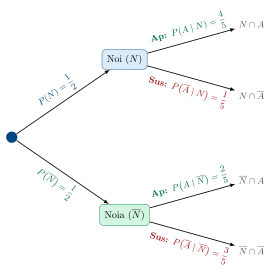
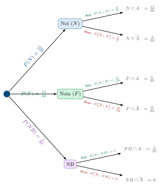

# Probabilitat: Exercicis

## Probabilitat

### Exercicis per practicar

> **📝 Exercici**
>
> 1 — Dau trucat Un dau està trucat, de manera que la probabilitat de treure un nombre *parell* és $0{,}67$. Sabent que $P\!\left(1\right) = P\!\left(3\right) = P\!\left(5\right)$, calcula la probabilitat de treure un 5.

Solució

La suma de les probabilitats dels nombres imparells és: $$P\!\left(1\right) + P\!\left(3\right) + P\!\left(5\right) = 1 - 0{,}67 = 0{,}33$$ Com que les tres probabilitats són iguals: $$3\cdot P\!\left(5\right) = 0{,}33 \quad\Rightarrow\quad \boxed{P\!\left(5\right) = 0{,}11}$$

> **📝 Exercici**
>
> 2 — Aficionats a l’esport En una escola, el 66% dels alumnes són aficionats al futbol i el 42% al bàsquet. El 27% ho és als dos esports. Calcula la probabilitat que un alumne triat a l’atzar **no sigui aficionat a cap dels dos esports**.

Solució

Definim $F$ = “aficionat al futbol”, $B$ = “aficionat al bàsquet”. $$P\!\left(F \cup B\right) = 0{,}66 + 0{,}42 - 0{,}27 = 0{,}81$$ $$P\!\left(\overline{F \cup B}\right) = 1 - 0{,}81 = \boxed{0{,}19}$$

> **📝 Exercici**
>
> 3 — Nombres primers i quadrats perfectes Es tria a l’atzar un nombre entre els 50 primers nombres naturals ($1, 2, \ldots, 50$). Calcula la probabilitat que sigui:
>
> 1.  Un nombre primer.
>
> 2.  Un quadrat perfecte.

Solució

L’espai mostral té $n(\Omega) = 50$ elements.

**a)** Els nombres primers entre 1 i 50 són: 2, 3, 5, 7, 11, 13, 17, 19, 23, 29, 31, 37, 41, 43, 47 $\Rightarrow$ 15 nombres. $$P\!\left(\text{primer}\right) = \frac{15}{50} = \frac{3}{10} = \boxed{0{,}30}$$

**b)** Els quadrats perfectes entre 1 i 50 són: 1, 4, 9, 16, 25, 36, 49 $\Rightarrow$ 7 nombres. $$P\!\left(\text{quadrat perfecte}\right) = \frac{7}{50} = \boxed{0{,}14}$$

> **📝 Exercici**
>
> 4 — PAU: Reunió d’homes i dones A una reunió assisteixen 32 homes i 48 dones. La meitat dels homes i la quarta part de les dones tenen 40 anys o més. Escollida una persona a l’atzar, calcula la probabilitat que:
>
> 1.  Sigui dona i menor de 40 anys.
>
> 2.  Sigui menor de 40 anys.

Solució

Total de persones: $32 + 48 = 80$.

Organitzem les dades:

|           | **$\geq 40$ anys** | **$< 40$ anys** |
|:----------|:------------------:|:---------------:|
| **Homes** |         16         |       16        |
| **Dones** |         12         |       36        |

**a)** Dones menors de 40 anys: 36. $$P\!\left(\text{dona i} < 40\right) = \frac{36}{80} = \frac{9}{20} = \boxed{0{,}45}$$

**b)** Menors de 40 anys: $16 + 36 = 52$. $$P\!\left(< 40\right) = \frac{52}{80} = \frac{13}{20} = \boxed{0{,}65}$$

> **📝 Exercici**
>
> 5 — Difícil: Monedes a la butxaca Porto a la butxaca dues monedes de $0{,}50$ €, dues de $0{,}20$ € i dues de $0{,}10$ €. Si perdo dues de les monedes que porto, calcula la probabilitat que hagi perdut:
>
> 1.  Exactament $1$ €.
>
> 2.  Menys de $0{,}40$ €.
>
> 3.  Més de $0{,}50$ €.

Solució

Tenim 6 monedes en total. El nombre de maneres de perdre’n 2 és: $$\binom{6}{2} = \frac{6!}{2!\cdot 4!} = 15 \quad \text{(casos possibles)}$$

**a) Perdre exactament $1$ €:** Només és possible perdent les dues monedes de $0{,}50$ €. $$\text{casos favorables} = \binom{2}{2} = 1 \qquad \Rightarrow \qquad P\!\left(1\,\text{€}\right) = \frac{1}{15}$$

**b) Perdre menys de $0{,}40$ €:** Les combinacions possibles són $0{,}10+0{,}10 = 0{,}20$ € i $0{,}10+0{,}20 = 0{,}30$ €. $$\binom{2}{2} + \binom{2}{1}\cdot\binom{2}{1} = 1 + 4 = 5 \qquad \Rightarrow \qquad P\!\left(< 0{,}40\,\text{€}\right) = \frac{5}{15} = \frac{1}{3}$$

**c) Perdre més de $0{,}50$ €:** Les combinacions que superen $0{,}50$ € són: $0{,}50+0{,}50=1$ €, $0{,}50+0{,}20=0{,}70$ € (× 4 combinacions) i $0{,}50+0{,}10=0{,}60$ € (× 4 combinacions). $$1 + 2\cdot\binom{2}{1}\cdot\binom{2}{1} = 1 + 8 = 9 \qquad \Rightarrow \qquad P\!\left(> 0{,}50\,\text{€}\right) = \frac{9}{15} = \frac{3}{5}$$

> **📝 Exercici**
>
> 6 — Difícil: Àlgebra de probabilitats De dos successos $A$ i $B$ sabem que: $$P\!\left(A\right) = 0{,}37 \qquad P\!\left(A \cup B\right) = 0{,}79 \qquad P\!\left(A \cap B\right) = 0{,}06$$
>
> 1.  Calcula $P\!\left(B\right)$ i $P\!\left(\overline{B}\right)$.
>
> 2.  Calcula $P\!\left(\overline{A} \cap B\right)$ (“$B$ però no $A$”).
>
> 3.  Són $A$ i $B$ independents? Raona la resposta.

Solució

**a)** Aïllem $P\!\left(B\right)$ de la fórmula de la unió: $$P\!\left(B\right) = P\!\left(A \cup B\right) - P\!\left(A\right) + P\!\left(A \cap B\right) = 0{,}79 - 0{,}37 + 0{,}06 = \boxed{0{,}48}$$ $$P\!\left(\overline{B}\right) = 1 - 0{,}48 = \boxed{0{,}52}$$

**b)** “$B$ però no $A$” és la part de $B$ que no comparteix amb $A$: $$P\!\left(\overline{A} \cap B\right) = P\!\left(B\right) - P\!\left(A \cap B\right) = 0{,}48 - 0{,}06 = \boxed{0{,}42}$$

**c)** Per a la independència cal que $P\!\left(A \cap B\right) = P\!\left(A\right) \cdot P\!\left(B\right)$: $$P\!\left(A\right) \cdot P\!\left(B\right) = 0{,}37 \cdot 0{,}48 = 0{,}1776 \neq 0{,}06 = P\!\left(A \cap B\right)$$ Per tant, $A$ i $B$ **no són independents**: el fet que passi un afecta la probabilitat de l’altre.

------------------------------------------------------------------------

### Exercicis: probabilitat condicionada i Bayes

> **📝 Exercici**
>
> 7 — Excursió a l’estació d’esquí En un institut el 65% dels alumnes són noies. El 90% dels alumnes de l’autobús petit sap esquiar, mentre que dels que van en autobús gran (65% del total) en saben el 60%. S’escull un alumne a l’atzar i **no sap esquiar**. Quina probabilitat hi ha que viatgi en l’autobús petit?

Solució

Definim: $G$ = “autobús gran”, $\overline{G}$ = “autobús petit”, $S$ = “sap esquiar”.

Dades: $P\!\left(G\right) = 0{,}65$, $P\!\left(\overline{G}\right) = 0{,}35$, $P\!\left(S \mid G\right) = 0{,}60$, $P\!\left(S \mid \overline{G}\right) = 0{,}90$.

**Probabilitat de no saber esquiar:** $$P\!\left(\overline{S}\right) = 0{,}65 \cdot 0{,}40 + 0{,}35 \cdot 0{,}10 = 0{,}260 + 0{,}035 = 0{,}295$$

**Bayes:** $$P\!\left(\overline{G} \mid \overline{S}\right) = \frac{0{,}35 \cdot 0{,}10}{0{,}295} = \frac{0{,}035}{0{,}295} \approx \boxed{0{,}119}$$

> **📝 Exercici**
>
> 8 — Cinema i gènere a l’institut En un institut, el 30% de l’alumnat són noies. El 40% de les noies va anar al cinema l’últim cap de setmana, i el 70% dels nois també hi va anar. Es tria un alumne a l’atzar. Quina és la probabilitat que hagi anat al cinema?

Solució

Definim: $N$ = “ser noia”, $C$ = “anar al cinema”.

Dades: $P\!\left(N\right) = 0{,}30$, $P\!\left(\overline{N}\right) = 0{,}70$, $P\!\left(C \mid N\right) = 0{,}40$, $P\!\left(C \mid \overline{N}\right) = 0{,}70$. $$P\!\left(C\right) = 0{,}30 \cdot 0{,}40 + 0{,}70 \cdot 0{,}70 = 0{,}12 + 0{,}49 = \boxed{0{,}61}$$

> **📝 Exercici**
>
> 9 — Difícil: Diagnòstic mèdic En una població, el 30% dels habitants pateix una malaltia. Una prova diagnòstica dona resultat $A$ (positiu) o $B$ (negatiu). Si el pacient té la malaltia, la probabilitat que la prova doni $A$ és del 90%. Si el pacient *no* té la malaltia, la probabilitat que doni $A$ és del 5%.
>
> 1.  Calcula la probabilitat que la prova doni resultat $B$.
>
> 2.  Sabent que el resultat ha estat $B$, quina probabilitat hi ha que el pacient **no** tingui la malaltia?

Solució

Definim: $M$ = “tenir la malaltia”.

Dades: $P\!\left(M\right) = 0{,}30$, $P\!\left(\overline{M}\right) = 0{,}70$, $P\!\left(A \mid M\right) = 0{,}90$, $P\!\left(A \mid \overline{M}\right) = 0{,}05$.

Per tant: $P\!\left(B \mid M\right) = 0{,}10$ i $P\!\left(B \mid \overline{M}\right) = 0{,}95$.

**a)** Probabilitat total de resultat $B$: $$P\!\left(B\right) = P\!\left(M\right)\cdot P\!\left(B \mid M\right) + P\!\left(\overline{M}\right)\cdot P\!\left(B \mid \overline{M}\right)
= 0{,}30 \cdot 0{,}10 + 0{,}70 \cdot 0{,}95 = 0{,}030 + 0{,}665 = \boxed{0{,}695}$$

**b)** Bayes — probabilitat de no tenir la malaltia donat resultat $B$: $$P\!\left(\overline{M} \mid B\right) = \frac{P\!\left(\overline{M}\right) \cdot P\!\left(B \mid \overline{M}\right)}{P\!\left(B\right)} = \frac{0{,}70 \cdot 0{,}95}{0{,}695} = \frac{0{,}665}{0{,}695} \approx \boxed{0{,}957}$$

*Interpretació:* Si la prova és negativa, hi ha un 95,7% de probabilitat que el pacient estigui sa. La prova és força fiable en sentit negatiu.

> **📝 Exercici**
>
> 10 — PAU: Tres robots a la cadena de muntatge En una cadena de muntatge, tres robots $A$, $B$ i $C$ solden peces. El robot $A$ solda el 18% de les peces amb probabilitat de defecte 0,002; el robot $B$ solda el 42% amb probabilitat de defecte 0,005; el robot $C$ solda el 40% restant amb probabilitat de defecte 0,001.
>
> 1.  Quin és el percentatge total de soldadures defectuoses?
>
> 2.  Si escollim una peça defectuosa, quina és la probabilitat que l’hagi soldat el robot $C$?

Solució

Definim $D$ = “soldadura defectuosa”.

**a)** Teorema de la probabilitat total: $$\begin{aligned}
P\!\left(D\right) &= P\!\left(A\right)\cdot P\!\left(D \mid A\right) + P\!\left(B\right)\cdot P\!\left(D \mid B\right) + P\!\left(C\right)\cdot P\!\left(D \mid C\right) \\
&= 0{,}18 \cdot 0{,}002 + 0{,}42 \cdot 0{,}005 + 0{,}40 \cdot 0{,}001 \\
&= 0{,}00036 + 0{,}00210 + 0{,}00040 = \boxed{0{,}00286 \approx 0{,}286\%}
\end{aligned}$$

**b)** Teorema de Bayes: $$P\!\left(C \mid D\right) = \frac{0{,}40 \cdot 0{,}001}{0{,}00286} = \frac{0{,}00040}{0{,}00286} \approx \boxed{0{,}140}$$ Malgrat que $C$ solda el 40% de les peces, la seva taxa de defecte tan baixa fa que només sigui responsable del 14% dels defectes.

------------------------------------------------------------------------

### Probabilitat condicionada combinada i Bayes avançat

Fins ara hem treballat el teorema de Bayes en situacions on les probabilitats condicionades ens les donaven directament. En els problemes reals de la PAU, però, sovint cal **calcular primer** algunes probabilitats condicionades a partir d’altres dades, i *després* aplicar Bayes. Aquesta combinació és la que genera més errors.

> **Esquema mental per atacar qualsevol problema de Bayes**
>
> 1.  **Identifica el sistema complet:** Quines són les “causes” o “orígens” possibles? ($A_1, A_2, \ldots$). Comprova que les seves probabilitats sumin 1.
>
> 2.  **Identifica l’efecte observat:** Quin és l’esdeveniment $B$ que “ja ha passat” i del qual volem treure informació?
>
> 3.  **Calcula $P\!\left(B\right)$ per probabilitat total:** $$P\!\left(B\right) = \sum_i P\!\left(A_i\right) \cdot P\!\left(B \mid A_i\right)$$
>
> 4.  **Aplica Bayes:** $$P\!\left(A_i \mid B\right) = \frac{P\!\left(A_i\right) \cdot P\!\left(B \mid A_i\right)}{P\!\left(B\right)}$$
>
> 5.  **Interpreta el resultat** en el context del problema.

> **✏️ Exemple**
>
> Bayes combinat — Dos antivirus independents Un ordinador està contaminat per un virus. S’executen dos antivirus $P_1$ i $P_2$ de manera independent. $P_1$ detecta el virus amb probabilitat $0{,}9$ i $P_2$ amb probabilitat $0{,}8$.
>
> **Quina és la probabilitat que el virus *no* sigui detectat per cap dels dos?**
>
> Definim: $D_1$ = “$P_1$ detecta el virus”, $D_2$ = “$P_2$ detecta el virus”.
>
> Com que actuen de manera **independent**: $$P\!\left(\overline{D_1} \cap \overline{D_2}\right) = P\!\left(\overline{D_1}\right) \cdot P\!\left(\overline{D_2}\right) = 0{,}1 \cdot 0{,}2 = \boxed{0{,}02}$$
>
> *Interpretació:* Hi ha un 2% de probabilitat que el virus passi desapercebut. Sembla poc, però en milions d’ordinadors representa un nombre molt gran de sistemes vulnerables.

> **✏️ Exemple**
>
> Bayes clàssic — Les tres monedes Disposem de tres monedes. La primera té **dues cares**; la segona és **equilibrada** ($p(\text{cara}) = \frac{1}{2}$); la tercera té $p(\text{cara}) = \frac{3}{10}$. Escollim una moneda a l’atzar i la llencem. Ha sortit **cara**. Quina és la probabilitat que la moneda escollida sigui la primera?
>
> **Pas 1 — Sistema complet i probabilitats:** $$P\!\left(M_1\right) = P\!\left(M_2\right) = P\!\left(M_3\right) = \frac{1}{3}$$ **Probabilitats condicionades de cara donada cada moneda:** $$P\!\left(C \mid M_1\right) = 1 \qquad P\!\left(C \mid M_2\right) = \frac{1}{2} \qquad P\!\left(C \mid M_3\right) = \frac{3}{10}$$
>
> **Pas 2 — Probabilitat total de cara:** $$P\!\left(C\right) = \frac{1}{3}\cdot 1 + \frac{1}{3}\cdot\frac{1}{2} + \frac{1}{3}\cdot\frac{3}{10}
= \frac{1}{3} + \frac{1}{6} + \frac{1}{10}
= \frac{10 + 5 + 3}{30} = \frac{18}{30} = \frac{3}{5}$$
>
> **Pas 3 — Bayes:** $$P\!\left(M_1 \mid C\right) = \frac{P\!\left(M_1\right) \cdot P\!\left(C \mid M_1\right)}{P\!\left(C\right)}
= \frac{\dfrac{1}{3} \cdot 1}{\dfrac{3}{5}}
= \frac{\dfrac{1}{3}}{\dfrac{3}{5}} = \frac{1}{3} \cdot \frac{5}{3} = \boxed{\frac{5}{9}}$$
>
> *Interpretació:* Malgrat que la moneda trucada només és una de tres, la probabilitat que sigui ella és $\frac{5}{9} \approx 55{,}6\%$: el fet d’haver obtingut cara fa que sigui la candidata més probable, perquè és l’única que garanteix cara en cada llançament.

> **✏️ Exemple**
>
> Bayes encadenat — Cistells de pomes D’un cistell amb 20 pomes (4 en mal estat) en cau una en un segon cistell que tenia 6 pomes en mal estat i 18 en bon estat. Escollim una poma del segon cistell i **és en bon estat**. Quina és la probabilitat que la poma que va caure del primer cistell fos **bona**?
>
> Aquí la dificultat és que la poma caiguda **canvia la composició** del segon cistell: és un Bayes on les probabilitats condicionades depenen de quin cas s’ha donat.
>
> **Sistema complet:**
>
> - $B_1$ = “la poma caiguda era bona” $\Rightarrow P\!\left(B_1\right) = \dfrac{16}{20} = \dfrac{4}{5}$
>
> - $\overline{B_1}$ = “la poma caiguda era en mal estat” $\Rightarrow P\!\left(\overline{B_1}\right) = \dfrac{4}{20} = \dfrac{1}{5}$
>
> **Composició del segon cistell segons cada cas:**
>
> | **Cas**                                  | **Segon cistell (25 pomes)** | $P\!\left(B_2 \mid \cdot\right)$ |
> |:-----------------------------------------|:----------------------------:|:--------------------------------:|
> | $B_1$ (va caure bona)                    |  19 bones + 6 en mal estat   |         $\dfrac{19}{25}$         |
> | $\overline{B_1}$ (va caure en mal estat) |  18 bones + 7 en mal estat   |         $\dfrac{18}{25}$         |
>
> **Probabilitat total** de treure una poma bona del segon cistell: $$P\!\left(B_2\right) = \frac{4}{5}\cdot\frac{19}{25} + \frac{1}{5}\cdot\frac{18}{25}
= \frac{76}{125} + \frac{18}{125} = \frac{94}{125}$$
>
> **Bayes:** $$P\!\left(B_1 \mid B_2\right) = \frac{P\!\left(B_1\right)\cdot P\!\left(B_2 \mid B_1\right)}{P\!\left(B_2\right)}
= \frac{\dfrac{4}{5}\cdot\dfrac{19}{25}}{\dfrac{94}{125}}
= \frac{\dfrac{76}{125}}{\dfrac{94}{125}} = \frac{76}{94} = \boxed{\frac{38}{47} \approx 0{,}809}$$
>
> *Interpretació:* Si la poma extreta del segon cistell és bona, hi ha un 80,9% de probabilitats que la poma que va caure del primer cistell també fos bona. Té sentit: si va caure una bona, el segon cistell té més bones i és més probable treure’n una de bona.

> **📝 Exercici**
>
> 11 — PAU: Examen tipus test En un examen tipus test una pregunta té 5 possibles respostes, una sola correcta. La probabilitat que un alumne **sàpiga** la resposta és $\frac{2}{3}$. Si la sap, l’encerta amb certesa; si **no** la sap, la tria a l’atzar entre les 5 opcions. Sabent que l’alumne ha **encertat** la pregunta, quina és la probabilitat que **realment la sabés**?

Solució

Definim: $S$ = “sap la resposta”, $E$ = “encerta la pregunta”.

**Dades:** $$P\!\left(S\right) = \frac{2}{3} \qquad P\!\left(\overline{S}\right) = \frac{1}{3} \qquad P\!\left(E \mid S\right) = 1 \qquad P\!\left(E \mid \overline{S}\right) = \frac{1}{5}$$

**Probabilitat total d’encertar:** $$P\!\left(E\right) = \frac{2}{3}\cdot 1 + \frac{1}{3}\cdot\frac{1}{5} = \frac{2}{3} + \frac{1}{15} = \frac{10}{15} + \frac{1}{15} = \frac{11}{15}$$

**Bayes:** $$P\!\left(S \mid E\right) = \frac{P\!\left(S\right)\cdot P\!\left(E \mid S\right)}{P\!\left(E\right)} = \frac{\dfrac{2}{3}\cdot 1}{\dfrac{11}{15}} = \frac{\dfrac{2}{3}}{\dfrac{11}{15}} = \frac{2}{3}\cdot\frac{15}{11} = \boxed{\frac{10}{11} \approx 0{,}909}$$

*Interpretació:* Si un alumne encerta, la probabilitat que realment ho sabés és del 90,9%. Gairebé tots els encerts provenen del coneixement real, no de la sort. Això confirma que el test és un instrument raonablement fiable.

> **📝 Exercici**
>
> 12 — PAU: Autobús gran i petit En un institut s’organitza una excursió a una estació d’esquí. El 65% dels alumnes viatja en autobús gran i el 35% en autobús petit. El 60% dels que van en autobús gran sap esquiar, i el 90% dels que van en autobús petit. S’escull un alumne a l’atzar i **no sap esquiar**.
>
> 1.  Quina és la probabilitat que viatgi en l’autobús petit?
>
> 2.  Si l’alumne **sap** esquiar, quina és la probabilitat que viatgi en l’autobús gran?

Solució

Definim: $G$ = “autobús gran”, $\overline{G}$ = “autobús petit”, $E$ = “sap esquiar”.

**Probabilitat total de no saber esquiar:** $$P\!\left(\overline{E}\right) = P\!\left(G\right)\cdot P\!\left(\overline{E} \mid G\right) + P\!\left(\overline{G}\right)\cdot P\!\left(\overline{E} \mid \overline{G}\right)
= 0{,}65\cdot 0{,}40 + 0{,}35\cdot 0{,}10 = 0{,}260 + 0{,}035 = 0{,}295$$

**a)** Bayes — autobús petit donat que no sap esquiar: $$P\!\left(\overline{G} \mid \overline{E}\right) = \frac{0{,}35\cdot 0{,}10}{0{,}295} = \frac{0{,}035}{0{,}295} \approx \boxed{0{,}119}$$

**Probabilitat total de saber esquiar:** $$P\!\left(E\right) = 1 - 0{,}295 = 0{,}705$$

**b)** Bayes — autobús gran donat que sap esquiar: $$P\!\left(G \mid E\right) = \frac{P\!\left(G\right)\cdot P\!\left(E \mid G\right)}{P\!\left(E\right)} = \frac{0{,}65\cdot 0{,}60}{0{,}705} = \frac{0{,}390}{0{,}705} \approx \boxed{0{,}553}$$ *Nota:* Dels que saben esquiar, el 55,3% viatja en l’autobús gran (que és el majoritari) i el 44,7% en el petit, on proporcionalment n’hi ha molts més que saben esquiar.

> **⚠️ Atenció**
>
> **L’error més freqüent en problemes de Bayes combinat:** confondre $P\!\left(A \mid B\right)$ amb $P\!\left(B \mid A\right)$.
>
> Al problema de l’examen tipus test: $$P\!\left(E \mid S\right) = 1 \neq P\!\left(S \mid E\right) = \frac{10}{11}$$ La primera diu: “si saps la resposta, l’encertes segur”. La segona diu: “si has encertat, probablement la sabies”. Són preguntes **completament diferents** i el teorema de Bayes serveix precisament per passar de l’una a l’altra.

------------------------------------------------------------------------

## Probabilitat condicionada: exercici de classe

**La nostra classe de Matemàtiques**  
Un exercici complet de probabilitat condicionada  
2n Batxillerat · Probabilitat

------------------------------------------------------------------------

Tenim una classe de **30 alumnes** dels quals sabem el sexe i si han aprovat o suspès l’últim examen de Matemàtiques. Les dades són les següents:

|               | **Han aprovat** | **Han suspès** | **Total** |     |
|:--------------|:---------------:|:--------------:|:---------:|:---:|
| **Nois**      |       12        |       3        |    15     |     |
| **Noies**     |        6        |       9        |    15     |     |
| ****Total**** |       18        |       12       |  **30**   |     |

Treballarem aquesta taula des de **zero**, construint a poc a poc tots els conceptes. Segueix l’ordre dels apartats.

### Notació i probabilitats bàsiques (Regla de Laplace)

Definim els nostres esdeveniments: $$N = \text{``l'alumne escollit és noi''} \qquad
A = \text{``l'alumne escollit ha aprovat''}$$ i els seus complementaris: $$\overline{N} = \text{``és noia''} \qquad \overline{A} = \text{``ha suspès''}$$

> **📝 Exercici**
>
> Apartat 1 — Probabilitats bàsiques Calcula directament de la taula:
>
> 1.  $P\!\left(N\right)$, $P\!\left(\overline{N}\right)$, $P\!\left(A\right)$, $P\!\left(\overline{A}\right)$
>
> 2.  $P\!\left(N \cap A\right)$, $P\!\left(N \cap \overline{A}\right)$, $P\!\left(\overline{N} \cap A\right)$, $P\!\left(\overline{N} \cap \overline{A}\right)$

Solució

Apartat 1 **a)** Directament de la taula (Regla de Laplace, total = 30): $$P\!\left(N\right) = \frac{15}{30} = \frac{1}{2} \qquad
P\!\left(\overline{N}\right) = \frac{15}{30} = \frac{1}{2}$$ $$P\!\left(A\right) = \frac{18}{30} = \frac{3}{5} \qquad
P\!\left(\overline{A}\right) = \frac{12}{30} = \frac{2}{5}$$

**b)** Les interseccions corresponen a cada cel·la de la taula:

|                           |                          **$A$ (aprovat)**                           |                           **$\overline{A}$ (suspès)**                            |
|:--------------------------|:--------------------------------------------------------------------:|:--------------------------------------------------------------------------------:|
| **$N$ (noi)**             |      $P\!\left(N \cap A\right) = \dfrac{12}{30} = \dfrac{2}{5}$      |      $P\!\left(N \cap \overline{A}\right) = \dfrac{3}{30} = \dfrac{1}{10}$       |
| **$\overline{N}$ (noia)** | $P\!\left(\overline{N} \cap A\right) = \dfrac{6}{30} = \dfrac{1}{5}$ | $P\!\left(\overline{N} \cap \overline{A}\right) = \dfrac{9}{30} = \dfrac{3}{10}$ |

**Comprovació:** La suma de les quatre interseccions ha de ser 1: $\dfrac{2}{5} + \dfrac{1}{10} + \dfrac{1}{5} + \dfrac{3}{10} = \dfrac{4+1+2+3}{10} = \dfrac{10}{10} = 1$

### Probabilitat condicionada

> **📘 Teoria**
>
> La probabilitat condicionada $P\!\left(A \mid B\right)$ respon a la pregunta: *“Si ja sé que ha passat $B$, quina és la probabilitat que passi $A$?”* $$P\!\left(A \mid B\right) = \frac{P\!\left(A \cap B\right)}{P\!\left(B\right)}$$ En termes pràctics: **restringim** l’espai mostral al grup $B$ i comptem dins d’ell.

> **📝 Exercici**
>
> Apartat 2 — Probabilitat condicionada
>
> 1.  Calcula $P\!\left(A \mid N\right)$: probabilitat d’haver aprovat, **sabent que és noi**.
>
> 2.  Calcula $P\!\left(A \mid \overline{N}\right)$: probabilitat d’haver aprovat, **sabent que és noia**.
>
> 3.  Calcula $P\!\left(N \mid A\right)$: probabilitat que sigui noi, **sabent que ha aprovat**.
>
> 4.  Calcula $P\!\left(N \mid \overline{A}\right)$: probabilitat que sigui noi, **sabent que ha suspès**.

Solució

Apartat 2

**a)** Ens quedem *només* amb els 15 nois i mirem quants han aprovat: $$P\!\left(A \mid N\right) = \frac{P\!\left(A \cap N\right)}{P\!\left(N\right)} = \frac{12/30}{15/30} = \frac{12}{15} = \boxed{\frac{4}{5}}$$ *Interpretació: el 80% dels nois ha aprovat.*

**b)** Ens quedem *només* amb les 15 noies: $$P\!\left(A \mid \overline{N}\right) = \frac{P\!\left(A \cap \overline{N}\right)}{P\!\left(\overline{N}\right)} = \frac{6/30}{15/30} = \frac{6}{15} = \boxed{\frac{2}{5}}$$ *Interpretació: només el 40% de les noies ha aprovat.*

**c)** Ara ens quedem *només* amb els 18 alumnes que han aprovat: $$P\!\left(N \mid A\right) = \frac{P\!\left(N \cap A\right)}{P\!\left(A\right)} = \frac{12/30}{18/30} = \frac{12}{18} = \boxed{\frac{2}{3}}$$ *Interpretació: 2 de cada 3 alumnes que han aprovat són nois.*

**d)** Ens quedem *només* amb els 12 alumnes que han suspès: $$P\!\left(N \mid \overline{A}\right) = \frac{P\!\left(N \cap \overline{A}\right)}{P\!\left(\overline{A}\right)} = \frac{3/30}{12/30} = \frac{3}{12} = \boxed{\frac{1}{4}}$$ *Interpretació: entre els suspesos, només 1 de cada 4 és noi.*

> **⚠️ Atenció**
>
> Fixeu-vos que $P\!\left(A \mid N\right) \neq P\!\left(N \mid A\right)$. Aquestes dues probabilitats **no són el mateix**:
>
> - $P\!\left(A \mid N\right) = \dfrac{4}{5}$: probabilitat d’aprovar *si ets noi*.
>
> - $P\!\left(N \mid A\right) = \dfrac{2}{3}$: probabilitat de ser noi *si has aprovat*.
>
> Canviar l’ordre de les condicions canvia completament el resultat!

### La regla del producte i el diagrama d’arbre

> **📘 Teoria**
>
> De la fórmula de la probabilitat condicionada s’obté la **regla del producte**: $$P\!\left(A \cap B\right) = P\!\left(B\right) \cdot P\!\left(A \mid B\right)$$ Això és la base del **diagrama d’arbre**: cada branca terminal té probabilitat igual al *producte de totes les branques del camí*.

Construïm el diagrama d’arbre per a la nostra classe. La primera bifurcació és el sexe, la segona és si ha aprovat o no:

> **📝 Exercici**
>
> Apartat 3 — Regla del producte Usa l’arbre per calcular les quatre probabilitats de les branques terminals i comprova que sumen 1.

Solució

Apartat 3 Multipliquem les probabilitats de cada camí:

| **Branca terminal**                              | **Càlcul**                         |      **Fracció**      | **Alumnes** |
|:-------------------------------------------------|:-----------------------------------|:---------------------:|:-----------:|
| $P\!\left(N \cap A\right)$                       | $\dfrac{1}{2} \times \dfrac{4}{5}$ |    $\dfrac{2}{5}$     |     12      |
| $P\!\left(N \cap \overline{A}\right)$            | $\dfrac{1}{2} \times \dfrac{1}{5}$ |    $\dfrac{1}{10}$    |      3      |
| $P\!\left(\overline{N} \cap A\right)$            | $\dfrac{1}{2} \times \dfrac{2}{5}$ |    $\dfrac{1}{5}$     |      6      |
| $P\!\left(\overline{N} \cap \overline{A}\right)$ | $\dfrac{1}{2} \times \dfrac{3}{5}$ |    $\dfrac{3}{10}$    |      9      |
| **Suma**                                         |                                    | $\dfrac{4+1+2+3}{10}$ |     30      |

La suma és $\dfrac{10}{10} = 1$ i recuperem exactament la taula inicial.

### Teorema de la probabilitat total

> **📝 Exercici**
>
> Apartat 4 — Probabilitat total Sense mirar la taula directament, calcula $P\!\left(A\right)$ (probabilitat d’aprovar) usant el teorema de la probabilitat total a partir de l’arbre.

Solució

Apartat 4 Les dues “vies” per arribar a $A$ (aprovar) són: passant per $N$ (noi) o per $\overline{N}$ (noia). Sumem les dues branques terminals que acaben en aprovat: $$P\!\left(A\right) = P\!\left(N\right) \cdot P\!\left(A \mid N\right) \;+\; P\!\left(\overline{N}\right) \cdot P\!\left(A \mid \overline{N}\right)$$ $$P\!\left(A\right) = \frac{1}{2} \cdot \frac{4}{5} \;+\; \frac{1}{2} \cdot \frac{2}{5}
= \frac{2}{5} + \frac{1}{5} = \boxed{\frac{3}{5}}$$ *Coincideix exactament amb el que llegim directament a la taula: $18/30 = 3/5$.*

### Independència d’esdeveniments

> **📘 Teoria**
>
> $A$ i $B$ són **independents** si saber que ha passat $B$ *no canvia* la probabilitat de $A$: $$A \perp B \iff P\!\left(A \mid B\right) = P\!\left(A\right) \iff P\!\left(A \cap B\right) = P\!\left(A\right) \cdot P\!\left(B\right)$$ Qualsevol de les tres condicions és equivalent. N’hi ha prou de comprovar-ne una.

> **📝 Exercici**
>
> Apartat 5 — Independència Són independents el sexe i el fet d’aprovar? És a dir, **el ser noi o noia influeix en la probabilitat d’aprovar?** Comprova-ho de dues maneres.

Solució

Apartat 5

**Mètode 1 — Comparant probabilitats condicionades amb la global:**

Si fossin independents, hauria de complir-se que $P\!\left(A \mid N\right) = P\!\left(A\right)$: $$P\!\left(A \mid N\right) = \frac{4}{5} = 0{,}8 \qquad \text{vs} \qquad P\!\left(A\right) = \frac{3}{5} = 0{,}6$$ Com que $\dfrac{4}{5} \neq \dfrac{3}{5}$, **no són independents**.

**Mètode 2 — Comprovant si $P\!\left(N \cap A\right) = P\!\left(N\right) \cdot P\!\left(A\right)$:** $$P\!\left(N\right) \cdot P\!\left(A\right) = \frac{1}{2} \cdot \frac{3}{5} = \frac{3}{10} \qquad \text{vs} \qquad P\!\left(N \cap A\right) = \frac{12}{30} = \frac{2}{5} = \frac{4}{10}$$ Com que $\dfrac{3}{10} \neq \dfrac{4}{10}$, confirmem que **no són independents**.

**Interpretació:** El sexe *sí* que influeix en la probabilitat d’aprovar. Els nois aproven més (80%) que la mitjana de la classe (60%), mentre que les noies aproven menys (40%). Tenir informació sobre el sexe *canvia* la nostra predicció sobre si l’alumne ha aprovat.

### Complementaris i unions

> **📝 Exercici**
>
> Apartat 6 — Complementaris i unions
>
> 1.  Calcula $P\!\left(N \cup A\right)$: probabilitat que l’alumne sigui noi **o** hagi aprovat (o les dues coses).
>
> 2.  Calcula $P\!\left(\overline{N \cup A}\right)$: probabilitat que **no** sigui noi **i** tampoc hagi aprovat.
>
> 3.  Comprova que l’apartat b) coincideix amb $P\!\left(\overline{N} \cap \overline{A}\right)$ de la taula.

Solució

Apartat 6 **a)** Fórmula de la unió: $$P\!\left(N \cup A\right) = P\!\left(N\right) + P\!\left(A\right) - P\!\left(N \cap A\right)
= \frac{1}{2} + \frac{3}{5} - \frac{2}{5}
= \frac{5}{10} + \frac{6}{10} - \frac{4}{10} = \boxed{\frac{7}{10}}$$ *El 70% dels alumnes és noi o ha aprovat (o les dues coses).*

**b)** Pel complementari de la unió (llei de De Morgan: $\overline{N \cup A} = \overline{N} \cap \overline{A}$): $$P\!\left(\overline{N \cup A}\right) = 1 - P\!\left(N \cup A\right) = 1 - \frac{7}{10} = \boxed{\frac{3}{10}}$$

**c)** De la taula: les alumnes que *no* són nois i han *suspès* (noies suspeses) són 9: $$P\!\left(\overline{N} \cap \overline{A}\right) = \frac{9}{30} = \frac{3}{10} \checkmark$$

### Resum visual de tots els resultats

| **Probabilitat**                                                     |   **Fracció**   | **Decimal** |
|:---------------------------------------------------------------------|:---------------:|:-----------:|
| $P\!\left(N\right)$ (ser noi)                                        | $\dfrac{1}{2}$  |   $0{,}5$   |
| $P\!\left(A\right)$ (aprovar)                                        | $\dfrac{3}{5}$  |   $0{,}6$   |
| $P\!\left(N \cap A\right)$ (noi i aprovat)                           | $\dfrac{2}{5}$  |   $0{,}4$   |
| $P\!\left(N \cup A\right)$ (noi o aprovat)                           | $\dfrac{7}{10}$ |   $0{,}7$   |
| $P\!\left(A \mid N\right)$ (aprovar sabent que és noi)               | $\dfrac{4}{5}$  |   $0{,}8$   |
| $P\!\left(A \mid \overline{N}\right)$ (aprovar sabent que és noia)   | $\dfrac{2}{5}$  |   $0{,}4$   |
| $P\!\left(N \mid A\right)$ (ser noi sabent que ha aprovat)           | $\dfrac{2}{3}$  |  $0{,}667$  |
| $P\!\left(N \mid \overline{A}\right)$ (ser noi sabent que ha suspès) | $\dfrac{1}{4}$  |  $0{,}25$   |
|                                                                      |                 |             |

### Exercicis addicionals

> **📝 Exercici**
>
> Extra 1 Escollim un alumne a l’atzar. Sabem que **ha suspès**. Quina és la probabilitat que sigui noia?

Solució

Extra 1 $$P\!\left(\overline{N} \mid \overline{A}\right) = \frac{P\!\left(\overline{N} \cap \overline{A}\right)}{P\!\left(\overline{A}\right)}
= \frac{9/30}{12/30} = \frac{9}{12} = \boxed{\frac{3}{4}}$$ El 75% dels alumnes suspesos són noies.

> **📝 Exercici**
>
> Extra 2 Construeix l’arbre en ordre invers: primer la bifurcació **aprovat/suspès**, i després **noi/noia**. Calcula $P\!\left(N\right)$ usant el teorema de la probabilitat total i comprova que segueix sent $\dfrac{1}{2}$.

Solució

Extra 2 Les dades per a aquest arbre invers: $$P\!\left(A\right) = \frac{3}{5}, \quad P\!\left(\overline{A}\right) = \frac{2}{5}, \quad
P\!\left(N \mid A\right) = \frac{2}{3}, \quad P\!\left(N \mid \overline{A}\right) = \frac{1}{4}$$ $$P\!\left(N\right) = P\!\left(A\right) \cdot P\!\left(N \mid A\right) + P\!\left(\overline{A}\right) \cdot P\!\left(N \mid \overline{A}\right)
= \frac{3}{5} \cdot \frac{2}{3} + \frac{2}{5} \cdot \frac{1}{4}
= \frac{2}{5} + \frac{1}{10} = \frac{4}{10} + \frac{1}{10} = \boxed{\frac{1}{2}} \checkmark$$ *L’ordre de l’arbre no importa: el resultat final és sempre el mateix.*

> **📝 Exercici**
>
> Extra 3 — Difícil Si triem **dos alumnes a l’atzar** (sense reposició), quina és la probabilitat que tots dos hagin aprovat?

Solució

Extra 3 Aquí intervé la probabilitat condicionada per la reposició. El primer alumne s’escull entre 30 i el segon entre els 29 restants: $$P\!\left(A_1 \cap A_2\right) = P\!\left(A_1\right) \cdot P\!\left(A_2 \mid A_1\right)
= \frac{18}{30} \cdot \frac{17}{29}
= \frac{18 \times 17}{30 \times 29} = \frac{306}{870} = \boxed{\frac{51}{145} \approx 0{,}352}$$ *Si haguéssim considerat les dues eleccions independents (amb reposició), el resultat seria $\left(\dfrac{3}{5}\right)^2 = \dfrac{9}{25} = 0{,}36$, molt proper però no igual.*

> **💡 Connexió**
>
> **Tots els conceptes que hem treballat amb un sol exemple:**
>
> lp9cm **Laplace** & Probabilitats bàsiques directament de la taula  
> **Intersecció** $P\!\left(A \cap B\right)$ & Cada cel·la de la taula  
> **Unió** $P\!\left(A \cup B\right)$ & Suma de files/columnes menys la intersecció  
> **Complementari** & Canviar de fila/columna o restar d’1  
> **Prob. condicionada** & Restringir l’espai mostral a una fila o columna  
> **Regla del producte** & Multiplicar les branques de l’arbre  
> **Prob. total** & Sumar les branques que arriben al mateix resultat  
> **Independència** & Comprovar si condicionar canvia o no la probabilitat  

------------------------------------------------------------------------

### Reflexió: i si una alumna es declara no binària?

Suposem que una de les 15 alumnes classificades com a “noia” ens diu que **no s’identifica ni com a noi ni com a noia**. Aquesta situació té conseqüències matemàtiques concretes que val la pena entendre.

> **El canvi fonamental: el complementari ja no funciona igual**
>
> Amb **dues categories** (noi / noia), teníem: $$\overline{N} = \text{``no és noi''} = \text{``és noia''} \qquad \Rightarrow \qquad P\!\left(\overline{N}\right) = 1 - P\!\left(N\right)$$ Això funcionava perquè les dues categories eren *exhaustives* (o ets noi o ets noia, no hi havia més opcions) i *excloents* (no podies ser les dues coses).
>
> Ara, amb una persona no binària ($NB$), tenim **tres categories**: $$N = \text{``noi''} \qquad \overline{N} = \text{``no és noi''} = \text{noia \textbf{o} no binari}$$ El complementari $\overline{N}$ ara **agrupa dues coses diferents**. Si ens interessa distingir-les, hem d’usar tres esdeveniments separats: $$N, \quad F \;(\text{noia}), \quad NB \;(\text{no binari})$$ i llavors: $P\!\left(N\right) + P\!\left(F\right) + P\!\left(NB\right) = 1$, però **cap dels tres és el complementari de l’altre**.

#### La nova taula (suposem que l’alumna NB va aprovar)

Suposem que l’alumna no binària havia aprovat. Llavors la taula original canvia així:

|               | **Han aprovat** | **Han suspès** | **Total** |     |
|:--------------|:---------------:|:--------------:|:---------:|:---:|
| **Nois**      |       12        |       3        |    15     |     |
| **Noies**     |        5        |       9        |    14     |     |
| **No binari** |        1        |       0        |     1     |     |
| ****Total**** |       18        |       12       |  **30**   |     |

Fixeu-vos que el **total d’aprovats i suspesos no canvia** (segueix sent 18 i 12), però la distribució per gènere sí.

#### Què canvia i què no canvia?

| **Probabilitat**                                        |            **Abans**            |             **Ara**              | **Canvia?** |
|:--------------------------------------------------------|:-------------------------------:|:--------------------------------:|:------------|
| $P\!\left(A\right)$ (aprovar)                           | $\dfrac{18}{30} = \dfrac{3}{5}$ | $\dfrac{18}{30} = \dfrac{3}{5}$  | **NO**      |
| $P\!\left(N\right)$ (ser noi)                           | $\dfrac{15}{30} = \dfrac{1}{2}$ | $\dfrac{15}{30} = \dfrac{1}{2}$  | **NO**      |
| $P\!\left(F\right)$ (ser noia)                          | $\dfrac{15}{30} = \dfrac{1}{2}$ | $\dfrac{14}{30} = \dfrac{7}{15}$ | **SÍ**      |
| $P\!\left(\overline{N}\right)$ (“no noi”)               | $\dfrac{15}{30} = \dfrac{1}{2}$ | $\dfrac{15}{30} = \dfrac{1}{2}$  | **NO**      |
| $P\!\left(A \mid N\right)$ (ap. si noi)                 | $\dfrac{12}{15} = \dfrac{4}{5}$ | $\dfrac{12}{15} = \dfrac{4}{5}$  | **NO**      |
| $P\!\left(A \mid F\right)$ (ap. si noia)                | $\dfrac{6}{15} = \dfrac{2}{5}$  |         $\dfrac{5}{14}$          | **SÍ**      |
| $P\!\left(A \mid \overline{N}\right)$ (ap. si “no noi”) | $\dfrac{6}{15} = \dfrac{2}{5}$  |  $\dfrac{6}{15} = \dfrac{2}{5}$  | **NO**$^*$  |
| $P\!\left(NB\right)$ (ser no binari)                    |                —                |         $\dfrac{1}{30}$          | *nova*      |
| $P\!\left(A \mid NB\right)$ (ap. si NB)                 |                —                |        $\dfrac{1}{1} = 1$        | *nova*      |

$^*$Perquè $\overline{N}$ ara inclou la persona NB (que ha aprovat) i una noia menys (que hauria aprovat). En aquest cas concret, la probabilitat condicionada no canvia, però això **depèn dels números concrets** del problema, no és sempre així.

> **La lliçó matemàtica: sistema complet d’esdeveniments**
>
> Quan tenim **més de dues categories**, hem de treballar amb un **sistema complet d’esdeveniments**: un conjunt de categories que:
>
> - Són **mútuament excloents**: ningú pertany a dues categories alhora.
>
> - Són **exhaustives**: tothom pertany a alguna categoria.
>
> Amb dues categories: $\{N, \overline{N}\}$ és un sistema complet. Podem usar el complementari lliurement.
>
> Amb tres categories: $\{N, F, NB\}$ és el sistema complet. Ara: $$P\!\left(N\right) + P\!\left(F\right) + P\!\left(NB\right) = 1$$ $$P\!\left(A\right) = P\!\left(N\right)\cdot P\!\left(A \mid N\right) + P\!\left(F\right)\cdot P\!\left(A \mid F\right) + P\!\left(NB\right)\cdot P\!\left(A \mid NB\right)$$
>
> El teorema de la probabilitat total i el teorema de Bayes **funcionen igual**, simplement sumem **tantes branques com categories tinguem**.
>
> **Resum pràctic:**
>
> - Si treballes amb $\overline{N}$ (“no noi”), inclous la persona NB dins $\overline{N}$: **tot funciona igual**.
>
> - Si vols tractar NB com a categoria pròpia, **cal afegir una branca més** a l’arbre i una fila més a la taula.
>
> - En cap cas es “trenca” la matemàtica: simplement el model s’adapta a la realitat.

#### Com quedaria l’arbre amb tres categories?

**Comprovació final** — probabilitat total d’aprovar amb tres categories: $$P\!\left(A\right) = \frac{15}{30}\cdot\frac{4}{5} + \frac{14}{30}\cdot\frac{5}{14} + \frac{1}{30}\cdot 1
= \frac{12}{30} + \frac{5}{30} + \frac{1}{30} = \frac{18}{30} = \frac{3}{5} \checkmark$$
