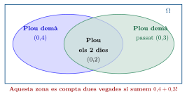
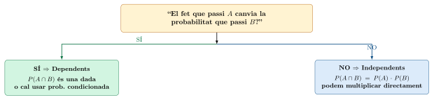
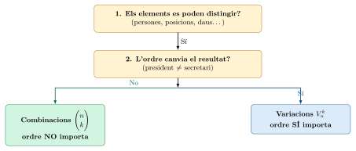
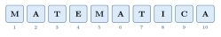
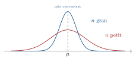

# Probabilitat

**PROBABILITAT**  
2n Batxillerat  
Matemàtiques II

------------------------------------------------------------------------

La probabilitat és la branca de les matemàtiques que estudia la incertesa. Quan no sabem amb seguretat quin serà el resultat d’una situació, la probabilitat ens dóna una mesura de com de probable és cadascun dels possibles resultats. La fem servir cada dia: al temps, als jocs de cartes, a la medicina, a les assegurances…

## Conceptes bàsics

> **📘 Teoria**
>
> **Experiment aleatori:** Qualsevol acció el resultat de la qual no podem predir amb certesa. Per exemple: llançar un dau, treure una carta d’una baralla, o saber si plourà demà.
>
> **Espai mostral** $\Omega$: El conjunt de *tots* els resultats possibles d’un experiment aleatori.
>
> **Esdeveniment:** Qualsevol subconjunt de l’espai mostral. És a dir, qualsevol resultat o grup de resultats que ens interessi estudiar.

> **✏️ Exemple**
>
> Llançar un dau Llencem un dau de 6 cares. Identifiquem els elements bàsics:
>
> - **Experiment aleatori:** llançar el dau.
>
> - **Espai mostral:** $\Omega = \{1, 2, 3, 4, 5, 6\}$
>
> - **Exemple d’esdeveniment $A$:** “obtenir un nombre parell” $\Rightarrow A = \{2, 4, 6\}$
>
> - **Exemple d’esdeveniment $B$:** “obtenir un nombre major que 4” $\Rightarrow B = \{5, 6\}$

## Propietats de la probabilitat

La probabilitat és un nombre entre 0 i 1 que assignem a cada esdeveniment. Com més proper a 1, més probable és. Com més proper a 0, menys probable.

> **📘 Propietat**
>
> Propietats fonamentals Sigui $A$ un esdeveniment qualsevol de l’espai mostral $\Omega$:
>
> @p7cmp6cm@ **Esdeveniment segur** $\Omega$ & $P\!\left(\Omega\right) = 1$  
> **Esdeveniment impossible** $\emptyset$ & $P\!\left(\emptyset\right) = 0$  
> **Complementari** $\overline{A}$ (“no $A$”) & $P\!\left(\overline{A}\right) = 1 - P\!\left(A\right)$  
> **Unió** $A \cup B$ (“$A$ o $B$”) & $P\!\left(A \cup B\right) = P\!\left(A\right) + P\!\left(B\right) - P\!\left(A \cap B\right)$  

> **Per què es resta $\mathbf{P(A \cap B)}$? La intuïció darrere la fórmula**
>
> **El problema de la pluja:** Sabem que la probabilitat que demà plogui és $0{,}4$; que plogui demà passat és $0{,}3$; i que plogui *els dos dies alhora*, $0{,}2$.
>
> *Quina és la probabilitat que plogui **com a mínim un** dels dos dies?*
>
> Un alumne podria pensar: *“sumo $0{,}4 + 0{,}3 = 0{,}7$ i ja està”*. Però aquí hi ha un error: **estem comptant dues vegades** la situació en què plou els dos dies!
>
> Imagina que totes les situacions possibles les poses dins d’un rectangle:
>
> 
>
> **La solució:** quan sumes $P\!\left(A\right) + P\!\left(B\right)$, la zona del mig (plou els dos dies) entra *una vegada* per $A$ i *una altra vegada* per $B$. Per tant, l’has comptada **dues vegades**, i n’has de treure una:
>
> $$P\!\left(A \cup B\right) = \underbrace{0{,}4}_{\text{plou demà}} + \underbrace{0{,}3}_{\text{plou demà passat}} - \underbrace{0{,}2}_{\substack{\text{trèiem el que} \\ \text{hem comptat dues vegades}}} = \boxed{0{,}5}$$
>
> **Resum visual del que representa cada zona:**
>
> |  **Zona**  | **Significat**                |             **Probabilitat**             |
> |:----------:|:------------------------------|:----------------------------------------:|
> | Només $A$  | Plou demà però NO demà passat |         $0{,}4 - 0{,}2 = 0{,}2$          |
> | Només $B$  | Plou demà passat però NO demà |         $0{,}3 - 0{,}2 = 0{,}1$          |
> | $A \cap B$ | Plou els dos dies             |                 $0{,}2$                  |
> | $A \cup B$ | Plou **almenys** un dia       | $0{,}2 + 0{,}1 + 0{,}2 = \mathbf{0{,}5}$ |
>
> *Sumant les tres zones separades (sense solapament) obtenim el mateix resultat. La fórmula $P\!\left(A\right) + P\!\left(B\right) - P\!\left(A \cap B\right)$ és simplement una drecera per fer aquest càlcul.*

> **Pregunta clau: quan val $\mathbf{P(A \cap B) = P(A) \cdot P(B)}$ i quan no?**
>
> Aquesta és una de les confusions més habituals. La resposta curta és:
>
> \|p5.5cm\|p7.5cm\| **Situació** & **Com calculem $P\!\left(A \cap B\right)$?**  
> $A$ i $B$ **independents** (un no afecta l’altre) & $P\!\left(A \cap B\right) = P\!\left(A\right) \cdot P\!\left(B\right)$ Podem multiplicar directament.  
> $A$ i $B$ **dependents** (un sí afecta l’altre) & $P\!\left(A \cap B\right)$ **ens la donen** al problema, o cal calcular-la per un altre camí.  
>
> **Exemple 1 — Independents (podem multiplicar):**
>
> Llancem una moneda i un dau. Definim:
>
> - $A$ = “surt cara” $\Rightarrow P\!\left(A\right) = 0{,}5$
>
> - $B$ = “surt 6 al dau” $\Rightarrow P\!\left(B\right) = \frac{1}{6}$
>
> El resultat de la moneda **no té res a veure** amb el resultat del dau. Són independents. Per tant: $$P\!\left(A \cap B\right) = P\!\left(A\right) \cdot P\!\left(B\right) = 0{,}5 \cdot \frac{1}{6} = \frac{1}{12} \approx 0{,}083$$
>
> **Exemple 2 — Dependents (NO podem multiplicar):**
>
> El temps de demà i demà passat. Definim:
>
> - $A$ = “plou demà” $\Rightarrow P\!\left(A\right) = 0{,}4$
>
> - $B$ = “plou demà passat” $\Rightarrow P\!\left(B\right) = 0{,}3$
>
> Si avui plou, és **més probable** que demà passat també plogui (les borrasques duren dies). El temps d’un dia **influeix** en el del dia següent: $A$ i $B$ són **dependents**.
>
> Si intentéssim multiplicar: $P\!\left(A\right) \cdot P\!\left(B\right) = 0{,}4 \cdot 0{,}3 = 0{,}12$. Però el problema ens diu que $P\!\left(A \cap B\right) = 0{,}2$. Són valors **diferents** perquè **no podem multiplicar**.
>
> En aquest cas, $P\!\left(A \cap B\right) = 0{,}2$ és una dada que **ens dóna el problema** (obtinguda, per exemple, de dades meteorològiques històriques), no una cosa que puguem deduir multiplicant.
>
> **La pregunta que t’has de fer sempre:**
>
> 
>
> **Més exemples per entrenar la intuïció:**
>
> p6.5cm c p4cm **Situació** & **Relació** & **Per què?**  
> Treure dues cartes *amb* reposició & Independents & La 2a extracció no depèn de la 1a  
> Treure dues cartes *sense* reposició & Dependents & La 1a carta canvia les que queden  
> Llançar dos daus & Independents & Un dau no afecta l’altre  
> Nota del primer examen i del segon & Dependents & L’esforç, l’estudiant… influeixen  
> Tenir cotxe i tenir febre avui & Independents & No hi ha relació entre els dos  
> Fumar i tenir càncer de pulmó & Dependents & Un factor clarament influeix en l’altre  

> **✏️ Exemple**
>
> Propietats — Calcular la intersecció a partir de la unió Dos successos $A$ i $B$ compleixen: $$P\!\left(A\right) = 0{,}58 \qquad P\!\left(B\right) = 0{,}42 \qquad P\!\left(A \cup B\right) = 0{,}80$$ Calcula $P\!\left(A \cap B\right)$ i indica si $A$ i $B$ són incompatibles.
>
> **Resolució:** Apliquem la fórmula de la unió i aïllem $P\!\left(A \cap B\right)$: $$P\!\left(A \cup B\right) = P\!\left(A\right) + P\!\left(B\right) - P\!\left(A \cap B\right)$$ $$0{,}80 = 0{,}58 + 0{,}42 - P\!\left(A \cap B\right)$$ $$\boxed{P\!\left(A \cap B\right) = 0{,}58 + 0{,}42 - 0{,}80 = 0{,}20}$$
>
> Com que $P\!\left(A \cap B\right) = 0{,}20 \neq 0$, els successos $A$ i $B$ **no són incompatibles**: poden succeir alhora.

> **⚠️ Atenció**
>
> Molts alumnes confonen **incompatible** amb **independent**. Recorda:
>
> - **Incompatibles:** $A$ i $B$ no poden passar alhora $\Rightarrow P\!\left(A \cap B\right) = 0$
>
> - **Independents:** el fet que passi $A$ no afecta la probabilitat de $B$ $\Rightarrow P\!\left(A \cap B\right) = P\!\left(A\right) \cdot P\!\left(B\right)$
>
> Dos successos incompatibles (amb probabilitat positiva) **mai** poden ser independents!

## La Regla de Laplace

> **📘 Teoria**
>
> Quan tots els resultats de l’espai mostral són **igualment probables** (com ara llançar un dau no trucat, o treure una carta d’una baralla ben barrejada), podem calcular la probabilitat d’un esdeveniment $A$ com: $$P\!\left(A\right) = \frac{\text{casos favorables}}{\text{casos possibles}} = \frac{n(A)}{n(\Omega)}$$

> **✏️ Exemple**
>
> Laplace — Fitxa de dòmino Tirem un dòmino. Quina és la probabilitat que la suma dels punts d’una fitxa sigui menor que 7?
>
> **Resolució:** Un joc de dòmino té 28 fitxes (de \[0-0\] a \[6-6\]). Cal comptar les fitxes amb suma $< 7$: \[0-0\], \[0-1\], \[0-2\], \[0-3\], \[0-4\], \[0-5\], \[0-6\], \[1-1\], \[1-2\], \[1-3\], \[1-4\], \[1-5\], \[2-2\], \[2-3\], \[2-4\], \[3-3\] $\Rightarrow$ 16 fitxes. $$P\!\left(S < 7\right) = \frac{16}{28} = \frac{4}{7} \approx 0{,}571$$

> **✏️ Exemple**
>
> Laplace i unió — Resultats d’exàmens a una classe En una classe, el 67% dels alumnes van aprovar Matemàtiques i el 63% van aprovar Anglès, mentre que el 38% van aprovar les dues matèries. Escollim un alumne a l’atzar. Calcula la probabilitat que:
>
> Definim: $M$ = “aprovar Matemàtiques”, $A$ = “aprovar Anglès”.
>
> Dades: $P\!\left(M\right) = 0{,}67$, $\quad P\!\left(A\right) = 0{,}63$, $\quad P\!\left(M \cap A\right) = 0{,}38$
>
> **a) Hagi aprovat alguna de les dues matèries.** $$P\!\left(M \cup A\right) = P\!\left(M\right) + P\!\left(A\right) - P\!\left(M \cap A\right) = 0{,}67 + 0{,}63 - 0{,}38 = \boxed{0{,}92}$$
>
> **b) Hagi aprovat *només* Matemàtiques.**
>
> “Només Matemàtiques” vol dir: ha aprovat Matemàtiques però *no* Anglès. $$P\!\left(M \cap \overline{A}\right) = P\!\left(M\right) - P\!\left(M \cap A\right) = 0{,}67 - 0{,}38 = \boxed{0{,}29}$$
>
> **c) No hagi aprovat cap de les dues.**
>
> Complementari de “alguna de les dues”: $$P\!\left(\overline{M \cup A}\right) = 1 - P\!\left(M \cup A\right) = 1 - 0{,}92 = \boxed{0{,}08}$$
>
> **d) Hagi aprovat només una de les dues.** $$P\!\left(\text{només una}\right) = P\!\left(M \cap \overline{A}\right) + P\!\left(\overline{M} \cap A\right) = 0{,}29 + (0{,}63 - 0{,}38) = 0{,}29 + 0{,}25 = \boxed{0{,}54}$$

## Exercicis per practicar

> **📝 Exercici**
>
> 1 — Dau trucat Un dau està trucat, de manera que la probabilitat de treure un nombre *parell* és $0{,}67$. Sabent que $P\!\left(1\right) = P\!\left(3\right) = P\!\left(5\right)$, calcula la probabilitat de treure un 5.

Solució

La suma de les probabilitats dels nombres imparells és: $$P\!\left(1\right) + P\!\left(3\right) + P\!\left(5\right) = 1 - 0{,}67 = 0{,}33$$ Com que les tres probabilitats són iguals: $$3\cdot P\!\left(5\right) = 0{,}33 \quad\Rightarrow\quad \boxed{P\!\left(5\right) = 0{,}11}$$

> **📝 Exercici**
>
> 2 — Aficionats a l’esport En una escola, el 66% dels alumnes són aficionats al futbol i el 42% al bàsquet. El 27% ho és als dos esports. Calcula la probabilitat que un alumne triat a l’atzar **no sigui aficionat a cap dels dos esports**.

Solució

Definim $F$ = “aficionat al futbol”, $B$ = “aficionat al bàsquet”. $$P\!\left(F \cup B\right) = 0{,}66 + 0{,}42 - 0{,}27 = 0{,}81$$ $$P\!\left(\overline{F \cup B}\right) = 1 - 0{,}81 = \boxed{0{,}19}$$

> **📝 Exercici**
>
> 3 — Nombres primers i quadrats perfectes Es tria a l’atzar un nombre entre els 50 primers nombres naturals ($1, 2, \ldots, 50$). Calcula la probabilitat que sigui:
>
> 1.  Un nombre primer.
>
> 2.  Un quadrat perfecte.

Solució

L’espai mostral té $n(\Omega) = 50$ elements.

**a)** Els nombres primers entre 1 i 50 són: 2, 3, 5, 7, 11, 13, 17, 19, 23, 29, 31, 37, 41, 43, 47 $\Rightarrow$ 15 nombres. $$P\!\left(\text{primer}\right) = \frac{15}{50} = \frac{3}{10} = \boxed{0{,}30}$$

**b)** Els quadrats perfectes entre 1 i 50 són: 1, 4, 9, 16, 25, 36, 49 $\Rightarrow$ 7 nombres. $$P\!\left(\text{quadrat perfecte}\right) = \frac{7}{50} = \boxed{0{,}14}$$

> **📝 Exercici**
>
> 4 — PAU: Reunió d’homes i dones A una reunió assisteixen 32 homes i 48 dones. La meitat dels homes i la quarta part de les dones tenen 40 anys o més. Escollida una persona a l’atzar, calcula la probabilitat que:
>
> 1.  Sigui dona i menor de 40 anys.
>
> 2.  Sigui menor de 40 anys.

Solució

Total de persones: $32 + 48 = 80$.

Organitzem les dades:

|           | **$\geq 40$ anys** | **$< 40$ anys** |
|:----------|:------------------:|:---------------:|
| **Homes** |         16         |       16        |
| **Dones** |         12         |       36        |

**a)** Dones menors de 40 anys: 36. $$P\!\left(\text{dona i} < 40\right) = \frac{36}{80} = \frac{9}{20} = \boxed{0{,}45}$$

**b)** Menors de 40 anys: $16 + 36 = 52$. $$P\!\left(< 40\right) = \frac{52}{80} = \frac{13}{20} = \boxed{0{,}65}$$

> **📝 Exercici**
>
> 5 — Difícil: Monedes a la butxaca Porto a la butxaca dues monedes de $0{,}50$ €, dues de $0{,}20$ € i dues de $0{,}10$ €. Si perdo dues de les monedes que porto, calcula la probabilitat que hagi perdut:
>
> 1.  Exactament $1$ €.
>
> 2.  Menys de $0{,}40$ €.
>
> 3.  Més de $0{,}50$ €.

Solució

Tenim 6 monedes en total. El nombre de maneres de perdre’n 2 és: $$\binom{6}{2} = \frac{6!}{2!\cdot 4!} = 15 \quad \text{(casos possibles)}$$

**a) Perdre exactament $1$ €:** Només és possible perdent les dues monedes de $0{,}50$ €. $$\text{casos favorables} = \binom{2}{2} = 1 \qquad \Rightarrow \qquad P\!\left(1\,\text{€}\right) = \frac{1}{15}$$

**b) Perdre menys de $0{,}40$ €:** Les combinacions possibles són $0{,}10+0{,}10 = 0{,}20$ € i $0{,}10+0{,}20 = 0{,}30$ €. $$\binom{2}{2} + \binom{2}{1}\cdot\binom{2}{1} = 1 + 4 = 5 \qquad \Rightarrow \qquad P\!\left(< 0{,}40\,\text{€}\right) = \frac{5}{15} = \frac{1}{3}$$

**c) Perdre més de $0{,}50$ €:** Les combinacions que superen $0{,}50$ € són: $0{,}50+0{,}50=1$ €, $0{,}50+0{,}20=0{,}70$ € (× 4 combinacions) i $0{,}50+0{,}10=0{,}60$ € (× 4 combinacions). $$1 + 2\cdot\binom{2}{1}\cdot\binom{2}{1} = 1 + 8 = 9 \qquad \Rightarrow \qquad P\!\left(> 0{,}50\,\text{€}\right) = \frac{9}{15} = \frac{3}{5}$$

> **📝 Exercici**
>
> 6 — Difícil: Àlgebra de probabilitats De dos successos $A$ i $B$ sabem que: $$P\!\left(A\right) = 0{,}37 \qquad P\!\left(A \cup B\right) = 0{,}79 \qquad P\!\left(A \cap B\right) = 0{,}06$$
>
> 1.  Calcula $P\!\left(B\right)$ i $P\!\left(\overline{B}\right)$.
>
> 2.  Calcula $P\!\left(\overline{A} \cap B\right)$ (“$B$ però no $A$”).
>
> 3.  Són $A$ i $B$ independents? Raona la resposta.

Solució

**a)** Aïllem $P\!\left(B\right)$ de la fórmula de la unió: $$P\!\left(B\right) = P\!\left(A \cup B\right) - P\!\left(A\right) + P\!\left(A \cap B\right) = 0{,}79 - 0{,}37 + 0{,}06 = \boxed{0{,}48}$$ $$P\!\left(\overline{B}\right) = 1 - 0{,}48 = \boxed{0{,}52}$$

**b)** “$B$ però no $A$” és la part de $B$ que no comparteix amb $A$: $$P\!\left(\overline{A} \cap B\right) = P\!\left(B\right) - P\!\left(A \cap B\right) = 0{,}48 - 0{,}06 = \boxed{0{,}42}$$

**c)** Per a la independència cal que $P\!\left(A \cap B\right) = P\!\left(A\right) \cdot P\!\left(B\right)$: $$P\!\left(A\right) \cdot P\!\left(B\right) = 0{,}37 \cdot 0{,}48 = 0{,}1776 \neq 0{,}06 = P\!\left(A \cap B\right)$$ Per tant, $A$ i $B$ **no són independents**: el fet que passi un afecta la probabilitat de l’altre.

------------------------------------------------------------------------

## Probabilitat condicionada

Sovint no tenim informació completa: sabem que ja ha passat alguna cosa i volem saber com afecta això a la probabilitat d’un altre esdeveniment. Aquí entra la **probabilitat condicionada**.

> **📘 Teoria**
>
> Donats dos esdeveniments $A$ i $B$ amb $P\!\left(B\right) \neq 0$, la **probabilitat de $A$ condicionada a $B$** és la probabilitat que passi $A$ *sabent que ja ha passat $B$*: $$P\!\left(A \mid B\right) = \frac{P\!\left(A \cap B\right)}{P\!\left(B\right)}$$ D’aquí s’obté la **regla del producte**, molt útil per calcular interseccions: $$P\!\left(A \cap B\right) = P\!\left(B\right) \cdot P\!\left(A \mid B\right) = P\!\left(A\right) \cdot P\!\left(B \mid A\right)$$

> **✏️ Exemple**
>
> Probabilitat condicionada — Cargols defectuosos Tenim una capsa amb 5 cargols de cabota rodona (2 defectuosos) i 8 de cabota quadrada (3 correctes, 5 defectuosos). Escollim un cargol a l’atzar.
>
> Definim: $Q$ = “cabota quadrada”, $D$ = “defectuós”, $\overline{D}$ = “correcte”.
>
> Resum de la situació (13 cargols en total):
>
> |                     | **Correctes** | **Defectuosos** | **Total** |
> |:--------------------|:-------------:|:---------------:|:---------:|
> | **Cabota rodona**   |       3       |        2        |     5     |
> | **Cabota quadrada** |       3       |        5        |     8     |
> | **Total**           |       6       |        7        |    13     |
>
> **a) Probabilitat que sigui de cabota quadrada, sabent que és correcte.** $$P\!\left(Q \mid \overline{D}\right) = \frac{P\!\left(Q \cap \overline{D}\right)}{P\!\left(\overline{D}\right)} = \frac{3/13}{6/13} = \frac{3}{6} = \boxed{\frac{1}{2}}$$
>
> **b) Probabilitat que sigui defectuós, sabent que és de cabota rodona.** $$P\!\left(D \mid \overline{Q}\right) = \frac{P\!\left(D \cap \overline{Q}\right)}{P\!\left(\overline{Q}\right)} = \frac{2/13}{5/13} = \frac{2}{5} = \boxed{0{,}40}$$

### Esdeveniments independents

> **📘 Propietat**
>
> Independència d’esdeveniments Dos esdeveniments $A$ i $B$ són **independents** si el fet que passi un *no afecta* la probabilitat de l’altre. Formalment: $$A \text{ i } B \text{ independents} \iff P\!\left(A \cap B\right) = P\!\left(A\right) \cdot P\!\left(B\right)$$ De manera equivalent: $P\!\left(A \mid B\right) = P\!\left(A\right)$ i $P\!\left(B \mid A\right) = P\!\left(B\right)$.

> **✏️ Exemple**
>
> Independència — Controls de qualitat d’un automòbil Un automòbil passa tres controls independents: mecànic ($M$), elèctric ($E$) i de planxa ($X$), amb probabilitats de fallada $0{,}02$, $0{,}01$ i $0{,}07$ respectivament. Si la fàbrica treu 500 cotxes, quants sortiran amb algun defecte?
>
> **Estratègia:** és més fàcil calcular la probabilitat de *cap* defecte i fer el complementari.
>
> Com que els tres controls són independents: $$P\!\left(\text{cap defecte}\right) = P\!\left(\overline{M}\right) \cdot P\!\left(\overline{E}\right) \cdot P\!\left(\overline{X}\right) = 0{,}98 \cdot 0{,}99 \cdot 0{,}93 = 0{,}9022$$ $$P\!\left(\text{algun defecte}\right) = 1 - 0{,}9022 = \boxed{0{,}0978}$$ $$\text{Cotxes defectuosos esperats} = 500 \cdot 0{,}0978 \approx \boxed{49 \text{ cotxes}}$$

## Teorema de la probabilitat total

> **📘 Teoria**
>
> Quan l’espai mostral es pot dividir en parts que **no se solapen** i **ho cobreixen tot** (sistema complet d’esdeveniments $A_1, A_2, \ldots, A_n$), la probabilitat de qualsevol altre esdeveniment $B$ es pot calcular com: $$P\!\left(B\right) = P\!\left(A_1\right)\cdot P\!\left(B \mid A_1\right) + P\!\left(A_2\right)\cdot P\!\left(B \mid A_2\right) + \cdots + P\!\left(A_n\right)\cdot P\!\left(B \mid A_n\right)$$ Visualment, es fa servir el **diagrama d’arbre**: cada branca representa una “via” per arribar a $B$, i sumem totes les vies.

> **✏️ Exemple**
>
> Probabilitat total — Eleccions a dues ciutats En les últimes eleccions, a la ciutat $A$ els grocs van obtenir el 20% dels vots i a la ciutat $B$ el 40%. Escollim una de les dues ciutats a l’atzar i una persona que hi visqui.
>
> **Quina és la probabilitat que la persona hagi votat el partit groc?**
>
> Definim: $A$ = “escollir la ciutat A”, $B$ = “escollir la ciutat B”, $G$ = “votar groc”.
>
> Dades: $P\!\left(A\right) = P\!\left(B\right) = 0{,}5$, $\quad P\!\left(G \mid A\right) = 0{,}20$, $\quad P\!\left(G \mid B\right) = 0{,}40$.
>
> **Diagrama d’arbre:**
>
> 
>
> Apliquem el teorema de la probabilitat total: $$P\!\left(G\right) = P\!\left(A\right)\cdot P\!\left(G \mid A\right) + P\!\left(B\right)\cdot P\!\left(G \mid B\right)
= 0{,}5 \cdot 0{,}20 + 0{,}5 \cdot 0{,}40 = 0{,}10 + 0{,}20 = \boxed{0{,}30}$$

## Teorema de Bayes

> **📘 Teoria**
>
> El teorema de Bayes respon la pregunta inversa: *ja sabem que ha passat $B$, quina és la probabilitat que provingués de la “via $A_i$”?* $$P\!\left(A_i \mid B\right) = \frac{P\!\left(A_i\right) \cdot P\!\left(B \mid A_i\right)}{P\!\left(B\right)} = \frac{P\!\left(A_i\right) \cdot P\!\left(B \mid A_i\right)}{\displaystyle\sum_{j=1}^{n} P\!\left(A_j\right) \cdot P\!\left(B \mid A_j\right)}$$ El denominador no és res més que $P\!\left(B\right)$ calculat amb el teorema de la probabilitat total.

> **✏️ Exemple**
>
> Bayes — Qui ha votat el groc? Seguint l’exemple anterior: **sabent que la persona ha votat el partit groc, quina és la probabilitat que visqui a la ciutat $A$?**
>
> Ara apliquem Bayes, usant $P\!\left(G\right) = 0{,}30$ calculat abans: $$P\!\left(A \mid G\right) = \frac{P\!\left(A\right) \cdot P\!\left(G \mid A\right)}{P\!\left(G\right)} = \frac{0{,}5 \cdot 0{,}20}{0{,}30} = \frac{0{,}10}{0{,}30} = \boxed{0{,}\overline{3}}$$ Només 1 de cada 3 votants grocs prové de la ciutat $A$, perquè malgrat que les dues ciutats es triaven amb la mateixa probabilitat, la ciutat $B$ té el doble de votants grocs.

> **✏️ Exemple**
>
> Bayes PAU — Rellotges defectuosos i dos proveïdors Un joier compra el 60% dels rellotges al proveïdor $P_1$ (0,4% defectuosos) i el 40% al proveïdor $P_2$ (1,5% defectuosos). Un rellotge resulta defectuós. Quina és la probabilitat que provingui de $P_2$?
>
> Definim: $P_1$, $P_2$ = proveïdors; $D$ = “defectuós”.
>
> Dades: $$P\!\left(P_1\right) = 0{,}60,\quad P\!\left(D \mid P_1\right) = 0{,}004 \qquad
P\!\left(P_2\right) = 0{,}40,\quad P\!\left(D \mid P_2\right) = 0{,}015$$
>
> **Pas 1 — Probabilitat total de defecte:** $$P\!\left(D\right) = 0{,}60 \cdot 0{,}004 + 0{,}40 \cdot 0{,}015 = 0{,}0024 + 0{,}0060 = 0{,}0084$$
>
> **Pas 2 — Bayes:** $$P\!\left(P_2 \mid D\right) = \frac{P\!\left(P_2\right) \cdot P\!\left(D \mid P_2\right)}{P\!\left(D\right)} = \frac{0{,}40 \cdot 0{,}015}{0{,}0084} = \frac{0{,}006}{0{,}0084} \approx \boxed{0{,}714}$$
>
> Malgrat que $P_2$ subministra menys rellotges, la seva taxa de defectes és gairebé 4 vegades superior, cosa que fa que el 71% dels rellotges defectuosos provinguin d’ell.

## Exercicis: probabilitat condicionada i Bayes

> **📝 Exercici**
>
> 7 — Excursió a l’estació d’esquí En un institut el 65% dels alumnes són noies. El 90% dels alumnes de l’autobús petit sap esquiar, mentre que dels que van en autobús gran (65% del total) en saben el 60%. S’escull un alumne a l’atzar i **no sap esquiar**. Quina probabilitat hi ha que viatgi en l’autobús petit?

Solució

Definim: $G$ = “autobús gran”, $\overline{G}$ = “autobús petit”, $S$ = “sap esquiar”.

Dades: $P\!\left(G\right) = 0{,}65$, $P\!\left(\overline{G}\right) = 0{,}35$, $P\!\left(S \mid G\right) = 0{,}60$, $P\!\left(S \mid \overline{G}\right) = 0{,}90$.

**Probabilitat de no saber esquiar:** $$P\!\left(\overline{S}\right) = 0{,}65 \cdot 0{,}40 + 0{,}35 \cdot 0{,}10 = 0{,}260 + 0{,}035 = 0{,}295$$

**Bayes:** $$P\!\left(\overline{G} \mid \overline{S}\right) = \frac{0{,}35 \cdot 0{,}10}{0{,}295} = \frac{0{,}035}{0{,}295} \approx \boxed{0{,}119}$$

> **📝 Exercici**
>
> 8 — Cinema i gènere a l’institut En un institut, el 30% de l’alumnat són noies. El 40% de les noies va anar al cinema l’últim cap de setmana, i el 70% dels nois també hi va anar. Es tria un alumne a l’atzar. Quina és la probabilitat que hagi anat al cinema?

Solució

Definim: $N$ = “ser noia”, $C$ = “anar al cinema”.

Dades: $P\!\left(N\right) = 0{,}30$, $P\!\left(\overline{N}\right) = 0{,}70$, $P\!\left(C \mid N\right) = 0{,}40$, $P\!\left(C \mid \overline{N}\right) = 0{,}70$. $$P\!\left(C\right) = 0{,}30 \cdot 0{,}40 + 0{,}70 \cdot 0{,}70 = 0{,}12 + 0{,}49 = \boxed{0{,}61}$$

> **📝 Exercici**
>
> 9 — Difícil: Diagnòstic mèdic En una població, el 30% dels habitants pateix una malaltia. Una prova diagnòstica dona resultat $A$ (positiu) o $B$ (negatiu). Si el pacient té la malaltia, la probabilitat que la prova doni $A$ és del 90%. Si el pacient *no* té la malaltia, la probabilitat que doni $A$ és del 5%.
>
> 1.  Calcula la probabilitat que la prova doni resultat $B$.
>
> 2.  Sabent que el resultat ha estat $B$, quina probabilitat hi ha que el pacient **no** tingui la malaltia?

Solució

Definim: $M$ = “tenir la malaltia”.

Dades: $P\!\left(M\right) = 0{,}30$, $P\!\left(\overline{M}\right) = 0{,}70$, $P\!\left(A \mid M\right) = 0{,}90$, $P\!\left(A \mid \overline{M}\right) = 0{,}05$.

Per tant: $P\!\left(B \mid M\right) = 0{,}10$ i $P\!\left(B \mid \overline{M}\right) = 0{,}95$.

**a)** Probabilitat total de resultat $B$: $$P\!\left(B\right) = P\!\left(M\right)\cdot P\!\left(B \mid M\right) + P\!\left(\overline{M}\right)\cdot P\!\left(B \mid \overline{M}\right)
= 0{,}30 \cdot 0{,}10 + 0{,}70 \cdot 0{,}95 = 0{,}030 + 0{,}665 = \boxed{0{,}695}$$

**b)** Bayes — probabilitat de no tenir la malaltia donat resultat $B$: $$P\!\left(\overline{M} \mid B\right) = \frac{P\!\left(\overline{M}\right) \cdot P\!\left(B \mid \overline{M}\right)}{P\!\left(B\right)} = \frac{0{,}70 \cdot 0{,}95}{0{,}695} = \frac{0{,}665}{0{,}695} \approx \boxed{0{,}957}$$

*Interpretació:* Si la prova és negativa, hi ha un 95,7% de probabilitat que el pacient estigui sa. La prova és força fiable en sentit negatiu.

> **📝 Exercici**
>
> 10 — PAU: Tres robots a la cadena de muntatge En una cadena de muntatge, tres robots $A$, $B$ i $C$ solden peces. El robot $A$ solda el 18% de les peces amb probabilitat de defecte 0,002; el robot $B$ solda el 42% amb probabilitat de defecte 0,005; el robot $C$ solda el 40% restant amb probabilitat de defecte 0,001.
>
> 1.  Quin és el percentatge total de soldadures defectuoses?
>
> 2.  Si escollim una peça defectuosa, quina és la probabilitat que l’hagi soldat el robot $C$?

Solució

Definim $D$ = “soldadura defectuosa”.

**a)** Teorema de la probabilitat total: $$\begin{aligned}
P\!\left(D\right) &= P\!\left(A\right)\cdot P\!\left(D \mid A\right) + P\!\left(B\right)\cdot P\!\left(D \mid B\right) + P\!\left(C\right)\cdot P\!\left(D \mid C\right) \\
&= 0{,}18 \cdot 0{,}002 + 0{,}42 \cdot 0{,}005 + 0{,}40 \cdot 0{,}001 \\
&= 0{,}00036 + 0{,}00210 + 0{,}00040 = \boxed{0{,}00286 \approx 0{,}286\%}
\end{aligned}$$

**b)** Teorema de Bayes: $$P\!\left(C \mid D\right) = \frac{0{,}40 \cdot 0{,}001}{0{,}00286} = \frac{0{,}00040}{0{,}00286} \approx \boxed{0{,}140}$$ Malgrat que $C$ solda el 40% de les peces, la seva taxa de defecte tan baixa fa que només sigui responsable del 14% dels defectes.

------------------------------------------------------------------------

## Probabilitat condicionada combinada i Bayes avançat

Fins ara hem treballat el teorema de Bayes en situacions on les probabilitats condicionades ens les donaven directament. En els problemes reals de la PAU, però, sovint cal **calcular primer** algunes probabilitats condicionades a partir d’altres dades, i *després* aplicar Bayes. Aquesta combinació és la que genera més errors.

> **Esquema mental per atacar qualsevol problema de Bayes**
>
> 1.  **Identifica el sistema complet:** Quines són les “causes” o “orígens” possibles? ($A_1, A_2, \ldots$). Comprova que les seves probabilitats sumin 1.
>
> 2.  **Identifica l’efecte observat:** Quin és l’esdeveniment $B$ que “ja ha passat” i del qual volem treure informació?
>
> 3.  **Calcula $P\!\left(B\right)$ per probabilitat total:** $$P\!\left(B\right) = \sum_i P\!\left(A_i\right) \cdot P\!\left(B \mid A_i\right)$$
>
> 4.  **Aplica Bayes:** $$P\!\left(A_i \mid B\right) = \frac{P\!\left(A_i\right) \cdot P\!\left(B \mid A_i\right)}{P\!\left(B\right)}$$
>
> 5.  **Interpreta el resultat** en el context del problema.

> **✏️ Exemple**
>
> Bayes combinat — Dos antivirus independents Un ordinador està contaminat per un virus. S’executen dos antivirus $P_1$ i $P_2$ de manera independent. $P_1$ detecta el virus amb probabilitat $0{,}9$ i $P_2$ amb probabilitat $0{,}8$.
>
> **Quina és la probabilitat que el virus *no* sigui detectat per cap dels dos?**
>
> Definim: $D_1$ = “$P_1$ detecta el virus”, $D_2$ = “$P_2$ detecta el virus”.
>
> Com que actuen de manera **independent**: $$P\!\left(\overline{D_1} \cap \overline{D_2}\right) = P\!\left(\overline{D_1}\right) \cdot P\!\left(\overline{D_2}\right) = 0{,}1 \cdot 0{,}2 = \boxed{0{,}02}$$
>
> *Interpretació:* Hi ha un 2% de probabilitat que el virus passi desapercebut. Sembla poc, però en milions d’ordinadors representa un nombre molt gran de sistemes vulnerables.

> **✏️ Exemple**
>
> Bayes clàssic — Les tres monedes Disposem de tres monedes. La primera té **dues cares**; la segona és **equilibrada** ($p(\text{cara}) = \frac{1}{2}$); la tercera té $p(\text{cara}) = \frac{3}{10}$. Escollim una moneda a l’atzar i la llencem. Ha sortit **cara**. Quina és la probabilitat que la moneda escollida sigui la primera?
>
> **Pas 1 — Sistema complet i probabilitats:** $$P\!\left(M_1\right) = P\!\left(M_2\right) = P\!\left(M_3\right) = \frac{1}{3}$$ **Probabilitats condicionades de cara donada cada moneda:** $$P\!\left(C \mid M_1\right) = 1 \qquad P\!\left(C \mid M_2\right) = \frac{1}{2} \qquad P\!\left(C \mid M_3\right) = \frac{3}{10}$$
>
> **Pas 2 — Probabilitat total de cara:** $$P\!\left(C\right) = \frac{1}{3}\cdot 1 + \frac{1}{3}\cdot\frac{1}{2} + \frac{1}{3}\cdot\frac{3}{10}
= \frac{1}{3} + \frac{1}{6} + \frac{1}{10}
= \frac{10 + 5 + 3}{30} = \frac{18}{30} = \frac{3}{5}$$
>
> **Pas 3 — Bayes:** $$P\!\left(M_1 \mid C\right) = \frac{P\!\left(M_1\right) \cdot P\!\left(C \mid M_1\right)}{P\!\left(C\right)}
= \frac{\dfrac{1}{3} \cdot 1}{\dfrac{3}{5}}
= \frac{\dfrac{1}{3}}{\dfrac{3}{5}} = \frac{1}{3} \cdot \frac{5}{3} = \boxed{\frac{5}{9}}$$
>
> *Interpretació:* Malgrat que la moneda trucada només és una de tres, la probabilitat que sigui ella és $\frac{5}{9} \approx 55{,}6\%$: el fet d’haver obtingut cara fa que sigui la candidata més probable, perquè és l’única que garanteix cara en cada llançament.

> **✏️ Exemple**
>
> Bayes encadenat — Cistells de pomes D’un cistell amb 20 pomes (4 en mal estat) en cau una en un segon cistell que tenia 6 pomes en mal estat i 18 en bon estat. Escollim una poma del segon cistell i **és en bon estat**. Quina és la probabilitat que la poma que va caure del primer cistell fos **bona**?
>
> Aquí la dificultat és que la poma caiguda **canvia la composició** del segon cistell: és un Bayes on les probabilitats condicionades depenen de quin cas s’ha donat.
>
> **Sistema complet:**
>
> - $B_1$ = “la poma caiguda era bona” $\Rightarrow P\!\left(B_1\right) = \dfrac{16}{20} = \dfrac{4}{5}$
>
> - $\overline{B_1}$ = “la poma caiguda era en mal estat” $\Rightarrow P\!\left(\overline{B_1}\right) = \dfrac{4}{20} = \dfrac{1}{5}$
>
> **Composició del segon cistell segons cada cas:**
>
> | **Cas**                                  | **Segon cistell (25 pomes)** | $P\!\left(B_2 \mid \cdot\right)$ |
> |:-----------------------------------------|:----------------------------:|:--------------------------------:|
> | $B_1$ (va caure bona)                    |  19 bones + 6 en mal estat   |         $\dfrac{19}{25}$         |
> | $\overline{B_1}$ (va caure en mal estat) |  18 bones + 7 en mal estat   |         $\dfrac{18}{25}$         |
>
> **Probabilitat total** de treure una poma bona del segon cistell: $$P\!\left(B_2\right) = \frac{4}{5}\cdot\frac{19}{25} + \frac{1}{5}\cdot\frac{18}{25}
= \frac{76}{125} + \frac{18}{125} = \frac{94}{125}$$
>
> **Bayes:** $$P\!\left(B_1 \mid B_2\right) = \frac{P\!\left(B_1\right)\cdot P\!\left(B_2 \mid B_1\right)}{P\!\left(B_2\right)}
= \frac{\dfrac{4}{5}\cdot\dfrac{19}{25}}{\dfrac{94}{125}}
= \frac{\dfrac{76}{125}}{\dfrac{94}{125}} = \frac{76}{94} = \boxed{\frac{38}{47} \approx 0{,}809}$$
>
> *Interpretació:* Si la poma extreta del segon cistell és bona, hi ha un 80,9% de probabilitats que la poma que va caure del primer cistell també fos bona. Té sentit: si va caure una bona, el segon cistell té més bones i és més probable treure’n una de bona.

> **📝 Exercici**
>
> 11 — PAU: Examen tipus test En un examen tipus test una pregunta té 5 possibles respostes, una sola correcta. La probabilitat que un alumne **sàpiga** la resposta és $\frac{2}{3}$. Si la sap, l’encerta amb certesa; si **no** la sap, la tria a l’atzar entre les 5 opcions. Sabent que l’alumne ha **encertat** la pregunta, quina és la probabilitat que **realment la sabés**?

Solució

Definim: $S$ = “sap la resposta”, $E$ = “encerta la pregunta”.

**Dades:** $$P\!\left(S\right) = \frac{2}{3} \qquad P\!\left(\overline{S}\right) = \frac{1}{3} \qquad P\!\left(E \mid S\right) = 1 \qquad P\!\left(E \mid \overline{S}\right) = \frac{1}{5}$$

**Probabilitat total d’encertar:** $$P\!\left(E\right) = \frac{2}{3}\cdot 1 + \frac{1}{3}\cdot\frac{1}{5} = \frac{2}{3} + \frac{1}{15} = \frac{10}{15} + \frac{1}{15} = \frac{11}{15}$$

**Bayes:** $$P\!\left(S \mid E\right) = \frac{P\!\left(S\right)\cdot P\!\left(E \mid S\right)}{P\!\left(E\right)} = \frac{\dfrac{2}{3}\cdot 1}{\dfrac{11}{15}} = \frac{\dfrac{2}{3}}{\dfrac{11}{15}} = \frac{2}{3}\cdot\frac{15}{11} = \boxed{\frac{10}{11} \approx 0{,}909}$$

*Interpretació:* Si un alumne encerta, la probabilitat que realment ho sabés és del 90,9%. Gairebé tots els encerts provenen del coneixement real, no de la sort. Això confirma que el test és un instrument raonablement fiable.

> **📝 Exercici**
>
> 12 — PAU: Autobús gran i petit En un institut s’organitza una excursió a una estació d’esquí. El 65% dels alumnes viatja en autobús gran i el 35% en autobús petit. El 60% dels que van en autobús gran sap esquiar, i el 90% dels que van en autobús petit. S’escull un alumne a l’atzar i **no sap esquiar**.
>
> 1.  Quina és la probabilitat que viatgi en l’autobús petit?
>
> 2.  Si l’alumne **sap** esquiar, quina és la probabilitat que viatgi en l’autobús gran?

Solució

Definim: $G$ = “autobús gran”, $\overline{G}$ = “autobús petit”, $E$ = “sap esquiar”.

**Probabilitat total de no saber esquiar:** $$P\!\left(\overline{E}\right) = P\!\left(G\right)\cdot P\!\left(\overline{E} \mid G\right) + P\!\left(\overline{G}\right)\cdot P\!\left(\overline{E} \mid \overline{G}\right)
= 0{,}65\cdot 0{,}40 + 0{,}35\cdot 0{,}10 = 0{,}260 + 0{,}035 = 0{,}295$$

**a)** Bayes — autobús petit donat que no sap esquiar: $$P\!\left(\overline{G} \mid \overline{E}\right) = \frac{0{,}35\cdot 0{,}10}{0{,}295} = \frac{0{,}035}{0{,}295} \approx \boxed{0{,}119}$$

**Probabilitat total de saber esquiar:** $$P\!\left(E\right) = 1 - 0{,}295 = 0{,}705$$

**b)** Bayes — autobús gran donat que sap esquiar: $$P\!\left(G \mid E\right) = \frac{P\!\left(G\right)\cdot P\!\left(E \mid G\right)}{P\!\left(E\right)} = \frac{0{,}65\cdot 0{,}60}{0{,}705} = \frac{0{,}390}{0{,}705} \approx \boxed{0{,}553}$$ *Nota:* Dels que saben esquiar, el 55,3% viatja en l’autobús gran (que és el majoritari) i el 44,7% en el petit, on proporcionalment n’hi ha molts més que saben esquiar.

> **⚠️ Atenció**
>
> **L’error més freqüent en problemes de Bayes combinat:** confondre $P\!\left(A \mid B\right)$ amb $P\!\left(B \mid A\right)$.
>
> Al problema de l’examen tipus test: $$P\!\left(E \mid S\right) = 1 \neq P\!\left(S \mid E\right) = \frac{10}{11}$$ La primera diu: “si saps la resposta, l’encertes segur”. La segona diu: “si has encertat, probablement la sabies”. Són preguntes **completament diferents** i el teorema de Bayes serveix precisament per passar de l’una a l’altra.

------------------------------------------------------------------------

## El repte ocult: definir correctament l’espai mostral

En tots els problemes anteriors l’espai mostral era evident. Però en molts problemes reals, la dificultat principal **no és aplicar cap fórmula**: és decidir quins elements formen $\Omega$ i quants en són. Un error en aquesta decisió fa que tot el problema sigui incorrecte, fins i tot si la resta dels càlculs és perfecta.

> **La pregunta que t’has de fer SEMPRE abans de res**
>
> 
>
> **Regla d’or:** Si pots posar etiquetes distintes a tots els elements (persona A, persona B…; dau 1, dau 2…), l’espai mostral és **ordenat**. Si les etiquetes no importa (un grup de tres persones, una mà de cartes), és **no ordenat**.

### Cas 1: Lletres repetides — el mateix objecte pot ser distint

> **✏️ Exemple**
>
> La paraula MATEMÀTICA Escrivim en targetes individuals les 10 lletres de la paraula MATEMÀTICA i les posem en una bossa:
>
> 
>
> **Cada targeta és un element distint** encara que tingui la mateixa lletra: hi ha 3 targetes “A” (posicions 2, 6, 10), 2 targetes “M” (posicions 1, 5), 2 targetes “T” (posicions 3, 7).
>
> Treiem **una** targeta a l’atzar. Calcula:
>
> **a)** $P\!\left(\text{lletra A}\right)$ **b)** $P\!\left(\text{lletra M}\right)$ **c)** $P\!\left(\text{vocal}\right)$
>
> **Espai mostral:** $n(\Omega) = 10$ targetes, totes equiprobables.
>
> **a)** Hi ha 3 targetes amb A: $P\!\left(A\right) = \dfrac{3}{10}$
>
> **b)** Hi ha 2 targetes amb M: $P\!\left(M\right) = \dfrac{2}{10} = \dfrac{1}{5}$
>
> **c)** Vocals: A(×3), E(×1), I(×1) $\Rightarrow$ 5 targetes: $P\!\left(\text{vocal}\right) = \dfrac{5}{10} = \dfrac{1}{2}$
>
> Ara treiem **dues** targetes (sense reposició). Calcula $P\!\left(\text{les dues són A}\right)$.
>
> **Espai mostral:** $n(\Omega) = \dbinom{10}{2} = 45$ parelles de targetes.
>
> **Casos favorables:** Triar 2 de les 3 targetes “A”: $\dbinom{3}{2} = 3$ $$P\!\left(\text{dues A}\right) = \frac{3}{45} = \boxed{\frac{1}{15}}$$
>
> > **⚠️ Atenció**
> >
> > Si hagués dit “triem 2 **lletres** de l’alfabet de MATEMÀTICA”, l’espai mostral tindria només **6 lletres distintes** $\{M, A, T, E, I, C\}$ i $P\!\left(\text{dues A}\right) = 0$ perquè A apareix una sola vegada. **Targetes físiques $\neq$ lletres de l’alfabet.**

### Cas 2: Ordre importa vs. ordre no importa — comitès i càrrecs

> **✏️ Exemple**
>
> Comitè o càrrecs? L’espai mostral canvia radicalment Tenim 5 homes i 4 dones (9 persones en total). Volem triar 3 persones.
>
> **Situació A — Comitè sense càrrecs** (un grup de 3): $$n(\Omega) = \binom{9}{3} = \frac{9!}{3!\cdot 6!} = \mathbf{84} \text{ grups}$$
>
> **Situació B — Comitè amb càrrecs** (president, vicepresident, secretari): $$n(\Omega) = V_9^3 = 9 \cdot 8 \cdot 7 = \mathbf{504} \text{ trios ordenats}$$
>
> L’error típic és usar 504 quan el problema diu “grup de 3” i 84 quan diu “càrrecs”. **La paraula clau és si les persones triades tenen rols diferenciats.**
>
> **Amb l’espai mostral A (84):**
>
> **a)** $P\!\left(\text{exactament 2 dones}\right) = \dfrac{\binom{4}{2}\cdot\binom{5}{1}}{84} = \dfrac{6 \cdot 5}{84} = \dfrac{30}{84} = \boxed{\dfrac{5}{14}}$
>
> **b)** $P\!\left(\text{almenys 1 home}\right) = 1 - P\!\left(\text{cap home}\right) = 1 - \dfrac{\binom{4}{3}}{84} = 1 - \dfrac{4}{84} = \boxed{\dfrac{20}{21}}$
>
> **Amb l’espai mostral B (504):**
>
> **c)** $P\!\left(\text{presidenta és dona}\right) = \dfrac{4 \cdot 8 \cdot 7}{504} = \dfrac{224}{504} = \boxed{\dfrac{4}{9}}$
>
> *El càlcul de c) fixa el 1r lloc (presidenta: 4 opcions) i deixa els 2 restants lliures (8 i 7 opcions).*

### Cas 3: Daus — cada dau és distint encara que no ho sembli

> **✏️ Exemple**
>
> Dos daus: per què l’espai mostral té 36 i no 21 elements? Llencem dos daus iguals. Un alumne podria argumentar: “els daus són iguals, (1,2) i (2,1) és el mateix” i usar un espai de $\binom{6}{2} + 6 = \mathbf{21}$ resultats (parelles no ordenades).
>
> **Per què és incorrecte?** Perquè els dos daus, tot i ser físicament iguals, **es poden distingir**: un és el dau de l’esquerra i l’altre el de la dreta. El resultat (1,2) i el resultat (2,1) són esdeveniments **físicament distints** que ocorren amb la mateixa probabilitat. Si usem 21 elements, aquests no serien equiprobables!
>
> p5cm p5.5cm c **Espai mostral** & **Casos amb suma = 7** & **P(suma = 7)**  
> Correcte: 36 parelles ordenades $(d_1, d_2)$ & (1,6) (2,5) (3,4) (4,3) (5,2) (6,1) → **6 casos** & $\dfrac{6}{36} = \dfrac{1}{6}$  
> Incorrecte: 21 parelles no ordenades $\{d_1,d_2\}$ & {1,6} {2,5} {3,4} → **3 casos** & $\dfrac{3}{21} = \dfrac{1}{7}$  
>
> El resultat és diferent! La probabilitat correcta és $\dfrac{1}{6}$. L’espai de 21 dóna un resultat erroni perquè els elements **no són equiprobables**: $\{1,2\}$ pot sortir de 2 maneres (dau1=1,dau2=2 o dau1=2,dau2=1) però $\{1,1\}$ només d’1 manera.
>
> **Regla:** Quan els objectes físics es poden distingir (fins i tot si semblen idèntics), l’espai mostral és **ordenat**.

### Exercicis: defineix primer l’espai mostral

> **📝 Exercici**
>
> 13 — Baralla espanyola de 40 cartes D’una baralla espanyola de 40 cartes (4 pals de 10 cartes cadascun: as, 2, 3, 4, 5, 6, 7, sota, cavall i rei) traiem **2 cartes** sense reposició. Abans de calcular cap probabilitat, **justifica quin és l’espai mostral i quants elements té**. Després calcula:
>
> 1.  $P\!\left(\text{les dues cartes són del mateix pal}\right)$
>
> 2.  $P\!\left(\text{almenys una figura (sota, cavall o rei)}\right)$
>
> 3.  $P\!\left(\text{les dues cartes sumen exactament 5}\right)$ (as val 1, figures no sumen)

Solució

**Espai mostral:** Traiem 2 cartes d’un conjunt de 40. L’ordre **no importa** (no diem “primera” i “segona” carta, sinó una “mà” de 2). Les cartes **sí** es poden distingir (cada carta és única). Per tant: $$n(\Omega) = \binom{40}{2} = \frac{40 \cdot 39}{2} = \mathbf{780} \text{ parelles}$$

**a)** Mateix pal: triem 1 pal de 4 i 2 cartes de les 10 d’aquell pal. $$\text{favorables} = \binom{4}{1}\cdot\binom{10}{2} = 4 \cdot 45 = 180
\qquad\Rightarrow\qquad P\!\left(\right) = \frac{180}{780} = \boxed{\frac{3}{13}}$$

**b)** Complementari — cap figura. Hi ha $4\times3 = 12$ figures i $40-12=28$ no-figures. $$P\!\left(\text{cap figura}\right) = \frac{\binom{28}{2}}{780} = \frac{378}{780}
\qquad\Rightarrow\qquad P\!\left(\text{almenys una}\right) = 1 - \frac{378}{780} = \frac{402}{780} = \boxed{\frac{67}{130}}$$

**c)** Suma 5: les parelles de valors que sumen 5 són $(1,4)$ i $(2,3)$. Cada valor apareix en 4 pals: $$\text{favorables} = \underbrace{4\cdot 4}_{(1,4)} + \underbrace{4\cdot 4}_{(2,3)} = 32
\qquad\Rightarrow\qquad P\!\left(\right) = \frac{32}{780} = \boxed{\frac{8}{195}}$$

> **📝 Exercici**
>
> 14 — Grup o càrrecs: comitè de professors Un departament té 5 professors i 4 professores. Es trien 3 persones. Per a cadascun dels dos enunciats següents, **justifica primer quin és l’espai mostral** i calcula la probabilitat demanada:
>
> 1.  S’escull un **grup de 3** per assistir a una reunió. Quina és la probabilitat que el grup tingui exactament 2 professores?
>
> 2.  S’escull un **coordinador, un sots-coordinador i un secretari**. Quina és la probabilitat que el coordinador sigui una professora?

Solució

**a) Grup** → ordre NO importa → $n(\Omega) = \dbinom{9}{3} = 84$

$$P\!\left(\text{2 professores}\right) = \frac{\binom{4}{2}\cdot\binom{5}{1}}{84} = \frac{6\cdot 5}{84} = \frac{30}{84} = \boxed{\frac{5}{14} \approx 35{,}7\%}$$

**b) Càrrecs** → ordre SÍ importa (coordinador $\neq$ secretari) → $n(\Omega) = V_9^3 = 9\cdot 8\cdot 7 = 504$

El coordinador és una de les 4 professores; els altres 2 càrrecs s’omplen amb qualsevol de les 8 persones restants i 7: $$P\!\left(\text{coordinadora}\right) = \frac{4\cdot 8\cdot 7}{504} = \frac{224}{504} = \boxed{\frac{4}{9} \approx 44{,}4\%}$$

*Nota: $\frac{4}{9}$ coincideix exactament amb la proporció de professores ($\frac{4}{9}$ del total), cosa que té sentit: cada persona té la mateixa probabilitat de sortir com a coordinadora.*

> **📝 Exercici**
>
> 15 — PAU: Tres extractors d’una urna Una urna conté 4 boles blanques i 6 boles negres. Tres persones, $X$, $Y$ i $Z$, treuen una bola cadascuna **sense reposició**, en aquest ordre. **Defineix l’espai mostral** i calcula:
>
> 1.  La probabilitat que les tres boles siguin del mateix color.
>
> 2.  La probabilitat que la tercera persona ($Z$) tregui una bola blanca.
>
> 3.  Sabent que $X$ i $Y$ han tret boles del **mateix color**, quina és la probabilitat que $Z$ tregui una bola blanca?

Solució

**Espai mostral:** Les tres persones treuen boles en ordre i sense reposició. L’ordre **importa** ($X$ treu primer, $Z$ últim). Com que les boles del mateix color **no** es distingeixen entre elles, comptem seqüències de colors: $$n(\Omega) = 10 \cdot 9 \cdot 8 = 720 \quad \text{(boles distingibles per posició)}$$ O equivalentment, usem probabilitats condicionades directament.

**a)** Tres boles del mateix color: $$\begin{aligned}
P\!\left(\text{3 blanques}\right) &= \frac{4}{10}\cdot\frac{3}{9}\cdot\frac{2}{8} = \frac{24}{720} = \frac{1}{30}\\[4pt]
P\!\left(\text{3 negres}\right)   &= \frac{6}{10}\cdot\frac{5}{9}\cdot\frac{4}{8} = \frac{120}{720} = \frac{1}{6}\\[4pt]
P\!\left(\text{3 iguals}\right)   &= \frac{1}{30} + \frac{1}{6} = \frac{1}{30} + \frac{5}{30} = \boxed{\frac{6}{30} = \frac{1}{5}}
\end{aligned}$$

**b)** Per simetria, la posició d’extracció no afecta la probabilitat marginal: $$P\!\left(Z \text{ treu blanca}\right) = \frac{4}{10} = \boxed{\frac{2}{5}}$$ *La probabilitat és la mateixa que si $Z$ hagués tret la primera: el fet de no saber el resultat de $X$ i $Y$ preserva la simetria.*

**c)** Condicionem a que $X$ i $Y$ treuen del **mateix color**. Primer calculem $P\!\left(X \text{ i } Y \text{ igual}\right)$: $$P\!\left(\text{XY blanques}\right) = \frac{4}{10}\cdot\frac{3}{9} = \frac{12}{90} = \frac{2}{15}
\qquad
P\!\left(\text{XY negres}\right) = \frac{6}{10}\cdot\frac{5}{9} = \frac{30}{90} = \frac{1}{3}$$ $$P\!\left(\text{XY iguals}\right) = \frac{2}{15} + \frac{1}{3} = \frac{2}{15} + \frac{5}{15} = \frac{7}{15}$$

Ara apliquem probabilitat total per a $Z$ blanca, condicionant a cada cas: $$\begin{aligned}
P\!\left(Z_B \mid \text{XY iguals}\right) &= \frac{P\!\left(\text{XY blanques}\right)\cdot P\!\left(Z_B\mid\text{XY B}\right) + P\!\left(\text{XY negres}\right)\cdot P\!\left(Z_B\mid\text{XY N}\right)}{P\!\left(\text{XY iguals}\right)}\\[6pt]
&= \frac{\dfrac{2}{15}\cdot\dfrac{2}{8} + \dfrac{1}{3}\cdot\dfrac{4}{8}}{\dfrac{7}{15}}
= \frac{\dfrac{4}{120} + \dfrac{4}{24}}{\dfrac{7}{15}}
= \frac{\dfrac{1}{30} + \dfrac{1}{6}}{\dfrac{7}{15}}
= \frac{\dfrac{1}{5}}{\dfrac{7}{15}} = \frac{1}{5}\cdot\frac{15}{7} = \boxed{\frac{3}{7}}
\end{aligned}$$

*Fixeu-vos que $\frac{3}{7} \neq \frac{2}{5}$: saber que $X$ i $Y$ van treure del mateix color **sí** afecta la probabilitat de $Z$, a diferència de l’apartat b) on no sabíem res.*

> **Resum: les 4 preguntes per definir l’espai mostral**
>
> p0.5cm p5.5cm p4.5cm p2.5cm & **Pregunta** & **Exemple** & **Fórmula**  
> **1** & Els elements es poden distingir? & Targetes amb lletres repetides: SÍ & Depèn de 2–4  
> **2** & L’ordre importa? & Grup $\neq$ president/secretari & SÍ→$V$, NO→$\binom{n}{k}$  
> **3** & Hi ha reposició? & Treure boles tornant-les vs. sense tornar & SÍ→$n^k$, NO→$V$ o $\binom{n}{k}$  
> **4** & Tots els elements de $\Omega$ són equiprobables? & Daus: parelles ordenades sí, no ordenades no & Cal verificar!  
>
> **Si la resposta a la pregunta 4 és NO**, no pots usar la Regla de Laplace. Hauràs de calcular probabilitats amb **producte de branques** (regla del producte) com a l’exercici 15.

------------------------------------------------------------------------

## La distribució binomial

Fins ara hem calculat probabilitats d’esdeveniments concrets. Ara fem un pas més: estudiem situacions on **repetim el mateix experiment moltes vegades** i volem saber quantes vegades passa un determinat resultat.

> **Quan podem usar la distribució binomial? Les 4 condicions**
>
> Un experiment segueix una **distribució binomial** $X \sim B(n,p)$ si es compleixen **les quatre condicions** següents:
>
> @p0.6cm p3.5cm p8cm@ **1.** & **Nombre fix** & Es repeteix l’experiment exactament $n$ vegades.  
> **2.** & **Dos resultats** & Cada repetició té exactament dos resultats possibles: *èxit* o *fracàs*.  
> **3.** & **Probabilitat constant** & La probabilitat d’èxit $p$ és la mateixa en cada repetició.  
> **4.** & **Independència** & El resultat d’una repetició **no afecta** les altres.  
>
> **Exemples que SÍ compleixen les 4 condicions:** llançar una moneda $n$ vegades, respondre $n$ preguntes a l’atzar, inspeccionar $n$ productes d’una cadena de muntatge.
>
> **Exemples que NO les compleixen:** treure boles d’una urna *sense reposició* (la prob. canvia a cada extracció → condició 3 falla), o treure cartes d’una baralla sense tornar-les.

> **📘 Propietat**
>
> La fórmula binomial i els seus paràmetres Si $X \sim B(n,p)$, la probabilitat d’obtenir exactament $k$ èxits és: $$\boxed{P(X = k) = \binom{n}{k} \cdot p^k \cdot (1-p)^{n-k}}
\qquad k = 0, 1, 2, \ldots, n$$
>
> On cada factor té un significat concret:
>
> p2.2cm p5.5cm p4cm **Factor** & **Significat** & **Exemple ($k{=}3$, $n{=}5$, $p{=}0{,}5$)**  
> $\dbinom{n}{k}$ & Nº de maneres de col·locar $k$ èxits entre $n$ intents & $\dbinom{5}{3} = 10$ ordenacions  
> $p^k$ & Probabilitat dels $k$ èxits & $0{,}5^3 = 0{,}125$  
> $(1-p)^{n-k}$ & Probabilitat dels $n{-}k$ fracassos & $0{,}5^2 = 0{,}25$  
>
> **Esperança i desviació típica:** $$\mu = E(X) = n \cdot p \qquad\qquad \sigma = \sqrt{n \cdot p \cdot (1-p)}$$

### Construint la intuïció: la moneda tres vegades

> **✏️ Exemple**
>
> Moneda equilibrada, 3 llançaments — d’on surt la fórmula? Llencem una moneda 3 vegades. Sigui $X$ = “nombre de cares”. Tenim $X \sim B(3, 0{,}5)$.
>
> **Enumerem tots els resultats possibles** (C=cara, ++=creu):
>
> 
>
> Tots els 8 resultats són equiprobables (prob. $\frac{1}{8}$ cadascun). Comptem:
>
> | $k$ |    Resultats    | Compte |   $P(X=k)$    |    $\binom{3}{k}\cdot(0{,}5)^3$     |
> |:---:|:---------------:|:------:|:-------------:|:-----------------------------------:|
> |  0  |      {+++}      |   1    | $\frac{1}{8}$ | $1 \cdot \frac{1}{8} = \frac{1}{8}$ |
> |  1  | {C++, +C+, ++C} |   3    | $\frac{3}{8}$ | $3 \cdot \frac{1}{8} = \frac{3}{8}$ |
> |  2  | {CC+, C+C, +CC} |   3    | $\frac{3}{8}$ | $3 \cdot \frac{1}{8} = \frac{3}{8}$ |
> |  3  |      {CCC}      |   1    | $\frac{1}{8}$ | $1 \cdot \frac{1}{8} = \frac{1}{8}$ |
> |     |    **Total**    | **8**  |     **1**     |                **1**                |
>
> El combinatori $\binom{3}{k}$ compta exactament les ordenacions de cada cas. **Aquí s’entén per què la fórmula té el combinatori**: no és màgia, és comptar quantes maneres hi ha de col·locar $k$ cares entre $n$ posicions.

### Problemes graduats

> **✏️ Exemple**
>
> Nivell 1 — Clients satisfets d’una empresa Una empresa estima que el 80% dels seus clients estan satisfets. S’escullen 10 clients a l’atzar. Quina és la probabilitat que **exactament 8** estiguin satisfets?
>
> **Pas 1 — Comprova les 4 condicions:** $n=10$ clients (fix), cada client satisfet o no (2 resultats), $p=0{,}8$ constant, clients independents. ✓ $\Rightarrow X \sim B(10,\; 0{,}8)$
>
> **Pas 2 — Aplica la fórmula:** $$P(X=8) = \binom{10}{8} \cdot 0{,}8^8 \cdot 0{,}2^2
= 45 \cdot 0{,}16777 \cdot 0{,}04 = \boxed{0{,}3020}$$
>
> *És el valor màxim probable: l’esperança és $\mu = 10\cdot0{,}8 = 8$ clients satisfets.*

> **✏️ Exemple**
>
> Nivell 1 — Examen tipus test a l’atzar Un examen de 20 preguntes, 4 opcions cadascuna (una correcta). Un alumne respon **a l’atzar**. Quina és la probabilitat d’encertar **exactament 5** preguntes?
>
> $p = \frac{1}{4} = 0{,}25$, $n=20$, $X \sim B(20,\; 0{,}25)$.
>
> $$P(X=5) = \binom{20}{5} \cdot 0{,}25^5 \cdot 0{,}75^{15}
= 15504 \cdot 0{,}000977 \cdot 0{,}01336 = \boxed{0{,}2023}$$
>
> *L’esperança és $\mu = 20 \cdot 0{,}25 = 5$ preguntes encertades a l’atzar. El resultat màxim probable coincideix exactament amb l’esperança.*

> **Estratègia per a “almenys” i “com a màxim”**
>
> p4cm p4.5cm p4.5cm **Expressió** & **Directe** & **Via complementari**  
> $P(X \geq k)$ & Suma des de $k$ fins a $n$ & $= 1 - P(X \leq k{-}1)$ **Millor si $k$ és gran**  
> $P(X \leq k)$ & Suma des de $0$ fins a $k$ & $= 1 - P(X \geq k{+}1)$ **Millor si $k$ és petit**  
> $P(X > k)$ & $= P(X \geq k+1)$ & $= 1 - P(X \leq k)$  
> $P(X < k)$ & $= P(X \leq k-1)$ & $= 1 - P(X \geq k)$  
>
> **Regla pràctica:** si el complementari té *menys termes* que el directe, usa’l.

> **✏️ Exemple**
>
> Nivell 2 — Almenys: bombetes d’un fabricant El 95% de les bombetes d’un fabricant funcionen correctament. Se’n prenen 15 a l’atzar. Quina és la probabilitat que **almenys 14** funcionin?
>
> $X \sim B(15,\; 0{,}95)$. “Almenys 14” = $P(X \geq 14) = P(X=14) + P(X=15)$.
>
> Directe és millor (2 termes vs. 14 del complementari): $$\begin{aligned}
P(X=14) &= \binom{15}{14} \cdot 0{,}95^{14} \cdot 0{,}05^1 = 15 \cdot 0{,}4877 \cdot 0{,}05 = 0{,}3658 \\
P(X=15) &= \binom{15}{15} \cdot 0{,}95^{15} \cdot 0{,}05^0 = 1 \cdot 0{,}4633 \cdot 1 = 0{,}4633 \\[4pt]
P(X \geq 14) &= 0{,}3658 + 0{,}4633 = \boxed{0{,}8290}
\end{aligned}$$

> **✏️ Exemple**
>
> Nivell 2 — Complementari obligatori: cargols defectuosos Una màquina produeix cargols amb un 2% de defectes. S’inspeccionen 50 cargols. Quina és la probabilitat de trobar **més de 2** defectuosos?
>
> $X \sim B(50,\; 0{,}02)$. “Més de 2” = $P(X > 2) = P(X \geq 3)$.
>
> Directe requeriria sumar 48 termes. Usem el complementari: $$P(X > 2) = 1 - P(X \leq 2) = 1 - \bigl[P(X=0) + P(X=1) + P(X=2)\bigr]$$ $$\begin{aligned}
P(X=0) &= 0{,}98^{50} = 0{,}3642 \\
P(X=1) &= 50 \cdot 0{,}02 \cdot 0{,}98^{49} = 0{,}3716 \\
P(X=2) &= \binom{50}{2} \cdot 0{,}02^2 \cdot 0{,}98^{48} = 1225 \cdot 0{,}0004 \cdot 0{,}3716 = 0{,}1858 \\[4pt]
P(X > 2) &= 1 - (0{,}3642 + 0{,}3716 + 0{,}1858) = 1 - 0{,}9216 = \boxed{0{,}0784}
\end{aligned}$$

> **✏️ Exemple**
>
> Nivell 3 — Probabilitat fraccionària: pòlissa d’assegurança Un agent d’assegurances ven pòlisses a 5 persones de la mateixa edat. La probabilitat que cadascuna visqui 30 anys o més és $p = \frac{2}{3}$. Sigui $X$ = “nombre de persones que viuen 30 anys o més”. Llavors $X \sim B\!\left(5,\,\frac{2}{3}\right)$.
>
> **a) Les cinc persones viuen ($k=5$):** $$P(X=5) = \binom{5}{5}\cdot\left(\frac{2}{3}\right)^5\cdot\left(\frac{1}{3}\right)^0
= 1 \cdot \frac{32}{243} \cdot 1 = \frac{32}{243} \approx \boxed{0{,}1317}$$
>
> **b) Almenys tres persones ($k \geq 3$):** $$P(X \geq 3) = P(3) + P(4) + P(5)$$ $$\begin{aligned}
P(X=3) &= \binom{5}{3}\cdot\left(\frac{2}{3}\right)^3\cdot\left(\frac{1}{3}\right)^2
= 10\cdot\frac{8}{27}\cdot\frac{1}{9} = \frac{80}{243} \\
P(X=4) &= \binom{5}{4}\cdot\left(\frac{2}{3}\right)^4\cdot\left(\frac{1}{3}\right)^1
= 5\cdot\frac{16}{81}\cdot\frac{1}{3} = \frac{80}{243} \\
P(X=5) &= \frac{32}{243}
\end{aligned}$$ $$P(X \geq 3) = \frac{80+80+32}{243} = \frac{192}{243} = \frac{64}{81} \approx \boxed{0{,}7901}$$
>
> **c) Exactament dues persones ($k=2$):** $$P(X=2) = \binom{5}{2}\cdot\left(\frac{2}{3}\right)^2\cdot\left(\frac{1}{3}\right)^3
= 10\cdot\frac{4}{9}\cdot\frac{1}{27} = \frac{40}{243} \approx \boxed{0{,}1646}$$

> **✏️ Exemple**
>
> Nivell PAU — Moneda i simetria de la distribució Es llança una moneda **quatre vegades**. Quina és la probabilitat que surtin **més cares que creus**?
>
> “Més cares que creus” vol dir $X > 2$, és a dir, $X = 3$ o $X = 4$. $X \sim B(4,\, 0{,}5)$.
>
> $$\begin{aligned}
P(X=3) &= \binom{4}{3} \cdot 0{,}5^3 \cdot 0{,}5^1 = 4 \cdot \frac{1}{16} = \frac{4}{16} \\
P(X=4) &= \binom{4}{4} \cdot 0{,}5^4 = 1 \cdot \frac{1}{16} = \frac{1}{16} \\[4pt]
P(X \geq 3) &= \frac{4}{16} + \frac{1}{16} = \frac{5}{16} = \boxed{0{,}3125}
\end{aligned}$$
>
> *Nota de simetria: $P(\text{més creus que cares}) = P(X \leq 1)$ = també $\frac{5}{16}$ (per simetria de $p=0{,}5$). La probabilitat d’empat ($X=2$) és $\binom{4}{2}\cdot 0{,}5^4 = \frac{6}{16}$, i $\frac{5}{16}+\frac{6}{16}+\frac{5}{16} = 1$ ✓*

### Esperança i desviació típica: interpretació pràctica

> **📘 Teoria**
>
> Si $X \sim B(n,p)$: $$\mu = n \cdot p \qquad \sigma = \sqrt{n \cdot p \cdot (1-p)}$$ $\mu$ és el **nombre esperat d’èxits**: si repetim l’experiment moltes vegades, de mitjana n’obtindrem $\mu$.
>
> $\sigma$ mesura la **dispersió**: quan menor és $\sigma$, més concentrats estan els resultats al voltant de $\mu$.

> **✏️ Exemple**
>
> Interpretar $\mu$ i $\sigma$ en context real
>
> p4.5cm c c c p4cm **Situació** & $n$ & $p$ & $\mu$ & $\sigma$ i interpretació  
> Clients satisfets & 10 & 0,8 & 8 & $\sigma=1{,}26$ → entre 7 i 9 gairebé sempre  
> Partits de tennis & 5 & 0,6 & 3 & $\sigma=1{,}10$ → guanya entre 2 i 4 normalment  
> Bombetes correctes & 15 & 0,95 & 14,25 & $\sigma=0{,}84$ → quasi sempre 14 o 15  
> Llançaments moneda & 4 & 0,5 & 2 & $\sigma=1{,}00$ → variabilitat moderada  

### Exercicis

> **📝 Exercici**
>
> 16 — Torneig de tennis Un jugador de tennis té un 60% de probabilitat de guanyar cada partit. Si juga **5 partits**, calcula:
>
> 1.  La probabilitat de guanyar **exactament 3** partits.
>
> 2.  La probabilitat de guanyar **almenys 3** partits.
>
> 3.  L’esperança i la desviació típica del nombre de partits guanyats.

Solució

$X \sim B(5,\; 0{,}6)$.

**a)** $$P(X=3) = \binom{5}{3}\cdot 0{,}6^3\cdot 0{,}4^2 = 10 \cdot 0{,}216 \cdot 0{,}16 = \boxed{0{,}3456}$$

**b)** $$\begin{aligned}
P(X=3) &= 0{,}3456 \\
P(X=4) &= \binom{5}{4}\cdot 0{,}6^4\cdot 0{,}4^1 = 5\cdot 0{,}1296\cdot 0{,}4 = 0{,}2592 \\
P(X=5) &= 0{,}6^5 = 0{,}0778 \\
P(X \geq 3) &= 0{,}3456 + 0{,}2592 + 0{,}0778 = \boxed{0{,}6826}
\end{aligned}$$

**c)** $$\mu = 5 \cdot 0{,}6 = \boxed{3} \text{ partits} \qquad
\sigma = \sqrt{5 \cdot 0{,}6 \cdot 0{,}4} = \sqrt{1{,}2} \approx \boxed{1{,}095}$$

> **📝 Exercici**
>
> 17 — Components electrònics defectuosos Un fabricant de components electrònics sap que el 3% dels seus productes són defectuosos. En una comanda de 25 unitats, calcula:
>
> 1.  La probabilitat que **cap** sigui defectuosa.
>
> 2.  La probabilitat que **com a màxim una** sigui defectuosa.
>
> 3.  La probabilitat que **més de dues** siguin defectuoses.

Solució

$X \sim B(25,\; 0{,}03)$.

**a)** $$P(X=0) = 0{,}97^{25} = \boxed{0{,}4670}$$

**b)** $$P(X=1) = 25 \cdot 0{,}03 \cdot 0{,}97^{24} = 25 \cdot 0{,}03 \cdot 0{,}4815 = 0{,}3611$$ $$P(X \leq 1) = 0{,}4670 + 0{,}3611 = \boxed{0{,}8281}$$

**c)** Complementari (sumar des de 3 fins a 25 seria molt llarg): $$P(X=2) = \binom{25}{2}\cdot 0{,}03^2\cdot 0{,}97^{23} = 300 \cdot 0{,}0009 \cdot 0{,}4963 = 0{,}1340$$ $$P(X > 2) = 1 - P(X \leq 2) = 1 - (0{,}4670 + 0{,}3611 + 0{,}1340) = 1 - 0{,}9621 = \boxed{0{,}0379}$$

> **📝 Exercici**
>
> 18 — PAU: Pòlissa d’assegurança de vida Un agent d’assegurances ven pòlisses a 5 persones joves i sanes. La probabilitat que cada persona visqui 30 anys o més és $\dfrac{2}{3}$. Calcula:
>
> 1.  La probabilitat que totes cinc visquin 30 anys o més.
>
> 2.  La probabilitat que almenys tres visquin 30 anys o més.
>
> 3.  La probabilitat que exactament dues visquin 30 anys o més.
>
> 4.  Quantes persones s’espera que visquin 30 anys o més? Calcula també la desviació típica.

Solució

$X \sim B\!\left(5,\,\dfrac{2}{3}\right)$, on $\dfrac{1}{3} = 1 - \dfrac{2}{3}$.

**a)** $P(X=5) = \left(\dfrac{2}{3}\right)^5 = \dfrac{32}{243} \approx \boxed{0{,}1317}$

**b)** $P(X \geq 3) = \dfrac{80+80+32}{243} = \dfrac{192}{243} \approx \boxed{0{,}7901}$

**c)** $P(X=2) = \dbinom{5}{2}\cdot\left(\dfrac{2}{3}\right)^2\cdot\left(\dfrac{1}{3}\right)^3 = 10\cdot\dfrac{4}{9}\cdot\dfrac{1}{27} = \dfrac{40}{243} \approx \boxed{0{,}1646}$

**d)** $\mu = 5\cdot\dfrac{2}{3} = \dfrac{10}{3} \approx \boxed{3{,}33}$ persones $\quad\sigma = \sqrt{5\cdot\dfrac{2}{3}\cdot\dfrac{1}{3}} = \sqrt{\dfrac{10}{9}} \approx \boxed{1{,}054}$

> **⚠️ Atenció**
>
> **Els errors més freqüents amb la distribució binomial:**
>
> **Error 1 — Confondre “èxit” amb “cosa bona”.** L’èxit és simplement el resultat que comptem. En el problema dels cargols, “l’èxit” és “cargol defectuós” ($p=0{,}02$). No té per què ser positiu.
>
> **Error 2 — Oblidar el complementari.** Quan et demanen “més de 2” amb $n=50$, sumar 48 termes és inviable. Usa *sempre* el complementari quan el costat petit tingui *3 o menys* termes.
>
> **Error 3 — Usar binomial quan no hi ha independència.** Si treus boles d’una urna *sense reposició*, la probabilitat canvia a cada extracció: *no pots* usar la binomial. Cal usar combinatòria clàssica.
>
> **Error 4 — Confondre $P(X > k)$ amb $P(X \geq k)$.** $$P(X > 2) = 1 - P(X \leq 2) \qquad \text{però} \qquad P(X \geq 2) = 1 - P(X \leq 1)$$ Un terme de diferència canvia completament el resultat!

------------------------------------------------------------------------

## Quan usar la binomial i quan la normal?

Una de les confusions més habituals és no saber quin model aplicar. La clau és entendre que la normal no és un substitut de la binomial sinó una **aproximació útil quan la binomial es torna difícil de calcular**.

> **Les dues distribucions: diferències fonamentals**
>
> p3.5cm p5cm p5cm & **Distribució binomial** $B(n,p)$ & **Distribució normal** $N(\mu,\sigma)$  
> **Tipus de variable** & Discreta (0, 1, 2, …, $n$) & Contínua (qualsevol valor real)  
> **Origen** & Comptar *èxits* en $n$ intents independents & Fenòmens naturals continus  
> **Paràmetres** & $n$ (intents) i $p$ (prob. d’èxit) & $\mu$ (mitjana) i $\sigma$ (desv. típica)  
> **Fórmula** & $P(X=k) = \binom{n}{k}p^k(1-p)^{n-k}$ & Taula de $\Phi(z)$ via tipificació  
> **Quan s’usa** & $n$ petit o $p$ molt extrem & Fenòmens continus o aprox. binomial  

> **📘 Teoria**
>
> **Quan la binomial s’aproxima per la normal**
>
> Quan $n$ és molt gran, calcular $\sum \binom{n}{k}p^k(1-p)^{n-k}$ es torna inviable. En aquest cas, si es compleixen les condicions: $$\boxed{n \geq 30 \qquad np \geq 5 \qquad n(1-p) \geq 5}$$ podem aproximar $X \sim B(n,p)$ per una normal amb els mateixos paràmetres d’esperança i variància: $$X \sim B(n,p) \;\xrightarrow{\text{aprox.}}\; X \sim N\!\left(\mu,\,\sigma\right)
\quad\text{on}\quad
\mu = n\cdot p \qquad \sigma = \sqrt{n \cdot p \cdot (1-p)}$$
>
> **Per què funciona?** És conseqüència del *Teorema Central del Límit*: la suma de moltes variables aleatòries independents tendeix a una distribució normal, independentment de la distribució original.

> **✏️ Exemple**
>
> Quan usar binomial exacta vs aproximació normal
>
> **Cas A — Binomial exacta** ($n$ petit):  
> Un jugador de bàsquet encerta el 70% dels tirs lliures. Llança 8 vegades. $n=8$, $np=5{,}6$, però $n<30$ → **binomial exacta** $B(8,\,0{,}7)$. $$P(X = 6) = \binom{8}{6}\cdot 0{,}7^6\cdot 0{,}3^2 = 28 \cdot 0{,}1176 \cdot 0{,}09 = 0{,}2965$$
>
> **Cas B — Aproximació normal** ($n$ gran):  
> Una fàbrica produeix 500 bombetes, el 95% correctes. $n=500$, $np=475 \geq 5$, $n(1-p)=25 \geq 5$, $n \geq 30$ → **aproximació normal**. $$X \sim B(500,\,0{,}95) \;\approx\; N(\mu,\,\sigma)
\quad\text{on}\quad
\mu = 500 \cdot 0{,}95 = 475,\quad \sigma = \sqrt{500 \cdot 0{,}95 \cdot 0{,}05} = \sqrt{23{,}75} \approx 4{,}87$$ Calcular $P(X \geq 480)$ amb la binomial requeriria sumar 21 termes. Amb la normal: $$P(X \geq 480) \approx P\!\left(Z \geq \frac{480 - 475}{4{,}87}\right) = P(Z \geq 1{,}03) = 1 - \Phi(1{,}03) \approx 0{,}152$$

> **Guia ràpida: quin model triar a la selectivitat**
>
> p5.5cm p3.5cm p3.5cm **Enunciat diu…** & **Model** & **Paràmetres**  
> “repetim $n$ vegades amb prob. $p$…” & $B(n,p)$ & $n$, $p$  
> “…i $n$ gran ($\geq 30$), $np \geq 5$” & $N(np,\;\sqrt{np(1-p)})$ & aprox. normal  
> “segueix una distribució normal…” & $N(\mu,\sigma)$ & $\mu$, $\sigma$  
> “interval de confiança per a la mitjana” & $N(0,1)$ + taula & $\bar{x}$, $\sigma$ o $S$, $n$  
> “interval de confiança per a la proporció” & $N(0,1)$ + taula & $\hat{p}$, $n$  

------------------------------------------------------------------------

## La distribució normal i els intervals de confiança

La distribució normal és la distribució contínua més important de l’estadística. Apareix en fenòmens naturals (alçades, pesos, notes d’exàmens) i és la base dels intervals de confiança que surten a la selectivitat.

> **📘 Propietat**
>
> La distribució normal $N(\mu, \sigma)$ Una variable aleatòria contínua $X$ segueix una **distribució normal** de paràmetres $\mu$ (mitjana) i $\sigma$ (desviació típica), que escrivim $X \sim N(\mu, \sigma)$, si la seva corba té forma de campana simètrica centrada a $\mu$.
>
> 
>
> **Propietats fonamentals:**
>
> - Simètrica respecte a $\mu$: $P(X \leq \mu) = P(X \geq \mu) = 0{,}5$
>
> - El 68% dels valors estan entre $\mu - \sigma$ i $\mu + \sigma$
>
> - El 95% dels valors estan entre $\mu - 2\sigma$ i $\mu + 2\sigma$
>
> - La suma de totes les probabilitats és 1: l’àrea total sota la corba = 1

> **📘 Teoria**
>
> **La normal estàndard i la tipificació**
>
> La **normal estàndard** $Z \sim N(0, 1)$ té mitjana 0 i desviació típica 1. Les taules que us donen a la selectivitat corresponen *sempre* a aquesta distribució.
>
> Per usar la taula amb qualsevol $X \sim N(\mu, \sigma)$, cal **tipificar**: $$\boxed{Z = \frac{X - \mu}{\sigma}}$$ Això transforma qualsevol valor $x$ en un valor $z$ que indica **quantes desviacions típiques** és $x$ per damunt o per davall de la mitjana.
>
> **Com llegir la taula:** la taula us dóna $\Phi(z) = P(Z \leq z)$, és a dir, l’àrea a l’esquerra del valor $z$.
>
> p4.5cm p5cm p3.5cm **Probabilitat** & **Com calcular-la** & **Observació**  
> $P(Z \leq z)$ & Directament de la taula & $z > 0$  
> $P(Z \geq z)$ & $= 1 - P(Z \leq z)$ & Complementari  
> $P(Z \leq -z)$ & $= 1 - P(Z \leq z)$ & Simetria  
> $P(Z \geq -z)$ & $= P(Z \leq z)$ & Simetria  
> $P(-z \leq Z \leq z)$ & $= 2\cdot P(Z \leq z) - 1$ & Interval centrat  
> $P(z_1 \leq Z \leq z_2)$ & $= P(Z \leq z_2) - P(Z \leq z_1)$ & Interval general  
>
> **Valors de $z$ que cal memoritzar** (us els donen sempre a selectivitat): $$P(-1{,}96 \leq Z \leq 1{,}96) = 0{,}95
\qquad\qquad
P(-2{,}58 \leq Z \leq 2{,}58) = 0{,}99$$

> **✏️ Exemple**
>
> Tipificació — Notes d’un examen Les notes d’un examen segueixen una distribució $X \sim N(5{,}5;\; 1{,}5)$. Calcula:
>
> **a)** $P(X \leq 7)$ **b)** $P(X \geq 4)$ **c)** $P(4 \leq X \leq 7)$
>
> **a)** Tipifiquem $x = 7$: $$Z = \frac{7 - 5{,}5}{1{,}5} = \frac{1{,}5}{1{,}5} = 1
\qquad\Rightarrow\qquad
P(X \leq 7) = P(Z \leq 1) = \Phi(1) = \boxed{0{,}8413}$$
>
> **b)** Tipifiquem $x = 4$: $$Z = \frac{4 - 5{,}5}{1{,}5} = \frac{-1{,}5}{1{,}5} = -1
\qquad\Rightarrow\qquad
P(X \geq 4) = P(Z \geq -1) = P(Z \leq 1) = \boxed{0{,}8413}$$ (per simetria de la normal estàndard)
>
> **c)** $$P(4 \leq X \leq 7) = P(-1 \leq Z \leq 1) = 2 \cdot \Phi(1) - 1 = 2 \cdot 0{,}8413 - 1 = \boxed{0{,}6826}$$ Coincideix amb la regla del 68%: el 68% dels valors estan dins $\pm\sigma$.

### Intervals de confiança per a la mitjana

> **El problema de fons: mai coneixem $\mu$**
>
> Imagina que vols saber el pes mitjà *real* $\mu$ de tots els estudiants d’una escola de 1.000 alumnes. Pesar-los tots és inviable, de manera que agafes una mostra de $n=36$ alumnes i calcules la seva mitjana $\bar{x} = 62{,}4$ kg.
>
> **La pregunta clau:** $\bar{x} = 62{,}4$ és exactament $\mu$? **No.** La mostra és una de les moltes possibles, i cada mostra diferent donaria un $\bar{x}$ diferent. Necessitem una manera de dir: “$\mu$ probablement es troba *entre aquests dos valors*”.

> **📘 Teoria**
>
> **Pas 1 — Com es distribueix $\bar{x}$?**
>
> Si la població segueix una $N(\mu, \sigma)$ i prenem mostres de mida $n$, es pot demostrar que la mitjana mostral $\bar{x}$ també segueix una distribució normal: $$\bar{x} \sim N\!\left(\mu,\; \frac{\sigma}{\sqrt{n}}\right)$$ El terme $\dfrac{\sigma}{\sqrt{n}}$ s’anomena **error estàndard**: mesura quant varia $\bar{x}$ d’una mostra a una altra. Com més gran és $n$, més petit és l’error estàndard i més concentrades estan les $\bar{x}$ al voltant de $\mu$.
>
> 

> **📘 Teoria**
>
> **Pas 2 — Derivació de la fórmula de l’IC**
>
> Com que $\bar{x} \sim N\!\left(\mu, \frac{\sigma}{\sqrt{n}}\right)$, tipifiquem: $$Z = \frac{\bar{x} - \mu}{\sigma/\sqrt{n}} \sim N(0,1)$$ Sabem que $P(-1{,}96 \leq Z \leq 1{,}96) = 0{,}95$. Substituïm $Z$: $$P\!\left(-1{,}96 \leq \frac{\bar{x} - \mu}{\sigma/\sqrt{n}} \leq 1{,}96\right) = 0{,}95$$ Multipliquem per $\dfrac{\sigma}{\sqrt{n}}$ (positiu, no canvia el sentit): $$P\!\left(-1{,}96\cdot\frac{\sigma}{\sqrt{n}} \leq \bar{x} - \mu \leq 1{,}96\cdot\frac{\sigma}{\sqrt{n}}\right) = 0{,}95$$ Reescrivim en termes de $\mu$ (canviem signes i sentit de les desigualtats): $$P\!\left(\bar{x} - 1{,}96\cdot\frac{\sigma}{\sqrt{n}} \leq \mu \leq \bar{x} + 1{,}96\cdot\frac{\sigma}{\sqrt{n}}\right) = 0{,}95$$
>
> **Això és exactament l’IC al 95%:** el rang de valors de $\mu$ compatibles amb la nostra $\bar{x}$, construït de manera que el 95% de les vegades que repetim l’experiment, $\mu$ quedarà dins l’interval.
>
> 

> **⚠ La interpretació correcta de l’IC (error freqüent a la PAU)**
>
> **Incorrecte:** “La probabilitat que $\mu$ estigui dins l’interval és del 95%”.
>
> **Per què és incorrecte?** $\mu$ és un valor fix (no és aleatori). No té probabilitat. O hi és dins, o no hi és. Un cop calculat l’interval, no es pot parlar de probabilitat.
>
> **Correcte:** “Si repetíssim el mostreig moltes vegades i construíssim un IC cada vegada, el 95% d’aquests intervals contindrien $\mu$”.
>
> **La metàfora del dard:** $\mu$ és el centre fix d’una diana. Cada mostra llença un dard ($\bar{x}$) i construïm un cercle al voltant d’on ha caigut. Un IC al 95% significa que 95 de cada 100 dards cauen prou a prop del centre perquè el seu cercle el contingui.

> **📘 Propietat**
>
> Les fórmules de l’IC per a la mitjana
>
> **Cas 1 — $\sigma$ coneguda** (el problema et dóna la desviació típica de la població): $$\boxed{\bar{x} \pm z_\gamma \cdot \frac{\sigma}{\sqrt{n}}}$$
>
> **Cas 2 — $\sigma$ desconeguda, $n \geq 30$** (el problema et dóna la desviació típica *mostral* $S$): $$\boxed{\bar{x} \pm z_\gamma \cdot \frac{S}{\sqrt{n}}}$$
>
> | **Confiança** | **$z_\gamma$** |         **Condició de la taula**         |
> |:-------------:|:--------------:|:----------------------------------------:|
> |      95%      |    $1{,}96$    | $P(-1{,}96 \leq Z \leq 1{,}96) = 0{,}95$ |
> |      99%      |    $2{,}58$    | $P(-2{,}58 \leq Z \leq 2{,}58) = 0{,}99$ |
>
> **Factors que afecten l’amplada de l’IC:**
>
> - $\uparrow n$ (mostra més gran) $\Rightarrow$ interval més **estret** (estimació més precisa)
>
> - $\uparrow z_\gamma$ (més confiança) $\Rightarrow$ interval més **ample**
>
> - $\uparrow \sigma$ (més variabilitat) $\Rightarrow$ interval més **ample**

> **✏️ Exemple**
>
> PAU — Iogurts i etiqueta errònia Hem comprat 10 iogurts i n’hem pesat el contingut (grams): $148,\ 149,\ 147,\ 146,\ 149,\ 146,\ 149,\ 148,\ 149,\ 149$. Sabem que el pes segueix $N(\mu, 3)$. Construeix un IC al 95% i determina si l’etiqueta (150 g) és errònia.
>
> **Pas 1 — Identificar les dades:** $n = 10$, $\sigma = 3$ (coneguda, és dada del problema), $z_{0{,}95} = 1{,}96$.
>
> **Pas 2 — Calcular $\bar{x}$:** $$\bar{x} = \frac{148+149+147+146+149+146+149+148+149+149}{10} = \frac{1480}{10} = 148$$
>
> **Pas 3 — Calcular l’error estàndard:** $$\frac{\sigma}{\sqrt{n}} = \frac{3}{\sqrt{10}} = \frac{3}{3{,}162} = 0{,}9487$$
>
> **Pas 4 — Construir l’IC:** $$148 \pm 1{,}96 \cdot 0{,}9487 = 148 \pm 1{,}859
\quad\Rightarrow\quad \text{IC 95\%} = \boxed{[146{,}14\ ,\ 149{,}86]}$$
>
> **Pas 5 — Conclusió:** 150 g **no** pertany a $[146{,}14;\; 149{,}86]$. Amb un 95% de confiança, l’etiqueta és errònia: el contingut real és inferior als 150 g declarats.

> **✏️ Exemple**
>
> PAU — Cafeteria: IC al 95% i al 99% Una mostra de 250 estudiants dóna $\bar{x} = 5$ € i desviació típica *mostral* $S = 1{,}5$ €.
>
> Com que $\sigma$ és *desconeguda* però $n = 250 \geq 30$, usem $S$.
>
> **Error estàndard:** $\dfrac{S}{\sqrt{n}} = \dfrac{1{,}5}{\sqrt{250}} = \dfrac{1{,}5}{15{,}81} = 0{,}0949$
>
> **IC al 95%:** $\quad 5 \pm 1{,}96 \cdot 0{,}0949 = 5 \pm 0{,}186 \quad\Rightarrow\quad \boxed{[4{,}814\ ,\ 5{,}186]}$
>
> **IC al 99%:** $\quad 5 \pm 2{,}58 \cdot 0{,}0949 = 5 \pm 0{,}245 \quad\Rightarrow\quad \boxed{[4{,}755\ ,\ 5{,}245]}$
>
> **Per què l’IC al 99% és més ample?** El valor $z$ passa de 1,96 a 2,58: multipliquem el mateix error estàndard per un nombre més gran, de manera que l’interval s’eixampla. Com més confiança volem, més gran ha de ser el “cercle”.

### Intervals de confiança per a una proporció

> **📘 Teoria**
>
> L’IC per a una proporció segueix exactament la mateixa lògica que per a la mitjana. La diferència és que ara l’“error estàndard” no és $\sigma/\sqrt{n}$ sinó $\sqrt{\hat{p}(1-\hat{p})/n}$.
>
> **Estimació puntual:** $\hat{p} = \dfrac{k}{n}$ (proporció a la mostra)
>
> **IC al nivell $\gamma$:** $$\boxed{\hat{p} \pm z_\gamma \cdot \sqrt{\frac{\hat{p}(1-\hat{p})}{n}}}$$
>
> **Per què $\sqrt{\hat{p}(1-\hat{p})/n}$?** Perquè si $X$ = nombre d’èxits en $n$ intents independents amb probabilitat $\hat{p}$, llavors $X \sim B(n, \hat{p})$, i la seva desviació típica és $\sqrt{n\hat{p}(1-\hat{p})}$. La desviació típica de la proporció $\hat{p} = X/n$ és $\sqrt{\hat{p}(1-\hat{p})/n}$: la mateixa lògica que $\sigma/\sqrt{n}$ per a les mitjanes.

> **✏️ Exemple**
>
> PAU — Persones que parlen anglès En una mostra de 500 persones, 189 parlen anglès.
>
> **Pas 1 — Estimació puntual:** $$\hat{p} = \frac{189}{500} = 0{,}378 \quad\Rightarrow\quad \textbf{37{,}8\%}$$
>
> **Pas 2 — Error estàndard:** $$\sqrt{\frac{\hat{p}(1-\hat{p})}{n}} = \sqrt{\frac{0{,}378 \cdot 0{,}622}{500}} = \sqrt{0{,}000470} = 0{,}02169$$
>
> **Pas 3 — IC al 95%:** $$0{,}378 \pm 1{,}96 \cdot 0{,}02169 = 0{,}378 \pm 0{,}0425
\quad\Rightarrow\quad \boxed{[33{,}55\%\ ,\ 42{,}05\%]}$$
>
> **Interpretació:** amb un 95% de confiança, el percentatge real de persones que parlen anglès a la població es troba entre el 33,55% i el 42,05%.

### Exercicis

> **📝 Exercici**
>
> 19 — Tipificació i probabilitats normals Les puntuacions d’un test psicològic segueixen una distribució $X \sim N(100,\; 15)$. Calcula, raonant el procediment de tipificació:
>
> 1.  $P(X \leq 115)$
>
> 2.  $P(X \geq 85)$
>
> 3.  $P(85 \leq X \leq 115)$
>
> Dada: $P(Z \leq 1) = 0{,}8413$.

Solució

$X \sim N(100, 15)$, per tant $Z = \dfrac{X - 100}{15}$.

**a)** $$P(X \leq 115) = P\!\left(Z \leq \frac{115-100}{15}\right) = P(Z \leq 1) = \boxed{0{,}8413}$$

**b)** $$P(X \geq 85) = P\!\left(Z \geq \frac{85-100}{15}\right) = P(Z \geq -1) = P(Z \leq 1) = \boxed{0{,}8413}$$

**c)** $$P(85 \leq X \leq 115) = P(-1 \leq Z \leq 1) = 2 \cdot 0{,}8413 - 1 = \boxed{0{,}6826}$$

> **📝 Exercici**
>
> 20 — PAU: IC per a la mitjana, $\sigma$ coneguda Hem mesurat el pes (en kg) de 36 alumnes d’un institut i hem obtingut una mitjana mostral $\bar{x} = 62{,}4$ kg. Sabem que el pes segueix una distribució normal amb desviació típica $\sigma = 8$ kg.
>
> 1.  Construeix un interval de confiança al 95% per al pes mitjà dels alumnes.
>
> 2.  Construeix un interval de confiança al 99%.
>
> 3.  Explica per quin motiu l’interval al 99% és més ample que el del 95%.
>
> Dades: $P(-1{,}96 \leq Z \leq 1{,}96) = 0{,}95$ i $P(-2{,}58 \leq Z \leq 2{,}58) = 0{,}99$.

Solució

$n = 36$, $\bar{x} = 62{,}4$, $\sigma = 8$.

**Error estàndard:** $\dfrac{\sigma}{\sqrt{n}} = \dfrac{8}{\sqrt{36}} = \dfrac{8}{6} = 1{,}333$

**a) IC al 95%:** $$62{,}4 \pm 1{,}96 \cdot 1{,}333 = 62{,}4 \pm 2{,}613
\quad\Rightarrow\quad \boxed{[59{,}79\ ,\ 65{,}01]}$$

**b) IC al 99%:** $$62{,}4 \pm 2{,}58 \cdot 1{,}333 = 62{,}4 \pm 3{,}440
\quad\Rightarrow\quad \boxed{[58{,}96\ ,\ 65{,}84]}$$

**c)** L’IC al 99% és més ample perquè $z$ és més gran ($2{,}58 > 1{,}96$). Multipliquem el mateix error estàndard per un nombre més gran, cosa que eixampla l’interval. A canvi, l’estimació és menys precisa però tenim més confiança que $\mu$ hi queda inclòs.

> **📝 Exercici**
>
> 21 — PAU: IC per a una proporció En una enquesta a 400 estudiants universitaris, 180 afirmen que utilitzen el transport públic diàriament.
>
> 1.  Calcula l’estimació puntual del percentatge d’estudiants que utilitzen transport públic.
>
> 2.  Construeix un interval de confiança al 95% per a aquesta proporció.
>
> 3.  Un estudi anterior afirmava que el 50% dels estudiants utilitzen transport públic. És compatible aquest valor amb l’interval obtingut?
>
> Dada: $P(-1{,}96 \leq Z \leq 1{,}96) = 0{,}95$.

Solució

**a) Estimació puntual:** $$\hat{p} = \frac{180}{400} = 0{,}45 \quad\Rightarrow\quad \textbf{45\%}$$

**b) Error estàndard:** $$\sqrt{\frac{0{,}45 \cdot 0{,}55}{400}} = \sqrt{\frac{0{,}2475}{400}} = \sqrt{0{,}000619} = 0{,}02488$$ $$\text{IC 95\%} = 0{,}45 \pm 1{,}96 \cdot 0{,}02488 = 0{,}45 \pm 0{,}0488 = \boxed{[40{,}12\%\ ,\ 49{,}88\%]}$$

**c)** El 50% **no** pertany a $[40{,}12\%;\; 49{,}88\%]$. Per tant, amb un 95% de confiança, l’afirmació de l’estudi anterior no és compatible amb les nostres dades.

> **Resum: les fórmules que necessites a la selectivitat**
>
> p3.5cm p5.5cm p3.5cm **Situació** & **Fórmula de l’IC** & **Quan s’usa**  
> Mitjana, $\sigma$ coneguda & $\bar{x} \pm z_\gamma \cdot \dfrac{\sigma}{\sqrt{n}}$ & $\sigma$ és una dada  
> Mitjana, $\sigma$ desconeguda & $\bar{x} \pm z_\gamma \cdot \dfrac{S}{\sqrt{n}}$ & $n \geq 30$, s’usa $S$  
> Proporció & $\hat{p} \pm z_\gamma \cdot \sqrt{\dfrac{\hat{p}(1-\hat{p})}{n}}$ & Percentatges, enquestes  
>   

> **⚠️ Atenció**
>
> **Errors freqüents a la selectivitat:**
>
> **Error 1 — Confondre $\sigma$ i $S$.** $\sigma$ és la desviació típica poblacional (dada del problema). $S$ és la mostral (calculada de la mostra o donada com a “desviació típica de la mostra”).
>
> **Error 2 — No dividir per $\sqrt{n}$.** L’error estàndard és $\dfrac{\sigma}{\sqrt{n}}$, no $\dfrac{\sigma}{n}$. Amb $n=36$: dividir per $\sqrt{36}=6$, no per 36.
>
> **Error 3 — Interpretar malament el nivell de confiança.** L’IC no diu que $\mu$ hi és dins amb probabilitat 95%. Diu que el mètode encerta el 95% de les vegades.
>
> **Error 4 — Confondre $z=1{,}96$ i $z=2{,}58$.** L’enunciat de selectivitat **sempre** t’indica quin valor has d’usar. Llegeix-lo amb atenció.

------------------------------------------------------------------------

## Demostració pràctica: 100 monedes i 60 cares

Vegem de manera concreta i verificable com la distribució binomial s’aproxima a la normal. El problema que plantegem és senzill però les dues vies de resolució il·lustren perfectament la diferència entre tots dos models.

> **El problema**
>
> Llencem una moneda equilibrada **100 vegades**. Quina és la probabilitat d’obtenir **60 o més cares**? $$X = \text{``nombre de cares''} \qquad X \sim B(100,\; 0{,}5)$$

### Mètode 1: Binomial exacta (amb la funció acumulada)

Calcular $P(X \geq 60)$ directament significa sumar 41 termes: $$P(X \geq 60) = \sum_{k=60}^{100} \binom{100}{k} \cdot 0{,}5^k \cdot 0{,}5^{100-k}
= P(60) + P(61) + \cdots + P(100)$$ Això és inviable a mà, però usant el **complementari** i la **funció de distribució acumulada** ho podem fer: $$\boxed{P(X \geq 60) = 1 - P(X \leq 59)}$$

La funció $P(X \leq 59)$ és el que la calculadora anomena `binomcdf` o `FBin` i dóna directament la suma acumulada fins a 59.

lp9cm **Calculadora Casio** & `STAT` $\to$ `DIST` $\to$ `BINM` $\to$ `Bcd`:  
& `X=59`, `N=100`, `p=0.5` $\to$ resultat: $0{,}9716$  
**Calculadora TI** & `2nd` + `VARS` $\to$ `binomcdf(100, 0.5, 59)`  

$$P(X \leq 59) = 0{,}9716 \qquad\Rightarrow\qquad
P(X \geq 60) = 1 - 0{,}9716 = \boxed{0{,}0284}$$

*Interpretació: si llencem 100 monedes, hi ha aproximadament un 2,84% de probabilitat d’obtenir 60 o més cares.*

### Mètode 2: Aproximació normal

**Pas 1 — Verifiquem les condicions:** $$n = 100 \geq 30 \checkmark \qquad
np = 100 \cdot 0{,}5 = 50 \geq 5 \checkmark \qquad
n(1-p) = 50 \geq 5 \checkmark$$ Les tres condicions es compleixen. Podem aproximar.

**Pas 2 — Calculem $\mu$ i $\sigma$:** $$\mu = n \cdot p = 100 \cdot 0{,}5 = 50
\qquad\qquad
\sigma = \sqrt{n \cdot p \cdot (1-p)} = \sqrt{100 \cdot 0{,}5 \cdot 0{,}5} = \sqrt{25} = 5$$ Per tant: $X \sim B(100,\,0{,}5) \;\approx\; N(50,\, 5)$.

**Pas 3 — Tipifiquem i apliquem la taula:** $$P(X \geq 60) \approx P\!\left(Z \geq \frac{60 - 50}{5}\right) = P(Z \geq 2)
= 1 - \Phi(2) = 1 - 0{,}9772 = \boxed{0{,}0228}$$ *(Dada necessària que dóna l’enunciat: $\Phi(2) = P(Z \leq 2) = 0{,}9772$)*

| **Mètode**                   | **Resultat** | **Error absolut** | **Error relatiu** |
|:-----------------------------|:------------:|:-----------------:|:-----------------:|
| Binomial exacta (referència) |  $0{,}0284$  |         —         |         —         |
| Normal $N(50,5)$ sense cc    |  $0{,}0228$  |    $0{,}0056$     |  $\approx 20\%$   |
| Normal $N(50,5)$ amb cc$^*$  |  $0{,}0287$  |    $0{,}0003$     |   $\approx 1\%$   |

$^*$ La **correcció de continuïtat** consisteix a usar $59{,}5$ en lloc de $60$, ja que la binomial és discreta i la normal és contínua: $P(X \geq 60)_{\text{binomial}} \approx P\!\left(Z \geq \frac{59{,}5-50}{5}\right) = P(Z \geq 1{,}9) = 1 - 0{,}9713 = 0{,}0287$. A la selectivitat no s’exigeix, però explica per què l’aproximació millora molt.

> **Per què l’aproximació és acceptable malgrat el 20% d’error?**
>
> En valors petits de probabilitat (com $0{,}028$), un error absolut de $0{,}006$ sembla gran en termes relatius, però en la pràctica les dues conclusions són les mateixes: **obtenir 60 o més cares en 100 llançaments és un fet poc probable** (menys del 3%).
>
> A més, la utilitat real de l’aproximació es veu quan $n$ és molt gran (500, 1000 llançaments): la binomial exacta seria literalment impossible de calcular, mentre que la normal dóna una resposta ràpida i suficientment precisa.

### Visualització: la binomial s’assembla cada cop més a la normal

La taula següent mostra com, a mesura que $n$ augmenta, l’error entre la binomial exacta i l’aproximació normal disminueix:

| $n$ | $k_0$ | $\mu$ | $\sigma$ | $P(X \geq k_0)$ binomial | $P(X \geq k_0)$ normal |
|:---:|:-----:|:-----:|:--------:|:------------------------:|:----------------------:|
| 10  |   6   |   5   |   1,58   |        $0{,}3770$        | $0{,}2635$ (err. 30%)  |
| 30  |  18   |  15   |   2,74   |        $0{,}1808$        | $0{,}1367$ (err. 24%)  |
| 50  |  30   |  25   |   3,54   |        $0{,}1013$        | $0{,}0786$ (err. 22%)  |
| 100 |  60   |  50   |   5,00   |        $0{,}0284$        | $0{,}0228$ (err. 20%)  |

Observeu que l’error no desapareix instantàniament, però la diferència **en valors absoluts** es fa cada cop més petita i, sobretot, **les dues distribucions donen la mateixa conclusió qualitativa**. Quan les condicions $np \geq 5$ i $n(1-p) \geq 5$ es compleixen holgadament, l’aproximació és més que suficient per a la pràctica estadística.

> **📝 Exercici**
>
> 22 — Demostració amb calculadora Llencem una moneda equilibrada 80 vegades. Calcula la probabilitat d’obtenir exactament 50 o més cares pels dos mètodes i compara els resultats.
>
> 1.  Mètode binomial: usa la funció acumulada complementària.
>
> 2.  Mètode normal: verifica les condicions, troba $\mu$ i $\sigma$, tipifica i usa la taula.
>
> 3.  Calcula l’error relatiu entre els dos mètodes.
>
> Dada: $P(Z \leq 2{,}24) = 0{,}9875$.

Solució

$X \sim B(80,\; 0{,}5)$.

**a) Binomial exacta:** $$P(X \geq 50) = 1 - P(X \leq 49)$$ Amb la calculadora: `binomcdf(80, 0.5, 49)` $= 0{,}9836$ $$P(X \geq 50) = 1 - 0{,}9836 = \boxed{0{,}0164}$$

**b) Aproximació normal:**

Condicions: $n=80\geq30$ ✓, $np=40\geq5$ ✓, $n(1-p)=40\geq5$ ✓ $$\mu = 80 \cdot 0{,}5 = 40 \qquad \sigma = \sqrt{80 \cdot 0{,}5 \cdot 0{,}5} = \sqrt{20} \approx 4{,}47$$ $$P(X \geq 50) \approx P\!\left(Z \geq \frac{50-40}{4{,}47}\right) = P(Z \geq 2{,}24) = 1 - 0{,}9875 = \boxed{0{,}0125}$$

**c) Error relatiu:** $$\text{Error} = \frac{|0{,}0164 - 0{,}0125|}{0{,}0164} \approx 24\%$$ Malgrat el percentatge, els dos mètodes coincideixen en la conclusió: obtenir 50 o més cares en 80 llançaments és poc probable (menys del 2%).

------------------------------------------------------------------------

### La connexió definitiva: IC sobre les 100 monedes

Fins ara hem respost la pregunta: *“Si la moneda és equilibrada ($p=0{,}5$), quina probabilitat hi ha d’obtenir 60 o més cares?”* Però hi ha una pregunta diferent i igualment vàlida:

> **La pregunta inversa**
>
> **Hem obtingut 60 cares en 100 llançaments.**  
> En comptes de preguntar “és probable aquest resultat si $p=0{,}5$?”,  
> ara preguntem: **“quin rang de valors de $p$ és compatible amb les nostres 60 cares?”**

Aquesta és exactament la pregunta que respon un **interval de confiança per a la proporció**.

> **✏️ Exemple**
>
> IC sobre les 100 monedes: és la moneda equilibrada?
>
> Hem llançat una moneda 100 vegades i hem obtingut $k = 60$ cares.
>
> **Pas 1 — Estimació puntual de $p$:** $$\hat{p} = \frac{k}{n} = \frac{60}{100} = 0{,}60 \quad\Rightarrow\quad \text{estimem que la moneda dóna cara el 60\% de les vegades}$$
>
> **Pas 2 — Error estàndard:** $$\sqrt{\frac{\hat{p}(1-\hat{p})}{n}} = \sqrt{\frac{0{,}60 \cdot 0{,}40}{100}} = \sqrt{\frac{0{,}24}{100}} = \sqrt{0{,}0024} = 0{,}049$$
>
> **Pas 3 — IC al 95%** ($z = 1{,}96$): $$0{,}60 \pm 1{,}96 \cdot 0{,}049 = 0{,}60 \pm 0{,}096
\quad\Rightarrow\quad \text{IC 95\%} = \boxed{[50{,}4\%\ ,\ 69{,}6\%]}$$
>
> **Pas 4 — IC al 99%** ($z = 2{,}58$): $$0{,}60 \pm 2{,}58 \cdot 0{,}049 = 0{,}60 \pm 0{,}126
\quad\Rightarrow\quad \text{IC 99\%} = \boxed{[47{,}4\%\ ,\ 72{,}6\%]}$$

> **La connexió entre la probabilitat i l’interval**
>
> p3cm p4cm p3cm p3cm **Mètode** & **Pregunta** & **Resultat** & **Conclusió sobre $p=0{,}5$**  
> Binomial / Normal & $P(X \geq 60)$ si $p=0{,}5$ & $\approx 2{,}84\%$ & Poc probable, però possible  
> IC al 95% & Quins valors de $p$ expliquen 60 cares? & $[50{,}4\%,\; 69{,}6\%]$ & $p=0{,}5$ queda **fora** de l’IC  
> IC al 99% & Quins valors de $p$ expliquen 60 cares? & $[47{,}4\%,\; 72{,}6\%]$ & $p=0{,}5$ queda **dins** de l’IC  
>
> **Com llegir la taula:**
>
> - L’**IC al 95%** exclou just $p=0{,}5$: amb un 95% de confiança, diríem que la moneda *no* és equilibrada.
>
> - L’**IC al 99%** inclou $p=0{,}5$: amb un 99% de confiança, no tenim prou evidència per descartar que sigui equilibrada.
>
> - Aquesta és exactament la mateixa tensió que reflecteix la probabilitat $P(X\geq60)=2{,}84\%$: el resultat és *inusual* però no *impossible* amb $p=0{,}5$.
>
> **La relació profunda:** un valor $p_0$ queda *fora* de l’IC al 95% exactament quan la probabilitat de veure un resultat tan extrem com el nostre (o més) és inferior al 5%. Aquests dos raonaments, la probabilitat i l’IC, diuen el *mateix* des d’angles oposats.

El diagrama ho mostra clarament: $p=50\%$ (línia vermella) cau **fora** de l’IC al 95% (rectangle verd) però **dins** de l’IC al 99% (rectangle blau). Amb un 95% de confiança rebutgem que la moneda sigui equilibrada, però amb un 99% no.

> **✏️ Exemple**
>
> Contrast: 55 cares vs 60 cares en 100 llançaments
>
> **Cas A: 55 cares** $\Rightarrow \hat{p} = 0{,}55$
>
> $$\text{IC 95\%} = 0{,}55 \pm 1{,}96\cdot\sqrt{\frac{0{,}55\cdot0{,}45}{100}}
= 0{,}55 \pm 1{,}96 \cdot 0{,}0497
= 0{,}55 \pm 0{,}097
= \boxed{[45{,}3\%\ ,\ 64{,}7\%]}$$ $p=0{,}5$ **sí** pertany a $[45{,}3\%;\; 64{,}7\%]$ → amb 55 cares, la moneda *podria* ser equilibrada.
>
> **Cas B: 60 cares** $\Rightarrow \hat{p} = 0{,}60$
>
> $$\text{IC 95\%} = \boxed{[50{,}4\%\ ,\ 69{,}6\%]}$$ $p=0{,}5$ **no** pertany a l’IC → amb 60 cares, la moneda *sembla* trucada (al 95%).
>
> **Conclusió pedagògica:** l’IC indica a partir de quants resultats extrems podem dir, amb una certa confiança, que el model assumit ($p=0{,}5$) no explica bé el que hem observat. Exactament el mateix que feia la probabilitat $P(X\geq k)$, però des de l’angle oposat.

> **📝 Exercici**
>
> 23 — PAU: IC sobre les monedes i decisió Hem llançat una moneda 200 vegades i hem obtingut 115 cares.
>
> 1.  Calcula l’estimació puntual de la probabilitat de cara $\hat{p}$.
>
> 2.  Construeix un IC al 95% per a $p$.
>
> 3.  Amb els resultats obtinguts, pots afirmar, amb una confiança del 95%, que la moneda **no** és equilibrada? Raona la resposta.
>
> 4.  Construeix un IC al 99% i comprova si la conclusió canvia.
>
> Dades: $P(-1{,}96 \leq Z \leq 1{,}96) = 0{,}95$ i $P(-2{,}58 \leq Z \leq 2{,}58) = 0{,}99$.

Solució

**a) Estimació puntual:** $$\hat{p} = \frac{115}{200} = 0{,}575 \quad\Rightarrow\quad 57{,}5\%$$

**b) Error estàndard i IC al 95%:** $$\sqrt{\frac{0{,}575 \cdot 0{,}425}{200}} = \sqrt{\frac{0{,}24438}{200}} = \sqrt{0{,}001222} = 0{,}03495$$ $$\text{IC 95\%} = 0{,}575 \pm 1{,}96 \cdot 0{,}03495 = 0{,}575 \pm 0{,}0685 = \boxed{[50{,}65\%\ ,\ 64{,}35\%]}$$

**c) Decisió al 95%:** $p=0{,}5$ **no** pertany a $[50{,}65\%;\; 64{,}35\%]$. Per tant, amb un 95% de confiança, podem afirmar que la moneda no és equilibrada: la probabilitat de cara sembla superior al 50%.

**d) IC al 99%:** $$\text{IC 99\%} = 0{,}575 \pm 2{,}58 \cdot 0{,}03495 = 0{,}575 \pm 0{,}0902 = \boxed{[48{,}48\%\ ,\ 66{,}52\%]}$$ $p=0{,}5$ **sí** pertany a $[48{,}48\%;\; 66{,}52\%]$. Amb un 99% de confiança, *no* tenim prou evidència per descartar que la moneda sigui equilibrada. La conclusió **canvia** segons el nivell de confiança escollit.

------------------------------------------------------------------------

*Fi del document · Probabilitat i Estadística · 2n Batxillerat*
