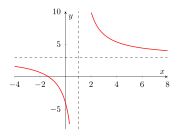

# Derivades i aplicacions: Teoria

## Funcions, límits i continuïtat

### Derivades

#### Taxa de variació mitjana i derivada

> **📘 Teoria**
>
> La **taxa de variació mitjana (TVM)** d’una funció entre $x=a$ i $x=b$ mesura el canvi mitjà de $f$ en aquest interval: $$\text{TVM}[a,b]=\frac{f(b)-f(a)}{b-a}$$ La **derivada** d’una funció en un punt, $f'(a)$, és el límit d’aquesta taxa quan l’interval es fa infinitament petit: $$f'(a)=\lim_{h\to 0}\frac{f(a+h)-f(a)}{h}$$ Geomètricament, $f'(a)$ és el pendent de la recta tangent a la gràfica de $f$ en el punt $x=a$.

> **✏️ Exemple**
>
> Un producte té preu $P(t)=-4t+48$ durant els seus últims anys a la venda. La taxa de variació mitjana del preu entre $t=5$ i $t=10$: $$\text{TVM}=\frac{P(10)-P(5)}{10-5}=\frac{8-28}{5}=-4 \text{ \text{€}/any}$$ El preu baixa, de mitjana, $4$€ cada any en aquest període.

#### Regles bàsiques de derivació

> **📘 Teoria**
>
> | **Funció**                | **Derivada**                                  |
> |:--------------------------|:----------------------------------------------|
> | $f(x)=k$                  | $f'(x)=0$                                     |
> | $f(x)=x^n$                | $f'(x)=n\,x^{n-1}$                            |
> | $f(x)=k\cdot g(x)$        | $f'(x)=k\cdot g'(x)$                          |
> | $f(x)=g(x)\pm h(x)$       | $f'(x)=g'(x)\pm h'(x)$                        |
> | $f(x)=g(x)\cdot h(x)$     | $f'(x)=g'(x)h(x)+g(x)h'(x)$                   |
> | $f(x)=\dfrac{g(x)}{h(x)}$ | $f'(x)=\dfrac{g'(x)h(x)-g(x)h'(x)}{[h(x)]^2}$ |

> **✏️ Exemple**
>
> $f(x)=180x-20(x-15)^2+300$. Derivant terme a terme: $$f'(x)=180-40(x-15)=180-40x+600=-40x+780$$ Igualant $f'(x)=0$ trobem el punt on la funció canvia de creixent a decreixent (o al revés): $x=19,5$.

#### Derivada i creixement/decreixement. Continuïtat i derivabilitat

> **📘 Teoria**
>
> El signe de la derivada informa sobre la monotonia de la funció: $$\begin{cases}
f'(x)>0 \ \text{en un interval} \Rightarrow f \text{ és creixent en aquest interval}\\
f'(x)<0 \ \text{en un interval} \Rightarrow f \text{ és decreixent en aquest interval}\\
f'(x)=0 \ \Rightarrow \ \text{possible màxim, mínim o punt d'inflexió}
\end{cases}$$ Per classificar un punt crític $x_0$ (on $f'(x_0)=0$):
>
> - Si $f'$ passa de $+$ a $-$ en $x_0$: **màxim** local.
>
> - Si $f'$ passa de $-$ a $+$ en $x_0$: **mínim** local.
>
> **Relació entre continuïtat i derivabilitat:** si una funció és derivable en un punt, aleshores necessàriament hi és contínua. El recíproc **no** és cert: una funció pot ser contínua en un punt i no ser-hi derivable (per exemple, si la gràfica hi forma un "pic" o angle, com $f(x)=|x|$ a $x=0$).

> **✏️ Exemple**
>
> $$f(x)=\begin{cases} 1-x & x<2\\ 0 & x=2\\ 3x & x>2\end{cases}$$ No té ni tan sols els límits laterals iguals ($\lim_{2^-}f=-1$, $\lim_{2^+}f=6$), de manera que ja no és contínua a $x=2$ i, per tant, tampoc és derivable en aquest punt.

### Optimització de funcions

> **📘 Teoria**
>
> Molts problemes pràctics (geomètrics, econòmics...) consisteixen a trobar el **valor màxim o mínim** d’una magnitud que depèn d’una variable. L’estratègia general és:
>
> 1.  **Identificar la variable** que volem optimitzar (per exemple, l’àrea $A$, el cost $C$, el benefici $B$...) i la incògnita $x$ de la qual depèn.
>
> 2.  **Escriure la funció** a optimitzar en termes de dues variables, si cal, a partir de les dades de l’enunciat.
>
> 3.  **Trobar una relació (lligam)** entre aquestes variables i **substituir-la** per deixar la funció en **una sola variable**.
>
> 4.  **Derivar** la funció i **igualar a zero**: $f'(x)=0$, per trobar els punts crítics.
>
> 5.  **Comprovar** si és un màxim o un mínim (estudiant el signe de $f'$ abans i després, o amb la derivada segona).
>
> 6.  **Comprovar el domini** del problema (per exemple, longituds i costos han de ser positius) i **respondre** la pregunta amb les unitats adequades.

> **✏️ Exemple**
>
> Volem construir una caixa oberta de base quadrada i $4000\text{ cm}^3$ de volum, gastant la mínima quantitat de material (superfície mínima).
>
> **1. Variables:** costat de la base $x$, alçada $y$.
>
> **2. Lligam (volum):** $V=x^2y=4000 \Rightarrow y=\dfrac{4000}{x^2}$
>
> **3. Funció a optimitzar (superfície: base + 4 cares laterals):** $$S(x)=x^2+4xy=x^2+4x\cdot\frac{4000}{x^2}=x^2+\frac{16000}{x}$$
>
> **4. Derivem i igualem a $0$:** $$S'(x)=2x-\frac{16000}{x^2}=0 \ \Rightarrow\ 2x^3=16000 \ \Rightarrow\ x^3=8000\ \Rightarrow\ x=20$$
>
> **5. Comprovem que és un mínim:** $S''(x)=2+\dfrac{32000}{x^3}>0$ per a $x>0$, per tant $x=20$ és mínim.
>
> **6. Resposta:** el costat de la base ha de ser $20$ cm i l’alçada $y=\dfrac{4000}{400}=10$ cm.

> **✏️ Exemple**
>
> Una botiga ven samarretes a $30$€ i, cada mes, en ven $3000$. Per cada $\text{€}$ que baixa el preu, en ven $400$ més. Quin preu de venda maximitza els ingressos?
>
> **Variable:** $x$ = nombre d’euros que es rebaixa el preu.
>
> **Preu de venda:** $P(x)=30-x$
>
> **Nombre de samarretes venudes:** $N(x)=3000+400x$
>
> **Ingressos totals:** $$I(x)=P(x)\cdot N(x)=(30-x)(3000+400x)$$
>
> Derivem i igualem a $0$: $I'(x)=-400x+30\cdot400-3000-\dots=0$, d’on s’obté un valor de $x$ que, substituït a $P(x)$, dona el preu òptim de venda.
>
> *(Aquest tipus d’esquema – preu $\times$ quantitat venuda – apareix sovint: benefici $=$ ingressos $-$ costos, i cal derivar-lo i igualar a zero de la mateixa manera.)*

> **💡 Per aprofundir**
>
> Es disposa d’una làmina de cartró quadrada de $10$ cm de costat. Es vol construir una caixa sense tapa retallant un quadrat de costat $x$ a cada cantonada i plegant els laterals cap amunt.
>
> 1.  Expressa el volum $V(x)$ de la caixa en funció de $x$, i indica quin és el domini raonable de $x$.
>
> 2.  Troba el valor de $x$ que fa màxim el volum de la caixa i calcula aquest volum màxim.

> **💡 Per aprofundir**
>
> Una companyia de mòbils té $500$ clients que paguen $40$€/mes. Per cada $\text{€}$ que apuja la tarifa, perd $5$ clients.
>
> 1.  Escriu la funció d’ingressos mensuals $I(x)$ en funció de la pujada $x$ (en euros).
>
> 2.  Troba la pujada que maximitza els ingressos i calcula’ls.
>
> 3.  Si el cost fix mensual de mantenir el servei és de $6000$€, escriu la funció de benefici i troba el seu màxim.

## Introducció a les derivades

### Definició de derivada

> **📘 Teoria**
>
> La derivada d’una funció mesura la **rapidesa de canvi** de $f(x)$ respecte de $x$ en un punt concret: quant varia la $y$ (eix vertical) per cada unitat que varia la $x$ (eix horitzontal) en aquell punt.
>
> Hi ha dues formes equivalents d’escriure-la com a límit del **quocient incremental**: $$f'(a)=\lim_{x\to a}\frac{f(x)-f(a)}{x-a} \qquad \text{(increment en } y \text{ dividit per increment en } x\text{)}$$ $$f'(a)=\lim_{h\to 0}\frac{f(a+h)-f(a)}{h}$$ Aquesta segona forma s’usa substituint $x$ per $(x+h)$ dins l’expressió de $f$, simplificant, i fent el límit quan $h\to 0$.
>
> **Interpretació geomètrica:** $f'(a)$ és el pendent $m$ de la **recta tangent** a la gràfica de $f$ en el punt $x=a$: $$y=mx+n, \qquad m=f'(a)$$

> **✏️ Exemple**
>
> Calculem la derivada de $f(x)=3x+7$ mitjançant la definició (segona forma): $$f'(x)=\lim_{h\to 0}\frac{f(x+h)-f(x)}{h}=\lim_{h\to 0}\frac{3(x+h)+7-(3x+7)}{h}=\lim_{h\to 0}\frac{3x+3h+7-3x-7}{h}$$ $$=\lim_{h\to 0}\frac{3h}{h}=3$$ Com era d’esperar, el pendent d’una recta és sempre constant: $f'(x)=3$ per a tot $x$.

#### Regles bàsiques de derivació

> **📘 Teoria**
>
> A la pràctica no cal aplicar la definició cada vegada: n’hi ha prou amb aquestes regles.
>
> | **Tipus de funció** | **Derivada**           |
> |:--------------------|:-----------------------|
> | $f(x)=k$ (constant) | $f'(x)=0$              |
> | $f(x)=mx$ (lineal)  | $f'(x)=m$              |
> | $f(x)=mx+n$ (afí)   | $f'(x)=m$              |
> | $f(x)=x^n$          | $f'(x)=n\,x^{n-1}$     |
> | $f(x)=k\cdot g(x)$  | $f'(x)=k\cdot g'(x)$   |
> | $f(x)=g(x)\pm h(x)$ | $f'(x)=g'(x)\pm h'(x)$ |
>
> En una funció **quadràtica** $f(x)=x^2$, la derivada $f'(x)=2x$ val $0$ al vèrtex: és el **punt estacionari**.

> **✏️ Exemple**
>
> $$f(x)=x^4+3x^3 \ \Rightarrow \ f'(x)=4x^3+9x^2$$ $$f(x)=(x^2+5x+4)(x+2)=x^3+7x^2+14x+8 \ \Rightarrow \ f'(x)=3x^2+14x+14$$ (Cal recordar: per derivar un producte de dos factors polinòmics, el més senzill és multiplicar-los primer i obtenir un sol polinomi, i després derivar terme a terme.)

#### Punts estacionaris: màxims i mínims

> **📘 Teoria**
>
> Un **punt estacionari** és un punt on $f'(x)=0$, és a dir, on la recta tangent és horitzontal ($m=0$). En aquests punts la funció "ni creix ni decreix" instantàniament, i sol correspondre a un **màxim** o un **mínim** local:
>
> - Si abans del punt $f'(x)<0$ (decreix) i després $f'(x)>0$ (creix) $\Rightarrow$ **mínim**.
>
> - Si abans del punt $f'(x)>0$ (creix) i després $f'(x)<0$ (decreix) $\Rightarrow$ **màxim**.
>
> En general: $$f'(x)>0 \ \text{en un interval} \ \Rightarrow f \text{ creix}, \qquad f'(x)<0 \ \text{en un interval} \ \Rightarrow f \text{ decreix}$$

> **✏️ Exemple**
>
> Per a $f(x)=x^2$: $f'(x)=2x$. $$x\in(-\infty,0) \Rightarrow f'(x)<0 \Rightarrow \text{decreixent} \qquad x\in(0,+\infty)\Rightarrow f'(x)>0 \Rightarrow \text{creixent}$$ A $x=0$, $f'(0)=0$: és un **mínim** (el vèrtex de la paràbola).

### Taxa de variació mitjana i taxa de variació instantània

> **📘 Teoria**
>
> La **taxa de variació mitjana (TVM)** entre dos punts $a$ i $x$ mesura quant varia, de mitjana, la funció entre aquests dos valors: $$\text{TVM}[a,x]=\frac{f(x)-f(a)}{x-a}$$ La **taxa de variació instantània (TVI)** en un punt $a$ és el límit de la TVM quan l’altre punt s’hi acosta infinitament: $$\text{TVI}(a)=\lim_{x\to a}\frac{f(x)-f(a)}{x-a}=f'(a)$$ És a dir: **la TVI no és res més que la derivada en aquell punt**. Normalment la TVI es calcula directament amb les **regles de derivació**; el càlcul amb límits (factoritzant per eliminar la indeterminació $\tfrac{0}{0}$) serveix per entendre d’on surt la fórmula.

> **✏️ Exemple**
>
> Els ingressos (en milers d’€) d’una empresa en funció del nombre de motos $x$ que fabrica són $I(x)=-0{,}03x^2+30x-1400$, amb $x>0$.
>
> **a) TVM entre $100$ i $120$ motos:** $$I(100)=1300, \qquad I(120)=1768$$ $$\text{TVM}=\frac{1768-1300}{120-100}=\frac{468}{20}=23{,}4 \text{ (mil \text{€}/moto)}$$
>
> **b) TVI (derivada) a $x=100$:** calculant-ho amb límits (factoritzant el numerador com a producte de $(x-900)(x-100)$) s’arriba al mateix resultat que amb la regla de derivació: $$I'(x)=-0{,}06x+30 \ \Rightarrow \ I'(100)=-6+30=24 \text{ (mil \text{€}/moto)}$$ La TVM i la TVI són semblants però no idèntiques: la primera és un promig en un interval, la segona és el valor exacte en un punt.

### Continuïtat de funcions definides a trossos

> **📘 Teoria**
>
> Una funció és **contínua** si es pot dibuixar **d’un sol traç**, sense aixecar el llapis del paper. Formalment, $f$ és contínua en tots els punts $a$ del seu domini tals que: $$\lim_{x\to a^-}f(x)=\lim_{x\to a}f(x)=\lim_{x\to a^+}f(x)=f(a)$$
>
> - Les funcions **polinòmiques** són contínues a tot $\mathbb{R}$.
>
> - Les funcions **racionals** són contínues a tot el seu domini (és a dir, arreu excepte on s’anul·la el denominador).
>
> En una funció **definida a trossos**, cada tram per separat ja sol ser continu (si és polinòmic o racional dins el seu interval); per tant, **només cal comprovar la continuïtat en els punts on canvia de tram**, substituint únicament els valors extrems de cada interval (no cal comprovar cap altre punt intermedi).

> **✏️ Exemple**
>
> $$f(x)=\begin{cases} 35 & 0\leq x<1\\ 25+10x & 1\leq x<2\\ -0{,}5x^2+4x+a & 2\leq x\leq 5\end{cases}$$ Els únics punts "sospitosos" de discontinuïtat són $x=1$ i $x=2$ (on canvia d’expressió).
>
> **A $x=1$:** $\displaystyle\lim_{x\to 1^-}35=35$, $\displaystyle\lim_{x\to 1^+}(25+10x)=35$. Coincideixen $\Rightarrow$ contínua a $x=1$ (no depèn de $a$).
>
> **A $x=2$:** $\displaystyle\lim_{x\to 2^-}(25+10x)=45$, $\displaystyle\lim_{x\to 2^+}(-0{,}5x^2+4x+a)=6+a$.
>
> Perquè sigui contínua, igualem: $$6+a=45 \ \Rightarrow \ a=39$$ Amb aquest valor de $a$, la funció és contínua a tot l’interval $[0,5]$.

> **💡 Per aprofundir**
>
> Donada la funció $$f(x)=\begin{cases} x+2a & x\leq 5\\ x^2-5 & 2<x<4 \\ x^2+2x-b & x>0\end{cases}$$ (fixa’t que els intervals no "lliguen" tots de la mateixa manera que en els exemples anteriors): identifica primer quins són realment els punts frontera rellevants per a la continuïtat abans de plantejar les equacions, i després resol per trobar $a$ i $b$.

### Tipus de discontinuïtat

> **📘 Teoria**
>
> Quan una funció no compleix la condició de continuïtat en un punt $a$, distingim tres casos:
>
> **1. Discontinuïtat evitable.** Existeix $\displaystyle\lim_{x\to a}f(x)$ (finit), però o bé $f(a)$ no existeix, o bé no coincideix amb aquest límit. Gràficament és un "forat" que es podria "evitar" redefinint el valor de la funció en aquest punt.
>
> **2. Discontinuïtat de salt.** Existeixen els dos límits laterals, però són diferents entre si: $$\lim_{x\to a^-}f(x)\neq\lim_{x\to a^+}f(x)$$ La gràfica fa un "salt" d’un valor a un altre.
>
> **3. Discontinuïtat infinita (o asimptòtica).** Algun dels límits laterals val $+\infty$ o $-\infty$. Sol coincidir amb una **asímptota vertical**.

> **✏️ Exemple**
>
> **Evitable:** $f(x)=\dfrac{x^2-4}{x+2}=\dfrac{(x+2)(x-2)}{x+2}=x-2$ per a $x\neq -2$. El punt $x=-2$ no pertany al domini, però $\lim_{x\to -2}f(x)=-4$ existeix: discontinuïtat evitable.
>
> **De salt:** $f(x)=\begin{cases}3x+2 & x<3\\ x^2+1 & x\geq 3\end{cases}$. $\lim_{3^-}f(x)=11$, $\lim_{3^+}f(x)=10$: no coincideixen, discontinuïtat de salt (finit).
>
> **Infinita:** $f(x)=\dfrac{1}{x-2}$. Als dos costats de $x=2$ la funció tendeix a $\pm\infty$: discontinuïtat infinita (asímptota vertical $x=2$). Fora d’aquest punt, és contínua: per exemple, és contínua a l’interval $(-\infty,2)$ i també a $(2,+\infty)$, encara que no ho sigui a tot $\mathbb{R}$.

#### Continuïtat i derivabilitat

> **📘 Teoria**
>
> Ara bé, el recíproc **no** és cert: una funció pot ser contínua en un punt i **no** ser-hi derivable. Això passa quan la gràfica forma un "pic" o canvi brusc de direcció, de manera que la derivada per l’esquerra i per la dreta donen valors diferents.

> **✏️ Exemple**
>
> El **valor absolut** $f(x)=|x|$ és contínua a tot $\mathbb{R}$ (es pot dibuixar sense aixecar el llapis), però: $$f(x)=\begin{cases}x & x\geq 0\\ -x & x<0\end{cases} \qquad \Rightarrow \qquad f'(x)=\begin{cases}+1 & x>0\\ -1 & x<0\end{cases}$$ A $x=0$ la derivada per l’esquerra val $-1$ i per la dreta val $+1$: no coincideixen, per tant **$f$ no és derivable a $x=0$** (tot i ser-hi contínua). Geomètricament: la gràfica de $|x|$ fa un "pic" a l’origen, i no té sentit parlar d’una única recta tangent en aquest punt.

### Asímptotes

> **📘 Teoria**
>
> Una **asímptota** és una recta a la qual la gràfica d’una funció s’aproxima cada vegada més, sense arribar mai a creuar-la (almenys no indefinidament a prop de l’infinit). N’hi ha de tres tipus: **verticals**, **horitzontals** i **obliqües**.

#### Asímptotes verticals

> **📘 Teoria**
>
> Una funció racional $f(x)=\dfrac{p(x)}{q(x)}$ té una asímptota vertical (A.V.) a $x=a$ si $q(a)=0$ (i $p(a)\neq 0$), i a més $$\lim_{x\to a^-}f(x)=\pm\infty \quad \text{i/o} \quad \lim_{x\to a^+}f(x)=\pm\infty$$

> **✏️ Exemple**
>
> $$f(x)=\frac{3x+4}{x-1}$$ El denominador s’anul·la a $x=1$ (i el numerador no s’hi anul·la), per tant hi ha A.V. a $x=1$.

#### Asímptotes horitzontals

> **📘 Teoria**
>
> Hi ha asímptota horitzontal (A.H.) $y=L$ si $$\lim_{x\to+\infty}f(x)=L \quad \text{i/o} \quad \lim_{x\to-\infty}f(x)=L, \qquad L\in\mathbb{R}$$ En funcions racionals, l’A.H. existeix quan el **grau del numerador és menor o igual** que el grau del denominador:
>
> - Mateix grau: $L=$ quocient dels coeficients principals.
>
> - Grau del numerador menor: $L=0$.

> **✏️ Exemple**
>
> $$f(x)=\frac{3x+4}{x-1} \qquad \Rightarrow \qquad \lim_{x\to\infty}\frac{3x+4}{x-1}=3 \quad \Rightarrow \quad \text{A.H. } y=3$$
>
> 

#### Asímptotes obliqües

> **📘 Teoria**
>
> Una funció racional té una asímptota obliqua (A.O.) $y=mx+n$ quan el **grau del numerador és exactament una unitat més gran** que el grau del denominador (si la diferència és més gran, no hi ha cap tipus d’asímptota d’aquesta família, sinó una branca parabòlica).
>
> **Mètode 1 – divisió de polinomis:** fent la divisió $p(x):q(x)$, el **quocient** (de grau $1$) és directament la recta $y=mx+n$ de l’asímptota (el residu es fa cada cop més petit en proporció i no afecta a l’infinit).
>
> **Mètode 2 – límits:** $$m=\lim_{x\to\infty}\frac{f(x)}{x}, \qquad n=\lim_{x\to\infty}\big(f(x)-mx\big)$$
>
> **Important:** una mateixa funció **pot tenir alhora** una asímptota vertical i una obliqua (o una vertical i una horitzontal), però **mai pot tenir alhora una asímptota horitzontal i una obliqua**, perquè totes dues descriuen el comportament a l’infinit i la gràfica no pot acostar-se a dues rectes amb diferent pendent al mateix temps.

> **✏️ Exemple**
>
> $$f(x)=\frac{x^2+1}{x-4}$$ El grau del numerador ($2$) és una unitat més gran que el del denominador ($1$) $\Rightarrow$ hi ha A.O.
>
> **Per divisió:** $x^2+1=(x-4)(x+4)+17$, per tant $$f(x)=x+4+\frac{17}{x-4} \quad\Rightarrow\quad \text{A.O.: } y=x+4$$
>
> **Comprovació pel mètode dels límits:** $$m=\lim_{x\to\infty}\frac{f(x)}{x}=\lim_{x\to\infty}\frac{x^2+1}{x(x-4)}=1$$ $$n=\lim_{x\to\infty}\big(f(x)-mx\big)=\lim_{x\to\infty}\left(\frac{x^2+1}{x-4}-x\right)=\lim_{x\to\infty}\frac{x^2+1-x(x-4)}{x-4}=\lim_{x\to\infty}\frac{4x+1}{x-4}=4$$ Els dos mètodes donen el mateix resultat: $y=x+4$. A més, aquesta funció també té una A.V. a $x=4$ (on s’anul·la el denominador): és compatible tenir-les totes dues alhora.

> **💡 Per aprofundir**
>
> Troba el valor de $k$ perquè la funció $f(x)=\dfrac{x^2+kx-3}{x-1}$ tingui una asímptota obliqua que passi pel punt $(0,5)$.

### Resum final

> **📘 Teoria**
>
> - La **derivada** $f'(a)$ és el límit del quocient incremental i coincideix amb el pendent de la recta tangent i amb la **taxa de variació instantània (TVI)**.
>
> - La **TVM** és un promig entre dos punts; la **TVI** (derivada) és el valor exacte en un sol punt: no cal que coincideixin.
>
> - En funcions a trossos, només cal comprovar la **continuïtat als punts d’unió**, substituint els extrems de cada interval i igualant els límits laterals.
>
> - Les discontinuïtats poden ser **evitables** (hi ha límit però no coincideix amb $f(a)$), de **salt** (límits laterals diferents) o **infinites** (algun límit lateral és $\pm\infty$).
>
> - **Derivable $\Rightarrow$ contínua**, però **contínua $\not\Rightarrow$ derivable** (exemple: $f(x)=|x|$ a $x=0$).
>
> - En funcions racionals: **A.V.** on s’anul·la el denominador; **A.H.** si grau numerador $\leq$ grau denominador; **A.O.** si grau numerador $=$ grau denominador $+1$. Mai hi ha alhora A.H. i A.O.
