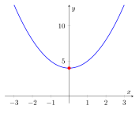
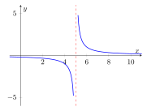

# Funcions, límits i continuïtat

## Domini i recorregut d’una funció

> **📘 Teoria**
>
> Una funció $f$ associa a cada valor $x$ d’un conjunt un únic valor $y=f(x)$.
>
> - **Domini** $\operatorname{Dom} f$: tots els valors de $x$ per als quals existeix $f(x)$ (és a dir, per als quals la funció "es pot calcular").
>
> - **Recorregut** (o imatge) $\operatorname{Im} f$: tots els valors $y=f(x)$ que la funció realment pren.
>
> Per trobar el domini cal fixar-se en les operacions "perilloses":
>
> - Denominadors: no es pot dividir per $0$.
>
> - Arrels d’índex parell: el radicand ha de ser $\ge 0$.
>
> - Logaritmes: l’argument ha de ser $>0$ (es veurà més endavant).
>
> Per trobar el recorregut sol ser útil dibuixar (o imaginar) la gràfica de la funció.

### Funció constant

> **📘 Teoria**
>
> $$f(x)=k, \qquad k\in\mathbb{R}$$ Sigui quin sigui el valor de $x$, la imatge sempre val $k$. La gràfica és una recta horitzontal. $$\operatorname{Dom} f=\mathbb{R}=(-\infty,+\infty), \qquad \operatorname{Im} f=\{k\}$$

> **✏️ Exemple**
>
> $f(x)=7$. Per a qualsevol $x$, $f(x)=7$. $\operatorname{Dom} f=\mathbb{R}$, $\operatorname{Im} f=\{7\}$.

### Funció lineal i funció afí

> **📘 Teoria**
>
> **Funció lineal:** $f(x)=mx$. Totes tallen l’eix $Y$ al punt $(0,0)$.
>
> **Funció afí:** $f(x)=mx+n$ (funció lineal $+$ terme independent $n$). Talla l’eix d’ordenades a $(0,n)$.
>
> El nombre $m$ és el **pendent**: indica la inclinació de la recta i coincideix amb la **derivada** de la funció, $f'(x)=m$ (constant per a tota recta): $$\begin{cases}
m>0 \ \Rightarrow\ \text{funció creixent} \\
m<0 \ \Rightarrow\ \text{funció decreixent} \\
m=0 \ \Rightarrow\ \text{funció constant}
\end{cases}$$ $$\operatorname{Dom} f=\mathbb{R}, \qquad \operatorname{Im} f=\mathbb{R} \quad (\text{si } m\neq 0)$$

> **✏️ Exemple**
>
> $f(x)=3x$: pendent $m=3>0\Rightarrow$ creixent, $f'(x)=3$.
>
> $f(x)=3x+4$: la mateixa inclinació que l’anterior, però desplaçada: talla l’eix $Y$ a $(0,4)$.

> **📝 Exercicis**
>
> 1.  Indica el pendent, si és creixent o decreixent, i el punt de tall amb l’eix $Y$ de:
>
>     2
>
>     1.  $f(x)=-2x+5$
>
>     2.  $f(x)=\dfrac{1}{2}x-3$
>
>     3.  $f(x)=6$
>
>     4.  $f(x)=-x$
>
> 2.  Troba l’equació de la recta que passa per $(0,-2)$ i té pendent $m=4$.
>
> 3.  Dues rectes afins tenen el mateix pendent $m=5$ però diferent terme independent. Què podem dir de les seves gràfiques?

### Funció quadràtica

> **📘 Teoria**
>
> $$f(x)=ax^2+bx+c, \qquad a\neq 0$$ La gràfica és una **paràbola**.
>
> - Si $a>0$: paràbola oberta cap amunt $\Rightarrow$ té un **mínim**.
>
> - Si $a<0$: paràbola oberta cap avall $\Rightarrow$ té un **màxim**.
>
> El **vèrtex** (màxim o mínim) es troba a: $$x_v=-\frac{b}{2a}, \qquad y_v=f(x_v)$$ Abans del vèrtex la funció és decreixent (si $a>0$) o creixent (si $a<0$); després, al revés.
>
> $$\operatorname{Dom} f=\mathbb{R}$$ $$\operatorname{Im} f=[y_v,+\infty) \ \text{ si } a>0, \qquad \operatorname{Im} f=(-\infty,y_v] \ \text{ si } a<0$$

> **✏️ Exemple**
>
> $f(x)=x^2+4$. Com que $a=1>0$, hi ha un mínim a $x_v=-\dfrac{0}{2}=0$, $f(0)=4$.
>
> Vèrtex $(0,4)$: abans decreix, després creix. $$\operatorname{Dom} f=\mathbb{R}, \qquad \operatorname{Im} f=[4,+\infty)$$
>
> 

> **📝 Exercicis**
>
> 1.  Calcula el vèrtex, indica si és màxim o mínim, i dona el domini i el recorregut de:
>
>     2
>
>     1.  $f(x)=x^2-6x+5$
>
>     2.  $f(x)=-x^2+4x$
>
>     3.  $g(x)=2x^2-1$
>
>     4.  $h(x)=-3x^2+12x-7$
>
> 2.  Una paràbola té vèrtex $(2,-3)$ i s’obre cap amunt. Raona quin és el seu recorregut.

> **💡 Per aprofundir**
>
> Una empresa ven un producte i el seu benefici (en milers d’€) segons el nombre $x$ de unitats produïdes ve donat per $B(x)=-2x^2+40x-150$. Troba el nombre d’unitats que maximitza el benefici i quin és el benefici màxim. Per a quins valors de $x$ l’empresa té pèrdues?

### Funcions polinòmiques

> **📘 Teoria**
>
> Una funció polinòmica és de la forma $$f(x)=a_nx^n+a_{n-1}x^{n-1}+\dots+a_1x+a_0$$ Sigui quin sigui el grau, **tots els polinomis tenen domini** $\operatorname{Dom} f=\mathbb{R}$ (no hi ha denominadors ni arrels). El recorregut pot variar segons el grau i la forma concreta del polinomi.

> **✏️ Exemple**
>
> $f(x)=(x-1)(x-2)x=x^3-3x^2+2x$. És un polinomi de grau $3$, per tant $\operatorname{Dom} f=\mathbb{R}$. Les seves arrels (punts de tall amb l’eix $X$) són $x=0,1,2$.

> **📝 Exercicis**
>
> 1.  Indica el grau i el domini de: a) $f(x)=x^4-3x^2+1$ b) $g(x)=(x+2)(x-3)(x-5)$
>
> 2.  Troba els punts de tall amb l’eix $X$ de $h(x)=x(x-4)(x+1)$.

### Funcions amb radicals

> **📘 Teoria**
>
> $$f(x)=\sqrt[n]{g(x)}$$
>
> - Si $n$ és **parell**: el radicand ha de ser $\geq 0$. Cal resoldre $g(x)\geq 0$. $$\operatorname{Dom} f=\{x: g(x)\geq 0\}$$ A més, com que una arrel parell dona sempre un resultat $\geq 0$, $\operatorname{Im} f\subseteq [0,+\infty)$.
>
> - Si $n$ és **imparell**: no hi ha cap limitació sobre el radicand. $$\operatorname{Dom} f=\mathbb{R}, \qquad \operatorname{Im} f=\mathbb{R}$$

> **✏️ Exemple**
>
> $f(x)=\sqrt{x+3}$ (índex parell): cal $x+3\geq 0 \Rightarrow x\geq -3$. $$\operatorname{Dom} f=[-3,+\infty)$$ $g(x)=\sqrt[3]{x+3}$ (índex imparell): no hi ha restricció. $$\operatorname{Dom} g=\mathbb{R}$$

> **📝 Exercicis**
>
> 1.  Calcula el domini de:
>
>     2
>
>     1.  $f(x)=\sqrt{5-x}$
>
>     2.  $g(x)=\sqrt{x^2-9}$
>
>     3.  $h(x)=\sqrt[3]{x-7}$
>
>     4.  $j(x)=\sqrt{2x+6}$
>
> 2.  Explica per què $f(x)=\sqrt{x^2+1}$ té domini tot $\mathbb{R}$.

### Funcions racionals

> **📘 Teoria**
>
> Una funció racional és un quocient de polinomis: $$f(x)=\frac{p(x)}{q(x)}$$ El **domini** exclou els valors que anul·len el denominador: $$\operatorname{Dom} f=\mathbb{R}\setminus\{x: q(x)=0\}$$ En aquests punts "prohibits" la funció sol presentar **asímptotes verticals**. Si el grau del numerador $\leq$ grau del denominador i el quocient dels coeficients principals dona un valor finit, la funció pot tenir una **asímptota horitzontal**.

> **✏️ Exemple**
>
> $$f(x)=\frac{1}{x-5}$$ El denominador s’anul·la a $x=5\Rightarrow \operatorname{Dom} f=\mathbb{R}\setminus\{5\}$.
>
> Estudiem què passa a prop de $x=5$ i quan $x\to\pm\infty$: $$\lim_{x\to 5^-}f(x)=-\infty, \qquad \lim_{x\to 5^+}f(x)=+\infty \quad\Rightarrow\quad \text{A.V. } x=5$$ $$\lim_{x\to \pm\infty}f(x)=0 \quad\Rightarrow\quad \text{A.H. } y=0$$
>
> 

> **📝 Exercicis**
>
> 1.  Calcula el domini i les asímptotes vertical i horitzontal de: $$f(x)=\frac{2}{x+4}, \qquad g(x)=\frac{x-3}{x+1}$$
>
> 2.  Una funció racional $h(x)=\dfrac{x^2-9}{x-3}$ té un "forat" (discontinuïtat evitable) a $x=3$. Simplifica l’expressió i explica per què.

## Límits

> **📘 Teoria**
>
> El **límit** d’una funció $f$ quan $x$ tendeix a un valor $a$, $\displaystyle\lim_{x\to a}f(x)$, és el valor cap al qual s’acosten les imatges $f(x)$ quan $x$ s’acosta a $a$ (sense necessàriament arribar-hi).

### Límits laterals

> **📘 Teoria**
>
> - **Límit per l’esquerra**: $\displaystyle\lim_{x\to a^-}f(x)$ (valors de $x$ menors que $a$, acostant-s’hi).
>
> - **Límit per la dreta**: $\displaystyle\lim_{x\to a^+}f(x)$ (valors de $x$ majors que $a$, acostant-s’hi).
>
> Aquest càlcul és imprescindible en **funcions definides a trossos**, on cal comprovar què passa a banda i banda del punt d’unió.

> **✏️ Exemple**
>
> $$f(x)=\begin{cases} 3x & x<2 \\ x+1 & x\geq 2 \end{cases}$$ $$\lim_{x\to 2^-}f(x)=\lim_{x\to 2^-}3x=6, \qquad \lim_{x\to 2^+}f(x)=\lim_{x\to 2^+}(x+1)=3$$ Com que $6\neq 3$, el límit $\displaystyle\lim_{x\to 2}f(x)$ **no existeix**.

> **📝 Exercicis**
>
> 1.  Calcula els límits laterals a $x=1$ i digues si existeix el límit: $$f(x)=\begin{cases} x^2 & x\leq 1\\ 3x-1 & x>1 \end{cases}$$
>
> 2.  Calcula els límits laterals a $x=0$ de $g(x)=\dfrac{|x|}{x}$.

### Límits a l’infinit. Asímptotes

> **📘 Teoria**
>
> Quan $x\to\pm\infty$, estudiem cap a quin valor s’acosta $f(x)$:
>
> - Si $\displaystyle\lim_{x\to\pm\infty}f(x)=L$ (finit) $\Rightarrow$ hi ha una **asímptota horitzontal** $y=L$.
>
> - Si $\displaystyle\lim_{x\to a}f(x)=\pm\infty$ (amb $a$ finit) $\Rightarrow$ hi ha una **asímptota vertical** $x=a$.

> **✏️ Exemple**
>
> $$f(x)=\frac{1}{x^2-5x+4}$$ El denominador s’anul·la a $x=1$ i $x=4\Rightarrow$ possibles A.V. Comprovem-ho: $$\lim_{x\to 1^-}f(x)=+\infty \quad (\text{el denominador s'acosta a } 0^+)$$ Com que $\displaystyle\lim_{x\to\pm\infty}f(x)=0$ (grau del denominador $>$ grau del numerador), hi ha A.H. $y=0$.

> **📝 Exercicis**
>
> 1.  Calcula $\displaystyle\lim_{x\to+\infty}\frac{3x+2}{x-1}$ i $\displaystyle\lim_{x\to-\infty}\frac{3x+2}{x-1}$. Què representen?
>
> 2.  Estudia les asímptotes de $f(x)=\dfrac{2}{(x-3)^2}$.

### Indeterminacions

> **📘 Teoria**
>
> En calcular límits sovint apareixen expressions sense un valor determinat a priori, anomenades **indeterminacions**. Les més habituals en aquest curs són: $$\frac{0}{0}, \qquad \frac{\infty}{\infty}, \qquad \infty-\infty$$ Estratègies típiques per resoldre-les:
>
> - $\dfrac{0}{0}$ en funcions racionals: **factoritzar** numerador i denominador i simplificar.
>
> - $\dfrac{\infty}{\infty}$ en funcions racionals: dividir numerador i denominador per la potència més gran de $x$, o comparar directament els graus.

> **✏️ Exemple**
>
> $$\lim_{x\to 3}\frac{2x+5}{x^3-16}\Bigg|_{\text{comprovem}} \qquad \text{amb } \lim_{x\to 3}\frac{x^2-9}{x-3}$$ Substituint directament $x=3$ obtenim $\dfrac{0}{0}$ (indeterminació). Factoritzem: $$\lim_{x\to 3}\frac{x^2-9}{x-3}=\lim_{x\to 3}\frac{(x-3)(x+3)}{x-3}=\lim_{x\to 3}(x+3)=6$$

> **📝 Exercicis**
>
> 1.  Resol les indeterminacions: $$\text{a) } \lim_{x\to 2}\frac{x^2-4}{x-2} \qquad \text{b) } \lim_{x\to -1}\frac{x^2-1}{x+1} \qquad \text{c) } \lim_{x\to+\infty}\frac{2x^2+1}{x^2-3}$$
>
> 2.  Calcula $\displaystyle\lim_{x\to 5}\frac{x^2-25}{x^2-3x-10}$.

## Continuïtat

> **📘 Teoria**
>
> Una funció $f$ és **contínua** en $x=a$ si es compleixen tres condicions:
>
> 1.  Existeix $f(a)$ (el punt pertany al domini).
>
> 2.  Existeix $\displaystyle\lim_{x\to a}f(x)$ (els límits laterals coincideixen).
>
> 3.  $\displaystyle\lim_{x\to a}f(x)=f(a)$.
>
> Si no es compleix alguna d’aquestes tres condicions, la funció és **discontínua** a $x=a$.

### Tipus de discontinuïtat

> **📘 Teoria**
>
> - **Evitable**: existeix $\displaystyle\lim_{x\to a}f(x)$ però no coincideix amb $f(a)$, o bé $f(a)$ no existeix (un "forat" a la gràfica).
>
> - **De salt finit**: existeixen els límits laterals però són diferents entre si.
>
> - **De salt infinit (asimptòtica)**: algun dels límits laterals val $+\infty$ o $-\infty$ (asímptota vertical).

> **✏️ Exemple**
>
> $$f(x)=\frac{x^2-16}{x-4}$$ Simplificant: $f(x)=x+4$ per a $x\neq 4$, però $f(4)$ no existeix (denominador $0$). $$\lim_{x\to 4}f(x)=8 \quad \text{però } f(4) \text{ no existeix} \Rightarrow \text{discontinuïtat evitable a } x=4$$
>
> Funcions elementals com les polinòmiques, racionals (fora dels punts que anul·len el denominador) i les radicals (dins del seu domini) són **contínues** allà on estan definides.

> **📝 Exercicis**
>
> 1.  Classifica el tipus de discontinuïtat de cada funció al punt indicat: $$\text{a) } f(x)=\frac{x^2-1}{x-1} \text{ a } x=1 \qquad \text{b) } g(x)=\frac{1}{x-2} \text{ a } x=2$$ $$\text{c) } h(x)=\begin{cases} x+1 & x\leq 0\\ x-1 & x>0\end{cases} \text{ a } x=0$$
>
> 2.  Digui per a quins valors de $x$ és discontínua $f(x)=\dfrac{x+2}{x^2-x-6}$.

### Continuïtat de funcions definides a trossos

> **📘 Teoria**
>
> Quan una funció es defineix per trossos, cal comprovar la continuïtat **només** en els punts on canvia de tros (els altres trams, si són polinòmics, racionals, etc., ja són continus dins del seu interval). El procediment és:
>
> 1.  Calcular $\displaystyle\lim_{x\to a^-}f(x)$ substituint a l’expressió vàlida per $x<a$.
>
> 2.  Calcular $\displaystyle\lim_{x\to a^+}f(x)$ substituint a l’expressió vàlida per $x>a$.
>
> 3.  Calcular $f(a)$ amb l’expressió que inclou el propi punt $a$.
>
> 4.  Comprovar si els tres valors coincideixen.
>
> Sovint aquest procediment serveix també per trobar un paràmetre desconegut que faci contínua la funció (igualant els dos límits laterals).

> **✏️ Exemple**
>
> $$P(t)=\begin{cases} 5(t+1)^2-5 & 0\leq t\leq 2\\ -4t+48 & 2<t\leq 10\end{cases}$$ Comprovem la continuïtat a $t=2$: $$\lim_{t\to 2^-}5(t+1)^2-5=5\cdot 9-5=40, \qquad \lim_{t\to 2^+}(-4t+48)=-8+48=40$$ Com que els dos límits laterals coincideixen (i valen el mateix que $P(2)$, calculat amb la primera expressió), la funció **és contínua** a $t=2$: el gràfic no fa cap salt en el moment d’enllaçar els dos trams.

> **📝 Exercicis**
>
> 1.  Estudia la continuïtat a $x=3$ de: $$f(x)=\begin{cases} x^2-3x & x<3\\ 3x-9+2 & x\geq 3\end{cases}$$
>
> 2.  Troba el valor de $k$ perquè la funció sigui contínua a $x=1$: $$f(x)=\begin{cases} kx+3 & x\leq 1\\ x^2+1 & x>1\end{cases}$$

## Derivades

### Taxa de variació mitjana i derivada

> **📘 Teoria**
>
> La **taxa de variació mitjana (TVM)** d’una funció entre $x=a$ i $x=b$ mesura el canvi mitjà de $f$ en aquest interval: $$\text{TVM}[a,b]=\frac{f(b)-f(a)}{b-a}$$ La **derivada** d’una funció en un punt, $f'(a)$, és el límit d’aquesta taxa quan l’interval es fa infinitament petit: $$f'(a)=\lim_{h\to 0}\frac{f(a+h)-f(a)}{h}$$ Geomètricament, $f'(a)$ és el pendent de la recta tangent a la gràfica de $f$ en el punt $x=a$.

> **✏️ Exemple**
>
> Un producte té preu $P(t)=-4t+48$ durant els seus últims anys a la venda. La taxa de variació mitjana del preu entre $t=5$ i $t=10$: $$\text{TVM}=\frac{P(10)-P(5)}{10-5}=\frac{8-28}{5}=-4 \text{ €/any}$$ El preu baixa, de mitjana, $4$€ cada any en aquest període.

### Regles bàsiques de derivació

> **📘 Teoria**
>
> | **Funció**                | **Derivada**                                  |
> |:--------------------------|:----------------------------------------------|
> | $f(x)=k$                  | $f'(x)=0$                                     |
> | $f(x)=x^n$                | $f'(x)=n\,x^{n-1}$                            |
> | $f(x)=k\cdot g(x)$        | $f'(x)=k\cdot g'(x)$                          |
> | $f(x)=g(x)\pm h(x)$       | $f'(x)=g'(x)\pm h'(x)$                        |
> | $f(x)=g(x)\cdot h(x)$     | $f'(x)=g'(x)h(x)+g(x)h'(x)$                   |
> | $f(x)=\dfrac{g(x)}{h(x)}$ | $f'(x)=\dfrac{g'(x)h(x)-g(x)h'(x)}{[h(x)]^2}$ |

> **✏️ Exemple**
>
> $f(x)=180x-20(x-15)^2+300$. Derivant terme a terme: $$f'(x)=180-40(x-15)=180-40x+600=-40x+780$$ Igualant $f'(x)=0$ trobem el punt on la funció canvia de creixent a decreixent (o al revés): $x=19,5$.

> **📝 Exercicis**
>
> 1.  Deriva: $$\text{a) } f(x)=x^3-5x^2+2x-1 \qquad \text{b) } g(x)=(x-3)(2x+1) \qquad \text{c) } h(x)=\frac{x+1}{x-2}$$
>
> 2.  Calcula la TVM de $f(x)=x^2$ entre $x=1$ i $x=4$, i compara-la amb $f'(2)$.

### Derivada i creixement/decreixement. Continuïtat i derivabilitat

> **📘 Teoria**
>
> El signe de la derivada informa sobre la monotonia de la funció: $$\begin{cases}
f'(x)>0 \ \text{en un interval} \Rightarrow f \text{ és creixent en aquest interval}\\
f'(x)<0 \ \text{en un interval} \Rightarrow f \text{ és decreixent en aquest interval}\\
f'(x)=0 \ \Rightarrow \ \text{possible màxim, mínim o punt d'inflexió}
\end{cases}$$ Per classificar un punt crític $x_0$ (on $f'(x_0)=0$):
>
> - Si $f'$ passa de $+$ a $-$ en $x_0$: **màxim** local.
>
> - Si $f'$ passa de $-$ a $+$ en $x_0$: **mínim** local.
>
> **Relació entre continuïtat i derivabilitat:** si una funció és derivable en un punt, aleshores necessàriament hi és contínua. El recíproc **no** és cert: una funció pot ser contínua en un punt i no ser-hi derivable (per exemple, si la gràfica hi forma un "pic" o angle, com $f(x)=|x|$ a $x=0$).

> **✏️ Exemple**
>
> $$f(x)=\begin{cases} 1-x & x<2\\ 0 & x=2\\ 3x & x>2\end{cases}$$ No té ni tan sols els límits laterals iguals ($\lim_{2^-}f=-1$, $\lim_{2^+}f=6$), de manera que ja no és contínua a $x=2$ i, per tant, tampoc és derivable en aquest punt.

> **📝 Exercicis**
>
> 1.  Donada $f(x)=x^3-3x$, troba els intervals de creixement i decreixement i classifica els punts crítics.
>
> 2.  Estudia la continuïtat i la derivabilitat de $f(x)=|x-2|$ a $x=2$.

## Optimització de funcions

> **📘 Teoria**
>
> Molts problemes pràctics (geomètrics, econòmics...) consisteixen a trobar el **valor màxim o mínim** d’una magnitud que depèn d’una variable. L’estratègia general és:
>
> 1.  **Identificar la variable** que volem optimitzar (per exemple, l’àrea $A$, el cost $C$, el benefici $B$...) i la incògnita $x$ de la qual depèn.
>
> 2.  **Escriure la funció** a optimitzar en termes de dues variables, si cal, a partir de les dades de l’enunciat.
>
> 3.  **Trobar una relació (lligam)** entre aquestes variables i **substituir-la** per deixar la funció en **una sola variable**.
>
> 4.  **Derivar** la funció i **igualar a zero**: $f'(x)=0$, per trobar els punts crítics.
>
> 5.  **Comprovar** si és un màxim o un mínim (estudiant el signe de $f'$ abans i després, o amb la derivada segona).
>
> 6.  **Comprovar el domini** del problema (per exemple, longituds i costos han de ser positius) i **respondre** la pregunta amb les unitats adequades.

> **✏️ Exemple**
>
> Volem construir una caixa oberta de base quadrada i $4000\text{ cm}^3$ de volum, gastant la mínima quantitat de material (superfície mínima).
>
> **1. Variables:** costat de la base $x$, alçada $y$.
>
> **2. Lligam (volum):** $V=x^2y=4000 \Rightarrow y=\dfrac{4000}{x^2}$
>
> **3. Funció a optimitzar (superfície: base + 4 cares laterals):** $$S(x)=x^2+4xy=x^2+4x\cdot\frac{4000}{x^2}=x^2+\frac{16000}{x}$$
>
> **4. Derivem i igualem a $0$:** $$S'(x)=2x-\frac{16000}{x^2}=0 \ \Rightarrow\ 2x^3=16000 \ \Rightarrow\ x^3=8000\ \Rightarrow\ x=20$$
>
> **5. Comprovem que és un mínim:** $S''(x)=2+\dfrac{32000}{x^3}>0$ per a $x>0$, per tant $x=20$ és mínim.
>
> **6. Resposta:** el costat de la base ha de ser $20$ cm i l’alçada $y=\dfrac{4000}{400}=10$ cm.

> **✏️ Exemple**
>
> Una botiga ven samarretes a $30$€ i, cada mes, en ven $3000$. Per cada $\text{€}$ que baixa el preu, en ven $400$ més. Quin preu de venda maximitza els ingressos?
>
> **Variable:** $x$ = nombre d’euros que es rebaixa el preu.
>
> **Preu de venda:** $P(x)=30-x$
>
> **Nombre de samarretes venudes:** $N(x)=3000+400x$
>
> **Ingressos totals:** $$I(x)=P(x)\cdot N(x)=(30-x)(3000+400x)$$
>
> Derivem i igualem a $0$: $I'(x)=-400x+30\cdot400-3000-\dots=0$, d’on s’obté un valor de $x$ que, substituït a $P(x)$, dona el preu òptim de venda.
>
> *(Aquest tipus d’esquema – preu $\times$ quantitat venuda – apareix sovint: benefici $=$ ingressos $-$ costos, i cal derivar-lo i igualar a zero de la mateixa manera.)*

> **📝 Exercicis**
>
> 1.  Es vol tancar amb una corda de $100$ m un terreny rectangular adossat a una paret (de manera que un dels costats no necessita corda). Troba les dimensions que fan màxima l’àrea tancada.
>
> 2.  Entre tots els rectangles de perímetre $60$ m, troba el que té l’àrea màxima.
>
> 3.  Una empresa fabrica $x$ unitats d’un producte a un cost $C(x)=x^2-20x+500$ euros. Cada unitat es ven a $80$€. Troba el nombre d’unitats que maximitza el benefici $B(x)=\text{ingressos}-\text{cost}$.
>
> 4.  Es vol construir un dipòsit cilíndric (sense tapa) d’$1\,\text{m}^3$ de capacitat amb la mínima quantitat de xapa. Planteja la funció de superfície en termes del radi $r$ i troba’n el mínim. (Recorda: $V=\pi r^2h$, $S=\pi r^2+2\pi r h$.)

> **💡 Per aprofundir**
>
> Es disposa d’una làmina de cartró quadrada de $10$ cm de costat. Es vol construir una caixa sense tapa retallant un quadrat de costat $x$ a cada cantonada i plegant els laterals cap amunt.
>
> 1.  Expressa el volum $V(x)$ de la caixa en funció de $x$, i indica quin és el domini raonable de $x$.
>
> 2.  Troba el valor de $x$ que fa màxim el volum de la caixa i calcula aquest volum màxim.

> **💡 Per aprofundir**
>
> Una companyia de mòbils té $500$ clients que paguen $40$€/mes. Per cada $\text{€}$ que apuja la tarifa, perd $5$ clients.
>
> 1.  Escriu la funció d’ingressos mensuals $I(x)$ en funció de la pujada $x$ (en euros).
>
> 2.  Troba la pujada que maximitza els ingressos i calcula’ls.
>
> 3.  Si el cost fix mensual de mantenir el servei és de $6000$€, escriu la funció de benefici i troba el seu màxim.

## Resum final

> **📘 Teoria**
>
> - El **domini** depèn del tipus de funció: polinomis $\to\mathbb{R}$; racionals $\to$ excloure zeros del denominador; arrels parells $\to$ radicand $\geq 0$.
>
> - Un **límit** existeix si i només si els límits laterals coincideixen; els límits a l’infinit donen les asímptotes horitzontals, i els límits infinits en un punt finit donen les asímptotes verticals.
>
> - Una funció és **contínua** en un punt si hi existeix, hi té límit, i aquest límit coincideix amb el valor de la funció; en funcions a trossos cal comprovar-ho sempre en els punts d’unió.
>
> - La **derivada** és el pendent de la recta tangent i indica el creixement ($f'>0$), el decreixement ($f'<0$) o els possibles extrems ($f'=0$).
>
> - En els problemes d’**optimització**: plantejar la funció, reduir-la a una variable amb el lligam, derivar, igualar a zero, i comprovar que la solució té sentit dins del context del problema.
